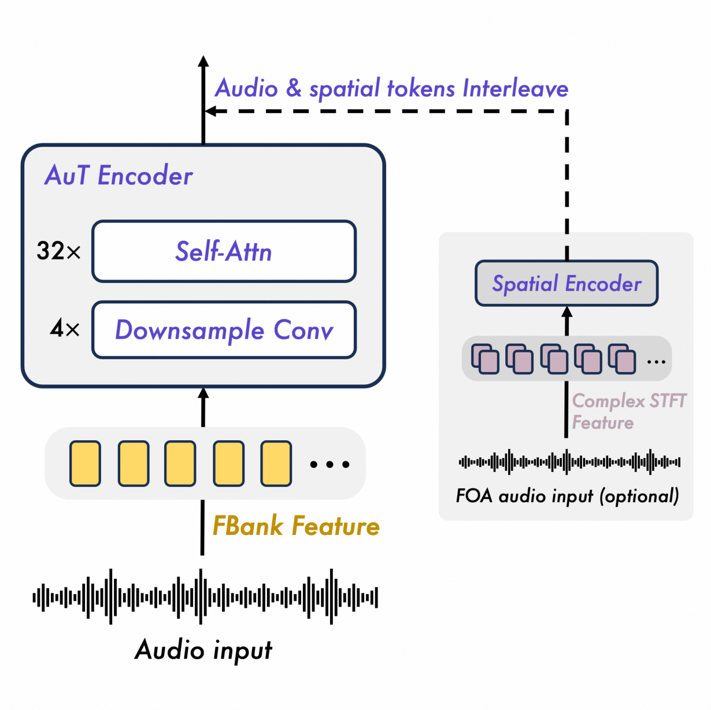
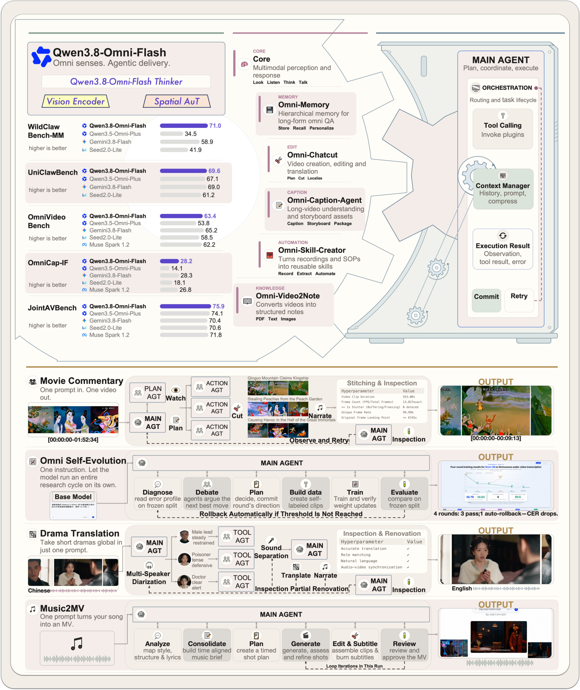
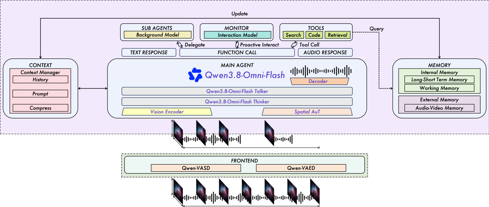

# Qwen3.8-Omni 技术报告

## 来源

- 原始 PDF：[2609.25611v1.pdf](../../raw/2609.25611v1.pdf)，24 页；本页使用 arXiv v1（提交 2026-09-22，PDF 页眉 2026-09-23）。
- 标题：Qwen3.8-Omni: Towards Native Omni-Modal Agents。
- 团队：Qwen Team。作者页星号标通讯作者 Dayiheng Liu、Jin Xu；arXiv 提交记录为 Yuxuan Wang。
- 版本入口：[arXiv:2609.25611](https://arxiv.org/abs/2609.25611)。
- 开源框架：[Qwen-MM-Plugins](https://github.com/QwenLM/Qwen-MM-Plugins)、[Qwen-Live-Harness](https://github.com/QwenLM/Qwen-Live-Harness)。
- 模型页：[Qwen3.8-Omni-Flash](../models/qwen3.8-omni-flash.md)。骨干报告：[Qwen3.8-Next](qwen3.8-next.md)。前代全模态：[Qwen3.5-Omni](qwen3.5-omni.md)。

这不是另一份架构消融。它把 [Qwen3.8-Next](qwen3.8-next.md) 的稀疏 MoE 骨干接上视觉 / 音频 / 空间音频编码器，目标从「更小 FLOPs 保住 base 质量」换成「能做长周期音视频生产的原生全模态 agent」。

## 核心结论

原文确证（Abstract、§1–2）：Qwen3.8-Omni-Flash 是 Thinker–Talker 模型。Thinker 吃文本、图像、音频、空间音频和视频，出文本（推理、对话、工具调用）；Talker 在 Thinker 的高层表示上出流式语音。相对前代 [Qwen3.5-Omni-Plus](qwen3.5-omni.md)，作者把主目标写成 agentic productivity，而不是再强调感知和实时交互本身。

三件同时成立的事：

1. **文本没有被多模态冲掉。** Table 2 上，Omni-Flash 相对同代文本模型 Qwen3.8-Flash：SWE-bench Pro 63.3 vs 62.5，NL2Repo 48.9 vs 48.1，CoWorkBench 75.3 vs 73.9；DeepSWE 1.1 57.8 vs 58.7，SWE-bench Multilingual 80.5 vs 81.0。差距在一两分内，方向不统一。
2. **长视频理解被改成按需取证。** 同一模型在 Qwen Code 里做规划、调工具、分段核对后，LVOmniBench 从 63.3 到 73.6，OmniVideoBench 的每问 token 从 145,736 降到 79,117（Table 7–8）。这是执行设置的增益，不是换了一套权重。
3. **系统缺口用开源 harness 补，而不是再训一个端到端产品。** Qwen-MM-Plugins 把音视频能力接到已有 agent harness；Qwen-Live-Harness 把实时交互写成上下文、记忆、工具和子 agent 的编排。

摘要另有两句正文没有展开的账：相对 Qwen3.5-Omni-Plus，29 项音频推理 / 音视频推理 / 音视频 agent 评测的平均分「提高 25% 以上」；每小时音频与音视频的 API 输入成本估计下降「98% 以上」和「93% 以上」。29 项清单和成本公式都没有出现在正文。这两句保持摘要声称，不能当成已复核的表。

## 架构与训练

### Thinker 骨干：继承，但 QSA 日程重做

原文确证（§2.1）：Thinker 使用 Qwen3.8-Next 的 hybrid sparse MoE。Token mixing 是 Gated DeltaNet（固定大小递归状态）加交错的注意力层；注意力层经 warmup 和 sparse training 换成 Qwen Sparse Attention（QSA）。QSA 仍是轻量 indexer 给压缩 micro-block 打分、核心注意力只在选中块的原始 token 上计算。

本报告**没有**重述 3:1 比例、$K$、$r$、Gated Residual、主机 n-gram 或 Muon。这些是 [架构报告](qwen3.8-next.md) 的事实，不能自动抄成 Omni 的配置。参数量也没有写。

预训练全程原生窗口 256K；正文写四个阶段的序列长度都是 262,144。扩到 1M 发生在**后训练之后**，方法（继续训练、位置外推还是只改推理）没有写。

### 三个编码器，外加一条空间支路

> Figure 2，PDF p.4。原图注：一般 AuT 用卷积下采样和自注意力抽出 6.25 Hz 的上下文音频表示；并行的 Spatial AuT 处理多通道空间音频，保留方向与空间线索。

原文确证（§2.1 Perception / Multimodal Encoder）：

| 编码器 | 输入 | 本报告写明的处理 |
| --- | --- | --- |
| Vision | 图像与抽帧后的视频 | §2.1 写「采用自 Qwen3.8-Next」；S1 写「采用自 Qwen3.5」。两句并存，见下方边界 |
| AuT | 16 kHz 一般音频，含从视频抽出的音轨 | 128 维 mel，25 ms 窗、10 ms hop；四层 Conv2D 下采样 16 倍；时间自注意力。输出 6.25 Hz，约每 160 ms 一个 token。PDF 把 6.25 印成小数逗号 `6,25` |
| Spatial AuT | 多通道，先变成一阶 ambisonics（FOA） | 复数 STFT 的实部与虚部都保留，用来留通道间幅度和相位。与 AuT 并行，不替换它 |

Figure 2 在 AuT 框上标了 **32× Self-Attn**。正文只说 temporal self-attention layers，没有重复层数，所以 32 层只以该图为据。图上的空间模块写成 Spatial Encoder，正文名称是 Spatial AuT。

AuT 用一份 Qwen ASR 模型生成的转写做预训练监督，语料覆盖 20 种以上语言，中文:英文:其他 = 3.5:3.5:3。动态注意力窗同时支持带缓存的流式推理和离线理解。三个编码器的输出经各自 adapter 投进 Thinker，并在 S1 与骨干对齐。

### 感知：时间戳照旧，空间音频借用视觉的位置布局

原文确证（§2.2、§3）：文本用 Qwen3.8-Next 的 byte-level BPE，词表约 250K。视觉、一般音频和空间音频投影进同一嵌入空间，按时间排列。音视频时间戳策略**不改**，沿用 Qwen3.5-Omni-Plus，并保留显式文本时间戳。

空间音频是这一代新增的输入模态。同一时间片的空间嵌入共享时间位置索引，彼此保留不同的空间位置索引——正文把它类比成一帧里不同空间位置的视觉 patch。这让空间 token 能和音轨对齐，又不会在同一时刻挤成一个向量。

Table 1 的标题写成 “Qwen3.8-Omni-Flash-Plus”，与全文的 Flash 不一致，应按标题笔误读，不能据此再立一个 Plus 模型。

| 模态 | 品种数 | 口径 |
| --- | ---: | --- |
| 文本 | 201 | 正文指向 Qwen3.5 的语言列表，本 PDF 不重复 |
| 语音输入 | 113 | 74 种语言 + 39 种汉语方言 |
| 语音输出 | 36 | 29 种语言 + 7 种汉语方言（四川、北京、天津、南京、陕西、粤语、闽南） |

### 四阶段预训练

原文确证（§3）。LLM 从 Qwen3.8-Next 初始化。四个阶段都用 262,144 的序列长度。

| 阶段 | 谁在动 | 做什么 |
| --- | --- | --- |
| S1 Encoder Alignment | 冻结 LLM，先训 adapter 再训编码器 | 图像–文本、单声道音频–文本、多通道音频–文本，三路编码器分开对齐 |
| S2 General | 全部解冻 | 约 2.5T token：文本 1.1T、音频 0.7T、图像 0.35T、视频 0.15T、视频–音频 0.3T。音频含单声道与多通道 |
| S3 QSA Warmup | 骨干固定，只训 indexer | 用骨干的 full-attention 分布做监督；此阶段 dense attention 仍开着 |
| S4 QSA | 骨干 + indexer 联合 | 在对应层打开 QSA，适应稀疏模式 |

分项相加是 2.6T，正文写 approximately 2.5 trillion。差额留在原文，不改平。

这和架构报告的 QSA 日程不是同一段训练。那边是文本 CPT：indexer 单独 warmup 约 2B，再联合稀疏约 200B@256K。这里是多模态 S2 之后，在仍然打开 dense attention 的前提下重做 warmup，再进入 S4。报告没有说初始化用的是 Qwen3.8-Next 的 pre-QSA 还是 post-QSA checkpoint，只说 S3 在启用稀疏之前学习块级选择。

## 后训练

### Thinker：多教师轨迹蒸馏，然后统一 RL

原文确证（§4）。ChatML。两阶段，覆盖纯文本、视觉、音频和混合对话。

**Stage 1 不是本库里的 MOPD。** 专家从「pre-trained Qwen3.8 base checkpoint」各自初始化，再独立做 SFT 和 RL。覆盖通用指令、基础推理、代码、agent、视觉理解和音频理解。专家生成领域轨迹，混成一份多模态数据，蒸馏进一个 student。正文的理由是：直接在异构混合物上微调 base，会有模态和任务之间的干扰；专家蒸馏给的监督更强、更一致。它没有写 student 是否 on-policy，也没有写 KL 方向或 token-level reward。不能把它记成 [MiMo MOPD](../concepts/multi-teacher-on-policy-distillation.md) 或 Talker 那句点名的 MOPD。

「Qwen3.8 base checkpoint」指文本基座还是 S4 之后的 Omni 骨干，原文没有区分。

**Stage 2** 从蒸馏 checkpoint 出发，在文本、视觉、音频和混合任务上做统一 RL。作者点名蒸馏后仍不稳的地方：音频条件查询难于对应的文本查询；长对话会出现意外换语言、人设漂移、指令跟随变差。奖励同时看任务对错和交互质量，并鼓励跨模态一致、对口语查询的自然回应、语言和人设稳定。长周期 agent 的奖励来自任务结果和执行结果，不来自模型自报的完成。算法名、clip、组大小都没有写。

### Talker：五阶段，多语言语音才点名 MOPD

原文确证（§7.1）。Talker 继承 Qwen3.5-Omni-Plus：RVQ token，MTP 预测残差 codebook，ARIA 做流式语音，另有系统提示指定目标音色。因果 Code2Wav 加一条上采样通路，波形从 24 kHz 提到 48 kHz。

五阶段：

1. 预训练：单独的数据管线，做均衡语料。
2. CPT：复杂对话上下文，加强 Talker 的上下文建模。
3. 分语言专家，再用 Multi-Teacher On-Policy Distillation 做多语言语音。引用 Ma et al. 2026（arXiv:2606.30406），目的是减轻单语语料带来的外国口音。这一句是全文唯一把 MOPD 当算法名写出的地方，且对象是 **Talker 的语音**，不是 Thinker。
4. 轻量说话人微调。
5. RL：先把 Thinker 微调到人类偏好，再用对齐后的 Thinker 给 Talker 提供奖励，Talker 侧优化器写的是 [GSPO](group-sequence-policy-optimization.md)。没有写 clip、sequence-level 还是 GSPO-token，也没有消融。

## 系统：把音视频接到已有 harness

> Figure 1，PDF p.2。原图注：统一的端到端模型，处理文本、音频、图像和视频，并生成实时文本或语音；支撑语音对话、视频对话和音视频工具使用。海报上的分数是展示用子集，细表以 §6 为准。例如 OmniCap-IF 的条只画了 28.2，对应 Table 5 的 ISR，不是 CSR 80.6；OmniVideoBench 的 63.4 是 Static，不是 Qwen Code 的 67.8。

原文确证（§1、§5）：作者把三个产品问题拆开。长视频的存储、传输和 token 预算太贵；现有 harness 的主上下文不吃流式音视频；面向生产的全模态用法本身还没被做透。

对应的模块，而不是新的模型权重：

| 模块 | 作用 |
| --- | --- |
| Omni-Caption / Omni-Video2Note | 把视频收成详细字幕或结构化文本摘要。Figure 1 把前者画成 Omni-Caption-Agent |
| Omni-Memory | agent 按需懒加载音视频，而不是一次灌进上下文 |
| Omni-Skill-Creator | 从教程或 SOP 式视频抽出可被 harness 调用的技能 |
| Omni-Chatcut | 长音视频翻译、电影解说、由音轨生成 MV 的现成生产力模块 |

Qwen3.8-Omni-Flash 可以当主 agent，也可以当调用这些工具的子 agent。§5 的四条工作流（Music-to-MV、短剧翻译、两到三小时电影解说、视频到笔记 / 技能 / 深研报告）是能力叙事加 Figure 1 的流程图，没有单独的成功率表。

**Omni-Autoresearch** 是唯一给了数字的应用案例（§5.4）：用 Omni-Flash 在 12 小时内改 Qwen2.5-Omni-3B 的四川话识别。它自己选定 WenetSpeech-Chuan、固定评测、听错例、造数据。四轮、3,413 条训练样本，CER 从 25.79% 降到 15.30%，相对下降约 40.7%。Figure 1 的注解是「4 rounds: 3 pass, 1 auto-rollback」。这是单次案例，不是受控消融。

### 实时变体与 Qwen-Live-Harness

> Figure 3，PDF p.15。原图注：Realtime 采用 Thinker–Talker。Thinker 出文本，Talker 直接接收 Thinker 的高层表示并生成流式语音 token；每步由 MTP 输出当前帧的残差 codebook，Code2Wav 逐帧合成波形。

原文确证（§7.2–7.3）：Qwen3.8-Omni-Flash-Realtime 把 Thinker 的分块流式输入和 Talker 的增量语音接在一起。ARIA 在不完整文本前缀上继续出语音。Table 9 的协议：6/12/20 秒片段；音频为 16 kHz 单声道 PCM；音视频另加 1280×720、1 FPS；每种条件 1 次预热后 10 条有效回复；新会话；固定指令要求输出超过 200 个文本 token；先上传再显式交卷；关闭 VAD。TTFT / TTFC 从客户端提交输入算到第一个非空文本 / 音频块，含网络，不含建连、上传和播放。生成 RTF 是首尾音频块间隔除以波形时长，不含首次等待。

| 输入 | 时长 | Text TPS | TTFT (ms) | TTFC (ms) | 生成 RTF |
| --- | ---: | ---: | ---: | ---: | ---: |
| 音频 | 6 s | 84.87 | 591 | 978 | 0.1538 |
| 音频 | 20 s | 81.06 | 618 | 1026 | 0.1538 |
| 音视频 | 6 s | 84.89 | 838 | 1215 | 0.1524 |
| 音视频 | 20 s | 83.00 | 981 | 1350 | 0.1528 |

正文把 RTF ≈ 0.153 说成约 6.5× 实时。视觉输入抬高的是启动延迟，持续生成效率差不多。表内毫秒已四舍五入到整数；原始值见 PDF Table 9。

Qwen-Live-Harness 做三件事，都是编排而不是新的权重：

- **异步工具与子 agent**：统一 adapter 接到 Qwen Code、Codex、Claude Code。提交后立刻口头确认，后台继续；进度再写回对话。用户可以打断当前语音而不取消已委托的任务，通话结束后任务仍可跑。
- **主动交互**：用户定义的音频、画面和时间条件在独立实时会话里出文本事件，前台再在不抢话的时候说出来。冷却和连续阳性抑制用来减少重复提醒。
- **持久记忆**：对话记录、显式工作记忆、跨会话的用户事实；词法检索，可选嵌入匹配。打开时，视觉记忆存的是抽帧得到的文本观察，不是原始帧。

Figure 3 底部的 Qwen-VASD / Qwen-VAED 只出现在图上，正文没有定义，本页不展开缩写。

## 评测要点

评测设置原文确证（§6 开篇）。粗体是所列表内最优，含并列。工具分是「模型 + 声明的执行设置」。文本和视觉的对照是 Qwen3.8-Flash、Qwen3.8-27B、Qwen3.7-Plus，外加表内其他基线。音频和音视频的对照是 Qwen3.5-Omni-Plus、Gemini 3.8 Flash、Seed 2.0 Lite（API `doubao-seed-2-0-lite-260428`）、Muse Spark 1.2。

### 文本还在，视觉 agent 有赢有输

Table 2。DeepSWE 取 Claude Code 与 mini-SWE-agent 两个 harness 的较高分（温度 1.0，top_p 0.95，256K）；Qwen3.8-Flash 的最高分来自 mini-SWE-agent。SWE-bench Pro 除 Claude-Opus-4.6 (Max) 用官方分外，其余走 Claude Code，且作者修正过有问题的任务后重测。HLE 由 GPT-4o 评判。CoWorkBench 是内部办公长任务集。

| Benchmark | Omni-Flash | Qwen3.8-Flash | Qwen3.8-27B | Qwen3.7-Plus | V4-Flash-0731 | Opus 4.6 Max |
| --- | ---: | ---: | ---: | ---: | ---: | ---: |
| DeepSWE 1.1 | 57.8 | **58.7** | 42.2 | 16.5 | 54.4 | – |
| SWE-bench Pro | **63.3** | 62.5 | 61.7 | 55.8 | 56.0 | 53.4 |
| SWE-bench Multilingual | 80.5 | **81.0** | 73.8 | 75.8 | – | 77.5 |
| NL2Repo-Bench | 48.9 | 48.1 | 42.3 | 41.1 | **54.2** | 47.6 |
| CoWorkBench | **75.3** | 73.9 | 70.7 | 65.1 | 45.1 | 68.2 |
| IFBench | **81.5** | 81.3 | 79.5 | 79.1 | 79.2 | 62.5 |
| GPQA Diamond | 91.0 | **91.7** | 89.2 | 90.3 | 90.8 | 91.3 |
| HLE | 36.5 | 35.9 | 30.8 | 34.7 | 33.8 | **40.0** |
| LiveCodeBench v6 | **92.6** | 91.9 | 90.3 | 89.6 | 90.6 | 88.8 |

Table 3。ClawEval-MM 写成 Pass@3 | 三次均分。MathVision / CharXiv 的 “w/ CI” 没有在正文定义 CI，本页不把它展开成某种工具名。

| Benchmark | Omni-Flash | Qwen3.8-Flash | Qwen3.8-27B | Qwen3.7-Plus | Opus 4.6 Max |
| --- | ---: | ---: | ---: | ---: | ---: |
| ClawEval-MM Pass@3 \| Avg | 60.4 \| **61.9** | **64.4** \| 60.4 | 57.4 \| 56.9 | 57.4 \| 60.1 | 52.5 \| 54.7 |
| AndroidWorld | **87.1** | 84.5 | 81.9 | 81.0 | 62.0 |
| Vision2Web | 62.9 | **64.0** | 62.9 | 42.1 | – |
| LVBench | **76.9** | 76.6 | 72.4 | 76.2 | 63.0 |
| MathVision | **91.8** | 90.6 | 90.0 | 90.3 | 65.5 |
| MathVision w/ CI | **96.2** | 95.7 | 94.6 | 88.4 | – |
| ERQA | 71.0 | **72.3** | 65.5 | 69.8 | 40.8 |
| RealWorldQA | 87.7 | **88.5** | 85.9 | 86.9 | 73.9 |

AndroidWorld 和 MathVision 高于同代文本 Flash；ERQA、RealWorldQA、Vision2Web 和 ClawEval 的 Pass@3 不是。均分高于 Pass@3 说明三次试验的稳定性与「至少过一次」不是同一件事。

### 音频：说话人分离的落差最大，通用转写没有全面赢

Table 4 的会议指标是 DER | cpWER，都是越低越好。正文确认 AliMeeting 从 88.1 | 89.6 降到 3.4 | 17.2，并且 AISHELL-4、MagicData-RAMC、MLC-SLM (en) 上两个指标都是表内最低。前代分数靠近 90–100，报告没有解释评测协议是否与这一代相同。读的时候先把它当成「表内数字」，不要直接换成「同一系统误差下降了二十倍」。

其余被正文点名、且可以和前代直接比的音频结果：

| 指标 | Omni-Flash | Qwen3.5-Omni-Plus | 方向 |
| --- | ---: | ---: | --- |
| WenetSpeech Meeting WER | **4.6** | 4.8 | 越低越好；Net 子集 4.8，差于前代 3.7 |
| FLEURS-ASR WER（60 语） | 9.3 | **7.2** | 越低越好；也高于 Gemini 3.8 Flash 的 7.9 |
| FLEURS-S2TT BLEU | 31.8 | 32.2 | 越高越好；Gemini 33.0 |
| SpotSoundBench | **67.2** | 64.2 | 越高越好 |
| LongAudioSpan Acc \| Rubric \| Chain | **82.7** \| **71.8** \| 48.2 | 74.4 \| 49.8 \| 45.1 | Chain 低于 Gemini 的 64.6 |
| MuchoMusic-RUL / HumMusQA / MusTBench | **72.6 / 75.8 / 50.6** | 71.6 / 75.5 / 49.1 | 三项都是表内最高 |
| Audio MultiChallenge | 71.5 | 57.6 | Gemini 71.9 |
| MuLA-Bench | 72.60 | 61.00 | Gemini 73.43 |
| OmniLingua-MultiSpeaker 成功率 | **100** | 未在正文单列 | tcpWER / cpWER / DER 为表内最低：43.25 / 34.97 / 20.15 |

VoiceBench 与 WildSpeech 仍低于前代和 Gemini 3.8 Flash。多语言长音频、指令跟随和多说话人处理的增益，与通用 ASR / 翻译的缺口，是两件事。

### 音视频：直接读输给 Gemini 的三项，agent 设置能扳回一项

Table 5，相对 Qwen3.5-Omni-Plus，正文确认的抬升：OmniVideoBench 53.8→63.4，Video-MME-v2 47.9→65.0，LVOmniBench 53.2→63.3。这三项的 Static 分仍低于 Gemini 3.8 Flash（65.2 / 71.0 / 70.7）。OmniCap-IF 的 CSR | ISR 从 72.1 | 14.1 到 80.6 | 28.2，接近 Gemini 的 81.9 | 28.3。StreamingBench 57.1→80.8，ProactiveVideoQA 35.1→61.5，QIVD **69.6** 为表内最高。Omni2Web Track A | B 为 56.7 | 51.6，前代 29.6 | 49.1。

正文写 OmniEchoBench「从 23.3 到 41.7」。Table 5 同一行是 43.9 | 23.3 | 32.0 | 28.3 | 31.3，第一列对 Omni-Flash。**以表为准，正文的 41.7 与表不一致。** 另一处正文说 OmniVChat-Bench「与前代并列 89.0」；表是 89.0 对前代 52.1，也不是并列。

### Agentic：换执行方式，不只是换模型

Table 6。四个榜的 harness 不同，不能横着比绝对分。WildClawBench-MM 与 AgenticVBench 用 Claude Code；[UniClawBench](uniclawbench.md) 用 OpenClaw；OmniGAIA 不用外部 harness。WildClawBench-MM 只保留含图像、视频或音频的子集。

| Benchmark | Omni-Flash | Qwen3.5-Omni-Plus | Gemini 3.8 Flash | Seed 2.0 Lite |
| --- | ---: | ---: | ---: | ---: |
| WildClawBench-MM | **71.0** | 34.5 | 58.9 | 41.9 |
| UniClawBench | **69.6** | 67.1 | 69.0 | 61.2 |
| AgenticVBench | 36.8 | 14.5 | **45.0** | 10.0 |
| OmniGAIA | 74.0 | 57.2 | **78.6** | 64.4 |

Table 7–8。Static 是直接读输入；Qwen Code 是模型自己规划、调工具、逐步定位和核对。两个模型都跑了这两种设置。

| Benchmark | Omni Static | Omni + Qwen Code | Gemini Static | Gemini + Qwen Code |
| --- | ---: | ---: | ---: | ---: |
| OmniVideoBench | 63.4 | 67.8 | 65.2 | **70.1** |
| Video-MME-v2 | 65.0 | 71.3 | 71.0 | **72.7** |
| LVOmniBench | 63.3 | **73.6** | 70.7 | 70.7 |

Omni 三项都涨。LVOmniBench 上，Static 比 Gemini 低 7.4 分，Qwen Code 后反超 2.9 分；Gemini 在这个榜上没有从 agent 设置再涨。OmniVideoBench 上 Omni 的 token/问从 145,736 降到 79,117（约 −45.7%），agent 模式跨轮保留上下文。作者明确这**不是**端到端延迟或货币成本的下降。

### Realtime 是非思考模式，分数不能和 Thinker 主表混读

Table 10 的脚注级说明：Realtime 为了响应速度走 non-thinking。因此 QIVD 66.8、StreamingBench 78.9、OmniVChat-Bench 82.3 低于 §6.1.4 主表的 69.6 / 80.8 / 89.0，比较对象也应是其他实时系统，而不是自己的思考模式。相对 Gemini 3.8 Flash，正文强调 OmniVChat-Bench 82.3 vs 65.6，ODUbench 两个设置都是表内最高，Omni2Web Track B 为 57.0。WildSpeech 72.5、VoiceBench 88.8 仍低于前代和 Gemini。

音色克隆只采用正文点名的数，不整表搬可能串列的单元格。内容稳定性越低越好，音色相似度越高越好。零样本克隆里，作者称 SEED、多语言、跨语言和带口音子集上内容稳定性与音色相似度都是所列表内最好。LongSpeechGeneration 的中/英 WER 为 1.74 | 1.59，前代 19.25 | 4.52。SpeechSuperClue 综合克隆分 3.749（多语言）和 3.306（跨语言）。自定义音色：PhonePronunciation 准确率 93.3%（前代 61.3%）；超长生成 1.83 WER、相似度 0.693；20 种风格控制成功率 95.0%（Gemini 3.1 TTS Flash 为 97.5%）；ABX 自然度胜率 72.7%（Gemini 3.1 TTS Flash 74.2%）。带星号的子集是内部集。

## 证据边界与阅读提示

- 视觉编码器出处自相矛盾：§2.1 写采用自 Qwen3.8-Next，S1 写采用自 Qwen3.5。[架构报告](qwen3.8-next.md) 是纯文本模型，没有视觉编码器。本页不选边。
- GR、n-gram、Muon、3:1、$K=2048$、$r=4$ 都没有在本 PDF 复述。继承骨干不等于这些超参已被 Omni 复测。
- Thinker 的 Stage 1 是轨迹蒸馏，不是点名的 on-policy KL。Talker 的 MOPD 引用的是 Ma et al. 2026，不是 MiMo 报告里的那套实现。
- 摘要的 +25% 与 API 成本 −98% / −93% 没有正文表。OmniEchoBench 与 OmniVChat-Bench 的正文句子和表不一致，以表为准。
- CI、Qwen-VASD、Qwen-VAED 未定义。Table 1 标题里的 Flash-Plus 不另立模型。
- 多说话人 DER 的量级落差、Autoresearch 的单次 12 小时运行、§5 的生产工作流，都没有外部复现或对照协议说明。

## 待追问

- **需实验或作者披露**：1M 窗口是在后训练之后用什么方法扩的？预训练停在 262,144，正文没有继续训练 token 数或位置编码改动。
- **需实验或作者披露**：S1 的 LLM 初始化是 Qwen3.8-Next 的 pre-QSA 还是 post-QSA？S2 是否把已经稀疏的层重新打开成 dense？
- **需实验或作者披露**：Omni 是否保留 Gated Residual 和 51B 主机 n-gram？本报告只点名 GDN 与 QSA。
- **需实验或作者披露**：Thinker RL 的算法、clip 和组大小；QSA indexer 在 RL 中是否冻结、top-k 是否确定。架构报告留下的 RL 稳定性问题这里仍没有测量。
- **需补外部来源**：摘要 29 项平均 +25% 的清单，以及每小时 API 输入成本 −98% / −93% 的计价口径。
- **现有材料待核**：视觉编码器到底来自哪一版权重。两句原文互相排斥，架构报告也帮不上忙。
- **需实验或作者披露**：AliMeeting 一类 DER 从约 90 降到个位数，前代是否用了同一 diarization 协议。

## 相关页面

- 模型：[Qwen3.8-Omni-Flash](../models/qwen3.8-omni-flash.md)、[Qwen3.8-Flash-Next](../models/qwen3.8-flash-next.md)、[Qwen3.5](../models/qwen3.5.md)
- 音频全双工对照：[StepAudio 3 Realtime](stepaudio-3-realtime.md)。它引用的 AuT 来自 Qwen3-Omni（arXiv:2509.17765），不是本报告的 6.25 Hz 配置；实时工具写在模型对话环里，而不是 Qwen-Live-Harness
- 前作：[Qwen3.8-Next 架构报告](qwen3.8-next.md)、[Qwen3.5-Omni](qwen3.5-omni.md)、[Qwen3-VL](qwen3-vl.md)
- 概念：[线性注意力与 delta rule](../concepts/linear-attention-and-delta-rule.md)、[多模态 Agentic 训练](../concepts/multimodal-agentic-training.md)、[Any-to-any 多模态 serving](../concepts/any-to-any-multimodal-serving.md)、[Agent harness](../concepts/agent-harness.md)、[Multi-Teacher On-Policy Distillation](../concepts/multi-teacher-on-policy-distillation.md)
- 算法与评测：[GSPO](group-sequence-policy-optimization.md)、[UniClawBench](uniclawbench.md)、[稀疏注意力机制对比](../comparisons/sparse-attention-mechanisms.md)、[2026 前沿模型技术报告对比](../comparisons/2026-open-model-technical-reports.md)
