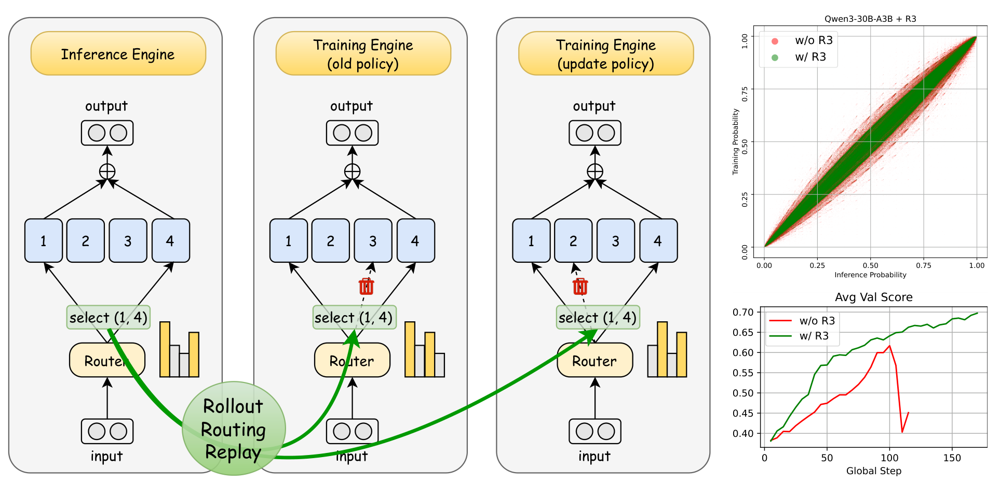
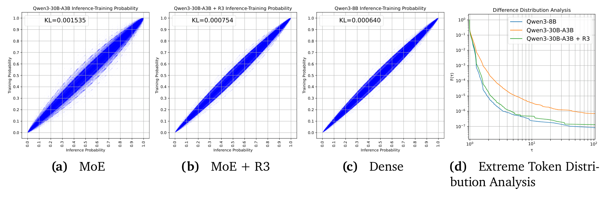
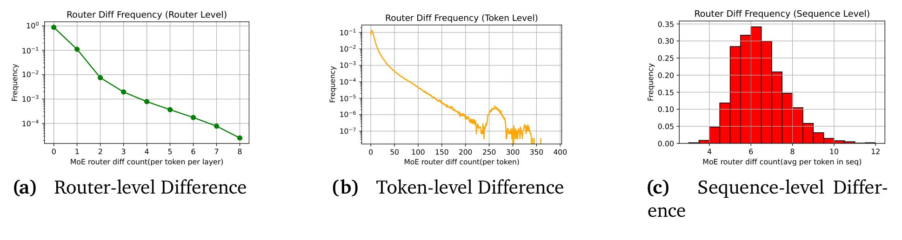

# R3：Rollout Routing Replay

## 来源

- **PDF**：`raw/2510.11370v2.pdf`（19 页）
- **标题**：Stabilizing MoE Reinforcement Learning by Aligning Training and Inference Routers
- **arXiv**：2510.11370v2，2025-10-21
- **团队**：北大计算机 / 多媒体信息处理国重（Ma / Song / Wang / Sui）+ 小米 LLM-Core（Zhang / Zhao）；Ma 实习于小米
- **不建模型页**：实验对象是 Qwen3-30B-A3B，不是新模型实体。

本页是 **Rollout Routing Replay（R3）的一手出处**。wiki 里已有的「R3 / `--use-rollout-routing-replay`」都指向这篇，不要另建 `rollout-routing-replay` 近亲页。它修的是 [训练—rollout 一致性](../concepts/train-rollout-consistency.md) 的第二层（专家路由），与 GRPO / GSPO / TIS / IcePop 的 ratio 修正正交。

## 核心结论

1. **MoE 把 train–infer 缝放大**：同一套 SGLang rollout + Megatron 训练，Qwen3-30B-A3B 的 token 概率 KL 是 $1.535\times 10^{-3}$，dense Qwen3-8B 是 $6.4\times 10^{-4}$（Eq. 2、§3.1）。
2. **根因是路由不连续**：约 10% 的 (token, layer) router 选了不同专家；**94% 的 token** 至少一层选错专家；序列上平均每 token 差约 6 个 router（Figure 3、§3.2）。同一 Megatron 引擎对同一序列跑两次，KL 仍有 $8.4\times 10^{-4}$（Figure 4）。
3. **R3 重放推理 mask，不重放训练 logits**：推理得到 $I_{\mathrm{infer}}=\mathrm{TopKMask}(s_{\mathrm{infer}},K)$，训练时用 $I_{\mathrm{infer}}$ 选专家，softmax 仍加在 $s_{\mathrm{train}}$ 上，梯度回得去 router（Eq. 8–9、§4.1）。
4. **对齐后接近 dense**：KL 降到 $7.54\times 10^{-4}$；$\tau>2$ 的极端 token 比例降约一个数量级（Figure 2）。Rollout 额外延迟 <3%。
5. **比 GSPO / TIS 更稳，且可叠加 GSPO**：三组设定里无 R3 的 GRPO 都会崩；R3 不崩。单 mini-step 上 R3 优于 TIS；TIS+R3 没有再涨，作者认为缝已经被 R3 收掉（Table 1、§5.2）。
6. **不是 GSPO 文里的 Recompute Routing Replay**：那套缓存的是 Recompute 阶段路由、只在 Update 重放，修的是权重更新造成的漂移；`mini_step=1` 时新旧 policy 相同，它失效。R3 从 Rollout 缓存，Recompute 与 Update 都重放（§6.3）。

## 架构与训练

本页没有新骨干。实验栈：VeRL + Megatron 训练 + SGLang 推理（§5.1）。分析与主实验都用 Qwen3-30B-A3B；dense 对照是 Qwen3-8B。

> Figure 1（原文截图，§1）："Left: Illustration of the Rollout Routing Replay (R3). Top right: Training and inference discrepancies before and after applying R3. Bottom right: Reinforcement learning training performance before and after applying R3."

## 后训练

### 诊断：路由差多少

对 2048 道数学题，SGLang 生成约 2000 万 response token，再送进 Megatron 取训练概率（§3.1）。KL 用 Schulman (2020) $k_3$ 估计（Eq. 2）。极端 token 函数 $F(\tau)$ 是 $\max(\pi_{\mathrm{train}}/\pi_{\mathrm{infer}},\,\pi_{\mathrm{infer}}/\pi_{\mathrm{train}})>\tau$ 的比例（Eq. 3）。

> Figure 2（原文截图，§3.1）："(a): ... discrepancy in the MoE model. (b): ... MoE+R3 ... (c): ... Dense model. (d): Extreme Token Distribution Function, calculated based on Equation 3."

> Figure 3（原文截图，§3.2）："Router discrepancy analysis"

作者判断：MoE 相对 dense 多出来的那截 discrepancy，主因是路由，不是别的 kernel 噪声（§3.2、§4.3）。

### 机制：重放 mask，保留 softmax 梯度

常规训练 MoE（Eq. 4–7）：$s_{\mathrm{train}}=x_{\mathrm{train}}W_r$，$I_{\mathrm{train}}=\mathrm{TopKMask}(s_{\mathrm{train}},K)$，再在选中专家上 softmax 得 $g_{\mathrm{train}}$。

R3（Eq. 8–9）：推理侧算 $I_{\mathrm{infer}}$，训练侧

$$
g_{\mathrm{replay},i}=\frac{I_{\mathrm{infer},i}\,\exp(s_{\mathrm{train},i})}{\sum_j I_{\mathrm{infer},j}\exp(s_{\mathrm{train},j})},\quad
y_{\mathrm{replay}}=\sum_i g_{\mathrm{replay},i}E_i(x_{\mathrm{train}}).
$$

只对齐「选谁」，不冻结「多重」。作者写两个目的：专家集合与推理一致；梯度仍回到 logits，router 还能学（§4.1）。

实现：从推理引擎存取 router mask，rollout 额外延迟 <3%。与 KVCache 前缀缓存同性质——同一前缀的 mask 可跟 KV 一起缓存，多轮 agent 不必为了取 mask 再 prefill（§4.2）。[MiMo-V2-Flash](mimo-v2-flash.md) §4.6.1 后来用 request-level prefix cache（不用 radix 跨请求共享）落地这一条。

主实验里，R3 在 **重算 old policy** 和 **更新 policy** 两次前向都重放（§5.1）。

### 与 TIS / GSPO / IcePop 的层级

R3 不改 importance ratio 的公式。它让 $\pi_{\mathrm{train}}$ 与 $\pi_{\mathrm{infer}}$ 尽量走到同一组专家，再交给现有 PPO/GRPO/GSPO 目标。TIS 夹的是已经算歪的比；IcePop 按 train/infer 比丢 token。作者认为缝收掉之后，TIS 再夹没有增量（§5.2）。这与 [IcePop](ring-1t.md)「留下的扰动会放大」是同一根轴上的不同层：R3 先修路由，ratio 修正吃残差。

和 GSPO 论文的 Recompute Routing Replay 不要混：那套不管 SGLang↔Megatron 的框架差，`mini_step=1` 时失效；R3 从 rollout 取 mask，两种设定都有效（§6.3）。

## 评测要点

数学 RL：约 10 万可验证题（Big-Math-RL-Verified、ORZ-Math 等）。评测 AIME24/25 Avg@32、AMC23 Avg@16、MATH500 Lv5 Avg@4。每 5 个 global step 评一次，表里报 **最佳分数及其 step**，另报崩溃 step（§5.1）。

配方：batch 256、$n=8$；prompt 最长 2048、生成最长 30720；DAPO Dynamic Sampling。GRPO 另加 Clip-Higher $\varepsilon_{\mathrm{low}}=0.2$、$\varepsilon_{\mathrm{high}}=0.27$。TIS 上界 $C=2$。GSPO $\varepsilon_{\mathrm{low}}=3\times 10^{-4}$、$\varepsilon_{\mathrm{high}}=4\times 10^{-4}$。无 expert-balancing auxiliary loss。多 mini-step：8 步、LR $1\times 10^{-6}$；单 mini-step：1 步、LR $3\times 10^{-6}$。

Table 1 摘录（Avg 与 Crash Step）：

| 设定 | 方法 | Avg | Crash |
| --- | --- | ---: | ---: |
| SFT，mini_step=8 | GRPO | 48.84 | 120 |
|  | GSPO | 66.76 | — |
|  | GRPO+R3 | 68.05 | — |
|  | GSPO+R3 | **69.00** | — |
| SFT，mini_step=1 | GRPO | 62.23 | 60 |
|  | GRPO+TIS | 66.24 | 105 |
|  | GRPO+R3 | **71.83** | — |
|  | GRPO+TIS+R3 | 70.14 | — |
| Base，mini_step=1 | GRPO | 61.69 | 105 |
|  | GRPO+TIS | 69.22 | — |
|  | GRPO+R3 | **70.73** | — |
|  | GRPO+TIS+R3 | 69.17 | — |

无 R3 且崩的 run，$F(\tau=2)$ 可超过 0.1（一成 token 的概率比 >2）；有 R3 时多数时间 $F(\tau=2)<10^{-4}$（§5.2、Figure 5）。

SWE 多轮（Table 2）：Qwen3-30B-A3B，R2E-Gym-Lite 训、SWE-bench Verified 验，序列最长 65536、最多 50 步。GRPO 31.80、step 90 崩；GRPO+R3 **38.60**、不崩。作者归功于 mask 跟 KV 一起缓存，rollout 不减速（§5.3）。

## 待追问

- 60 MB/轨迹 的 routing tensor 成本写在 [Miles](miles-v0-1.md)，**不是**本页数字。本页只报 <3% rollout 延迟。1M 上下文下带宽是否仍可忽略，两边都没有曲线。
- 主实验是数学 RLVR + 一个 SWE 设定，全是 Qwen3-30B-A3B。更粗专家、更多层、异步 staleness 更大时，只重放 mask 够不够？
- TIS+R3 略低于 R3：是「缝已收、再夹有害」，还是超参没重搜？没有对照表。
- 两次 Megatron 前向仍有 KL $8.4\times 10^{-4}$。R3 不修训练引擎内部的非确定性。
- [MiMo-V2-Flash](mimo-v2-flash.md) 写「We propose R3」，与本页 Ma et al. 是同一团队；生产采用的细节（异步、partial rollout）以 MiMo / Miles 为准，不要回写成本页实验。

## 相关页面

- 概念：[训练—rollout 一致性](../concepts/train-rollout-consistency.md)（第二层）、[Multi-Teacher On-Policy Distillation](../concepts/multi-teacher-on-policy-distillation.md)
- 实现 / 采用：[Miles v0.1](miles-v0-1.md)（`--use-rollout-routing-replay`）、[MiMo-V2-Flash](mimo-v2-flash.md)（§4.6.1）
- 正交的 ratio 层：[DeepSeekMath](deepseekmath.md)（GRPO）、[LLM RL policy optimization 对比](../comparisons/llm-rl-policy-optimization.md)、[Ring-1T / IcePop](ring-1t.md)
