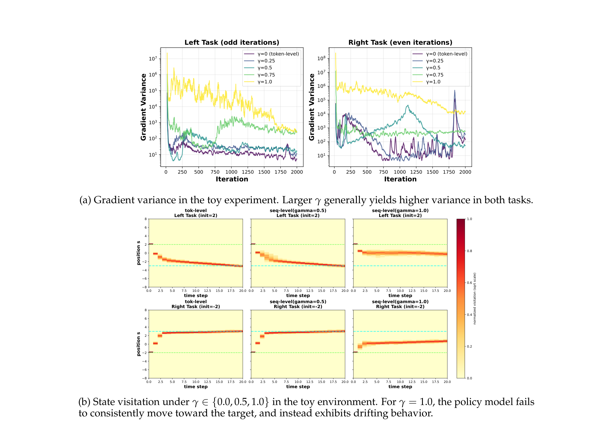
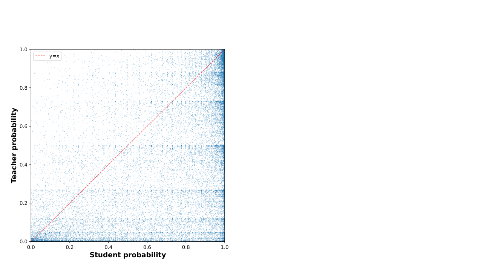
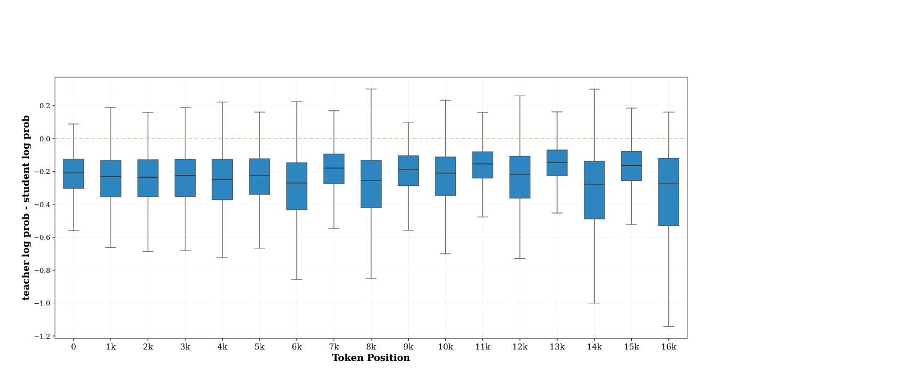

# Revisiting On-Policy Distillation：失败模式与 top-K 局部支撑

## 来源

- 原始 PDF：[`raw/2603.25562v2.pdf`](../../raw/2603.25562v2.pdf)
- 标题：Revisiting On-Policy Distillation: Empirical Failure Modes and Simple Fixes
- 版本 / 日期：arXiv:2603.25562v2，2026-04-27（v1 2026-03-26）。页眉为 Preprint, under review；脚注标明 work in progress
- 作者：Yuqian Fu、Haohuan Huang（共同一作）、Kaiwen Jiang、Yuanheng Zhu、Dongbin Zhao（中科院自动化所 / 国科大；Zhu、Zhao 为通讯）；Jiacai Liu（复旦）；Zhuo Jiang（独立）
- 代码：<https://github.com/hhh675597/revisiting_opd>
- 博客：<https://yuqianfu.notion.site/revisiting-opd>
- 模型链接：**未建模型页**——不发布新模型。Student 是 Qwen2.5-7B-Instruct 与 1.5B-Instruct

## 为什么这篇在 wiki 里独占一席

比较页还开着「sampled-token 和 full-vocab 谁更稳」。这篇不跑 full-vocab，它解释 **sampled-token 为什么脆**，并给出一个夹在中间的估计器：每个前缀上只在 teacher 的 top-K 里做重归一化 reverse KL，更新仍然是 token-level。摘要里的 **+19.8%** 是交替多任务里数学均分的相对涨幅（34.8 → 41.7），不是全表、也不是百分点。

它和 [Keye](keye-vl-2.md) 的 top-k overlap、[KAT-Coder-V2.5](kat-coder-v2.5.md) 的 drift truncation 不是同一刀。那两家是在 sampled token 上决定算不算 advantage。这篇是把「只看采样到的那一个 token」换成 teacher 支撑集上的一小团分布。[Prune-OPD](prune-opd.md) 用同一形状的重叠比去衰减 reward 并改下一步的最大长度，估计器本身不动。

也不要和 Mach-Mind 引用的 *Rethinking OPD: Phenomenology, Mechanism, and Recipe*（Li et al.，arXiv:2604.13016）混成一篇。本文在相关工作里引用了那篇，自己的题目是 Revisiting。

## 核心结论

1. **Token-level 估计器相对序列级 reverse KL 有偏，换来的是更松的最坏方差上界**（`§2.1`、附录 D）。序列级梯度把每个 token 的 score 乘上从该位置起的未来 log-ratio 之和；\(t'<t\) 的交叉项期望为 0。Token-level 只留当前项 \(r_t s_t\)，所以期望一般对不上。在 \(|r_t|\le B_r\)、\(\lVert s_t\rVert\le B_s\) 时，用 \(\mathrm{Var}\le\mathbb{E}\lVert X\rVert^2\) 得到的上界是 token-level \(O(T^2)\)、序列级 \(O(T^4)\)。作者写明这是保守上界，不是典型方差的定理。
2. **Sampled-token 的学习信号有三种脆点**（`§2.2`），观察来自 Qwen2.5-7B-Instruct 蒸 OpenThinker3-7B（同一基座上的 SFT teacher）：采样 token 的 reward 高度不均衡；学生前缀漂走之后 teacher 仍会给重复 token 高分；tokenizer / special token 对不齐时，一个 token 的 log-ratio 会把分词差异当成语义错误。
3. **Teacher top-K 局部支撑匹配**（公式 6–8，主实验 \(K=32\)）在 teacher 最高的 K 个 token 上把两边的分布重新归一化，再算 reverse KL，对 rollout 位置取平均。再配 top-p rollout 和 special-token mask。单独拿掉重归一化会快速崩；只上 top-K、不上 top-p，消融里比 sampled-token 还差。
4. **+19.8% 只描述 Table 2 的数学均分。** 无 mask 的本方法 41.7，sampled-token OPD 34.8，相对 \((41.7-34.8)/34.8\)。单任务数学均分是 36.4 → 41.7。离 OpenThinker3-7B 的 56.0 仍远。主表没有 full-vocab 对照。

## 方法

### 从序列级 reverse KL 到 sampled token

目标是 \(J(\theta)=\mathbb{E}_x[D_{\mathrm{KL}}(\pi_\theta(\cdot|x)\|q(\cdot|x))]\)。自回归拆开之后，序列级估计器是未来 log-ratio 的 reward-to-go（公式 1 的因果形式）。折扣 \(\gamma=0\) 就是 token-level，\(\gamma=1\) 回到序列级（公式 3）。

Toy 不是语言模型：约 4K 参数的三层 MLP，一维位置控制，左右两个镜像任务，3 个种子。\(\gamma\) 越大，梯度方差越高；\(\gamma=1\) 时策略会漂、到不了目标（Figure 1，附录 E）。

> Figure 1. Effect of increasing \(\gamma\) in the toy experiment. Larger \(\gamma\) yields a higher and more persistent variance regime and, in the sequence-level limit, drifting policies in state space.（`§2.1`）

当前 LLM 流水线把 token-level 再收成采样 token 上的 log-ratio（公式 5）。他们把 reward 写成 \(\log q(y_t|c_t)-\log\pi_\theta(y_t|c_t)\)：学生比 teacher 更相信这个 token 时，reward 为负。

### 三种失败

> Figure 2. Scatter of token probabilities (teacher vs. student) at the sampled-token OPD first iteration. The sampled-token signal is heavily skewed toward penalizing the current token.（`§2.2`）

负 reward 占多数之后，更新被少数局部为正的 token 主导。作者认为高频填充词和短续写可以拿到好看的局部分，却对轨迹质量没帮助。

第二，学生掉进重复循环时，teacher 对重复 token 仍然局部对齐（Figure 3）。高 teacher 概率不再代表这条轨迹是好的。他们把放大器写成两件事：teacher 分布很尖时 log-ratio 会很大；序列后段 teacher–student 差距的下尾更宽（Figure 4）。

> Figure 4. Distribution of teacher–student log-probability gaps across token positions. Several later position buckets exhibit wider lower tails and more extreme values.（`§2.2`）

第三，同一段字两边切分不同。Figure 5 里学生把 `<think>` 切成 `<`、`think`、`>`，`<` 的 student log-prob 是 −0.07，teacher 是 −19.16；`<|im_end|>` 对 `<EOS>` 是 −0.00 对 −58.71。监督只打在一个 token 上时，分词差异会变成巨大的负 reward。

> Figure 5. Token-level comparison can penalize semantically correct outputs due to tokenizer mismatch between the teacher and student.（`§2.2`）

### Teacher top-K 局部支撑

在前缀 \(c_t\) 上取 teacher 概率最高的 K 个 token 为 \(S(c_t)\)。Student 和 teacher 都只在 \(S\) 里重新 softmax，再算

\[\sum_{v\in S}\hat\pi_\theta(v|c_t)\log\frac{\hat\pi_\theta(v|c_t)}{\hat q(v|c_t)}.\]

对一条 rollout 的位置平均，再对一组 rollout 平均（公式 8）。支撑外的 token 没有这项梯度。相对 full-vocab reverse KL，这仍然有偏（附录 A）。作者把它写成估计器的性质，不写成已经证明的好处。

另外两处实现选择：rollout 用 top-p，避免极低概率 token 把前缀带离 teacher 还说得清的区域；special token 直接 mask。Mask 对 sampled-token 基线帮助明显，对本方法的均分几乎不动。他们没有去做多 token 标记的合并。

公开实现上的默认值在 Table A1：\(K=32\)，本方法的 rollout top-p 为 0.9，**sampled-token 基线不用这个 top-p**。Temperature 1，group size 8，batch 128，AdamW，学习率 \(2\times 10^{-6}\)，数学最长回复 16384。单任务与交替多任务都是 400 step；交替时数学和 ALFWorld 各 200 step。WebShop 只有 60 step。附录 A 承认 rollout 引擎的 top-p 和训练前向之间的 train–inference mismatch 还没修。

## 评测要点

数学 teacher 是 OpenThinker3-7B，训练数据是 DAPO-Math-17K 的英文部分，最长上下文 16K。数学报五项 pass@1：MATH500、AIME24、AIME25、Minerva、OlympiadBench。ALFWorld 报成功率，teacher 是 GiGPO-Qwen2.5-7B-Instruct-ALFWorld。8×H100，verl + verl-agent。

Table 1，单任务数学，pass@1：

| 方法 | MATH500 | AIME24 | AIME25 | Minerva | Olympiad | Avg. |
| --- | ---: | ---: | ---: | ---: | ---: | ---: |
| Qwen2.5-7B-Instruct | 68.2 | 13.3 | 0.0 | 26.5 | 32.9 | 28.2 |
| OpenThinker3-7B | 92.2 | 53.3 | 40.0 | 39.0 | 55.6 | 56.0 |
| Sampled-token OPD | 80.0 | 10.0 | 16.7 | 32.4 | 43.1 | 36.4 |
| Sampled-token OPD + mask | 81.4 | 26.7 | 16.7 | 34.2 | 44.7 | 40.7 |
| Ours，无 mask | 80.4 | 23.3 | 26.7 | 34.2 | 43.9 | **41.7** |
| Ours + mask | 82.0 | 23.3 | 23.3 | 34.9 | 43.9 | 41.5 |

Sampled-token 在 AIME24 上从 13.3 掉到 10.0。Mask 把这条基线的均分抬到 40.7，其中 AIME24 26.7 高于本方法。本方法的均分优势剩 1 分左右，而且加 mask 没有再涨。AIME 的 pass@1 没有误差条。

Table 2，batch 交替的 ALFWorld + 数学。数学均分一列就是 +19.8% 的分母分子。

| 方法 | ALFWorld | 数学 Avg. |
| --- | ---: | ---: |
| Qwen2.5-7B-Instruct | 21.9 | 28.2 |
| GiGPO ALFWorld teacher | 95.3 | — |
| OpenThinker3-7B | — | 56.0 |
| Sampled-token OPD | 90.6 | 34.8 |
| Sampled-token OPD + mask | 93.8 | 36.6 |
| Ours，无 mask | 95.3 | **41.7** |
| Ours + mask | **97.7** | 38.6 |

无 mask 的本方法在 ALFWorld 上追平 GiGPO teacher（95.3），数学均分 41.7。加 mask 后 ALFWorld 到 97.7，超过该 teacher，数学掉回 38.6。作者把这个读成：局部支撑主要帮推理侧，mask 在这一跑里把权衡推向 agent 任务。

消融（Table 3，单任务，AIME24 avg@32）：基座 10.0，teacher 63.3，sampled-token 20.4，只加 top-p 21.6，只做 teacher top-K 17.7，top-K 加 top-p 23.6。Top-K 自己不够，rollout 得先留在稳的区域。Figure 6：去掉支撑内重归一化会快速崩；\(K\) 太小或 top-p = 1 也不稳。主实验对具体 \(K\) 在够大之后不敏感，扫过的是 16 / 32 / 48。

支撑集怎么选（Table 4）：单任务里 teacher top-K、student top-K 加采样 token、teacher top-K 加采样 token 的 pass@1 均分分别是 41.7 / 41.9 / 42.9，作者不肯给排名。交替多任务里只有 teacher top-K 站住（数学均分 41.7）；另外两种掉到 28.4 和 26.9。他们把这写成支撑构造会受任务影响的初步证据。

WebShop，student 换成 Qwen2.5-1.5B-Instruct，teacher 是同一基座上的 GiGPO RL，所以没做 mask（Table A2）。成功率：基座 2.3，sampled-token OPD 50.0，本方法 57.8，teacher 66.4。任务分 12.7 / 73.0 / 75.1 / 81.9。只有 60 step。

## 与现有 wiki 页的关系

- **[OPD 比较页](../comparisons/on-policy-distillation.md)**：V4 用 full-vocab，MiMo / Nemotron 用 sampled-token，Nemotron 的初步实验里 top-k / full-vocab logit matching 在 Terminal Bench 上更差。本文补的是中间一档的小模型证据：teacher top-32 重归一化 reverse KL，7B 数学和 ALFWorld，没有 full-vocab 臂，也没有终端环境。不能拿来裁决 V4 和 Nemotron。
- **[OPSD](opsd.md)**：被引为 full-vocab 在自蒸馏里强于 sampled-token 的例子。OPSD 的主实验是 forward KL。本文坚持 reverse KL，只改支撑集。
- **[The Many Faces of OPD](many-faces-opd.md)**：导出未归一化 Top-K 梯度里消不掉的 \(+1\)，并写明重归一化丢掉集合上的概率质量。他们崩掉的是未归一化版本，不是本页 Qwen2.5-7B 配方的复现。
- **[MiniLLM](minillm.md) / [ExOPD](exopd.md)**：序列级梯度里的未来 log-ratio 之和，和这两页写下的 reward-to-go 是同一分解。本文的重点是把 \(\gamma=0\) 的那一档再从单 token 换成 top-K。ExOPD 被本文相关工作点名为「更灵活的 reward」，没有进实验。
- **[Thinking Machines Lab 博客](thinking-machines-on-policy-distillation.md)**、MiMo-V2-Flash、GLM-5、Qwen3：被引为 sampled-token / on-policy 流水线的工业出处，不是本文的复现对象。
- **[GiGPO](gigpo.md)**：ALFWorld 与 WebShop 的 teacher checkpoint 来自这篇的作者框架 verl-agent。本文不改 GiGPO 的 advantage，只把 OPD 的蒸馏项换掉。

## 待追问

- **需实验或作者披露**：和 full-vocab reverse KL、以及 Nemotron 那种 top-k logit matching，在同一学生、同一任务上差多少。本文的偏置讨论停在「支撑外没有梯度」。
- **需实验或作者披露**：AIME pass@1 没有误差条。单任务 AIME24 上 mask 后的 sampled-token（26.7）高于本方法（23.3），均分只差 1 分。+19.8% 不能写成稳定的全任务增益。
- **现有材料待核**：脚注写 work in progress。\(K\)、top-p、mask 的组合在 v2 之后是否还是同一配方，要以新版本为准。
- **需实验或作者披露**：top-p rollout 和训练前向的 mismatch，作者自己标成未做。400 step、7B、一个数学 teacher 加一个 ALFWorld teacher，离 V4 的多 teacher 全词表不是同一规模。

## 相关页面

- [On-Policy Distillation 跨报告对比](../comparisons/on-policy-distillation.md)
- [Multi-Teacher On-Policy Distillation](../concepts/multi-teacher-on-policy-distillation.md)
- [OPSD](opsd.md)
- [The Many Faces of OPD](many-faces-opd.md)
- [ExOPD](exopd.md)
- [MiniLLM](minillm.md)
- [Thinking Machines Lab On-Policy Distillation 博客](thinking-machines-on-policy-distillation.md)
- [GiGPO](gigpo.md)
- [Keye-VL-2.0 技术报告](keye-vl-2.md)
- [KAT-Coder-V2.5 技术报告](kat-coder-v2.5.md)
- [Nemotron 3 Ultra 技术报告](nemotron-3-ultra.md)
