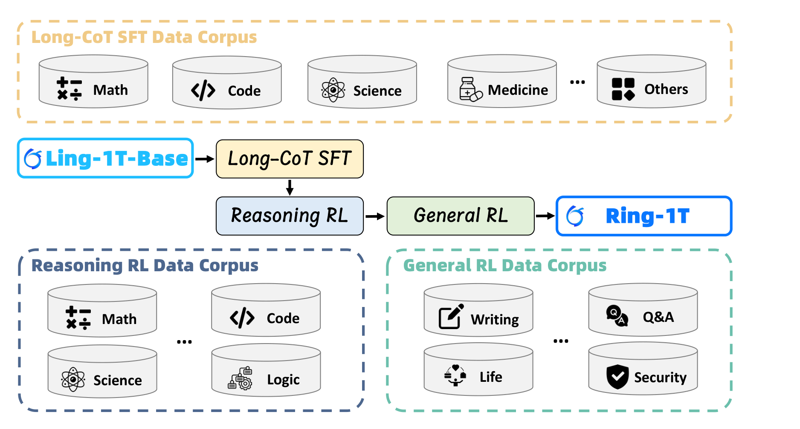
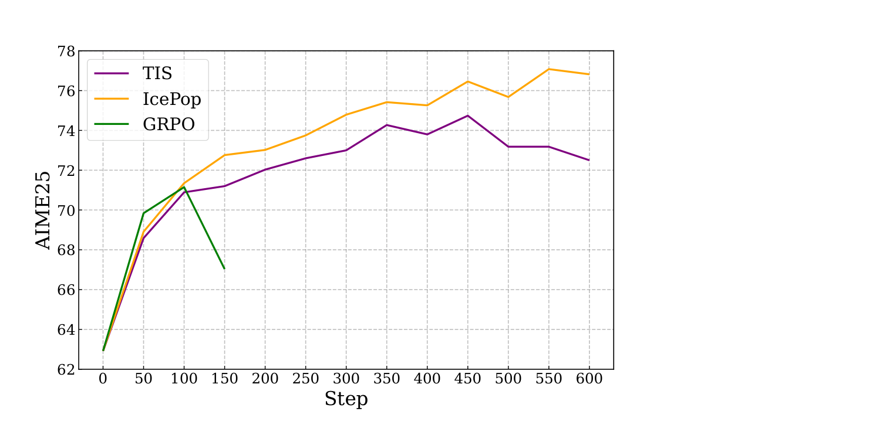
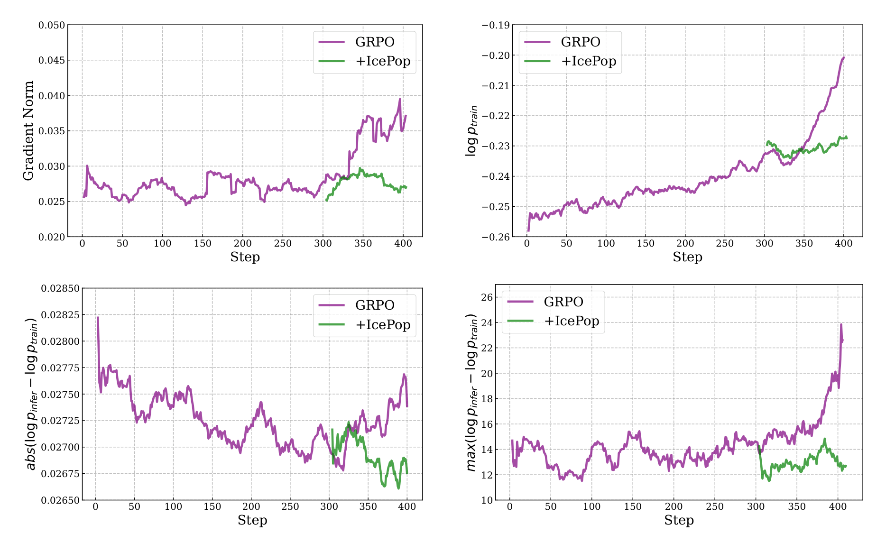
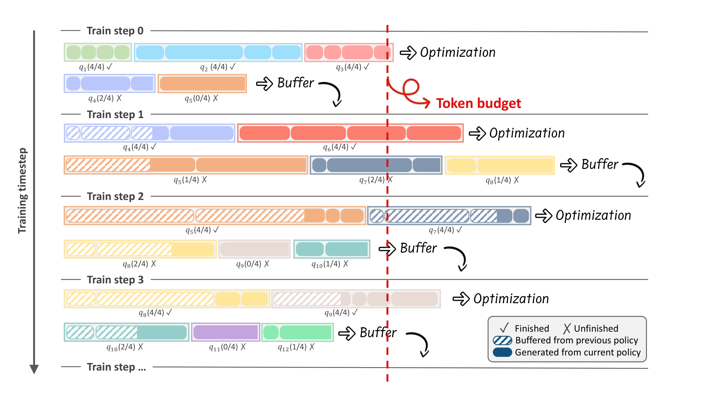

# Ring-1T：Every Step Evolves

## 来源

- **PDF**：`raw/2510.18855v2.pdf`（31 页）
- **标题**：Every Step Evolves: Scaling Reinforcement Learning for Trillion-Scale Thinking Model
- **arXiv**：2510.18855v2，2025-10-25；文首 Date: Oct 22, 2025
- **团队**：Ling Team, Inclusion AI
- **开源**：[GitHub Ring-V2](https://github.com/inclusionAI/Ring-V2)、[Hugging Face Ring-1T](https://huggingface.co/inclusionAI/Ring-1T)
- **模型页**：[Ring-1T](../models/ring-1t.md)
- **IcePop 博客**（作者另文，非本 PDF 原文确证）：https://ringtech.notion.site/icepop

本页同时是 **IcePop** 的一手出处，以及 **Ring-1T** 模型报告。它不是 [Ling-2.6 / Ring-2.6](ling-2.6.md)：后者是 2026-06 的后续族，把 GQA 基座 retrofit 成 Lightning Attention + MLA，并用 KPop 替换 IcePop。

## 核心结论

1. **Ring-1T 是开源万亿 thinking MoE**：从 Ling-1T-base（Ling 2.0 架构）训出，总参 1T、每 token 约 50B 激活。作者称它是当时第一个开源的万亿 thinking 模型，评测只靠自然语言推理，不依赖代码生成或符号求解器（摘要、§1）。
2. **万亿 MoE RL 的三件套**：IcePop 处理 train–inference 概率失配；C3PO++ 用 token budget 切分超长 rollout；ASystem 提供 Hybrid Runtime / AMem / AState / ASandbox。三者被写成互相配套，而不是可任意拆开的独立卖点（§1、Figure 3）。
3. **IcePop 是 GRPO 变体，不是新的 ratio 单元**：它在 PPO clip 之外，用 $k=\pi_{\mathrm{train}}(\theta_{\mathrm{old}})/\pi_{\mathrm{infer}}$ 做双侧校准——落在 $[\alpha,\beta]$ 内则把该比值乘进梯度，越界则整 token 丢弃（Eq. 1–3、§2.3.2）。Reasoning RL 默认 $\alpha=0.5$、$\beta=5$（§2.3.4）。
4. **Headline 分**：AIME-2025 93.40（Avg@64）、HMMT-2025 86.72（Avg@16）、CodeForces 2088、ARC-AGI-1 55.94；IMO-2025 在 AWorld 上一次提交解出 4 题，作者写成银牌级（摘要、Table 1、§3.3）。
5. **作者自己划的边界**：IcePop 压住主要失配，但**没有**做到完全一致；算子层数值差仍是隐患。后训练针对基础自然语言推理，工具使用等 agentic 能力被标成 under-optimized（§5）。

## 架构与训练

基座是 Ling-1T-base：1T 总参 / 50B 激活的 MoE（§2.1）。本报告**不给**层数、专家数、hidden size；注意力在 Limitations 里写成 GQA（§5），不要回写成后来 Ring-2.6 的 7:1 Lightning + MLA。

> Figure 2（原文截图，§2.1）："The training pipeline of Ring-1T."

三段分工（§2.1）：

| 阶段 | 目标 | 数据要点 |
| --- | --- | --- |
| Long-CoT SFT | 先激活长链推理，给后续 RL 垫底 | 开源 + 专家手写 + LLM 合成；去重 / 有害过滤 / 去污染 / 低质过滤。正文写 Math 46% / STEM 26% / Code 20% / Others 8%（§2.2） |
| Reasoning RL | RLVR 抬数学、代码、科学、逻辑 | 可验证结果 + 多域 verifier |
| General RL | RLHF 回校准，保推理同时补对齐、写作、安全 | 公开通用集 + 真实用户偏好 |

SFT 训练：序列 pack 到 64K，3 epoch，学习率 $2\times 10^{-4}$，cosine + 30 warmup，weight decay 0.1（§2.2）。

Science 数据把选择题改成开放题；有机化学走 image-semantization，把分子结构等视觉信息转成结构化文本再进模型（§2.3.1）。这是**数据侧**把图写成字，不能据此把 Ring-1T 标成多模态输入。

## 后训练

### IcePop：校准区间内、丢弃区间外

当代 RL 框架训练引擎与推理引擎分立，同一 $\theta$ 上算出的 token 概率会漂。作者认为 MoE 动态路由和长 CoT 会把漂移逐 step 放大，并给出 Compounding Probability Discrepancy（Theorem 1 / Appendix B Theorem 2）：在一组光滑性与 bias-alignment 假设下，当 $\delta_t$ 超过阈值后，$\delta_{t+1}\ge(1+\eta\mu/2)\delta_t$。定理依赖 (A1)–(A4)，不是无条件保证。

对策是 IcePop——**GRPO 变体**，双侧 mask 校准（§2.3.2）：

- **Double-sided calibration**：只在由上下界划出的区域内校准 token 梯度。
- **Masking**：概率偏差过大的 token 不进梯度。

目标（Eq. 1–2）里有**两条不同的比**：

- 校准 / mask：$k=\pi_{\mathrm{train}}(y_{i,t}\mid x,y_{i,<t};\theta_{\mathrm{old}})/\pi_{\mathrm{infer}}(\cdots;\theta_{\mathrm{old}})$。$M(k)=k$ 当 $k\in[\alpha,\beta]$，否则 $0$。
- PPO importance ratio：$r_{i,t}=\pi_{\mathrm{train}}(\theta)/\pi_{\mathrm{train}}(\theta_{\mathrm{old}})$，再做 $\mathrm{clip}(r_{i,t},1-\varepsilon,1+\varepsilon)$。

区间内的 token 因此被乘上 $k$（用 train/infer 比校正），区间外直接 $M=0$。这不是「只改 clip 形状」，也不是「改 sequence-level ratio」。目标里还留着 $-\gamma D_{\mathrm{KL}}(\pi_\theta\|\pi_{\mathrm{ref}})$，但 Reasoning RL 把 KL 系数设成 $0.0$（§2.3.4）。

![Figure 3：上半是 IcePop + C3PO++ 接入 Ring-1T 的数据流（语料 → Inference Engine → 各域 verifier → Training Engine）；左下 C3PO++ 按 token budget 把未完成 rollout 切到下一 policy version；右下 IcePop 在 $\pi_{\mathrm{infer}}$–$\pi_{\mathrm{train}}$ 平面上把 $[\alpha,\beta]$ 外的 token 标成 Discarded。](../assets/ring-1t/fig3-icepop-c3po.png)

> Figure 3（原文截图，§2.3.2）："We integrate C3PO++ and IcePop into Ring-1T, which enhances both training efficiency and effectiveness of RL."

Appendix A.1 把 IcePop 放进已有谱系（原文确证）：

- **相对 GSPO**：GSPO 先缓存 $\theta_{\mathrm{old}}$ 的 routed experts 再 replay，随后改成 sequence-level ratio。IcePop 不依赖 sequence-level 优化，作者认为可以并进其他工作。
- **相对 TIS**（Yao et al. 2025）：TIS 对越界 token 仍更新，只加 moderating coefficient；IcePop **丢掉**这些梯度。作者经验是：留下的小扰动会随训练放大，最终把 benchmark 平台期化。

这与 [Miles](miles-v0-1.md) 后来把同一层拆成 TIS（阻尼）vs clip-or-pop（丢弃）是同一坐标；IcePop 落在「丢弃」一侧，但乘的是 train/infer 比 $k$，不是把 PPO $r$ 直接置零。

### 小模型对照与 1T 动态

初步实验在 Ring-mini-2.0（16.8B / 0.75B 激活 MoE）上对比 IcePop（$\alpha=0.5,\beta=5$）、官方推荐设置的 TIS、以及无 KL 的 Vanilla GRPO，同一训练数据（§2.4.1）。

> Figure 5（原文截图，§2.4.1）："The performance comparison on AIME25 (Avg@64). We evaluate all models using the same setting."

> Figure 6（原文截图，§2.4.1）："The training dynamics before and after applying IcePop."

Appendix C 补充（Ring-mini-2.0，600 step）：

- IcePop 与 TIS 都能避免 baseline 在 180–200 step 的 reward 崩（Figure 10）。
- IcePop 的极端概率差更低，且 $\log\pi_{\mathrm{train}}$ 更低，作者读成保留探索空间（Figure 11）。
- 默认设置下被 mask 的 token 约 **1–2‰**；被 clip 的 token 熵更高（Figure 12）。
- 区间敏感度（Figure 13）：默认 $[0.5,5.0]$ 稳且多样；$[0.5,2.0]$ 立刻不稳；$[0.4,5.0]$ 仍稳，但 $\log\pi_{\mathrm{train}}$ 更高。

### C3PO++：按 token budget 切分 rollout

C3PO++ 扩展 C3PO（Ring-lite，arXiv:2506.14731）：用 token budget $\Phi$ 动态切开 rollout，避免单条超长序列拖死整步（§2.3.3、Algorithm 1）。

> Figure 4（原文截图，§2.3.3）："C3PO++ improves reinforcement learning efficiency for large thinking models by maintaining a rollout buffer across policy model versions."

机制要点：推理池 $P_{\mathrm{infer}}$（容量 $\Omega_{\mathrm{infer}}$）并行生成，完成轨迹进训练池 $Q_{\mathrm{train}}$；累计 token $C$ 到 $\Phi$ 就更新；未完成轨迹的 retention period +1，超过 $\sigma$ 则 purge。更新后的 $\pi_{\mathrm{infer};\theta_{t+1}}$ 继续有效期内的未完成 rollout。

相对「不做 budget-controlled partition」的 baseline：rollout 阶段约 **2.5×** 加速，端到端每 step 约 **1.5×**；reward 曲线接近，AIME25 同为 92.29，CodeForces 2084 vs 2085，ARC-AGI-1 53.25 vs 53.62（Figure 7–8、§2.4.2）。这是效率对照，不是质量增益主张。

[Ring-2.6](ling-2.6.md) 后来把 token budget $\Phi$ + cross-version buffer 写进生产异步 RL；本页是同一团队更早的算法表述。两者是否同一实现，报告没有对读。

### 训练配方（§2.3.4）

全部 policy optimization 走 ASystem。AdamW $\beta_1=0.9$、$\beta_2=0.999$，weight decay 0.01，**MoE router bias 固定**。

| | Reasoning RL | General RL |
| --- | --- | --- |
| 算法 | IcePop $\alpha=0.5$、$\beta=5$ + C3PO++ | **GRPO**（不再写 IcePop） |
| 学习率 | $2\times 10^{-6}$ | $3\times 10^{-6}$ |
| KL 系数 | 0.0 | 0.0 |
| temperature | 1.0 | 1.0 |
| 每步 | 480 prompt × 8 rollout | 80 question × 8 output |
| 最大长度 | 65,536 | 32,768 |

### ASystem（§2.5）

SingleController + SPMD，把控制流与数据流拆开。组件：

- **Hybrid Runtime**：训练与推理统一执行环境。
- **AMem**：GPU 内存库（memory switching / 多路径传输 / unified pooling）。
- **AState**：权重同步。§2.5 正文写万亿参数 **10 秒内**；§2.5.1 又写 sub-second in-place 更新。两处口径不同，见待追问。
- **ASandbox**：按需 serverless 沙箱，HTTP / MCP；冷启动约 100 ms，吞吐写 5,000 QPS / 200 ms。
- **AReaL**：开源算法层（Fu et al., 2025，arXiv:2505.24298），异步多阶段 pipeline。

Appendix A.3 对照 VeRL / OpenRLHF / Slime / checkpoint-engine：AMem 避免 Slime 那种销毁重建 NCCL 的数分钟开销；AState 用 zero-redundancy P2P，对照「分钟级」NCCL 同步。这些是作者对前作的评述，不是独立复现。

## 评测要点

评测覆盖知识 / 代码 / 数学 / 推理 / 对齐 / 医疗 / 多轮 / agent。AIME 2025、LiveCodeBench-v6、ARC-AGI-1、CodeForces、HMMT 2025、ZebraLogic、HLE、BFCL v3 用 128K（原生不够则 YaRN 外推）；Aider / CNMO 2024 / BBEH 用 64K；其余 32K（§3.2）。基线取官方复现与官方自报的较高者。CodeForces 口径：14 场 Div. 2 + 专家测试用例，最高可达 rating 2209（脚注 8）。

Table 1 摘录（原文确证；蓝字 = 开源第一，粗体 = 全局第一，下划线 = 全局第二；† = 官方文档分）：

| Benchmark | Ring-1T | DeepSeek-V3.1-Terminus-Thinking | Qwen3-235B-A22B-Thinking-2507 | Gemini-2.5-Pro | GPT-5-Thinking (High) |
| --- | ---: | ---: | ---: | ---: | ---: |
| AIME 2025 (Avg@64) | 93.40 | 89.06 | 92.30 | 88.00 | **94.60** |
| HMMT25 (Avg@16) | 86.72 | 86.10 | 83.90 | 82.50 | **93.30** |
| LCB-v6 (2408-2505, Avg@4) | 78.30 | 75.33 | 75.72 | 70.65 | **80.60** |
| CodeForces (rating) | **2088** | 2073 | 2055 | 1837 | 1918 |
| ARC-AGI-1 | 55.94 | 40.62 | 48.12 | 45.44 | **65.70** |
| ArenaHard v2 (win-rate) | 81.59 | 60.27 | 80.18 | 79.20 | **82.91** |
| HealthBench | 57.93 | 50.19 | 55.56 | 49.39 | **67.20** |
| BFCL v3 | 68.82 | 62.01 | **73.53** | 61.36 | 57.21 |
| GPQA-Diamond | 78.63 | 81.00† | 81.10† | **86.40**† | 86.05 |
| Aider | 78.57 | 92.86 | 88.91 | 94.36 | **95.49** |

开源侧 Ring-1T 在 AIME / HMMT / LCB / CodeForces / ARC-AGI-1 / ArenaHard / HealthBench 领先；知识向（GPQA、MMLU-Pro）和 Aider 明显落后闭源与部分开源。作者把数学和竞赛编程写成稳定 RL recipe + 数据的结果，把 Aider 落后留在表里没有单独解释。

IMO-2025（§3.3、Appendix E）：接入 [AWorld](https://github.com/inclusionAI/AWorld)，纯自然语言、不用代码或符号求解器。第一次提交解出 1、3、4、5，作者对应银牌；第三次尝试给 Problem 2 近乎完整的几何证明；Problem 6 收敛到错误答案 4048（与 Gemini 2.5 Pro 相同，正确答案 2112）。

## 证据边界与阅读提示

- Limitations 把 MoBA 与「advanced linear attention」列为未来推理效率方向；本报告的 Ring-1T 仍是 GQA，不要和 Ring-2.6 的 Lightning Attention retrofit 混成同一代架构。

## 待追问

- **需实验或作者披露**：IcePop 的 $M(k)=k$ 是重要性采样校正，还是只是把 mask 写成乘子？Eq. 3 把 $M(\pi_{\mathrm{train}}/\pi_{\mathrm{infer}})$ 直接乘在 $\nabla\log\pi_{\mathrm{train}}$ 上，但没有消融「只做 0/1 mask、不乘 $k$」。
- **需实验或作者披露**：Reasoning RL 用 IcePop，General RL 改回 GRPO：是对齐阶段不再怕 mismatch，还是 IcePop 在 RLHF 数据上没有试？报告没写。
- **需实验或作者披露**：Figure 6 的 +IcePop 从约 300 step 才出现：是中途切入，还是两条 run 的对齐方式不同？
- **需实验或作者披露**：AState 同步延迟：§2.5 写万亿参数 <10 s，§2.5.1 写 sub-second。哪一个是 Ring-1T 实测？
- **需实验或作者披露**：SFT 域比例正文 46/26/20/8 与 Figure 14 饼图（Math 43%、Code 18%、Physics 13% …）对不齐。
- **需实验或作者披露**：IcePop 与 [GSPO](group-sequence-policy-optimization.md) / [SAPO](soft-adaptive-policy-optimization.md) / [DIS](single-rollout-asynchronous-optimization.md) 的可组合性只有 Appendix 定性句，没有实验。

## 相关页面

- 模型：[Ring-1T](../models/ring-1t.md)
- 后续同族：[Ling and Ring 2.6 技术报告](ling-2.6.md)（KPop 替换 IcePop；C3PO++ 的 token budget 进入生产异步 RL）
- 概念：[训练—rollout 一致性](../concepts/train-rollout-consistency.md)、[异步 Agent RL](../concepts/asynchronous-agent-rl.md)、[Agentic 模型的后训练](../concepts/post-training-for-agentic-models.md)
- 比较：[LLM RL policy optimization 对比](../comparisons/llm-rl-policy-optimization.md)
- 同层算法：[Group Sequence Policy Optimization](group-sequence-policy-optimization.md)、[Single-Rollout Asynchronous Optimization](single-rollout-asynchronous-optimization.md)、[Miles v0.1](miles-v0-1.md)（TIS 阻尼 vs clip-or-pop 丢弃）
- 采用 IcePop 的后续报告：[HunyuanOCR-1.5](hunyuan-ocr-1.5.md)、[UI-Mate](ui-mate.md)、[KAT-Coder-V2](kat-coder-v2.md)、[Nemotron 3 Ultra](nemotron-3-ultra.md)
