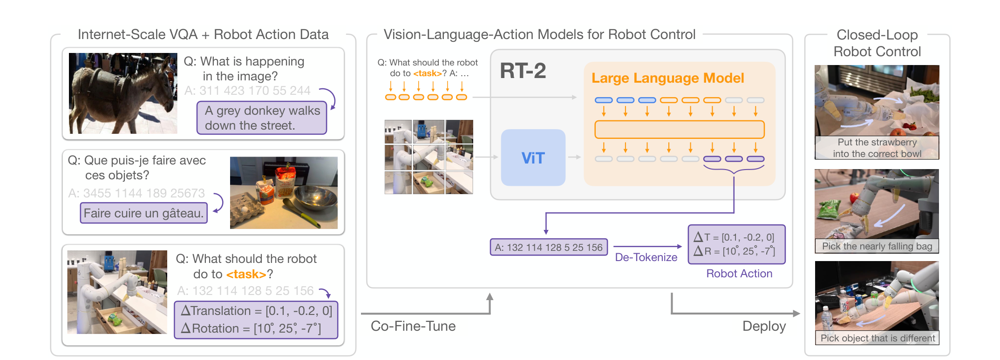
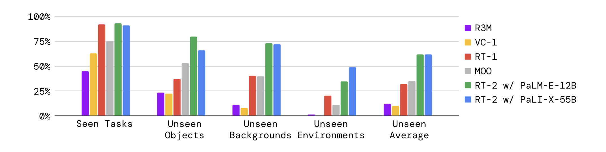
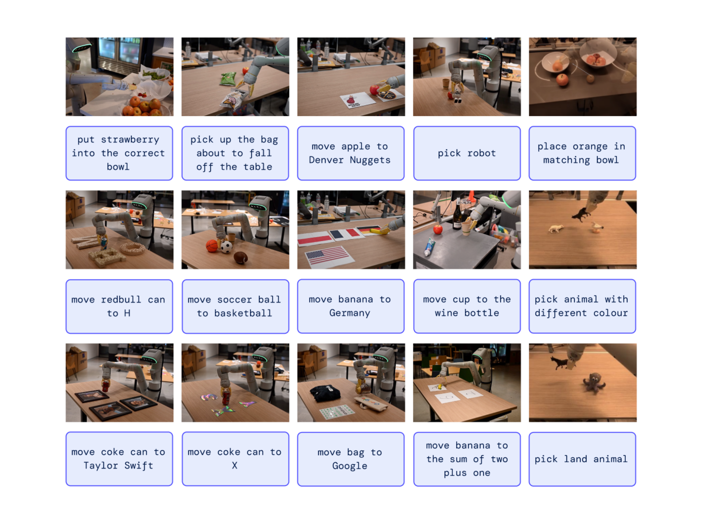
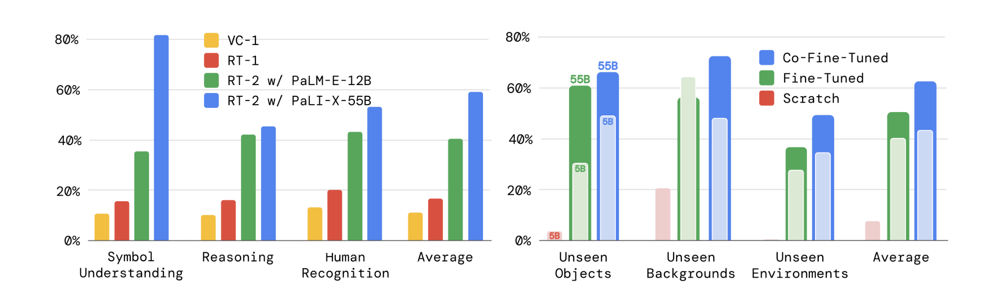
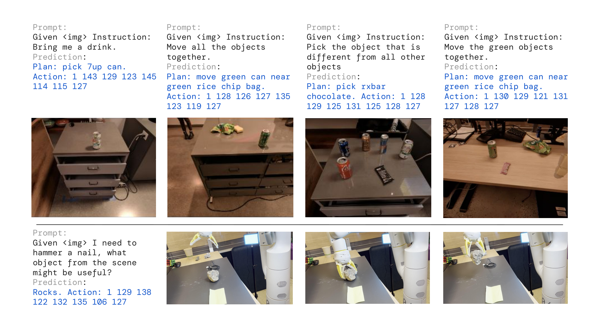

# RT-2

## 来源

- **PDF**：`raw/2307.15818v1.pdf`（arXiv:2307.15818v1，2023-07-28）
- **标题**：RT-2: Vision-Language-Action Models Transfer Web Knowledge to Robotic Control
- **团队**：Google DeepMind（通讯：Yevgen Chebotar、Tianhe Yu、Karol Hausman）
- **会议**：CoRL 2023（PDF 正文未写会议名；外部佐证见 [PMLR](https://proceedings.mlr.press/v229/zitkovich23a.html)）
- **项目页**：[robotics-transformer2.github.io](https://robotics-transformer2.github.io)（外部；视频与宣传不能升级为原文确证）
- **模型页**：[RT-2](../models/rt-2.md)

不要和 [OpenVLA](openvla.md) 评测里的 **RT-2-X** 混名。RT-2-X 出自后续 Open X-Embodiment，用 OXE 混合物训 55B；本页是 RT-1 / Fractal 厨房数据上的原版 RT-2。

## 核心结论

RT-2 把已经在网页规模图文上预训练的视觉语言模型（VLM）**直接**接到闭环低层控制：动作写成和语言一样的 text token，模型在互联网 VQA / caption 与机器人轨迹上 **co-fine-tune**，推理时把 token 反解成末端位移。论文把这类系统命名为 **vision-language-action（VLA）** 模型，并实例化为 RT-2（摘要、§1）。

它针对的是当时的分层接法：LLM/VLM 只当高层状态机，把指令拆成 pick/place 原语，真正的低层控制器吃不到网页知识（§1）。本库里这篇就是 [SayCan](saycan.md)。RT-2 的做法是不加新参数、不换动作空间结构，把现成 VLM 训成「看图 + 读指令 → 动作 token」。

约 6,000 条真机评测（摘要、§4）。在已见任务上与 35M 的 RT-1 持平；在未见物体 / 背景 / 环境上，两个实例的未见平均成功率都是 62%，相对 RT-1 的 32% 与 MOO 的 35% 约 2×，相对 R3M / VC-1 约 6×（Figure 4、Appendix Table 4）。涌现评测上 RT-2-PaLI-X-55B 平均 60%，相对 RT-1 的 17% 超过 3×（Figure 6a、Appendix Table 5）。物理技能仍锁在机器人数据见过的动作分布里，网页数据只改变「何时、对什么物体」去用这些技能（§5、Appendix G）。

## 架构与训练

### 动作就是另一种语言

> Figure 1（原文截图，§1）："RT-2 overview: we represent robot actions as another language, which can be cast into text tokens and trained together with Internet-scale vision-language datasets. During inference, the text tokens are de-tokenized into robot actions, enabling closed loop control."

机制（§3.2，原文确证）：

- 动作空间沿用 RT-1：末端 **6-DoF** 位置+旋转位移、夹爪开合、以及结束回合的离散 terminate，共 **8 个数**。连续维均匀切成 **256 bin**（不是 [OpenVLA](openvla.md) 后来用的 1%–99% 分位数）。
- 目标是空格拼接的整数串，例如 `1 128 91 241 5 101 127`，格式为 `terminate Δpos_x Δpos_y Δpos_z Δrot_x Δrot_y Δrot_z gripper_extension`。
- 输入是机器人相机图 + 标准 VQA 提示 `Q: what action should the robot take to [task instruction]? A:`。
- **PaLI-X**：词表里 0–1000 的整数各有独立 token，动作 bin 直接对上对应整数。
- **PaLM-E**：没有这种数字 token，**覆盖最少使用的 256 个 token** 当动作词表（论文称为 symbol tuning）。OpenVLA 的「覆盖词表最后 256 个 token」沿的是这一支，不是 PaLI-X 的整数映射。

输出约束：机器人任务解码时只采样合法动作 token；普通视觉语言任务仍用全词表（§3.2 Output Constraint）。

### 两个 VLM 实例，不加新参数

论文把 PaLI-X 与 PaLM-E 改成 VLA，分别叫 RT-2-PaLI-X 与 RT-2-PaLM-E（§3.1、Appendix D）。**不新增动作头或 action-only 层**，和从零搭 Gato 式架构、或 CLIPort/MOO 那种给策略加结构的做法对照（§2）。

| 实例 | Backbone（Appendix D） | 训练（Appendix E） | 推理（§3.3） |
| --- | --- | --- | --- |
| RT-2-PaLI-X-55B | ViT-22B 处理图像 + 32B / 50 层 encoder-decoder（类 UL2） | LR 1e-3，batch 2048，80K step | 1–3 Hz |
| RT-2-PaLI-X-5B | 同族较小 PaLI-X | 同上 LR/batch，270K step | 约 5 Hz |
| RT-2-PaLM-E-12B | decoder-only LLM + ViT-4B 把图像投到语言空间 | LR 4e-4，batch 512，1M step | 未单独报 Hz |
| RT-2-PaLI-3B | 仅 Language-Table：ViT-G/14 2B + UL2-3B | LR 1e-3，batch 128，300K step | 约 5 Hz |

55B 是论文自称「当时直接做闭环控制的最大模型，大一个数量级以上」（§3.3）。跑不动桌面机/机载 GPU，部署在多 TPU 云服务上经网络查询，一台服务可伺候多台机器人。

### 数据与 co-fine-tuning

机器人数据就是 RT-1 那份：13 台移动操作机器人、办公室厨房、17 个月、每条轨迹有自然语言指令（§4、Appendix B）。技能覆盖 pick / move near / place upright / knock over / 开关抽屉 / 放进容器 / 从容器取出。网页数据沿用 PaLI-X / PaLM-E 原混合物：WebLI 约 10B 图文对、按跨模态相似度滤到约 1B，外加 caption 与 VQA（Appendix B）。Co-fine-tune RT-2-PaLI-X 时不用 PaLI-X 原文的 Episodic WebLI。

关键配方是 **co-fine-tune**（机器人数据 + 原网页数据同一批里混），而不是只在机器人数据上 naïve fine-tune（§3.2、§4.3）：

- RT-2-PaLI-X：机器人数据约占混合物 **50%**
- RT-2-PaLM-E：约占 **66%**（Appendix B）

目标都是 next-token，在机器人学习里对应 behavior cloning（Appendix E）。超参沿用 PaLI-X / PaLM-E 原文，包括学习率日程和正则。

## 后训练

原文没有 LLM 意义上的 SFT→RL。所谓后训练就是上面的 co-fine-tune。另外有一个 **chain-of-thought** 变体：在 RT-2-PaLM-E 上再跑几百 gradient step，把数据扩成先写自然语言 `Plan`、再写动作 token，例如 `Instruction: I'm hungry. Plan: pick rxbar chocolate. Action: 1 128 124 136 121 158 111 255.`（§4.4）。这是定性演示，不是主表里的 55B / 12B 数字。

## 评测要点

评测平台默认是 **7-DoF 移动操作臂**，动作空间即 §3.2（§4）。基线都用**同一份**机器人数据：RT-1（35M，无从网页 VLM 初始化）、VC-1 与 R3M（预训练视觉表示 + RT-1 解码器）、MOO（VLM 只产出语义像素图，再交给 RT-1）（§4、Appendix C）。

### 已见任务与分布偏移（Figure 4 / Table 4）

已见指令沿用 RT-1 的 200+ 任务套件（36 pick、35 knock、35 扶正、48 move、18 抽屉、36 从抽屉取放）。未见评测 >280 个 pick/place，按物体 / 背景 / 环境 × easy/hard 切（§4.1、Figure 3）。

> Figure 4（原文截图，§4.1）："Overall performance of two instantiations of RT-2 and baselines across seen training tasks as well as unseen evaluations measuring generalization to novel objects, novel backgrounds, and novel environments."

Appendix Table 4（成功率 %）：

| 模型 | Seen | Unseen 平均 |
| --- | ---: | ---: |
| R3M | 45 | 12 |
| VC-1 | 63 | 10 |
| RT-1 | 92 | 32 |
| MOO | 75 | 35 |
| RT-2-PaLI-X-55B | 91 | **62** |
| RT-2-PaLM-E-12B | **93** | **62** |

已见任务上 RT-2 与 RT-1 持平；差距在泛化。PaLM-E-12B 在 hard 泛化上更好，PaLI-X-55B 在 easy 上更好，平均打平（§4.1）。

Language-Table 仿真（Table 1）：RT-2-PaLI-3B 90±10，高于 LAVA 77±4、RT-1 74±13、BC-Zero 72±3。动作是二维笛卡尔增量，写成 `"X Y"`、范围 {−10…+10}。

### 涌现能力（Figure 2、Figure 6a / Table 5）

论文把「机器人数据里没教过、但从网页知识迁过来的语义」叫做 emergent：不指望新动作，指望名词、关系、符号迁过来（§4.2）。

> Figure 2（原文截图，§3.1 / §4.2）："RT-2 is able to generalize to a variety of real-world situations that require reasoning, symbol understanding, and human recognition."

定量分三类，A/B 同条件轮流测四个模型（§4.2）：

- **符号理解**：如 `move apple to 3`、`push coke can on top of heart`
- **推理**：同色杯子、算术（`sum of two plus one`）、多语（`mueve la manzana al vaso verde`）
- **人物识别**：`move the coke can to the person with glasses` / 名人照片

> Figure 6（原文截图，§4.2–4.3）："Quantitative performance of RT-2 across (6a) emergent skills and (6b) size and training ablations."

Appendix Table 5 平均成功率 %：

| 模型 | 符号 | 推理 | 人物 | 平均 |
| --- | ---: | ---: | ---: | ---: |
| VC-1 | 11 | 10 | 13 | 11 |
| RT-1 | 16 | 16 | 20 | 17 |
| RT-2-PaLI-X-55B | **82** | **46** | **53** | **60** |
| RT-2-PaLM-E-12B | 36 | 43 | 43 | 40 |

PaLI-X-55B 符号理解最强；PaLM-E-12B 在数学推理子项上更好，论文归因于 PaLM-E 的预训练混合物更偏计算，PaLI-X 更偏视觉（§4.2）。

### 尺寸与训练消融（Figure 6b / Table 6）

只评未见，且只用 PaLI-X（PaLM-E 不能任意改尺寸）。Appendix Table 6 的未见平均：

| 尺寸 | 训练 | Unseen 平均 |
| --- | --- | ---: |
| 5B | from scratch | 9 |
| 5B | fine-tuning（只机器人） | 42 |
| 5B | co-fine-tuning | 44 |
| 55B | fine-tuning | 52 |
| 55B | co-fine-tuning | **63** |

从零训 5B 几乎失败，55B from scratch 因此没跑。同尺寸下 co-fine-tune ≥ 只 fine-tune；55B > 5B。论文把 co-fine-tune 的优势写成：网页数据留在微调阶段，VLM 原先学到的概念不容易忘（§4.3）。

### Chain-of-thought（Figure 7）

> Figure 7（原文截图，§4.4）："Rollouts of RT-2 with chain-of-thought reasoning, where RT-2 generates both a plan and an action."

这是定性 rollout，用来说明高层 planner 与低层策略可以写进同一个 VLA；不是 Table 4/5 的主数字。

### 原文自报局限（§5、Appendix G）

- 网页预训练**不教新动作**。不会按指定部位抓、不会用毛巾擦、不会叠毛巾、多层间接推理也弱。
- 55B 闭环 1–3 Hz，高频控制会成为瓶颈；作者点名量化与蒸馏。
- 当时可拿来做 VLA 的 VLM 很少，希望更多开源模型或开放微调 API。
- Language-Table 真机失败例：笔会滚下桌、香蕉质心远离接触点——未见过的物体动力学（Figure 9）。

均匀 256-bin 与后来的分位数 bin / flow-matching 连续头，原文没有比较。那是后文推断，见待追问。

## 证据边界与阅读提示

- 本页的 RT-2 与 Open X-Embodiment 的 RT-2-X：同一套离散 token 配方，但数据从厨房 RT-1 换成 OXE 约 350k。OpenVLA 赢的是 RT-2-X，不是本页 Table 4 的 55B。两边协议不能横比。
- PaLM-E-12B 脚注 1：其预训练混合物含高层 VQA 用的机器人图，可能和泛化场景的图像相似，但那些例子不含本实验评的低层动作。

## 待追问

- **需实验或作者披露**：均匀 256-bin 相对 OpenVLA 的分位数 bin、以及 π0 的连续 flow，精度和频率各差多少？本页只报 1–3 Hz / 5 Hz。
- **需实验或作者披露**：CoT 变体只有定性 Figure 7，没有与主模型同协议的成功率。

## 相关页面

- 模型：[RT-2](../models/rt-2.md)
- 概念：[Vision-Language-Action](../concepts/vision-language-action.md)（VLA 一词的出处；本页是封闭离散 token 配方）
- 本页 §1 针对的分层 planner：[SayCan](saycan.md)
- 开源复现同一动作头：[OpenVLA](openvla.md) · [模型](../models/openvla.md)（256-bin + Llama 词表覆盖；对照的是 RT-2-X 不是本页）
- 连续 flow，不再走 token：[π0](pi0.md)
- 开世界 co-training：[π0.5](pi0.5.md)
- 后续 MoT + flow：[InternVLA-A1.5](internvla-a1.5.md)
