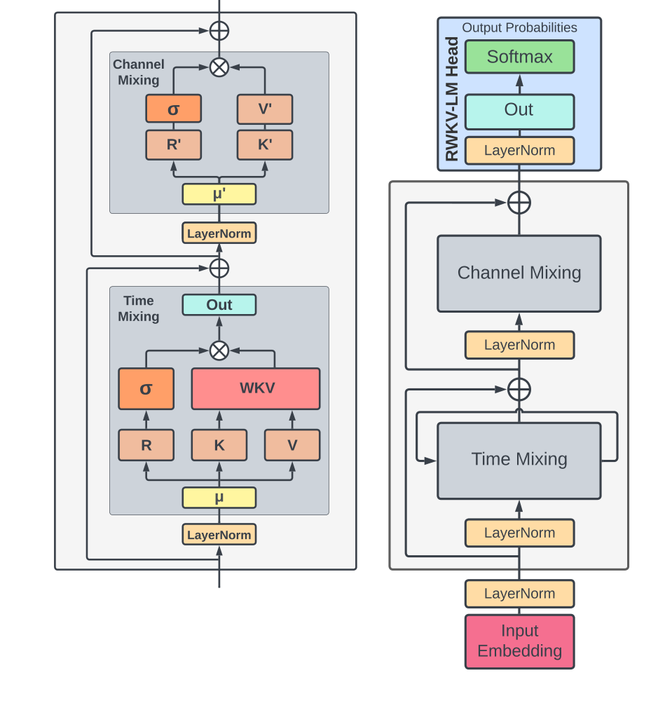

# RWKV

## 来源

- 文件：`raw/2305.13048v2.pdf`
- 标题：RWKV: Reinventing RNNs for the Transformer Era
- 团队 / 日期：Bo Peng、Eric Alcaide、Quentin Anthony 等（EleutherAI 等，共同一作三人）；arXiv:2305.13048v2，2023-12-11；Findings of EMNLP 2023
- 代码：[BlinkDL/RWKV-LM](https://github.com/BlinkDL/RWKV-LM)；权重 [HuggingFace/RWKV](https://huggingface.co/RWKV)
- 定位：**架构 + 发布检查点**。把 Attention-Free Transformer 的 pairwise 偏置收成 **channel-wise 时间衰减向量**，同一套公式既能并行训、又能当 RNN 推。机制归属 [线性注意力与 delta rule](../concepts/linear-attention-and-delta-rule.md) 的**旁支**：线性时间 token mixer，状态是 per-channel 的分子/分母，**不是** $d_k\times d_v$ 矩阵 $S$，**没有** delta rule。

模型页：[RWKV](../models/rwkv.md)（本报告的 169M–14B，后称 RWKV-4）。RWKV-5/6/7 不在本 PDF。

## 核心结论

1. **RNN 的可扩展替代。** 训练像 Transformer 一样主要走矩阵乘（$O(BTd^2)$），WKV 更新是 $O(BTd)$ 的扫描；推理每步时间和显存对序列长度是常数，$O(d)$（Table 1、§3.2–3.3）。作者写成当时最大的 dense RNN（14B）。
2. **WKV 来自 AFT，不是 $QK^\top$。** AFT 用标量 pairwise $w_{t,i}$；RWKV 改成 $w_{t,i}=-(t-i)w$，其中 $w\in(\mathbb{R}_{\ge 0})^d$ 是可学的 **channel-wise** 衰减（Eq. 10、§2.2）。当前 token 另加向量 $U$，免得 $w$ 把当下也衰减掉（Eq. 16、Appendix I）。
3. **Pile 上能跟 FLOP 对齐的 Transformer 打平。** 六档模型各训 330B token（一个 epoch）。平均十二项 NLP 与 Pythia / OPT / BLOOM 同算力可比（Figure 1、§5.1）。上下文从 1024 扩到 8192 后 Pile 测试损失继续降（Figure 6）。
4. **作者自己写的上限。** 线性注意力把历史漏进一个向量，细粒度远距离召回弱于 softmax；对 prompt 顺序更敏感（§9、Appendix L）。

> Figure 2（原文截图，§3.1）："Elements within an RWKV block (left) and the complete RWKV residual block, equipped with a final head for language modeling (right)."

## 机制（已据原文核实）

四个字母（§3）：**R** receptance（收过去）、**W** 位置衰减、**K** / **V** 与注意力同名。块内是 Time Mixing + Channel Mixing。

Time Mixing 先做 token shift，把 $x_t$ 与 $x_{t-1}$ 按通道插值再投影（Eq. 11–13）：

$$
r_t = W_r(\mu_r\odot x_t+(1-\mu_r)\odot x_{t-1}),
$$

$k_t$、$v_t$ 同构。WKV（Eq. 16）：

$$
\mathrm{wkv}_t=\frac{\sum_{i=1}^{t-1}e^{-(t-1-i)w+k_i}\odot v_i+e^{u+k_t}\odot v_t}{\sum_{i=1}^{t-1}e^{-(t-1-i)w+k_i}+e^{u+k_t}}.
$$

输出 $o_t=W_o(\sigma(r_t)\odot\mathrm{wkv}_t)$（Eq. 17）。Channel Mixing 是平方 ReLU 的门控 FFN（Eq. 14–15、18）。

和 GLA / GDN 的分叉：这里没有矩阵 $S_t\in\mathbb{R}^{d_k\times d_v}$，也没有 $k^\top v$ 外积写入。每个通道维护加权和的分子与分母，衰减 $w$ **不随 token 变**（数据无关）。[Gated Linear Attention](gated-linear-attention.md) Table 1 后来把 **RWKV-6** 写成数据相关的 $\alpha_t^\top\mathbf{1}$，那是后作，不要回写成本页。

训练用自定义 CUDA kernel 跑 WKV 扫描；embedding 小初始化 + 额外 LN；多数权重零初始化（§3.4）。上下文 1024，Adam、bfloat16，学习率指数衰减，加 PaLM 式 softmax 归一化辅助损失（§4.1）。

## 评测要点

Table 2 规模：169M / 430M / 1.5B / 3B / 7B / 14B。参数公式 $2VD+13D^2L+D(11L+4)$，$V=50277$。前向 FLOP 按 $2(2VD+13D^2L)$ 计，与 Kaplan 的 $6ND$ 口径对齐。

45 个 (数据, 参数) 点的 scaling 在 Pareto 前沿 $r^2=0.994$；外推一个数量级 $r^2=0.875$（Figure 4）。作者用来反驳「LSTM 不服从 Transformer 那种 log-log」的旧结论。

NLP：与 Pythia / OPT / BLOOM 做 FLOP 对齐，不和 Chinchilla-optimal 或 LLaMA 过训比（§5.1）。LRA 五项上仅次于 S4（Appendix J.2）。推理墙钟随生成长度线性，Transformer 二次（Figure 7）。

长上下文：1024 → 2048（10B token）→ 4096（100B）→ 8192（100B），Pile 测试损失随窗下降（Figure 6）。

## 与已有沉淀的关系

- **不是 GDN/KDA 链上的一环。** [线性注意力与 delta rule](../concepts/linear-attention-and-delta-rule.md) 的主轴是矩阵状态 +（可选）delta。RWKV-4 是 AFT 收成 RNN。GLA 的 MQAR 图里 RWKV-4 弱于矩阵状态模型（GLA Figure 4）。
- **Lightning-2 / GLA 解决的是矩阵线性注意力怎么在 GPU 上线性训。** 本页的并行瓶颈是 WKV 扫描 $O(BTd)$，矩阵乘已经可并行。未来工作自己写了用 parallel scan 把 WKV 降到 $O(B\log T\,d)$（§7），本 PDF 没做。
- **后作不要从本页推断。** Eagle/Finch（RWKV-5/6）改矩阵状态与动态递推；RWKV-7 写 generalized delta rule。入口若出现，另建来源页。

## 待追问

- Eq. 16 能否改写成 GLA 那种 $S_t=\mathrm{Diag}(\alpha)S_{t-1}+k^\top v$？作者没给这条等价。不要把 channel-wise 衰减升级成矩阵门。
- 14B 与同代 14B Transformer 的单任务表在附录；主文 Figure 1 是十二项平均。
- prompt 重排让 F1 从 44.2% 到 74.8%（Appendix L）是哪一项任务、多少样本，主文没展开。

## 相关页面

- 模型：[RWKV](../models/rwkv.md)
- 概念：[线性注意力与 delta rule](../concepts/linear-attention-and-delta-rule.md)
- 矩阵状态对照：[Gated Linear Attention](gated-linear-attention.md)、[Lightning Attention-2](lightning-attention-2.md)、[Mamba-2](mamba-2.md)、[Gated DeltaNet](gated-delta-net.md)
