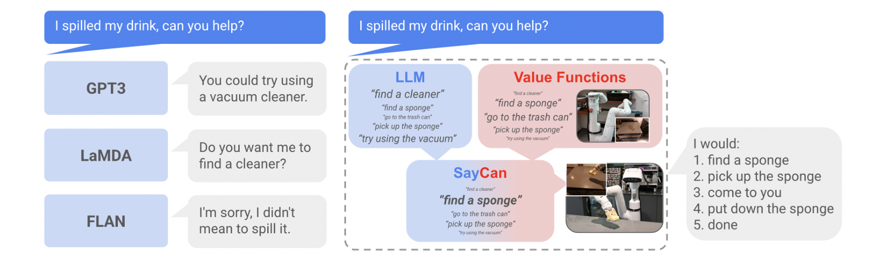
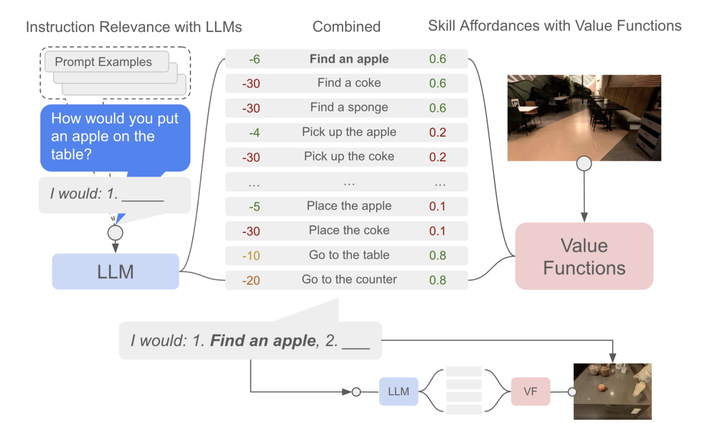
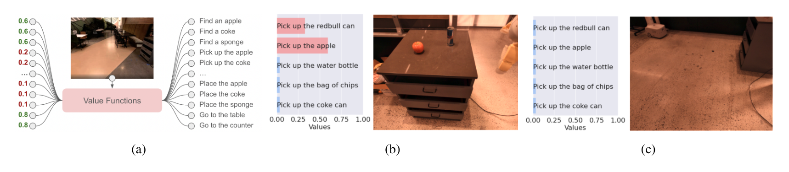
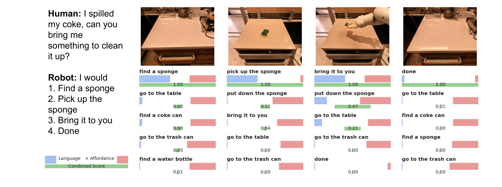
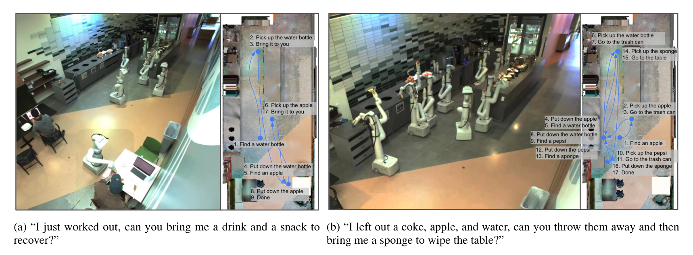

# SayCan

## 来源

- **PDF**：`raw/2204.01691v2.pdf`（arXiv:2204.01691v2，2022-08-16；v1 2022-04-04）
- **标题**：Do As I Can, Not As I Say: Grounding Language in Robotic Affordances
- **团队**：Robotics at Google + Everyday Robots（通讯：Brian Ichter、Fei Xia、Karol Hausman）
- **会议**：CoRL 2022（PDF 正文未写会议名；外部佐证见 [项目页](https://say-can.github.io/)）
- **项目页**：[say-can.github.io](https://say-can.github.io/)（外部；视频、Colab 与宣传不能升级为原文确证）

**不建模型页。** 产出是「LLM 打分 × 技能 affordance」的规划环，低层是 BC-Z / MT-Opt 训好的语言条件技能，规划用的 LLM 默认是冻结的 PaLM 540B。不是一组要发布的 VLA 权重。

不要把它读成 [RT-2](rt-2.md) 的前作换皮。RT-2 明确针对的就是这种分层：LLM 只当高层状态机，低层控制器吃不到网页知识（RT-2 §1）。本页的 LLM **不输出**末端动作。

## 核心结论

大语言模型有程序知识，但没在物理世界里试过自己的话，会给出合理却不可执行的回答——例如厨房里没有吸尘器，却建议用吸尘器清洒出的饮料（摘要、§1、Figure 1）。SayCan 的接地是两件事相乘：

- **Say（task-grounding）**：LLM 给每条技能的自然语言标签打分 \(p(\ell_\pi \mid i)\)，问「对这条高层指令有没有用」。
- **Can（world-grounding）**：该技能的 value function 给出 \(p(c_\pi \mid s, \ell_\pi)\)，问「在当前状态做不做得到」。

选 \(\pi = \arg\max_{\pi \in \Pi} p(c_\pi \mid s, \ell_\pi)\, p(\ell_\pi \mid i)\)，执行后再把 \(\ell_\pi\) 追加进对话，直到选出 `done`（§3、Algorithm 1）。稀疏成功奖励、无折扣时，value function 就是 affordance（§2，引 Gibson）。

在 mock kitchen 的 101 条指令上，PaLM-SayCan 规划成功率 **84%**、执行 **74%**；真实办公室厨房规划 81%、执行 60%。去掉 affordance（No VF）规划掉到 67%；把整句指令直接喂给低层策略（BC NL）执行 0%（Table 2）。换更大的 LLM，机器人成功率跟着涨：PaLM 540B 相对 FLAN 137B，规划 84% vs 70%，执行 74% vs 61%，错误大约减半（Table 3）。

## 架构与训练

### 不是生成一段计划再解析，而是在技能集合上打分

> Figure 1（原文截图，摘要下）："LLMs have not interacted with their environment and observed the outcome of their responses, and thus are not grounded in the world. SayCan grounds LLMs via value functions of pretrained skills, allowing them to execute real-world, abstract, long-horizon commands on robots."

只靠 prompt 让 LLM 自由生成，仍会吐出技能表之外的步骤或不好解析的句子。SayCan 改用 **scoring**：对固定技能描述集合 \(\ell_\Pi\) 逐条求 \(p(\ell_\pi \mid i)\)，再和 affordance 相乘（§3）。规划写成用户–机器人对话（「How would you bring me a coke can?」「I would: 1. find a coke can, 2. …」），既约束输出，也提供可解释的逐步计划。

> Figure 3（原文截图，§3 / Algorithm 1）："Given a high-level instruction, SayCan combines probabilities from a LLM (the probability that a skill is useful for the instruction) with the probabilities from a value function (the probability of successfully executing said skill) to select the skill to perform."

Algorithm 1（§4 原文）：每步对全部技能算 \(p^{\mathrm{LLM}}_\pi = p(\ell_\pi \mid i, \ell_{\pi_{n-1}}, \ldots, \ell_{\pi_0})\) 与 \(p^{\mathrm{affordance}}_\pi = p(c_\pi \mid s_n, \ell_\pi)\)，相乘后 \(\arg\max\)，执行 \(\pi_n\)，直到 \(\ell_{\pi_{n-1}} =\) `done`。

### 低层技能：BC 出动作，RL 出 affordance

每条技能要三件套：策略、value function、短语言描述（如 `pick up the can`）（§4）。

| 件 | 原文做法 |
| --- | --- |
| 策略 | 图像 BC，跟 BC-Z；多任务、语言条件 |
| Affordance | TD 训出的语言条件 Q；多任务 RL 跟 MT-Opt，仿真 + RetinaGAN sim-to-real |
| 技能语言 | 冻结的 Universal Sentence Encoder 嵌入；**规划 LLM 和技能编码器可以不是同一个模型** |
| 奖励 | 稀疏：成功 1、否则 0；三条人工看视频，2/3 同意才标成功 |

作者写：当前数据阶段 **BC 策略成功率更高**，但 RL 的 value function 才是把控制能力翻译成场景语义的那一层（§4）。动作空间包括末端 6-DoF、夹爪、移动底座 x-y 与 yaw、以及 terminate。

技能库存：提出 **551** 条，覆盖七个技能族、17 种物体（pick / place / 重排、开关抽屉、导航、特定放置）。评测实际用的是「适合组合、且当前采集质量够高」的子集（§4、Appendix D），不要把 551 写成 101 条指令上全部上线。

> Figure 2（原文截图，§3）："A value function module (a) is queried to form a value function space of action primitives based on the current observation."

## 后训练

规划用的 LLM **不**做具身 SFT 或 RL。PaLM-SayCan 的 LLM 是冻结的 540B PaLM，除非做模型尺寸消融（§5、Table 3）。加新技能的方式是：写入选项集合、提供配套 value function、在 prompt 里加一条例子——抽屉操作 21 条查询规划 100%、执行 33%，且「对其它指令没有性能损失」（§5.2、Appendix E.3）。

Chain-of-thought 也不是训新权重：先生成 `Explanation`，再把解释放进 scoring 的 prompt，用来补否定和需要推理的查询（§5.2、Table 4）。闭环纠错本页做不到；作者把 Inner Monologue 写成后续（§5 末，Huang et al.）。**找论文可解**：Huang et al., *Inner Monologue: Embodied Reasoning through Planning with Language Models*，[arXiv:2207.05608](https://arxiv.org/abs/2207.05608)。本库尚未 ingest，不把那篇的闭环反馈写进本页机制。

开源 Colab（§6）是另一套实现：CLIPort 做 pick-place，没有 value function，用 ViLD 检测器当 affordance，GPT-3 当 LLM。不要和厨房 PaLM-SayCan 主表横比。

## 评测要点

平台：Everyday Robots 7-DoF 移动操作臂，RGB 观测；15 种厨房物体、5 个语义地点（两个柜台、桌子、垃圾桶、用户位置）。两个场景：技能训练用的 mock kitchen，以及真实办公室厨房（Figure 4）。默认 LLM 是 PaLM 540B。

101 条指令、7 个家族（Table 1）：NL Single / NL Nouns / NL Verbs / Structured / Embodiment / Crowd-Sourced / Long-Horizon。指标两条，都是 3 人打分、2/3 同意才算过：

- **规划成功**：选出的技能序列对不对，不管执行
- **执行成功**：整条指令是否真做成

### 主表（Table 2）

Mock kitchen：规划 84%、执行 74%。真实厨房：规划 −3 个百分点（81%）、执行 −14 个百分点（60%）。作者把这写成策略和 value function「还算泛化」。

| 家族 | n | Mock 规划 | Mock 执行 | 真厨房规划 | 真厨房执行 | No VF 规划 | Generative 规划 | BC NL 执行 | BC USE 执行 |
| --- | ---: | ---: | ---: | ---: | ---: | ---: | ---: | ---: | ---: |
| NL Single | 15 | 100 | 100 | 93 | 87 | 73 | 87 | 0 | 60 |
| NL Nouns | 15 | 67 | 47 | 60 | 40 | 53 | 53 | 0 | 0 |
| NL Verbs | 15 | 100 | 93 | 93 | 73 | 87 | 93 | 0 | 0 |
| Structured | 15 | 93 | 87 | 93 | 47 | 93 | 100 | 0 | 0 |
| Embodiment | 11 | 64 | 55 | 64 | 55 | 18 | 36 | 0 | 0 |
| Crowd-Sourced | 15 | 87 | 87 | 73 | 60 | 67 | 80 | 0 | 0 |
| Long-Horizon | 15 | 73 | 47 | 73 | 47 | 67 | 60 | 0 | 0 |
| **Total** | **101** | **84** | **74** | **81** | **60** | **67** | **74** | **0** | **9** |

对照含义（§5.1）：

- **No VF**：只取 LLM 最高分。规划 67% vs 84%，说明场景可行性分必要。Embodiment 家族从 64% 掉到 18%，是这条消融的主证据。
- **Generative**：自由生成再 USE 余弦投到最近技能，对应 Huang et al. 2022 那种「只靠 prompt 抽计划、没有额外接地」。规划 74%。
- **BC NL**：高层指令整句喂给低层策略，代表当时标准语言条件 BC/RL。执行全 0%。
- **BC USE**：把指令嵌到已知技能（含组合序列）再喂策略。只在单原语上 60%，总计 9%。

错误里 **65% 是 LLM、35% 是 affordance**（§5.1、Appendix Figure 16）。Long-horizon 最差，典型是 LLM 早停（只送一件）。否定和含糊指代（「不是苹果的零食」「带咖啡因的饮料」）是底层 LM 的已知问题；CoT prompt 用来补（Table 4）。

> Figure 6（原文截图，§5.1）："Visualization of PaLM-SayCan's decision making, where the top combined score chooses the correct skill."

> Figure 5（原文截图，§5.1）："Timelapse of rollouts to two long-horizon queries. The robot interacts with a large portion of the kitchen environment and successfully performs sequences of manipulation and navigation skills."

### LLM 变好，机器人跟着变好（Table 3）

同一套 SayCan 环，只换规划 LLM：

| | PaLM-SayCan 规划 / 执行 | FLAN-SayCan 规划 / 执行 |
| --- | ---: | ---: |
| Total 101 | **84% / 74%** | 70% / 61% |

Appendix Table 6 还在纯生成（无 value function、USE 投影）上比了 PaLM 540B / 62B / 8B 与 FLAN 137B：总规划 74% / 72% / 38% / 43%。62B 与 540B 在这组生成题上差距小；上机器人、加 affordance 之后 540B 的优势才拉开。作者把 Table 3 写成「语言模型进步第一次对应到机器人成功率进步」。

### 原文自报局限（§8）

- 继承 LLM 的偏见与训练数据依赖。
- **主瓶颈是底层技能的范围和可靠性**，不是规划文案。
- 技能报了高 value 却失败时，系统不容易反应；作者认为可以用 prompt 纠错，但本页没做成。
- 自然语言是不是编程机器人的对本体，原文自己列为开放问题。

## 待追问

- **找论文可解**：Inner Monologue（Huang et al., [arXiv:2207.05608](https://arxiv.org/abs/2207.05608)）给本页加环境反馈闭环。本页 SayCan 每步只通过当前 value function 看世界；闭环纠错不能从本 PDF 推出。
- Code as Policies 把技能写成可执行程序，[ASPIRE](aspire.md) 再把程序库做成自进化；[EmbodiSkill](embodiskill.md) 从轨迹改技能正文。和本页「固定技能表 + value function」差在哪一层，不能用本页 84% 去填那些表。EmbodiSkill §2.2 把本页写成选已有技能、不从轨迹修订。
- [EmbodiedSkills](embodied-skills.md) 的 proposal × runtime 先验后验，和本页 LLM × affordance 是不是同一因式分解换了实现，两边原文都没对照。
- 551 条技能里评测实际启用了多少条，Appendix D 未在本页逐条核对。

## 相关页面

- 概念：[Vision-Language-Action](../concepts/vision-language-action.md)（本页是分层 LLM planner，**不是** VLA 动作头）
- RT-2 针对的分层接法：[RT-2](rt-2.md) · [模型](../models/rt-2.md)
- π0 把高层 VLM 写成外挂、并点名类似本页：[π0](pi0.md)
- 固定技能合同、不是本页的 value function 库：[EmbodiedSkills](embodied-skills.md)
- 程序库自进化，技能集合会扩张：[ASPIRE](aspire.md)
- 冻结 LLM 改技能正文，不是本页的固定表：[EmbodiSkill](embodiskill.md) · [具身 skill 自进化](../concepts/embodied-skill-self-evolution.md)
