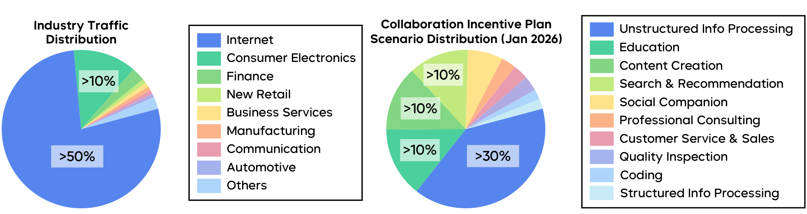
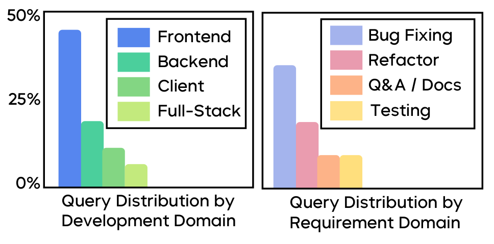
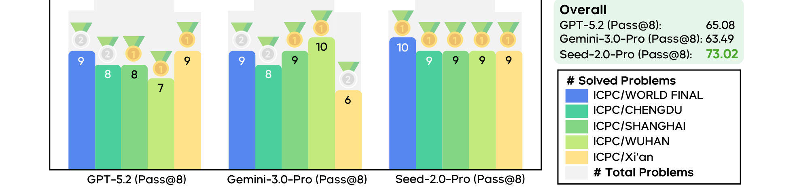

# Seed2.0 Model Card

## 来源

- PDF 路径：`raw/2607.00248v1.pdf`
- 标题：Seed2.0 Model Card: Towards Intelligence Frontier for Real-World Complexity
- 团队 / 日期：ByteDance Seed；arXiv:2607.00248v1，2026-07
- 页数：87
- 模型页：[Seed2.0](../models/seed2.md)

## 核心结论

Seed2.0 Series（Pro / Lite / Mini）是字节跳动 Seed 团面向大规模生产部署的多模态模型族。**本文件是 Model Card 而非技术报告**--不包含架构设计、参数量、训练数据、训练方法等细节，核心内容是：(1) 部署洞察（MaaS 使用分布、agentic coding 查询模式、定价），(2) 四维评测框架（Science Discovery / Vibe Coding / Context Learning / Real-World Tasks），(3) benchmark 结果（对标 GPT-5.2 / Claude-4.5 / Gemini-3-Pro），(4) 真实世界 case studies（GUI 操作、科研编程、竞赛编程）。

Seed2.0 Pro 在数学竞赛（AIME 2025 98.3、HMMT Feb 2025 97.3、IMO 2025 Gold 35/42、CMO 2025 Gold 114/126）、搜索 agent（BrowseComp 77.3、BrowseComp-zh 82.4）、ICPC 竞赛编程（Pass@8 73.02%，五场 ICPC 全金牌）方面表现突出。报告诚实承认与 frontier 模型的差距：coding 不如 Claude（SWE-Evo 8.5 vs Claude-Opus-4.5 的 27.1）、长尾知识不如 Gemini（SimpleQA Verified 36.0 vs Gemini-3-Pro 的 72.1）。

前代 Seed 家族包括 Seed1.6/1.8、Seed1.5-VL、Seed-OSS、Seed-Coder、Seed Diffusion、Seed-Prover 和 Seedream/Seedance。

## 部署洞察

### MaaS 使用分布

> Figure 1 MaaS usage distribution in mainland China. Left: Industry traffic distribution showing strong dominance of the Internet sector. Right: Business Customer Usage Scenario Distribution.（§ 2.1 MaaS Usage in Mainland China）

行业层面，Internet 行业占绝对主导（>50%流量），Consumer Electronics / Finance / New Retail / Business Services 各 >10%。传统行业（Manufacturing / Automotive / Communication）各 <1%。场景层面，Unstructured Info Processing 占 >30%，是最大类别--企业用 Seed 模型分析用户反馈、从多源文档提取洞见、生成决策报告。Education / Content Creation / Search & Recommendation 各 >10%。

Seed 模型定位为 **workflow-oriented MaaS foundation**，而非轻量对话模型，强调多模态理解、长上下文推理、结构化生成和工具增强执行。

### Agentic Coding 查询分布

> Figure 2 Query distribution by development and requirement domain. Frontend development and bug fixing substantially dominate agentic coding requests.（§ 2.2 Query Distribution in Agentic Coding）

前端开发（页面布局、样式、UI 逻辑管理）查询远超后端 / 客户端 / 全栈。Bug fixing 占任务类型主导，其次是 refactoring 和文档。这反映了前端开发的迭代性质和 bug-fixing 对强调试能力的需求。

### 定价

| 模型 | Prefill (USD/1M) | Decode (USD/1M) |
| --- | --- | --- |
| GPT-5.2 High | $1.75 | $14.00 |
| Claude-Opus-4.5-thinking | $5.00 | $25.00 |
| Gemini-3-Pro | $2.00–4.00 | $12.00–18.00 |
| Claude-Sonnet-4.5-thinking | $3.00 | $15.00 |
| GPT-5.0-mini High | $0.25 | $2.00 |
| Gemini-3-Flash High | $0.50–1.00 | $3.00 |
| **Seed2.0 Pro** | **$0.47 (¥3.41)** | **$2.37 (¥17.04)** |
| **Seed2.0 Lite** | **$0.09 (¥0.64)** | **$0.53 (¥3.83)** |
| **Seed2.0 Mini** | **$0.03 (¥0.22)** | **$0.31 (¥2.24)** |

Seed2.0 的 token 定价比 frontier 模型低约一个数量级。Pro 面向复杂推理和长上下文，Lite 面向通用应用，Mini 的 decode 定价低于 $0.50/1M tokens，面向高吞吐、延迟敏感场景。

## 评测框架

报告建立四维评测框架，每维针对真实世界复杂任务的一个核心方面：

1. **Science Discovery**：科研级推理任务。Ainstain Bench（科学计算编程）和 BABE（生物领域多模态科学推理）。
2. **Vibe Coding**：端到端软件工程。NL2Repo-Bench（从自然语言规范完整构建仓库，测试长周期 repository 构建、跨文件一致性和依赖管理）。
3. **Context Learning**：从用户提供的上下文和文档中自主学习执行任务。DeR2 Bench 和 CL-bench。
4. **Real-World Tasks**：端到端任务完成。GDPVal-Verified（GDPVal 的可靠子集 + rubric 自动评测）、XpertBench、WorldTravel（目标分解和多步规划）。

## 评测要点

### 语言能力

Seed2.0 Pro 在数学竞赛达到国际领先组水平：

| Benchmark | GPT-5.2 | Claude-Sonnet-4.5 | Claude-Opus-4.5 | Gemini-3-Pro | Seed2.0 Pro |
| --- | --- | --- | --- | --- | --- |
| AIME 2025 | 99.0 | 87.0 | 91.3 | 95.0 | **98.3** |
| HMMT Feb 2025 | 100.0 | 79.2 | 92.9 | 97.3 | 97.3 |
| BeyondAIME | 86.0 | 57.0 | 69.0 | 83.0 | **86.5** |
| IMOAnswerBench (no tool) | 86.6 | 60.7 | 72.6 | 83.3 | **89.3** |
| IMO 2025 | - | - | - | - | 35/42 (Gold) |
| CMO 2025 | - | - | - | - | 114/126 (Gold) |
| Codeforces Elo | - | - | - | - | - |
| LiveCodeBench (v6) | - | - | - | - | - |
| GPQA Diamond | - | - | - | - | - |
| SuperGPQA | 67.9 | 65.5 | 70.6 | 73.8 | 68.7 |
| HealthBench | 63.3 | 28.7 | 36.3 | 37.9 | **57.7** |

报告明确承认差距：Seed2.0 在 coding 方面与 Claude 有明显差距（SWE-Evo 8.5 vs 27.1），在长尾知识方面与 Gemini 有差距（SimpleQA Verified 36.0 vs 72.1）。

### 视觉能力

Seed2.0 Pro 在 50 个图像 benchmark 和 24 个视频 benchmark 上评测。MathVision 88.8、MathKangaroo 90.5、MathCanvas 61.9 均 SOTA。VLMsAreBlind 98.6、VLMsAreBiased 77.4 均领先。视频理解在 VideoReasonBench 77.8、VideoMME 89.5 等多个 benchmark 上 SOTA。

### Agentic 能力

| Benchmark | GPT-5.2 | Claude-Opus-4.5 | Gemini-3-Pro | Seed2.0 Pro |
| --- | --- | --- | --- | --- |
| BrowseComp | 77.9 (65.3) | 67.8 (57.2) | 59.2 | **77.3** |
| BrowseComp-zh | 76.1 | 62.4 | 66.8 | **82.4** |
| HLE-Verified | 68.5 | 56.6 | 67.5 | **73.6** |
| τ2-Bench (retail) | 82 | 88.9 | 85.3 | **90.4** |
| τ2-Bench (telecom) | **98.7** | 98.2 | 98.0 | 94.2 |
| Terminal Bench 2.0 | **62.4** | 60.2 | 56.9 | 55.8 |
| SWE-Bench Verified | 80.0 | **80.9** | 76.2 | 76.5 |
| SWE-Evo | 12.5 | **27.1** | 8.9 | 8.5 |
| NL2Repo-Bench | **49.3** | 43.2 | 34.2 | 27.9 |
| Minedojo-Verified | 18.3 | - | 23.3 | **49.0** |
| MM-BrowseComp | 26.3 | - | 25.0 | **48.8** |
| DeepConsult | 54.3 | 61.0 | 48.0 | **61.1** |
| ResearchRubrics | 42.3 | 45.0 | 37.7 | **50.7** |

Seed2.0 Pro 在 search agent、deep research 和 vision agent 方面优势明显，但在 repository-level coding（SWE-Evo / NL2Repo-Bench）方面落后于 Claude-Opus-4.5。

### 竞赛编程

> Figure 7 The competitive programming results across five ICPC.（§ 5.1.5 Competition-Level Programming）

Seed2.0 Pro 在五场 ICPC 官方赛事（2025 World Finals + 西安 / 成都 / 武汉 / 上海区域赛）中 Pass@8 达 73.02%，显著超过 GPT-5.2（65.08%）和 Gemini-3-Pro（63.49%），对比人类队伍表现均获金牌。

### Putnam-200

| Benchmark | Deepseek-Prover-V2 | Seed-1.5-Prover | Gemini-3-Pro | Seed2.0 Lite | Seed2.0 Pro |
| --- | --- | --- | --- | --- | --- |
| Putnam-200 (Pass@8) | <4.0 | 26.5 | 26.5 | 30.5 | **35.5** |

## Case Studies

报告用大量篇幅展示真实世界 case studies（§5，约 20 页），包括：

- **Vibe Coding**：FEAL 线性密码分析（meet-in-the-middle 攻击）、NL2Repo 项目仓库构建（37 轮交互构建完整 Python 包）、SWE-Evo 多 issue 迭代调试（79 轮修 6 个 issue）、ICPC 竞赛编程。
- **GUI 操作**：FreeCAD 参数化建模（96 步，含 8 次错误恢复，最终 Python console 验证体积/表面积）、CapCut 视频编辑（时间轴对齐、转场放置、音频拼接、全局特效）。
- **科研编程**：量子计算（Qiskit Solovay-Kitaev 编译器 SU(2)/SO(3) 相位 bug 修复）、广义相对论（Einstein Toolkit Fortran 子程序实现 proper distance 积分）、计算化学（PySCF density fitting 复数 DM bug 修复）。
- **科学研究**：分子动力学协议设计（CBD-α7 nAChR 粗粒化 MD）、高分子化学分析（Maleimide Polyacetylene n 型共轭聚合物）、Golgi 蛋白质组学实验设计。
- **复杂数学**：Erdős 级数无理性证明（7 阶段反证法）。

这些 case study 的价值不在于证明 Seed2.0 比其他模型好（缺乏对照），而在于展示模型在跨学科长周期任务中的推理深度和工程能力。

## 待追问

- Seed2.0 的架构是什么？参数量？是否 MoE？训练数据规模？--Model Card 完全未披露，需等待技术报告或开源。
- Seed2.0 是否有 HuggingFace 开源版本（如 Seed-OSS）？--报告提到前代 Seed-OSS 是开源的，但 Seed2.0 未说明开源计划。
- 前代 Seed1.6/1.8 的技术细节是否已公开？--Seed-1.8 Model Card 被引用为 [1]，但未在 raw/ 中。
- 定价仅为 Pro/Lite/Mini 各一个代表价，是否有按 context tier 分阶定价？--Gemini 有分阶，Seed2.0 只给单一价格。
- 视频理解使用 VideoCut 工具的具体机制是什么？--Table 10 提到 VideoCut 工具提升长视频理解，但未描述工具设计。

## 相关页面

- [Seed2.0](../models/seed2.md)
- [Agentic 评测体系](../concepts/agentic-evaluation-benchmarks.md)
- [Agentic Engineering](../concepts/agentic-engineering.md)
- [2026 前沿模型技术报告对比](../comparisons/2026-open-model-technical-reports.md)
- [MoE 前沿模型扩展](../concepts/moe-frontier-model-scaling.md)
- [DAPO 技术报告](dapo.md) - 同为 ByteDance Seed 团队的 RL 系统论文
