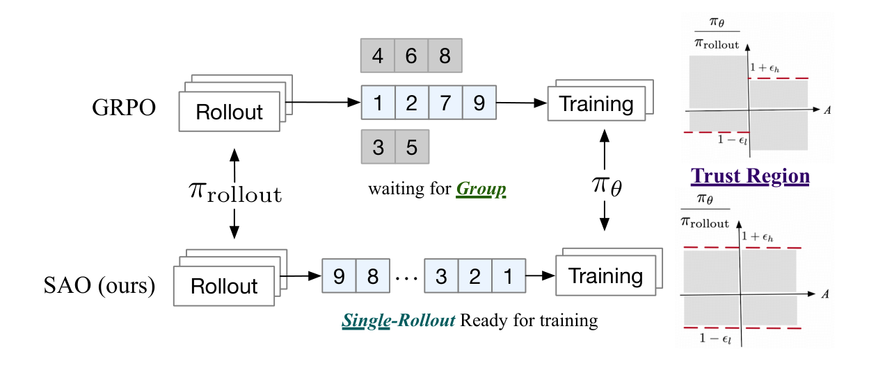
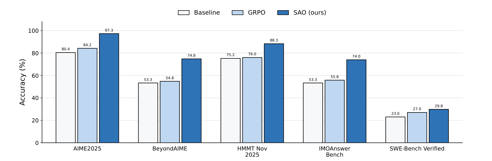
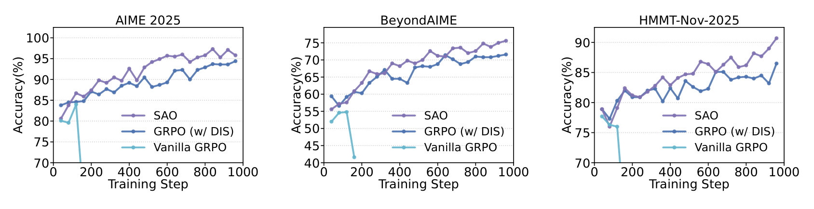
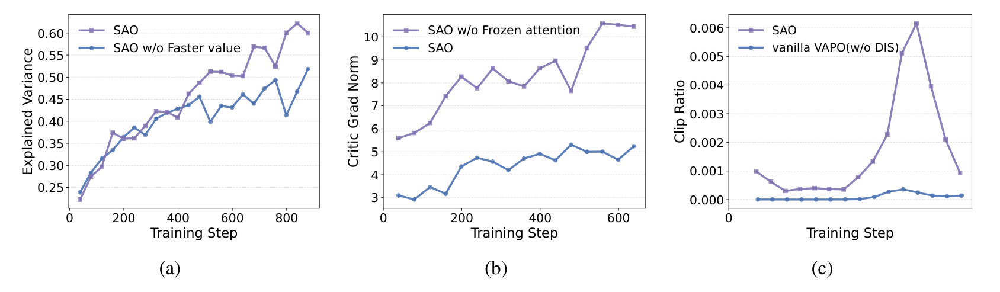
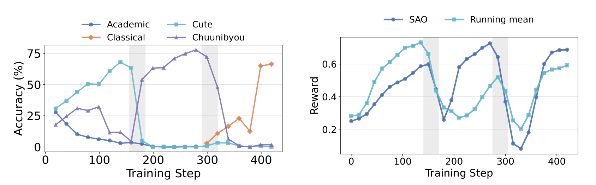

# Single-Rollout Asynchronous Optimization（SAO）

## 来源

- 文件：`raw/Hou 等 - 2026 - Single-Rollout Asynchronous Optimization for Agentic Reinforcement Learning.pdf`
- 标题：Single-Rollout Asynchronous Optimization for Agentic Reinforcement Learning
- 团队 / 日期：清华大学；作者实习于 Z.AI。arXiv:2607.07508v1，2026-07-08；PDF 页脚写 Under review, Feb 2026
- arXiv：<https://arxiv.org/abs/2607.07508>
- 定位：面向异步、长周期 agentic RL 的算法论文；不发布独立模型。主实验把 SAO 套到 Qwen3-30B-A3B-Thinking-2507 上，并写明已部署到开源 GLM-5.2（文中 750B-A40B）的 agentic RL pipeline（摘要、§1）。
- 命名：不要和 [SAPO](soft-adaptive-policy-optimization.md)（Qwen 的 soft gate）混名。

## 核心结论

1. **问题定义**：同步 batch-interleaved RL 在长尾 agent / coding rollout 上会空转 GPU。异步能边生成边更新，但引入更难追踪的 policy lag；GRPO 的组采样还要等最慢那条，把异步本来要消掉的屏障请回来，也和「每个 prompt 只有一条环境反馈」的在线设定不兼容（§1）。
2. **算法核心**：SAO = 单条 rollout + Direct Double-Sided Importance Sampling（DIS）+ 把 critic 请回来的几项工程（更快 value 更新、冻结 attention、扩大 value 预训练、Skip-Observation GAE）（§3）。
3. **DIS**：丢掉无法维护的 $\pi_{\theta_{\mathrm{old}}}$ 历史，ratio 直接用 $\pi_\theta / \pi_{\mathrm{rollout}}$；落在 $[1-\epsilon_\ell, 1+\epsilon_h]$ 外的 token **整段 mask**，不是 PPO 那种夹到边界仍留梯度（Eq. 1–3、§3.1）。作者写它和 IcePop 同类，但更简单。
4. **效果主张**：异步设置下 vanilla GRPO 约 160 step 崩、vanilla VAPO（无 DIS）约 90 step 崩；SAO 能训到约 1000 step。Qwen3-30B-A3B 上 AIME 2025 97.3、BeyondAIME 74.8、SWE-Bench Verified 29.8（Table 1–2、Figure 3）。
5. **边界**：主实验是单一 30B-A3B backbone；SWE 用 OpenHands、最多 300 turn；在线学习是受控的文风偏好切换，不是真实用户。附录承认依赖 value model 与 rollout log-prob 基础设施（Appendix B）。

## 方法：组采样换成单条立即训练

> 论文 Figure 2 原文标题："Overview of SAO with single rollout design. The numbers denote the generation order of trajectories. For SAO, each trajectory becomes available for training immediately upon completion. In contrast, GRPO must wait until all trajectories in a group are generated before training can begin."（§3）

### DIS：用 rollout log-prob 做行为策略，出界就 mask

异步里一条轨迹可能跨越多个 rollout 权重版本，精确追踪 $\pi_{\theta_{\mathrm{old}}}$ 需要无界 checkpoint 历史。SAO 的选择是：

$$
r_t(\theta)=\exp\bigl(\log\pi_\theta(a_t|s_t)-\log\pi_{\mathrm{rollout}}(a_t|s_t)\bigr)
$$

$$
f(x;\epsilon_\ell,\epsilon_h)=\begin{cases}x & \text{if }1-\epsilon_\ell<x<1+\epsilon_h\\ 0 & \text{otherwise}\end{cases}
$$

$$
\mathcal{L}(\theta)=\hat{\mathbb{E}}_t\bigl[f(r_t(\theta),\epsilon_l,\epsilon_h)\,\hat A_t\log\pi_\theta(a_t|s_t)\bigr]
$$

这和 [GLM-5 技术报告](glm-5.md) 里已经写过的 direct double-sided importance sampling 是同一层机制；本页是把它写成可独立引用的算法，并给出与 IcePop「去掉 $\pi_{\theta_{\mathrm{old}}}$」的差别（§3.1）。数学 / TIR 实验 $\epsilon_{\mathrm{low}}=0.3$、$\epsilon_{\mathrm{high}}=5.0$；coding $\epsilon_{\mathrm{low}}=0.8$、$\epsilon_{\mathrm{high}}=3.0$（§4.1）。

### 单 rollout 迫使 critic 回来

没有组内相对奖励，单条轨迹的梯度方差接近 REINFORCE。SAO 不另发明 group-free baseline 公式，而是把 value model 做稳：

- **Faster value update**：每个 policy 更新对应 $K=2$ 次 critic 更新（§3.2）。
- **Frozen-attention critic**：pilot 里 critic 梯度范数远大于 policy，且主要来自 Full Attention；RL 期间冻结 attention、只更新 MoE 投影。
- **Scaling value pretraining**：作者把 critic 冷启动标成单 rollout 的主要瓶颈，靠加大 value 预训练语料缓解；正文没有给出语料规模数字。
- **Length-adaptive GAE**：直接采用 [VAPO](vapo.md) 的 $\lambda_{\mathrm{policy}}=1-1/(\alpha l)$，$\alpha=1.5$；$\lambda_{\mathrm{critic}}=1$，value lr $5\times 10^{-6}$，10-step warmup（§4.1）。

### Skip-Observation GAE

多轮轨迹是 $T=[a_0,o_0,a_1,o_1,\ldots]$。标准逐 token GAE 会跨过「动作末 token → 观察首 token」这条模型没生成的边界。Skip-Observation 把当前动作末 token $a_{i,N}$ 直接接到下一动作首 token $a_{i+1,0}$：

$$
\delta=r_t+\gamma V(a_{i+1,0})-V(a_{i,N}),\qquad \hat A(a_{i,N})=\delta+\gamma\lambda\hat A(a_{i+1,0})
$$

附录还试过把一步对话当作一个 action（step-average / last-token），400 step 时都低于 token-level（Table 5：token-level AIME 89.8 / BeyondAIME 66.8，对 last-token 87.3 / 62.8）。因此主实验保持 token-level value（Appendix A.1）。

## 实验信号

数学 RL 先在 GPT-OSS-120B 产的 TIR 数据上把 Qwen3-30B-A3B-Thinking-2507 SFT 3 epoch，再初始化 policy 与 value；coding 直接从该 Thinking checkpoint 开训。共同设置：batch 128、group size 1、max length 128k、policy lr $1\times 10^{-6}$。GRPO 对照是 16 prompt × 8 rollout，同样 batch 128。GRPO 正文默认带 clip-higher，并保留 latest old policy 做 IS；GRPO (+ DIS) 只把 IS 换成 DIS（§4.1–§4.2）。

> 论文 Figure 1 原文标题："The performance of SAO on reasoning and coding benchmarks. The four reasoning benchmarks are evaluated in a reasoning-with-Python-tool setting, where the baseline is the Qwen3-30B-A3B SFT model; SWE-Bench Verified evaluates coding with the Qwen3-30B-A3B baseline."（摘要页）

### 数学（Table 1，Pass@1，16 次平均；BeyondAIME 4 次）

评测允许 Python 工具、最多 50 turn、128k、temperature 1.0。表中闭源行只作量级参照，不是同 harness 对照。

| 设置 | AIME2025 | BeyondAIME | HMMT Nov 2025 | IMOAnswerBench |
| --- | ---: | ---: | ---: | ---: |
| Qwen3-30B-A3B w/ python | 14.6 | 10.5 | 17.3 | 7.8 |
| Qwen3-30B-A3B w/o python | 85.0 | 63.0 | 76.7 | 55.3 |
| SFT (w/ python) | 80.4 | 53.3 | 75.2 | 53.3 |
| GRPO (w/ python) | 84.2 | 54.8 | 76.0 | 55.8 |
| GRPO (+ DIS) | 93.5 | 70.8 | 84.0 | 70.0 |
| SAO (w/ DIS only) | 94.2 | 71.5 | 86.7 | 71.3 |
| **SAO** | **97.3** | **74.8** | **88.3** | **74.0** |

读表时注意：基座 **不用** Python 已经 85.0；TIR SFT 打开 Python 后 AIME 掉到 80.4，再经 SAO 拉到 97.3。GRPO 无 DIS 的 84.2 是崩前最后有效分（§4.2）。

### SWE-Bench Verified（Table 2）

OpenHands、最多 300 交互、128k。Qwen3-30B-A3B 23.0 → GRPO (w/ DIS) 27.0 → SAO 29.8。

### 训练曲线：DIS 救命，单 rollout 拉后期

> 论文 Figure 3 原文标题："Performance comparison between SAO and GRPO (w/ DIS) during training. It can be observed that SAO almost consistently outperforms the optimized GRPO during the training process on different benchmarks."（§4.2）

作者把贡献拆开：DIS 负责不崩；单 rollout + critic 设计负责 400 step 之后的额外涨分。SAO (w/ DIS only) 在 Table 1 上已经接近 GRPO (+ DIS)，完整 SAO 再高一截。

### 消融（Table 4）

| 变体 | AIME2025 | BeyondAIME |
| --- | ---: | ---: |
| SAO | 97.3 | 74.8 |
| SAO w/o Faster value（critic 每 batch 只更 1 次） | 95.0 | 69.8 |
| SAO w/o Frozen attention | 90.6 | 74.5 |
| Vanilla VAPO (w/o DIS) | 91.3 | 69.0 |
| Running mean baseline | 79.8 | 55.3 |

去掉冻结 attention 主要伤 AIME（97.3→90.6）；去掉更快 critic 两边都掉，BeyondAIME 更明显（74.8→69.8）。Running-mean（每个 prompt 最近 8 条奖励的滑窗均值，§4.3）明显弱于 parametric critic。

> 论文 Figure 4 原文标题："Training dynamics of asynchronous single-rollout RL. (a) Explained Variance for SAO and a single-critic-update baseline. (b) Critic gradient norm during value training under full-parameter optimization and frozen-attention optimization used in SAO. (c) Token-level clip ratio during training for SAO with the proposed DIS and the VAPO baseline."（§4.4）

(c) 的机制主张要读准：VAPO 无 DIS 时 clip ratio 几乎为 0，**不是**更新更保守，而是没有把出界 token 挡掉，所以崩得更快。SAO 的 clip ratio 有峰值再回落，对应「真的在 mask」。

### 在线学习模拟（§4.5、Figure 5）

设定是写作风格非平稳：奖励 $r=r_{\mathrm{quality}}\times r_{\mathrm{style}}$，由 GLM-4.7 当 judge。风格依次偏向 cute / chuunibyou / classical。GRPO 在「每个 prompt 一条反馈」下没有组内 baseline；SAO 用 critic。对照是最近 128 条奖励的 running mean。

> 论文 Figure 5 原文标题："Online learning simulation under changing writing-style preferences."（§4.5）

这是「单 rollout 在结构上适配在线环境」的演示，不是生产 online RL 证据。Appendix B 自己要求真实用户场景先做监控与隐私审查。

## 与现有 wiki 页的关系

- 与 [异步 Agent RL](../concepts/asynchronous-agent-rl.md) 的关系：GLM-5 报告已经把 DIS / TITO / stale dropping 写成系统机制。SAO 是同一实验室线上的**算法论文**：把 DIS 形式化，并论证组采样在异步下是错配，必须回到 critic。GLM-5.3 博客写的「SAO with compaction」是发布声明，compaction 不在本 PDF。
- 与 [VAPO](vapo.md) 的关系：Length-Adaptive GAE 直接引用 VAPO；无 DIS 的 vanilla VAPO 在本文异步设置下约 90 step 崩。所以 VAPO 的 critic 配方不够，还要 DIS。
- 与 [ARPO](agentic-reinforced-policy-optimization.md) / [GiGPO](gigpo.md) 的关系：后两者仍在 **group** 里找 step-level 信号（多采 vs 同状态对照）。SAO 问的是更前面的问题：异步下要不要组。没有同表实验。
- 与 IcePop / [KPop](../sources/ling-2.6.md) 的关系：DIS 的 mask 形状接近 IcePop 的固定 ratio 区间，并显式丢掉 $\pi_{\theta_{\mathrm{old}}}$。KPop 后来改 binary KL，本页没有对照。
- 与 [GLM-5.3](../models/glm-5-3.md) 的关系：发布博客称 5.3 延续 5.2 的 SAO with compaction。本页只能证实 5.2 pipeline 用了 SAO；不能把 Table 1/2 的 30B 数字读成 GLM-5.2/5.3 的评测。
- 参数口径：本文写 GLM-5.2 为 750B-A40B；[FreeToken](freetoken.md) 写 753B-A40B；[GLM-5](../models/glm-5.md) 技术报告是 744B-A40B。不要划等号。

## 待追问

- Frozen-attention critic 依赖「不稳定来自 Full Attention、MoE 投影可训」；dense 模型或非 MoE 上这条还成不成立？
- Value 预训练「显著加大」没有规模数字，无法判断 critic 冷启动的真实成本。
- SWE-Bench Verified 29.8 是 Qwen3-30B-A3B + OpenHands 的算法对照，不是 GLM-5.2 的生产分。
- 与 GSPO / SAPO / CISPO 的 ratio 形状没有组合实验；DIS 的硬 mask 和 SAPO 的 soft gate 是否可叠加？
- compaction 只出现在 GLM-5.3 博客，本 PDF 未定义。

## 相关页面

- 概念：[Single-Rollout Asynchronous Optimization](../concepts/single-rollout-asynchronous-optimization.md)、[异步 Agent RL](../concepts/asynchronous-agent-rl.md)、[Agentic 模型的后训练](../concepts/post-training-for-agentic-models.md)
- 比较：[LLM RL policy optimization 对比](../comparisons/llm-rl-policy-optimization.md)
- 相邻算法：[VAPO](vapo.md)、[DAPO](dapo.md)、[Agentic Reinforced Policy Optimization](agentic-reinforced-policy-optimization.md)、[GiGPO](gigpo.md)、[Soft Adaptive Policy Optimization](soft-adaptive-policy-optimization.md)
- 模型 / 发布：[GLM-5](../models/glm-5.md)、[GLM-5.3](../models/glm-5-3.md)、[GLM-5.3 官方发布博客](glm-5-3-blog.md)
