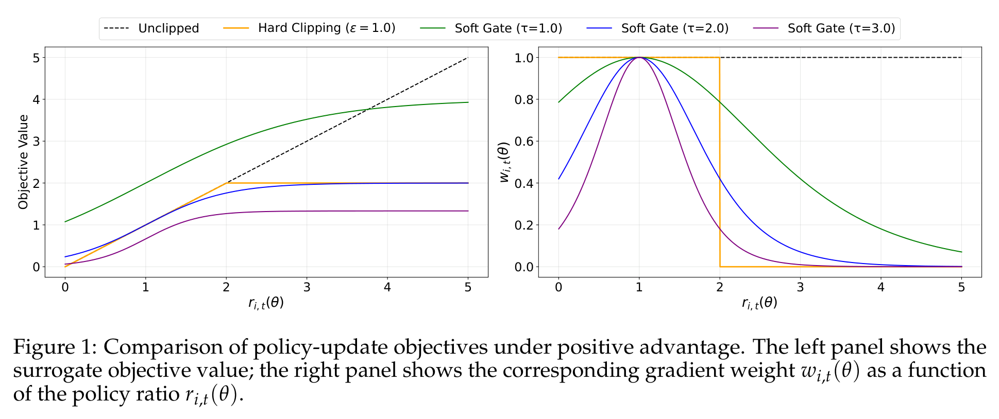
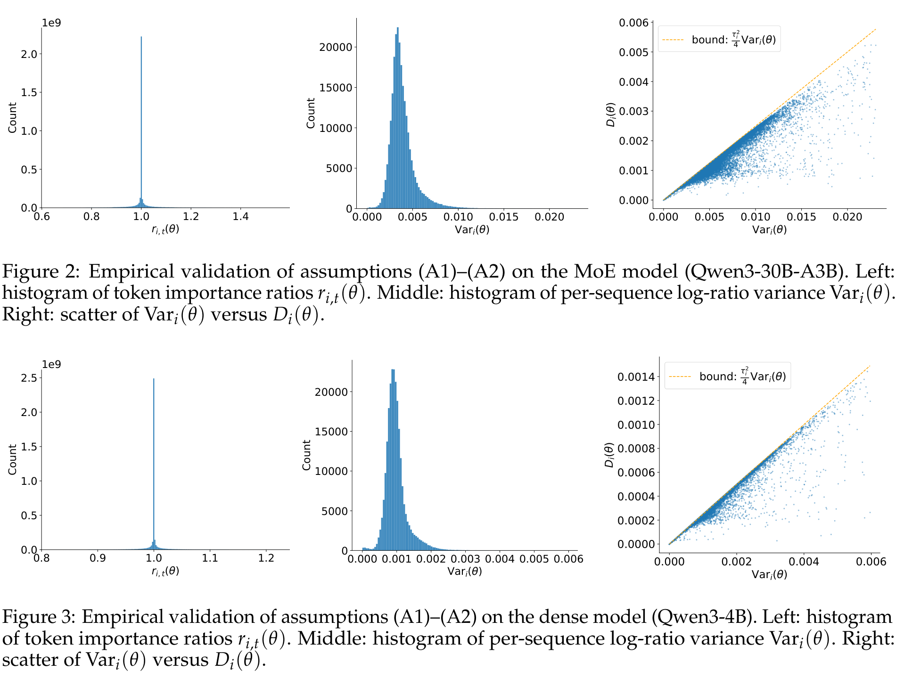
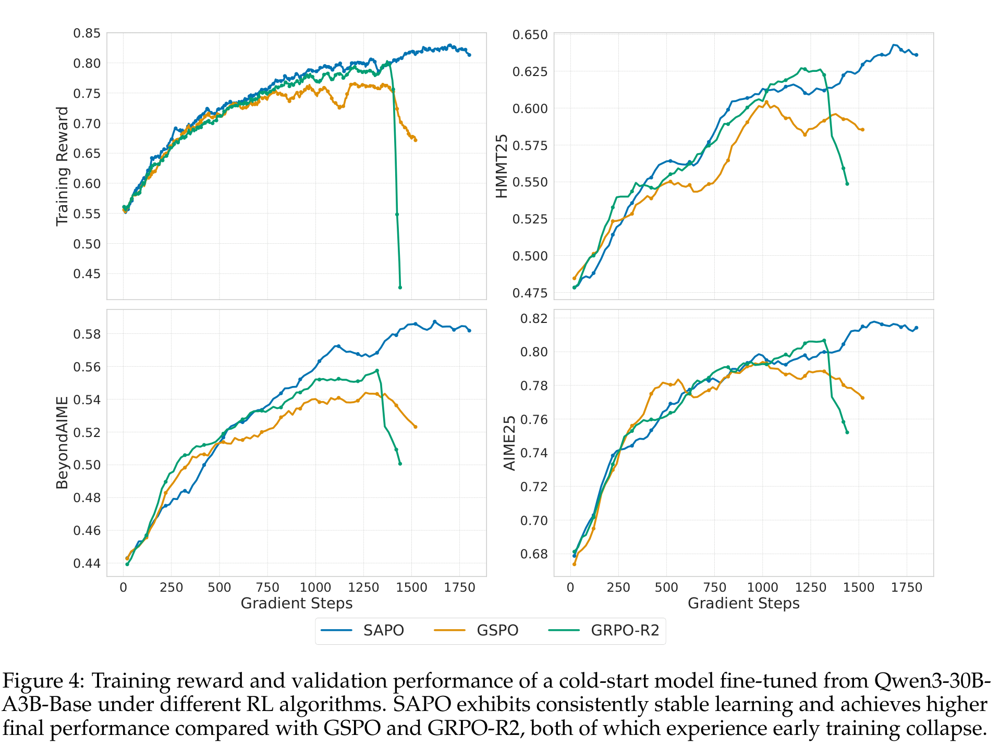
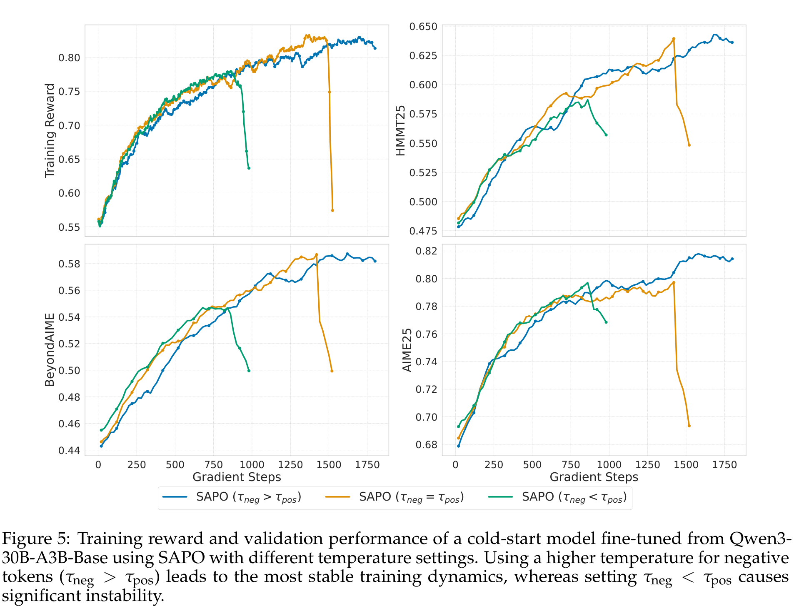
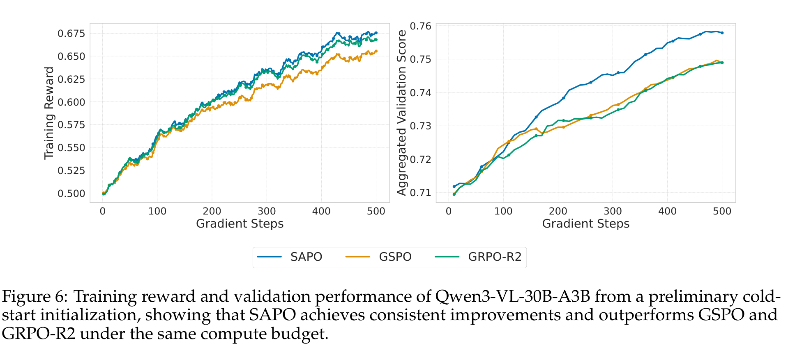

# Soft Adaptive Policy Optimization（SAPO）

## 来源

- 文件：`raw/Gao 等 - 2025 - Soft adaptive policy optimization.pdf`
- 标题：Soft Adaptive Policy Optimization
- 团队 / 日期：Qwen Team, Alibaba Inc.；2025-12-02
- 定位：LLM RL policy optimization 方法论文；不是新模型技术报告。论文称 SAPO 被用于 Qwen3-VL model series 的 RL 训练。

## 核心结论

1. **SAPO 批评 hard clipping 太脆**：GRPO 在 token-level hard clipping，GSPO 在 sequence-level hard clipping；两者都把 trust region 做成固定硬边界，容易在稳定性和有效学习信号之间二选一（Abstract、§1）。
2. **SAPO 的核心改动**：把 hard clipping 换成 smooth, temperature-controlled soft gate。ratio 越偏离 1，梯度权重越平滑衰减；near-on-policy token 保留学习信号，off-policy outlier token 被下调（§3、Figure 1）。
3. **兼顾 GSPO 与 GRPO 的优点**：在 token log-ratio 方差低、小步更新时，SAPO 平均 token gate 近似一个 sequence-level smooth gate，像 GSPO 一样 sequence-coherent；遇到序列内 outlier token 时，又能像 token-level 方法一样只下调坏 token，而不是整条 sequence 被 hard clip 掉（§4.1、Figure 2/3）。
4. **非对称温度**：负 advantage token 的梯度会提高许多 unsampled inappropriate tokens 的 logit，更容易带来不稳定；SAPO 设 $\tau_{neg}>\tau_{pos}$，让负梯度衰减更快（§3、Figure 5）。
5. **实践证据**：Qwen3-30B-A3B 数学 RL controlled experiments 中，SAPO 比 GSPO 和 GRPO-R2 更稳、更高；Qwen3-VL-30B-A3B preliminary cold-start 实验中，SAPO 在同 compute budget 下也优于 GSPO / GRPO-R2（Figure 4、Figure 6）。

## 方法：从硬裁剪到软门控

GRPO / GSPO 的 clipping 是分段硬函数：ratio 落在 band 内有梯度，越界后梯度为 0。SAPO 改成：

$$
J(\theta)=\mathbb{E}\left[\frac{1}{G}\sum_i \frac{1}{|y_i|}\sum_t f_{i,t}(r_{i,t}(\theta))\hat A_{i,t}\right]
$$

其中

$$
f_{i,t}(x)=\sigma(\tau_{i,t}(x-1))\cdot\frac{4}{\tau_{i,t}},\qquad
\tau_{i,t}=\begin{cases}
\tau_{pos}, & \hat A_{i,t}>0\\
\tau_{neg}, & \hat A_{i,t}\le 0
\end{cases}
$$

对它求导得到 gradient weight：

$$
w_{i,t}(\theta)=4p_{i,t}(\theta)(1-p_{i,t}(\theta)),\qquad p_{i,t}=\sigma(\tau_{i,t}(r_{i,t}-1))
$$

这个权重在 $r_{i,t}=1$ 处为 1，随着 ratio 偏离 1 平滑衰减；不会像 hard clipping 那样突然归零。

> 论文 Figure 1 原文标题："Comparison of policy-update objectives under positive advantage. The left panel shows the surrogate objective value; the right panel shows the corresponding gradient weight $w_{i,t}(\theta)$ as a function of the policy ratio $r_{i,t}(\theta)$."（§3）

## SAPO 与 GSPO / GRPO 的关系

### SAPO → GSPO：在常见条件下退化为 sequence-level smooth gate

SAPO 的 §4.1 给两个经验假设：

- A1：small-step / on-policy，即 $r_{i,t}\approx 1$；
- A2：同一 sequence 内 token log-ratio 方差低。

在这两个条件下，SAPO 的平均 token gate 可近似为 sequence gate：

> 论文 Figure 2 / Figure 3 原文标题："Empirical validation of assumptions (A1)–(A2) on the MoE model (Qwen3-30B-A3B)" / "... on the dense model (Qwen3-4B)"（§4.1）

$$
g_{\tau_i}(\log s_i)=sech^2\left(\frac{\tau_i}{2}\log s_i\right)
$$

且误差有界于 $\tau_i^2 Vari_i/4$。Figure 2/3 用 Qwen3-30B-A3B MoE 与 Qwen3-4B dense 的 off-policy mini-batches 验证：token ratio 集中在 1 附近，per-sequence log-ratio variance 通常低于 0.02，dense 更集中、MoE 更分散。

这就是 SAPO 的「sequence-coherent」来源：大多数时候，它像 GSPO 一样对 sequence-level reward 对齐；但当某条 sequence 内出现 outlier token 时，它不会像 GSPO hard clipping 那样整条 sequence 的梯度都被压掉。

### SAPO → GRPO：把 token hard clipping 换成 smooth token gate

GRPO 的 token gate 是二元 trust region：band 内梯度为 1，band 外为 0。SAPO 用 $sech^2$ 形 smooth kernel 替换硬 indicator，让越界 token 逐步降权而不是突然静音。论文认为这能避免 gradient vanishing，同时比 unclipped update 更稳。

## 实验信号

> 论文 Figure 4 原文标题："Training reward and validation performance of a cold-start model fine-tuned from Qwen3-30B-A3B-Base under different RL algorithms."（§5.1）

controlled experiments（§5.1）：Qwen3-30B-A3B-Base cold-start；数学 reasoning queries；AIME25 / HMMT25 / BeyondAIME，average Pass@1 over 16 samples；batch 分成 4 个 mini-batches；SAPO 默认 $\tau_{pos}=1.0$、$\tau_{neg}=1.05$；对比 GSPO 与 GRPO-R2（GRPO + routing replay）。

> 论文 Figure 5 原文标题："Training reward and validation performance of a cold-start model fine-tuned from Qwen3-30B-A3B-Base using SAPO with different temperature settings."（§5.1）

## Qwen3-VL 训练证据

SAPO 的特殊价值是它不只停留在数学 controlled experiment；论文 §5.2 明确说把 SAPO 用于 Qwen3-VL family 的实际大规模训练，覆盖文本与多模态任务（math、coding、logical reasoning），并固定各任务 batch sampling ratio。

> 论文 Figure 6 原文标题："Training reward and validation performance of Qwen3-VL-30B-A3B from a preliminary cold-start initialization, showing that SAPO achieves consistent improvements and outperforms GSPO and GRPO-R2 under the same compute budget."（§5.2）

Qwen3-VL 实验评测四项：AIME25（Pass@1 with 32 samples）、LiveCodeBench v6（Pass@1 with 8 samples）、ZebraLogic、MathVision。论文只给曲线与 aggregated validation score，没有给完整表格数值；可作为「Qwen3-VL 后续训练使用 SAPO」的算法来源，但不应改写 Qwen3-VL 技术报告里的原始 pipeline 事实。

## 与其他页面的关系

- [LLM RL policy optimization 对比](../comparisons/llm-rl-policy-optimization.md)：SAPO 是「soft trust region 派」——从 hard clip 改成温度控制软门，试图调和 GRPO 的 token adaptivity 与 GSPO 的 sequence coherence。
- [Group Sequence Policy Optimization](group-sequence-policy-optimization.md)：SAPO 直接继承/批评 GSPO，认为 GSPO sequence-level hard clipping 会因少数 off-policy token 牺牲整条 sequence 的 near-on-policy token 信号。
- [Qwen3-VL 技术报告](qwen3-vl.md)：SAPO 是 Qwen3-VL 后续/配套 RL 方法证据，应该作为外部后训练算法补充，而不是替换原报告的三阶段后训练描述。

## 待追问

- SAPO 说所有方法最终可能仍有 instability，只是 SAPO 稳定更久；它是否能完全避免 collapse，还是只是延迟 collapse？正文倾向后者。
- $\tau_{pos}$ / $\tau_{neg}$ 是否能自适应，而非固定 1.0 / 1.05？论文只做三档消融。
- SAPO 在 Qwen3-VL family 的不同尺寸/架构上都有效，但正文只展示 30B-A3B preliminary checkpoint 曲线；其它尺寸的具体收益未列表。
- SAPO 的 soft gate 是否会降低对极端坏 token 的惩罚力度？论文强调平滑保留信号，但没有给 reward hacking / safety 侧实验。

## 相关页面

- 比较：[LLM RL policy optimization 对比](../comparisons/llm-rl-policy-optimization.md)
- 相邻算法：[Group Sequence Policy Optimization](group-sequence-policy-optimization.md)、[DAPO](dapo.md)、[Agentic Reinforced Policy Optimization](agentic-reinforced-policy-optimization.md)
- 模型/来源：[Qwen3-VL 技术报告](qwen3-vl.md)、[Qwen3 技术报告](qwen3.md)
