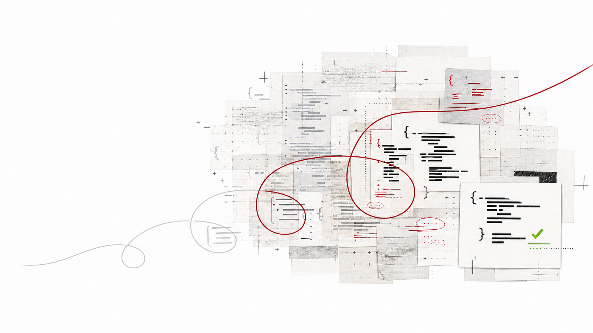

# SoL-Pi 官方博客

## 来源

- 本地快照：[`raw/nvlabs-sol-pi-blog.md`](../../raw/nvlabs-sol-pi-blog.md)（`raw/` 已 git-ignored，本地可读）
- 原文：[SoL-Pi: Scaling Auto-Research Loops for Efficient Agent Harnesses](https://nvlabs.github.io/SoL-Pi/)
- 代码：[NVlabs/SoL-Pi](https://github.com/NVlabs/SoL-Pi)
- 团队：NVIDIA NVLabs（Haozhe Liu、Tian Ye 等；core contributors 含 Enze Xie、Song Han）
- 底盘：[Pi coding agent 设计博客](pi-coding-agent.md)；仓库钉死 `@earendil-works/pi-coding-agent` 0.84.2
- 未建模型页：这是 Pi 的 opt-in 扩展，不是模型。

## 这页在本 wiki 的定位（重要）

这是 NVLabs 的研究博客，不是技术报告。它对机制、auto-research 流程和自报数字是**原文确证**；对 Pi 底盘设计的转述不能替代 [Pi 来源页](pi-coding-agent.md)。GitHub README 的安装步骤不当作机制证据。新智元 / 36氪是二手，不进本页。

SoL-Pi **没有**用上 0.84.0 以后的 durable `AgentHarness`：它挂在 0.84.2 的公开 `ExtensionAPI` 上，不 patch Pi。

## 核心结论

1. **先问 harness 能不能少烧 token，再谈扩大 RSI。** RSI 每次尝试都收费，失败也收费。作者把目标写成 constrained efficiency：在预声明的能力地板内减 cost / token（原文确证，Introduction / § Capability floors）。
2. **152 个方向进 auto-research，约 1/40 活下来，最终四个机制。** 四个都针对重复开销，而不是某一类题的答案（原文确证，§ What auto-research loops discovered）。
3. **相对底座 Pi：token 少 45–49%，成本约低 1/3，平均分保留约 94%。** 相对 Codex / Claude Code 原生 harness：token 少 35–64%，API 标价成本低 50–54%。专业研究者单问题上，相对原生 Codex/Claude Code 自称省 **$8.75–$13.50 / 小时**，相对 Pi 省 **$4.36–$5.71 / 小时**（官方 API-equivalent 定价，`xhigh`）。GPT-5.6 Sol 上 SoL-Pi 的 EdgeBench 分超过该模型的原生 Codex harness（原文确证，Introduction 与机制节末段）。
4. **省钱可以来自少干活。** 能力地板禁止靠提前停、跳过验证或丢掉证据来省 token。单机制过门后的小损失会累积：拼装后的 harness 只保留 Pi 约 94% 的平均分（原文确证，§ Capability floors）。
5. **「efficiency for efficiency」是愿景，不是本文已证明的复利。** 作者计划用更便宜的 harness 去跑下一轮 auto-research（原文确证，§ Efficiency for efficiency）。

> 项目页头图 caption：「Layered code papers traced by recursive research paths toward a verified result」（来源：[SoL-Pi 官方博客](https://nvlabs.github.io/SoL-Pi/)）。

## 架构与训练

### 底盘与约束

研究底盘是 [Pi](pi-coding-agent.md)。EdgeBench（51 个长周期可执行任务）的任务、verifier 和反馈只用于最终 held-out，不进搜索（原文确证，Introduction）。训练环境 535 个：495 个来自 GitHub issue–PR（fail-before / pass-after 才保留），40 个 verifier-driven 合成任务；不用 EdgeBench 当合成模板。

仓库四条规则（外部佐证，README）：不 patch Pi、缺配置则全关、保留原始 observation、认证和主模型仍由 Pi 管。

### Auto-research 怎么跑

外层把 152 个方向扇出成独立 lineage；Oracle Analysis 先用已有轨迹估机会，再花 rollout。每个 lineage 里是改编过的 Karpathy autoresearch loop：propose → implement（Ralph Loop）→ reviewer → in-trajectory validation → **frozen** held-out。Held-out 轨迹不回流入后续分析，loop 内 agent 也看不到 held-out 结果（原文确证，§ Parallel auto-research loops）。

编排经历三版：编译 YAML 工作流 → 长寿命 coordinator 代码 → **disposable skill loop**（每次实验复制模板，跑完丢掉改过的编排代码）。作者说单份模板比无限膨胀的 coordinator 好维护（原文确证，§ From compiled workflows to disposable skill loops）。

搜索轴：DFS 容易在 5–10 轮后困在局部；BFS 转换率低（约 1/40），但偶尔给出后来能硬化的跳变（原文确证，§ Breadth escapes local search basins）。人类只给先验、挡掉「搜 harness 超参」这类方向，并在幸存者上重构代码；loop 内部无人值守（原文确证，§ Humans set priors）。

### 四个幸存机制

| 区域 | 机制 | 改什么 |
| --- | --- | --- |
| Tools | **Action Fusion** | 一次 edit/write 可以带上随后的验证命令，少一轮模型往返 |
| Context | **Online Context Compact** | 子任务完成点成为 compaction 候选，但只有预期节省能还回 rewrite 成本才压 |
| Observations | **ObservationPack** | 大段重复 tool result 变成稳定 handle，原文本地可分页取回 |
| Delegation | **Evidence-Preserving Reducer** | 超长日志交给更便宜的 agent 先读，每条引用必须能对上归档原文才交给前沿模型 |

ObservationPack 从提案族 Context（C23/C24）出发，最终落在 observation 边界上实现——作者用它说明「提案家族记录假设从哪来，不记录机制最后装在哪」（原文确证，§ Parallel auto-research loops）。

### 四个机制怎么挂上 Pi 0.84.2（仓库一手）

来源：[compatibility.md](https://github.com/NVlabs/SoL-Pi/blob/main/docs/compatibility.md)、[README](https://github.com/NVlabs/SoL-Pi/blob/main/README.md)。这是开源扩展的实现契约，不是博客里的 auto-research 叙事。

只 import 公开包导出：`createEditToolDefinition` / `createWriteToolDefinition` / `createBashToolDefinition`、`ExtensionAPI.registerTool`，以及 `context`、`before_provider_request`、`tool_result`、`turn_end`、`agent_settled`、`session_before_tree`；compaction 走 `getContextUsage()` / `compact()`。缺 `sol-pi.json` 则全部关闭。

| 机制 | 挂点 | 实现约束 |
| --- | --- | --- |
| Action Fusion | 替换 edit/write 定义 | 按 `ctx.cwd` 缓存一份内建定义；自建 per-file 队列包住「改文件 + then_run」，不嵌套 Pi 自己的 mutation 队列。`then_run` 前对目标做 hash，若中间内容变了就跳过命令。 |
| ObservationPack | 公共 `context` 事件 | 只改投影给模型的消息；session 原文和 JSONL 不动。归档在 `<sessionDir>/sol-pi/<sessionId>/observation-pack/`。 |
| Evidence-Preserving Reducer | `tool_result` | 经 Pi `modelRegistry.complete()` 调便宜模型。资格、模型、schema、source-hash、逐条引用、大小或 likely-secret 任一失败则**原样返回**。可把合格日志送到配置的 reducer 模型；默认关。 |
| Online Context Compact | `context` + `before_provider_request`，在其他 SoL-Pi transformer **之后**注册 | Pi 不暴露 retained-tail 设置，经济估计用文档默认 **20,000 token**。0.84.2 的 `compact()` 会先 abort 当前 run；扩展在计划边界存状态 → `abort()` → 等 `agent_settled` → 等 compaction 回调 → `sendMessage({triggerTurn:true})` 开新 turn。`sendMessage()` **不返回 promise**，barrier 依赖同步开 turn。compaction 期间取消 `session_before_tree`，避免树导航把 leaf 从 compaction 下抽走。`cacheWriteReadRatio` 只从 `sol-pi.json` 读，换模型不改。 |

推荐的保守配置只开两个**不再打模型、也不停当前 run**的机制：`actionFusion` + `observationPack`。Reducer 和 Compact 要先看 [SECURITY.md](https://github.com/NVlabs/SoL-Pi/blob/main/SECURITY.md)：归档不随 session 结束删除；reducer 会把日志送出。

这解释了为什么 SoL-Pi **用不上** Pi 0.84.0 的 durable `AgentHarness`：它的 Compact 语义绑在「`compact()` abort + `agent_settled` + 无 promise 的 `sendMessage`」这一套旧 ExtensionAPI 上。

## 评测要点

所有主比较在 `xhigh`。主台是 EdgeBench，因为轨迹要跑数小时；作者认为 Terminal-Bench 2.1 / SWE-bench 通常一小时内结束，重复开销来不及累积（原文确证，§ EdgeBench makes long-horizon efficiency measurable）。

Terminal-Bench 4 的 63 个 **CPU-only** 任务（GPU 任务因内部基础设施跑不了长执行被排除）：

| Harness | Solved | Total cost | Per solved task |
| --- | ---: | ---: | ---: |
| Codex | 18/63 | $272.35 | $15.13 |
| Pi | 18/63 | $286.45 | $15.91 |
| SoL-Pi | 15/63 | $211.12 | $14.07 |

SoL-Pi 在这条短台上少解 3 题，单题成本略低。这和 EdgeBench「长轨迹才看得见效率」的论证一致，不能把 15/63 读成全面更强。

Swarm 试点（Anthropic original performance take-home，单次、非随机）：GPT-5.6 Sol coordinator + 20 个 Luna worker。SoL-Pi worker 到 1,127 cycles / $60.11；stock Pi swarm 1,366 / $82.12；单 agent Sol 最便宜（$39.20）但 1,333 cycles。作者明确：SoL-Pi 那次中途修了三次网/授权、对照从修好后的配置开始、**不能当因果估计**（原文确证，§ Efficient Agent Swarm）。

## 待追问

- 94% 能力保留是平均分；Terminal-Bench 4 上少解 3 题，损失集中在哪类任务？
- 四个机制各自的消融数字博客没有；拼装后的 45–49% token 下降有多少来自 ObservationPack vs Compact？
- Compact 的 20k tail 是对 Pi 默认的硬编码估计。用户若改了 Pi 的 compaction 设置，经济判断会偏。
- SoL-Pi 钉在 Pi 0.84.2 的旧 `ExtensionAPI`。Pi 的 durable `AgentHarness` 一旦成为 CLI 默认，`agent_settled` / `compact()` abort 语义还在不在？
- 评测主台是 [EdgeBench](edgebench.md) 的 51 公开题；官方 EdgeBench 榜用 Codex/Claude Code，不能和 SoL-Pi 数字横比。
- 「harness scaling law」和 closed-loop 环境自合成都标为早期 / 愿景，没有曲线。

## 相关页面

- [Pi coding agent 设计博客](pi-coding-agent.md)
- [DeepSeek Harness 官方文档](deepseek-harness.md)（插件核 vs 本页在 Pi 上加效率层；PTC/`run_code` 与 Action Fusion 是否同类未交叉实验）
- [EdgeBench 技术报告](edgebench.md)
- [Databricks coding agent 内部评测博客](databricks-coding-agents.md)
- [Agent harness](../concepts/agent-harness.md)
- [Agentic engineering](../concepts/agentic-engineering.md)
- [Agentic 评测体系](../concepts/agentic-evaluation-benchmarks.md)
- [Macaron-V1 技术报告](macaron-v1.md)（MindForge RSI 搜的是 HCP 配置；SoL-Pi 搜的是 token 效率机制）
- [Prime Agent 技术报告](prime-agent.md)
- [Agent Swarm](../concepts/agent-swarm.md)（Kimi 学编排策略；SoL-Pi swarm 试点是未隔离的单次试验）
