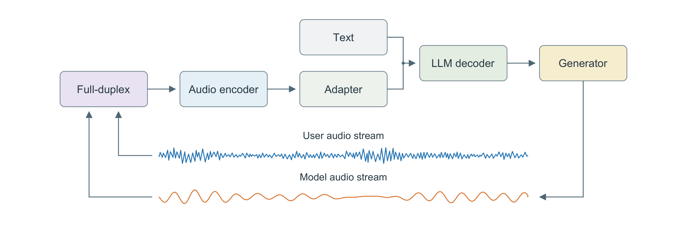
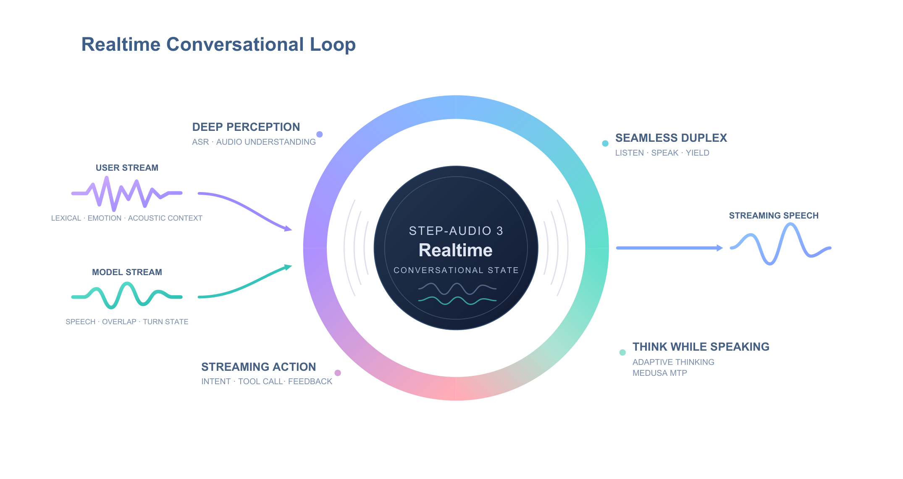
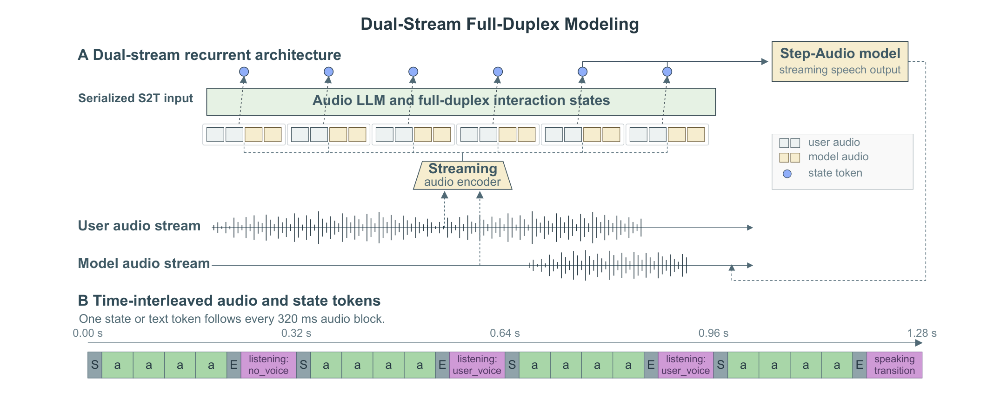
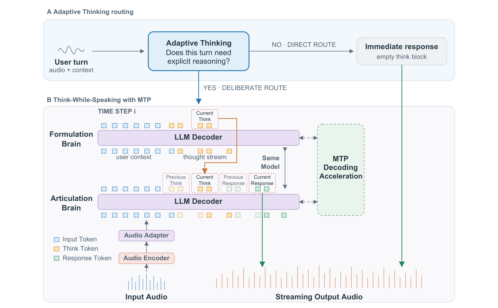

# StepAudio 3 Realtime 技术报告

## 来源

- 原始 PDF：[2609.14005v2.pdf](../../raw/2609.14005v2.pdf)，27 页。本页使用 arXiv v2（修订 2026-09-19；v1 提交于 2026-09-12）。
- 标题：StepAudio 3 Realtime Technical Report。
- 团队：StepFun-Audio Team。作者按名的字母序排列；arXiv 提交记录为 Haoyang Zhang。
- 版本入口：[arXiv:2609.14005](https://arxiv.org/abs/2609.14005)。PDF 首页项目页超链接：[stepaudiollm.github.io/step-audio-3-realtime](https://stepaudiollm.github.io/step-audio-3-realtime/)。
- 模型页：[StepAudio 3](../models/stepaudio-3.md)。

这是 Step-Audio 系列的实时对话报告，前作是 Step-Audio、Step-Audio 2、Step-Audio-R1、Step-Audio-R1.5 与 StepAudio 2.5（参考文献 [13]–[16]）。本库尚未单收这些前作。音频前端引用的是 Qwen3-Omni 技术报告（Jin Xu 等，arXiv:2509.17765），不是 [Qwen3.5-Omni](qwen3.5-omni.md) 或 [Qwen3.8-Omni](qwen3.8-omni.md) 里写过的编码器配置。

## 核心结论

原文确证（Abstract、§1–2、Figure 1）：StepAudio 3 Realtime 是一个音频语言模型，按 listen / converse / think / act 组织。用户语音和模型自己正在说的语音同时进入感知；地板管理决定听、说还是让出；需要深想的轮次用 Think-While-Speaking 把私下推理和开口并行；工具调用走异步，对话可以继续。

同一份预训练和 mid-training 在 SFT 分成两支（§4.1.1）：StepAudio 3 ASR Max 只做转写；StepAudio 3 Realtime 做音频理解、全双工对话、推理和工具。下面的转写数字只描述 ASR Max。

三件要分开读的结果：

1. **推理模式和实时开口不是同一次测量。** 推理模式在封闭文本基准 StepAudioChat 上八维宏均分 73.0（Table 4），高于豆包 2.0 Lite 的 70.5 和 DeepSeek-V4-Flash 的 71.4，低于 Kimi K3 的 77.1。实时交互模式的同一基准宏均分是 70.4（Table 10；§8.4 写 70.41）。Figure 1 的对话条目标了 realtime mode。摘要里的 73.0 是推理模式。
2. **全双工 Overall 98.9 是所报基线里最高的总分，分项并不项项第一。** Artificial Analysis 对 Full Duplex Bench v1 / v1.5 子集的 Overall：本模型 98.9，Qwen Audio 3.0 Realtime Plus 98.4，GPT-realtime-2 (High) 95.3，Grok Voice Think Fast 2.0 High 95.1（Table 3）。停顿处理上 GPT 为 99.3，附和处理上 Qwen 为 100.0。
3. **工具任务的宏平均接近第一，零售域明显落后。** τ-Voice 三域等权宏平均 56.0%，Grok 56.5%，Qwen 54.6%，GPT-Realtime-2.1 High 45.7。电信 70.2% 为四者最高；零售 37.7%，Grok 为 49.7%（Table 9）。

作者在 §1 和 §9 自己点出的缺口是多轮约束跟随，以及零售工具任务。AudioMultiChallenge 上相对 Gemini 3.1 Pro 低 17.7 分（49.3 vs 67.0）。实时模式的指令跟随从推理模式的 66.3 降到 54.1。

## 架构与训练

### 系统：MoE 解码器，双流音频，文本另路进入

原文确证（§3.1、Figure 3）：语言解码器是 MoE。正文没有总参数、激活参数、专家数或注意力类型。音频前端是 Qwen3-Omni 的 Audio Transformer（AuT），再用 adapter 投进语言模型的表示空间。本报告没有给出 AuT 的层数、下采样率或帧率，不能从后来的 Qwen Omni 页抄这些数。

> Figure 3，PDF p.4。原图注：LLM decoder 经音频编码器和 adapter 接收音频表示，并另有文本输入。用户音频与模型音频构成两路全双工流，生成器输出回到模型音频流。波形是示意。

生成器逐段产出带语气和节奏的语音，正文把停顿和犹豫算进表达。生成器内部（codec、采样率、token 率）没有写。

> Figure 2，PDF p.3。原图注：用户语音与模型语音一起供给感知和地板管理。推理支撑开口和工具使用，工具结果再写回后续交互的上下文。

共享上下文包括声学与语言证据、对话历史、当前话轮、推理进度和工具执行状态（§2.1）。模型侧语音用来解释和自己重叠的用户话语。

### 预训练 32K / 1.2T，mid-training 扩到 128K

原文确证（§3.2–§3.3）：

| 阶段 | 本报告写明的内容 |
| --- | --- |
| 数据 | 沿用 StepAudio 2.5 的自动音频管线，再加宽语言覆盖。声事件检测与 VAD 之后重切，保留语义完整；标注质量、合成语音似然、说话人数；多套识别系统交叉转写并分级 |
| 对齐 | 建立声学表示和语言模型的接口 |
| 混合训练 | 大规模联合音频–文本建模 |
| cooldown | 提高高质量数据权重 |
| 全程 | 序列长度固定 32K，三阶段合计 1.2T token |
| 配比 | 提高纯文本比例，以保住基座语言模型的通用能力，供后面的推理和 agent 训练使用 |
| mid-training | 感知、合成对话、voice-agent 数据；上下文扩到 128K，用来装更长历史、更早的用户要求和中间工具结果；提高音频理解与 agent 交互的占比 |

基座语言模型的名字、初始化方式和 MoE 负载均衡都没有写。

### 全双工：每 320 ms 音频块后跟一个状态或文本 token

原文确证（§5、Figure 5）：地板管理要区分话轮内部的停顿和话轮结束，也要区分附和与真的打断。系统把用户语音、模型正在说的语音和对话历史放在同一条时间线上。

> Figure 5，PDF p.8。原图注：(A) 用户语音、模型侧语音和对话历史共同决定地板。(B) 音频与交互状态排在同一条时间线上。

状态决策是继续听、开始答、继续说，或让出地板（§5.1）。停顿用声学时间和语义完整度一起判断（§5.2）。附和可以表示还在听，不要求换地板；实质要求或纠正才倾向打断。对话历史还用来判断进来的语音是不是在对助手说；无关背景对话不写入当前交换。

Mid-training 把模型适配到这种交错表示，监督包括流式 ASR、VAD 和话轮完整度的流式预测。混合物里有超过 10,000 小时的合成全双工交互，并保留文本以维持语言和推理。后训练再用高质量交互数据细化轮替、附和、打断和背景拒绝（§5.3）。

和 [MiniCPM-o 4.5](minicpm-o-4-5.md) 的差别写在时间单位上：那里是 1.0 秒 chunk，语言模型只出文本 token，语音交给单独的 speech decoder。这里是 320 ms 一块后跟一个状态或文本 token，开口由 Figure 3 的 Generator 接在 LLM decoder 之后。两份报告都没有在同一套全双工协议上对打。

## 后训练

### 两支 SFT，以及「少而精」的音频理解数据

原文确证（§4.1–§4.2）：两支模型只在监督微调处分叉。

ASR Max 把样本打包到最长 32K。时间–频率掩码遵循 SpecAugment 的原则。音频编码器冻结，更新 adapter 和语言解码器，目标是规范化转写。上下文可以另给对话历史、模型上一句、场景描述或术语；转写仍必须落在输入波形上。短句用标注数据，长录音用多系统转写再经 ROVER 融合，按一致度筛选后重组成更长会话，再由 LLM 恢复标点。长尾术语由 LLM 展开易混类目，放进载体句，只保留发音与目标文本一致的合成语音。

音频理解数据按词法、副语言、声学事件、说话人与时间结构、音乐、以及音频接地推理分层。文本 LLM 裁判给问题和回答打质量与 case value，不直接听音频。音频接地是否可靠，靠多个模型对同一音频–问题对的回答是否一致来估计。高一致、高 case value 的样本进 SFT；有用的更广样本可以进 mid-training。

单独消融只改 SFT 数据：约 200 万条随机样本，对照质量控制后留下的约 10 万条。后者把 MMSU 从 78.78 抬到 89.70，MMAR 从 74.70 抬到 84.50，WildSpeech 从 74.20 抬到 77.11；MTalk-Bench 的环境音、副语言和语义子集宏平均从 88.83 到 90.84。这组数低于最终主表（MMSU 90.6、MMAR 86.5），消融的 MTalk 口径还多了语义子集。主表的 MTalk-Bench 只含副语言和环境音（§8.3）。

### Think-While-Speaking：同一次权重，两次并发调用

原文确证（§6.3、Figure 7）：机制沿 Mind-Paced Speaking（Donghang Wu 等，arXiv:2510.09592）。Formulation Brain 写私下推理；Articulation Brain 按目前已经写出的推理、以及已经说出的回答，产生短的应答片段。两次调用的是同一个音频模型。

播放进度决定片段何时放出去，推理继续并行。推理写完之后，剩余回答可以用完整推理状态。开头若基于不完整推理，最后还可以补一句或改口。默认 Speak-First：不等第一段推理前缀就开始说。Think-First 则先等一段短的推理前缀。

> Figure 7，PDF p.14。原图注：Adaptive Thinking 把每一轮送到立即回答或深思；MTP 加速深思轮次的私下思考。

**Adaptive Thinking**（§6.3.1）在助手轮次上造监督。固定的探针模型没有经过这套数据变换，在空 think 块下重答。盲裁判对照目标答案比较「原推理」和「不思考」，不知道哪条是哪条，只标思考有没有改变答案质量。每个域有 no-think 比例预算；预算按细主题分层，并限制每个能力被拿掉思考的比例。

Table 5 在 StepAudioChat 的 46 个成员、八个类上比较。温度 0，无系统提示。Direct SFT 与强制不思考共用一套基座权重，只是推理时开或关思考。Adaptive Thinking 是另训的，所以和前两列的差里含着训练本身。思考调用率在八类上从 51.5% 到 82.0%。

| 域 | 全思考 | 强制不思考 | Adaptive 思考率 | Adaptive 分数 |
| --- | ---: | ---: | ---: | ---: |
| Instruction Following | 64.15 | 61.98 | 60.0% | 62.12 |
| Faithfulness | 72.35 | 70.63 | 79.2% | 72.42 |
| Reasoning | 71.89 | 60.52 | 59.5% | 66.80 |
| Memory | 67.99 | 63.86 | 51.5% | 65.99 |
| Knowledge | 74.59 | 68.65 | 80.4% | 71.55 |
| Safety and Reliability | 78.46 | 74.95 | 56.9% | 77.90 |
| Dialogue Pragmatics | 63.59 | 62.41 | 58.9% | 65.87 |
| Persona and Role Consistency | 77.17 | 68.80 | 82.0% | 74.62 |

全思考相对强制不思考，增益最大的是 Reasoning（11.37）、Persona（8.37）和 Knowledge（5.94）。Faithfulness 只高 1.72，思考率却有 79.2%。Reasoning 受益最大，思考率只有 59.5%。作者据此写明：思考更少并不说明思考被分到了最受益的轮次；这些聚合也不能确定单个轮次的最优决定。相对 Direct SFT，Adaptive 把 Dialogue Pragmatics 从 63.59 抬到 65.87，把 Reasoning 从 71.89 降到 66.80。Table 5 的全思考分数和 Table 4 的推理模式主表不是同一列数，不能并成一个 checkpoint。

**私下推理的 MTP**（§6.3.2）：MTP3 用三个预测头，每步最多起草三个未来 token。严格验证沿目标模型的常规推测解码。Medusa 式 typical acceptance 用随熵变化的置信阈值接受严格验证会拒绝的草稿，接受率上去，生成分布也允许改变。重复惩罚 1.05。typical acceptance 和重复惩罚只用在私下推理上；说出口的回答仍走严格验证。作者写：出口严格验证消除不了「私下推理尚未写完」带来的错误。

Table 6（StepAudioChat，重复惩罚 1.05）的接受长度与墙钟：

| 配置 | 每步接受草稿 | 墙钟加速 |
| --- | ---: | ---: |
| Baseline | 0 | 1.00× |
| MTP3 | 1.231 | 1.76× |
| MTP3（Medusa） | 1.801 | 2.05× |
| MTP5 | 1.353 | 1.49× |
| MTP5（Medusa） | 2.153 | 1.72× |

Instruction Following 从基线 64.15 降到 61.21–62.73；Reasoning 与 Memory 高于基线。Table 7 里 MTP5 第 4、第 5 头的严格边际接受率降到 10.7% 和 5.7%。典型接受下 MTP5 每步接受更多草稿（2.153 vs 1.801），墙钟却是 MTP3 Medusa 的 2.05× 更高。正文要求不要把这些墙钟比读成草稿深度的受控对照：比值各自绑定自己的计时配置，净效率还取决于推理长度和解码成本。

这和 [多 token 预测](../concepts/multi-token-prediction.md) 里「MTP 头跟着骨干一起训、再当服务端 drafter」的用法不同。这里的加速对象只是私下思考流，出口回答保持严格验证。

### 四教师参数平均，权重 3:1:1:1

原文确证（§6.4、Table 8）：从同一基座训出多个参数对齐的教师，数据配比分别偏向多轮对话、音频理解、通用文本推理与知识，以及有目标的混合域。合并是参数凸组合

\[
\theta_{\mathrm{merge}}=\sum_i \alpha_i \theta_i,\qquad \alpha_i\ge 0,\ \sum_i \alpha_i=1.
\]

报告模型用四名教师，归一化权重 3:1:1:1。系数在覆盖对话、音频理解和通用文本的留出评测上选定。合并不增加模块，推理时也不路由。这是参数空间的加权平均。教师数据可以分开开发，再合成，不必在数据并集上重训一个模型。

Table 8 的宏平均（域内各行等权；对话列是推理模式）：

| 域 | 合并 | Teacher 1 | Teacher 2 | Teacher 3 | Teacher 4 |
| --- | ---: | ---: | ---: | ---: | ---: |
| 音频理解 | 81.3 | 79.8 | 80.5 | 81.3 | 80.2 |
| 通用文本 | 76.5 | 57.2 | 71.8 | 70.7 | 73.2 |
| 对话 | 73.0 | 74.2 | 68.6 | 68.7 | 72.3 |

音频宏平均与最强教师打平，合并在 MMAU（79.0）和 WildSpeech（77.1）上领先。文本宏平均最高：HMMT 2026 Feb 86.8、GPQA Diamond 83.0，MultiChallenge 59.7 与 Teacher 4 并列。对话宏平均 73.0，低于最强对话教师 74.2。Teacher 1 的 HMMT 只有 44.0，对话宏平均却最高。表本身没有把 Teacher 1–4 标成上文的四种数据配比；把「对话最强、数学最弱」对上「多轮对话教师」是读表之后的推断。

这些数评的是底层推理模型，和后面加上 Think-While-Speaking、Adaptive Thinking、MTP 的系统级评测分开（§6.4 末、§6.2）。

### Voice Agent：先澄清，再异步执行

原文确证（§7）：模型在三类出口里选。稳定知识直接答。需要最新公开信息的请求走轻量工具，例子是天气和网页搜索。私人上下文、多步处理、或会超出当前话轮的工作，交给后端异步执行。语法完整的话仍可能缺槽或随后被改口，所以提交外部动作之前要向用户澄清，或用工具取上下文，并在后果较重时取得确认。

执行期间用户可以问进度、加要求或换话题。模型要把与任务相关的话和无关对话分开。结果写回上下文后再说。复杂请求上，推理负责约束和计划，工具与后端输出负责证明什么已经做完；正文把这写成 ReAct 式交错。Think-While-Speaking 负责想的时候继续说，异步执行负责外部任务跑的时候对话不断。

训练把针对性 voice-agent 对话和真实多步轨迹合在一起。对话覆盖路由、澄清、私人上下文检索、后果动作前的确认、执行中更新、进度询问和结果汇报。负例用来抑制多余工具调用，以及没有证据却声称已经完成。多步轨迹经过滤和规范化，关注工具调用结构、参数一致性、证据接地，以及适不适合说出来。

## 评测要点

原文确证（§8）。六个域：转写、音频理解、对话与推理、全双工、agent 任务完成、通用文本。ASR 基线（豆包 2.0 ASR、Seed 2.0 Lite、HY3.0 ASR Preview）用同一测试音频和计分流程重跑。其余域只写对照记录里的模型版本和 effort 标签，正文没有逐项声明都由作者重跑。

### 转写只属于 ASR Max

Table 1。英文 WER，中文 CER。ContextASR-Bench 用 Contextless：不注入领域标签、实体表或热词。

| 测试集 | StepAudio 3 ASR Max | 豆包 2.0 ASR | Seed 2.0 Lite | HY3.0 ASR Preview |
| --- | ---: | ---: | ---: | ---: |
| LibriSpeech test-clean | 1.18 | 2.94 | 1.47 | 1.38 |
| LibriSpeech test-other | 2.28 | 5.98 | 2.67 | 2.80 |
| AISHELL-1 | 0.49 | 2.07 | 1.66 | 1.22 |
| WenetSpeech test-net | 3.99 | 4.03 | 4.71 | 3.71 |
| WenetSpeech test-meeting | 4.35 | 5.09 | 4.80 | 4.12 |
| ContextASR-Speech-EN | 7.91 | 12.04 | 9.48 | 8.53 |
| ContextASR-Dialogue-EN | 3.43 | 9.09 | 3.65 | 4.66 |
| ContextASR-Speech-ZH | 1.43 | 2.80 | 2.15 | 1.74 |
| ContextASR-Dialogue-ZH | 1.02 | 10.47 | 4.15 | 1.63 |

标准集上，LibriSpeech 两子集和 AISHELL-1 由 ASR Max 最低。WenetSpeech 两子集低于豆包和 Seed，高于 HY3.0（net 3.99 vs 3.71，meeting 4.35 vs 4.12）。ContextASR 四个子集都最低。英文两子集宏平均错误率 5.67%，HY 为 6.60%；中文 1.23% 对 1.69%。§4.1.2 写明这些数字刻画的是转写专用模型。

### 音频理解：八项里领先四项，宏平均略低于 Gemini 3.1 Pro

Table 2，0–100，越高越好。

| 基准 | StepAudio 3 Realtime | 豆包 2.0 Lite | Gemini 3 Flash | Gemini 3.1 Pro |
| --- | ---: | ---: | ---: | ---: |
| Big Bench Audio | 98.1 | 98.8 | 99.4 | 99.6 |
| AudioMultiChallenge | 49.3 | 48.5 | 56.6 | 67.0 |
| MMSU | 90.6 | 80.0 | 77.0 | 83.6 |
| MMAU | 79.0 | 77.5 | 77.6 | 80.5 |
| WildSpeech | 77.1 | 73.9 | 74.4 | 77.7 |
| MMAR | 86.5 | 75.9 | 75.4 | 81.7 |
| Step-Caption | 78.2 | 76.8 | 67.8 | 74.8 |
| MTalk-Bench | 91.7 | 89.9 | 88.5 | 89.1 |
| 宏平均 | 81.3 | 77.7 | 77.1 | 81.8 |

领先的四项是 MMSU（相对 Gemini 3.1 Pro +7.0）、MMAR（+4.8）、Step-Caption 和 MTalk-Bench。MMAU 与 WildSpeech 接近 Gemini 3.1 Pro。Big Bench Audio 各方都接近饱和。Step-Caption 用标注说话人属性上的裁判分。MTalk 主表只聚合副语言和环境音。

### 对话：推理模式 73.0，实时开口 70.4

StepAudioChat 是封闭文本基准，把回复质量从韵律、轮替时机和打断里拆出来（§6.1）。题目新造，公开基准只用来检查覆盖，不复用其试题。每题有可独立检查的标准、一份满足全部标准的参考回答和一份故意违反至少一条的回答。难度用两个能力不同的参考系统校准。

Table 4 是推理模式，对照模型也按推理模式读。八维里 Kimi K3 领先六项。豆包领先指令跟随（72.9）和人设一致（82.6）。本模型八维里没有单项第一；宏平均 73.0 排在 Kimi 77.1 之后、DeepSeek-V4-Flash 71.4 和豆包 70.5 之前。推理 73.0、记忆 72.0、知识 73.1、语用 67.2、人设 80.9 为第二。指令跟随 66.3 是四者最低。

Table 10 的对话块改测实时交互，对照仍是它们的推理模式。这是表注写明的协议，不是同一解码设置下的对照。

| 能力 | 推理模式（Table 4） | 实时交互（Table 10） | 豆包推理 | DeepSeek-V4-Flash 推理 | Kimi K3 推理 |
| --- | ---: | ---: | ---: | ---: | ---: |
| Instruction Following | 66.3 | 54.1 | 72.9 | 71.4 | 68.9 |
| Faithfulness | 72.4 | 71.9 | 67.5 | 75.3 | 78.4 |
| Reasoning | 73.0 | 73.6 | 72.7 | 64.8 | 81.9 |
| Memory | 72.0 | 71.8 | 71.3 | 71.5 | 77.6 |
| Knowledge | 73.1 | 70.4 | 59.9 | 71.6 | 78.6 |
| Safety and Reliability | 79.0 | 75.1 | 75.9 | 79.9 | 84.8 |
| Conversational Pragmatics | 67.2 | 68.2 | 61.5 | 62.9 | 70.3 |
| Persona and Role Consistency | 80.9 | 78.3 | 82.6 | 73.6 | 76.5 |
| 宏平均 | 73.0 | 70.4 | 70.5 | 71.4 | 77.1 |

实时相对自身推理模式，掉得最多的是指令跟随（66.3→54.1），其次是安全（79.0→75.1）和知识（73.1→70.4）。推理维 73.0→73.6，语用 67.2→68.2。§8.4 把 70.4 说成与豆包 70.5、DeepSeek 71.4 相当；同一张表上 Kimi 仍是 77.1。摘要的 “comparable to dedicated reasoning models” 覆盖的是前两家，不是这张表上的每一家。

### 全双工与 τ-Voice

Table 3。Overall 使用基准自己的聚合，正文明确不用这四项的简单平均去替换它。

| 能力 | StepAudio 3 Realtime | GPT-realtime-2 (High) | Qwen Audio 3.0 Realtime Plus | Grok Voice Think Fast 2.0 High |
| --- | ---: | ---: | ---: | ---: |
| Pause Handling | 98.9 | 99.3 | 98.0 | 98.0 |
| Turn Taking | 100.0 | 100.0 | 98.0 | 91.0 |
| User Interruption Handling | 99.0 | 95.0 | 98.0 | 97.0 |
| Backchannel Handling | 98.0 | 86.7 | 100.0 | 95.0 |
| Overall | 98.9 | 95.3 | 98.4 | 95.1 |

τ-Voice 用 Artificial Analysis 的实现。成功定义为最终数据库状态等于目标状态。域成功率在有三次试验时取平均，宏平均对航空、零售、电信等权。条件包括用户改口式打断、附和和多种背景噪声。

| 域 | StepAudio 3 Realtime | Grok Voice Think Fast 2.0 High | Qwen Audio 3.0 Realtime Plus | GPT-Realtime-2.1 High |
| --- | ---: | ---: | ---: | ---: |
| Airline | 60.0 | 56.0 | 61.3 | 62.0 |
| Retail | 37.7 | 49.7 | 49.0 | 45.6 |
| Telecom | 70.2 | 63.7 | 53.5 | 29.4 |
| 宏平均 | 56.0 | 56.5 | 54.6 | 45.7 |

航空 60.0 距最高的 62.0 在 2 个百分点以内。电信高出 Grok 6.5 个百分点。零售低 12 个百分点。

### 通用文本与合并模型是同一组数

Table 10 的通用文本与 Table 8 的合并列一致：HMMT 2026 Feb 86.8（豆包 73.9，Gemini 3 Flash 85.9），GPQA Diamond 83.0（豆包 82.4，Gemini 3 Flash 90.3），MultiChallenge 59.7（豆包 60.8，Gemini 3 Flash 68.1）。§8.3 规定这三项不取平均。表头没有给这三项加上 “Interactive”。结合 §6.4，这三项评的是合并后的推理模型，不是开口条件下的语音接口测量。

## 待追问

- **需实验或作者披露**：MoE 的总参数、激活参数、专家数和注意力类型是什么？基座语言模型从哪一个检查点初始化？
- **需实验或作者披露**：Generator 的采样率、codec 和 token 率是什么？320 ms 音频块在 AuT 之后对应多少 token？
- **需实验或作者披露**：Realtime 的 SFT 是否像 ASR Max 那样冻结 AuT？正文只写了转写分支冻结编码器。
- **需实验或作者披露**：Teacher 1–4 各对应哪一种数据配比，3:1:1:1 在留出集上怎么选中？表 8 没有给教师贴能力名。
- **需实验或作者披露**：Formulation 与 Articulation 两次并发调用的延迟和显存是多少？Speak-First 与 Think-First 的切换规则只有默认值，没有分场景的触发条件。
- **需实验或作者披露**：Table 5 的全思考列和 Table 4 的推理模式是否同一检查点？分数对不齐，正文没有说明差在哪一次训练。
- **需补外部来源**：除 PDF 里的项目页超链接外，权重或推理代码是否发布。本页不把项目页的空抓取当成未发布。
- **需实验或作者披露**：音频理解、对话、全双工和 τ-Voice 的闭源基线，哪些是作者重跑、哪些是引用记录分数？正文只把重跑协议写在 ASR 上。
- **现有材料待核**：AA Full-Duplex 的 Overall 公式是什么？正文拒绝用四项简单平均代替官方 Overall，但没有写出权重。98.9 与 Pause Handling 的 98.9 数值相同，是否巧合并未说明。

## 相关页面

- 模型：[StepAudio 3](../models/stepaudio-3.md)
- 全双工与实时交互：[MiniCPM-o 4.5](minicpm-o-4-5.md)、[Qwen3.8-Omni](qwen3.8-omni.md)、[Qwen3.5-Omni](qwen3.5-omni.md)、[MOSS-VL](moss-vl.md)、[JoyAI-VL-Interaction](joyai-vl-interaction.md)
- 概念：[Any-to-any 多模态 serving](../concepts/any-to-any-multimodal-serving.md)、[多模态 Agentic 训练](../concepts/multimodal-agentic-training.md)、[多 token 预测](../concepts/multi-token-prediction.md)、[Agentic 模型的后训练](../concepts/post-training-for-agentic-models.md)、[Agent harness](../concepts/agent-harness.md)
- 同表对照里已收录的文本模型：[DeepSeek-V4](deepseek-v4.md)、[Kimi K3](kimi-k3.md)。对话分来自本报告的 StepAudioChat，不是这两份报告自己的主表。
