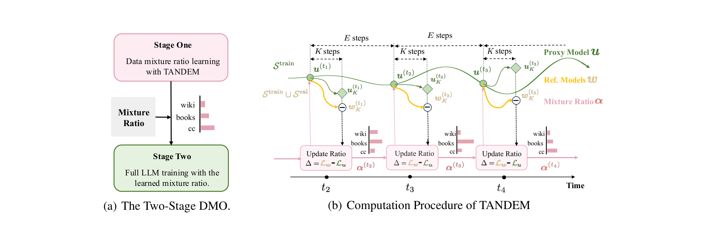
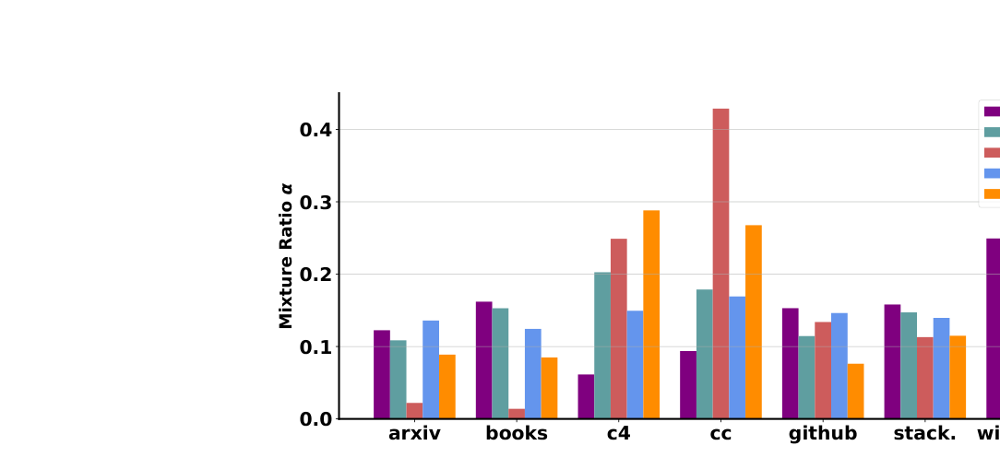
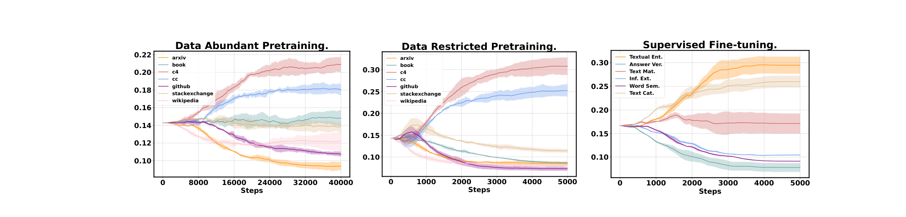
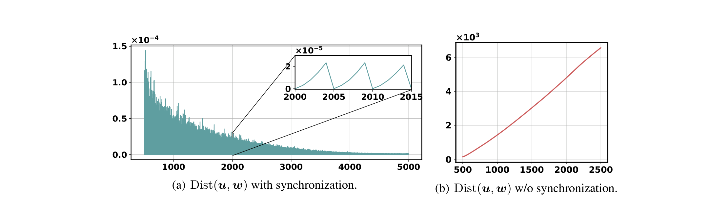

# TANDEM：Bi-Level Data Mixture Optimization with Twin Networks

## 来源

- 文件：`raw/2606.04401v1.pdf`
- 标题：TANDEM: Bi-Level Data Mixture Optimization with Twin Networks
- 团队 / 日期：Jiaxing Wang, Deping Xiang, Jin Xu, Mingyang Yi, Guoqiang Gong, Zicheng Zhang, Haoran Li, Pengzhang Liu, Zhen Chen, Ke Zhang, Ju Fan, Qixiang Jiang（JD.com + Oxford + 人民大学 + 国科大）；NeurIPS 2025；arXiv:2606.04401
- 定位：数据混合优化方法论文，不是模型报告；核心是把 domain reweighting 建模为 bi-level optimization 并用 twin network 求解，是 [DoReMi](doremi.md) 和 DoGE 的直接后继与改进。

## 核心结论

1. **TANDEM 把数据混合优化建模为 bi-level optimization 并简化为 single-level penalized form**：内层优化 model parameters $w$ 使 training loss 最小，外层优化 domain weights $\alpha$ 使 validation loss 最小。通过 Lagrangian penalty 把内层约束转化为惩罚项，用 twin network 求解（§2.2 公式 1-2）。
2. **Twin network = proxy model + 动态 reference model**：proxy model $u$ 只在 training set 上训练，reference model $w$ 在 training + validation set 上训练。两者的 per-domain loss 差 $L_{\text{train}}^m(w) - L_{\text{train}}^m(u)$ 度量了「加入 validation data 后该 domain 的收益」——差值大的 domain 被 upweight（§2.2 公式 5）。
3. **关键创新：$w$ 和 $u$ 每个 episode 同步初始化**：$w_0^{(t)} = u_0^{(t)}$，然后各自训练 $K$ 步（probing），再更新 $\alpha$。这控制了 twin model 间的距离，保证 penalized form 逼近原始 bi-level 问题。DoReMi 的 reference model 是静态的，TANDEM 的 reference model 是动态的（§2.3、Figure 7）。
4. **理论收敛保证**：在 PL 条件和 smoothness 假设下，TANDEM 以 $O(T^{-1/4})$ 速率收敛到一阶驻点（Theorem 1）。DoReMi 无此保证，DoGE 依赖梯度估计导致高方差。
5. **在 data-restricted 和 SFT 场景显著优于 DoReMi/DoGE**：当数据不足（小 domain 被多次重复导致过拟合）或 SFT（每个样本被多次访问导致泛化 gap）时，uniform weighting 不再是最优解，TANDEM 的 reweighting 价值凸显（§2.4、Table 3-5）。

## 算法

> 论文 Figure 1 原文标题："(a) The two-stage data mixture optimization. Optimal mixtures are first learned and then utilized to train the final model. (b) The computation procedure of TANDEM, twined proxy model (green) and reference model (orange) are used to determine the update of the mixture ratio (pink)."（§2.2）

### Bi-level formulation

原始问题（§2.1 公式 1）：

$$\min_{\alpha \in \mathcal{A}} L_{\text{val}}(w^*(\alpha)) \quad \text{s.t.} \quad w^*(\alpha) \in \arg\min_w L_{\text{train}}(\alpha, w)$$

内层：给定 domain weights $\alpha$，优化 model weights $w$ 使 training loss 最小。外层：搜索 $\alpha$ 使 validation loss 最小。

### Penalized single-level form

通过 Lagrangian penalty 转化（§2.2 公式 2）：

$$\min_{\alpha \in \mathcal{A}, w} H_\gamma(\alpha, w) := L_{\text{val}}(w) + \gamma \left( L_{\text{train}}(\alpha, w) - \min_u L_{\text{train}}(\alpha, u) \right)$$

当 $\gamma \to \infty$ 时，penalized form 的解逼近原始 bi-level 问题的解。$u$ 是 proxy model，近似 $\arg\min_w L_{\text{train}}(\alpha, w)$。

### Twin network 更新规则

每个 episode $t$：

1. **同步初始化**：$w_0^{(t)} = u_0^{(t)}$（从当前 proxy model 状态出发）
2. **Probing（$K$ 步）**：
   - Proxy model：$u_{k+1}^{(t)} = u_k^{(t)} - \eta_u \nabla_u L_{\text{train}}(\alpha^{(t)}, u_k^{(t)})$（只在 training set 上）
   - Reference model：$w_{k+1}^{(t)} = w_k^{(t)} - \eta_w (\nabla_w L_{\text{val}}(w_k^{(t)}) + \gamma \nabla_w L_{\text{train}}(\alpha^{(t)}, w_k^{(t)}))$（在 training + validation set 上）
3. **Domain weights 更新**（projected gradient descent）：

$$\alpha^{(t+1)} = \Pi_{\mathcal{A}} \left( \alpha^{(t)} - \eta_\alpha \gamma \left( \underbrace{L_{\text{train}}^{1:M}(\alpha^{(t)}, w_K^{(t)})}_{\text{reference model}} - \underbrace{L_{\text{train}}^{1:M}(\alpha^{(t)}, u_K^{(t)})}_{\text{proxy model}} \right) \right)$$

4. **Free training（$E$ 步）**：proxy model $u$ 在新 $\alpha^{(t+1)}$ 下继续训练 $E$ 步，降低 $\alpha$ 更新频率以省算力。

### 与 DoReMi / DoGE 的 hyper-gradient 对比

论文 Table 1 精确对比了三者的 $\Delta$（domain weights 更新方向）：

| 方法 | Hyper-gradient $\Delta$ |
|---|---|
| DoReMi | $-\max\{L_{\text{train}}(\alpha, u) - L_{\text{train}}(\bar\alpha, \bar w), 0\}$（静态 reference） |
| DoGE | $L_{\text{train}}(\alpha, u - \eta\nabla L_{\text{val}}(u)) - L_{\text{train}}(\alpha, u)$（梯度估计） |
| TANDEM | $L_{\text{train}}(\alpha, w_K) - L_{\text{train}}(\alpha, u_K)$（twin model 差值） |

DoReMi 的 reference model 是静态的（训练完就固定），TANDEM 的 $w$ 每个 episode 重新 probing，更好捕获当前训练状态。DoGE 依赖 per-domain gradient 估计，在高方差场景（如 SFT）不稳定，且内存开销大（需维护 per-domain gradients）。TANDEM 通过增加 probing steps $K$ 降低 $\Delta$ 的方差（Figure 8）。

### 计算复杂度

论文 Table 2 对比各方法（$C$ = 单步训练复杂度，$T$ = $\alpha$ 更新次数，$M$ = domain 数）：

| 方法 | 复杂度 |
|---|---|
| Vanilla Train | $CT$ |
| DoReMi | $3CT$ |
| DoGE | $2CT$（但需 per-domain gradient，实际更慢） |
| TANDEM | $CT + 2CTK + \frac{2}{3}CT$ |

总体：Aioli > Skill-it > DoReMi $\approx$ DoGE $\approx$ TANDEM。

## 实验

### 三个场景

论文定义了三种数据混合优化场景，核心洞察是「数据充足时 uniform 就够，数据受限或 SFT 时 reweighting 才有价值」：

**Proposition 1**：当 $L_{\text{train}}^m \approx L_{\text{val}}^m$（generalization gap 趋零，即数据充足的单 epoch 训练），uniform weighting $\alpha_m = 1/M$ 就是 bi-level 问题的有效解。这解释了为什么 data-abundant 场景下各方法差异不大。

1. **Data-abundant pretraining**：SlimPajama 6B，7 domain，160M GPT 模型，batch 128，512 context，40k steps（每个 domain 数据量足够，不耗尽最小 domain）。
2. **Data-restricted pretraining**：SlimPajama 300M 采样版，160M / 410M / 1B GPT 模型，5000 steps（小 domain 如 Arxiv/Books/Wikipedia 被多次访问）。
3. **Supervised fine-tuning**：Natural Instructions 6 大类 99 任务，Qwen2-500M，5000 steps，每样本平均曝光 1.15 次。

### 关键结果

**Data-abundant 场景**（Table 3 Upper）：各方法差异极小（avg perplexity 25.4-28.3），TANDEM 与 Uniform 基本持平，验证了 Proposition 1。

**Data-restricted 场景**（Table 3 Lower，核心结果）：

| 方法 | Avg Perplexity ↓ |
|---|---|
| Uniform | 31.53 |
| DoReMi | 36.91 |
| DoGE | 30.10 |
| Skill-It | 29.24 |
| Aioli | 30.67 |
| **TANDEM** | **28.07** |

TANDEM 比 Uniform 改善 3.46，比最强 baseline Skill-It 改善 1.17。DoReMi 在此场景反而恶化（36.91 > 31.53），因为 DoReMi 的静态 reference model 无法适应数据受限时的训练动态。

**跨尺度**（Table 4）：TANDEM 在 160M / 410M / 1B 上一致最优（28.07 / 25.00 / 24.35），且计算时间与 Skill-It 相当（26min / 57min / 77min），远快于 DoGE（65min / 172min）。

**SFT 场景**（Table 5）：TANDEM 在 6 类任务上 avg metric 83.3，优于 Uniform（82.5）和 Aioli（82.7）。test loss 0.208，远低于 Uniform 的 0.231。

### TANDEM 学到的 domain weights

在 data-restricted 场景，TANDEM upweight 了小 domain（Arxiv 3.4%→8.9%、Books 3.7%→8.5%、StackExchange 2.8%→11.5%、Wikipedia 3.1%→7.9%），防止它们被大 domain 淹没同时避免过拟合。大 domain（CommonCrawl、C4）仍占主导但比例下降。

> 论文 Figure 5 原文标题："Mixture ratio learned by different methods."（§4.2）

> 论文 Figure 3 原文标题："Step-wise data mixture ratio evolution under three scenarios."（§4.1）

### 关键消融

**Synchronization 的作用**（Figure 7）：有同步时 $\text{Dist}(u, w)$ 控制在 $1.5 \times 10^{-4}$ 以下并逐渐收缩；无同步时距离爆炸。同步是 penalized form 逼近原始 bi-level 问题的关键。

> 论文 Figure 7 原文标题："The Dist(u, w) evolution comparison during DMO with and without u, w synchronization."（§4.3）

**Probing steps $K$ 的作用**（Figure 8）：$K$ 越大，hyper-gradient $\Delta$ 的方差越小。DoGE 的 $\Delta$ 方差最大（直接依赖噪声梯度估计），TANDEM $K=5$ 时方差显著降低。SFT 场景梯度方差比 pretraining 大（Figure 2），所以 $K$ 的作用在 SFT 更重要。

## 局限与开放问题

- **Data-abundant 场景增益有限**：Proposition 1 本身就说明了 uniform weighting 在数据充足时已近最优，TANDEM 的优势主要体现在 data-restricted 和 SFT。论文坦诚这一点而非回避。
- **Penalty 参数 $\gamma$ 的选择**：理论要求 $\gamma \to \infty$，实践中固定 $\gamma = 1$。如何自适应调节 $\gamma$ 是开放问题。
- **Probing 计算 overhead**：每个 episode 需要 $K$ 步 twin model probing + $E$ 步 free training，虽比 DoGE 快但比 Vanilla Train 贵约 $2K+1$ 倍。
- **与 RegMix 的关系未讨论**：RegMix 的回归路线与 bi-level 路线是正交的，论文未对比。

## 与 DoReMi 的关系

TANDEM 是 [DoReMi](doremi.md) 的直接改进。Table 1 的 hyper-gradient 对比是关键：DoReMi 用静态 reference model 的 excess loss，TANDEM 用动态 twin model 的 loss 差。DoReMi 的 reference model 训练完就固定，无法反映 proxy model 训练过程中的状态变化；TANDEM 每个 episode 重新同步并 probing，更好捕获当前训练状态。此外，TANDEM 有 $O(T^{-1/4})$ 收敛保证而 DoReMi 无理论保证。

在 data-restricted 场景，DoReMi 反而恶化（36.91 vs Uniform 31.53），TANDEM 显著改善（28.07），说明动态 reference model 在数据受限时至关重要。

## 相关页面

- [DoReMi](doremi.md) — Group DRO 路线，TANDEM 的直接前作
- [数据混合优化](../concepts/data-mixture-optimization.md) — 方法谱系总览
- [Qwen3 技术报告](../sources/qwen3.md) — instance-level data mixture 的产业实践，是 domain-level reweighting 向更细粒度的演进
