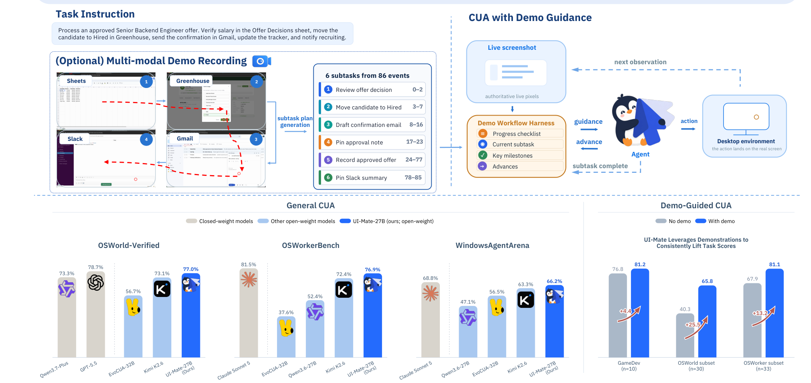
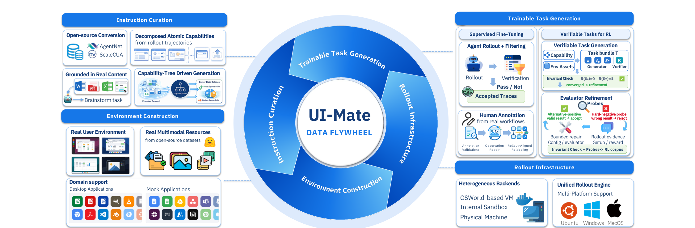
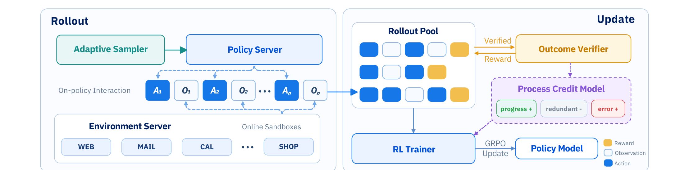
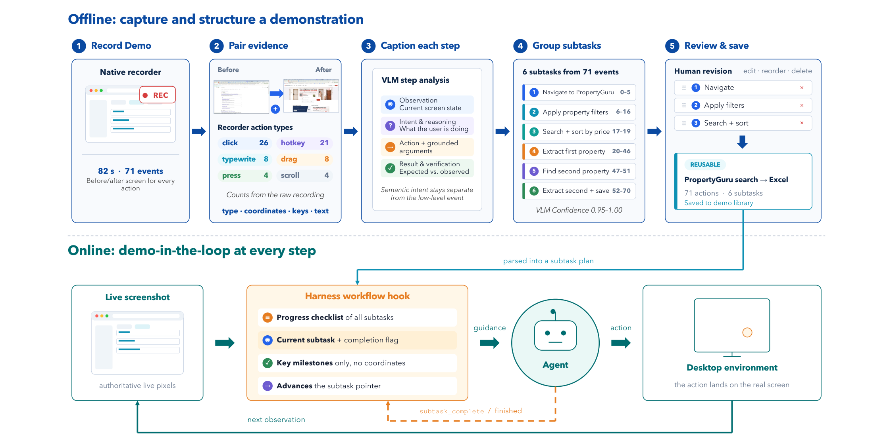
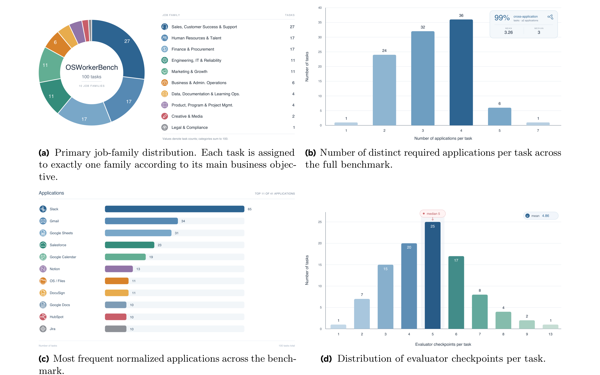

# UI-Mate 技术报告

## 来源

- **PDF**：`raw/2608.15930v1.pdf`
- **标题**：UI-Mate: Advancing Open-Weight Foundation GUI Agents with In-Context Demonstrations
- **日期**：2026-08-18（arXiv v1：2026-08-16）
- **团队**：Tencent HY Frontier Team；Project Lead Zilong Huang，Co-Lead Longxu Dou / Zihang Jiang / Lei Ke / Weixian Lei / Yingchen Yu，Supervisor Leowei Liang
- **arXiv**：[2608.15930](https://arxiv.org/abs/2608.15930)
- **项目页**：[ui-mate.github.io](https://ui-mate.github.io/)（含 macOS Apple Silicon 应用说明）
- **模型页**：[UI-Mate](../models/ui-mate.md)

未把 Qwen3.6 写成独立模型页：27B 基座在本 wiki 中尚无一手来源；9B 基座是 [Qwen3.5](../models/qwen3.5.md) 家族的 dense 变体。

## 核心结论

UI-Mate 把 foundation GUI agent 的瓶颈拆成两层（原文确证，§1）：

1. **训练瓶颈**：可学的不是静态轨迹，而是可实例化环境 + 可执行动作 + 可验证结果；规模化采集会偏向短、单应用、便宜实例化的任务。
2. **交互瓶颈**：用户指令通常只说目标，不说自家工具、模板和命名约定；平均成功率会掩盖「偶尔猜对」与「每次按同一套程序做对」的差别。

对应解法是环境接地训练栈 + DemoCUA。DemoCUA 把人或强 agent 的录屏蒸馏成 **subtask-level workflow**，而不是逐动作回放：在线截图有否决权，示范只提供当前子任务的目标、完成判据和坐标无关的里程碑。

Headline 数字（原文确证，Abstract / Table 1–3 / Table 5）：

| 设置 | UI-Mate-27B | 对照 |
| --- | --- | --- |
| OSWorld-Verified | 77.0% | 开源最强；Kimi-K2.6 73.1%，ScaleCUA-Qwen3.5 68.7%；闭源 GPT-5.5 78.7 / Claude Sonnet 5 81.2 |
| WindowsAgentArena | 66.2% | 开源最强；Kimi-K2.6 63.3%；相对 Qwen3.6-27B 基座 +19.1 |
| OSWorkerBench 指令-only | 41.0% 严格成功 / 76.9% 进度 | 相对基座 +17.7 / +24.5；Kimi-K2.6 40.67 / 72.42 |
| 33-task self-demo | 严格成功 17.2%→35.4%，进度 67.9%→81.1% | 同任务、同环境、同预算、同 verifier，只改示范是否可见 |

作者同时写明：表中比较是端到端系统分，不是已隔离的规模或 specialization 因果效应（原文确证，§7.1.2）。self-demo 测的是「同一任务的执行路径能否被用上」，不是跨任务程序迁移；45-task variant-demo 的系统汇总留给未来工作（原文确证，§6、§10）。

> Figure 1: UI-Mate combines strong general computer-use capabilities with demonstration-guided execution.（§1 / Figure 1）

## 架构与训练

### 任务形式

一般 computer-use 是 `(x, E)`：自然语言指令 + 可直接操作的桌面环境。每一步观察是上一动作之后的截图；一次模型响应是一个 **decision turn**，其中可含多个连续动作，中间没有新观察。历史 `ht` 被截成有界窗口。成败由检查终态的可执行 verifier 给出 `R(τ) ∈ {0,1}`（原文确证，§2.1）。

示范引导时，示范 `d` 被切成有序子任务 `(ℓn, vn, un)`：目标、可检查完成判据、不含像素坐标的动作描述。harness 用指针 `nt` 只注入当前子任务细节，并扩展动作 `subtask_complete`。`gt` 是 prior 不是 target：正确动作由 live `ot` 决定（原文确证，§2.1）。

### 数据飞轮

> Figure 2: Overview of the UI-Mate data flywheel.（§3 / Figure 2）

指令来自四路互补源：开源 CUA 数据集（AgentNet / ScaleCUA）、失败 rollout 拆出的原子子任务、真实文档/表格/网站接地的长工作流、以及从应用规格长出的 capability tree（原文确证，§3.1）。

环境构造把指令自动变成可运行初始态：LLM 识别所需文件并写 setup code，再随机化壁纸、布局和应用设置。合成文件偏短、同质、含占位符，因此优先检索真实开源文档/幻灯片/表格/音视频。办公室任务上，检索到的真实资源大约是合成文件的 **6×**，轨迹平均步数 58.4 vs 38.5（+51.7%）。作者据此把「难度在环境里，不在指令里」写成数据构造的主目标（原文确证，§3.2、§7.4.1）。

Rollout 走统一接口，覆盖 Ubuntu / Windows / macOS，后端含 OSWorld VM、内部云 VM 沙箱和物理机。过滤分两级：先由多模态 judge 丢掉不可行、初始态已满足、或缺观察的任务；再按指令抽取可独立验证的 deliverable，全程证据不足的轨迹不进监督（原文确证，§3.3）。

Capability tree 把任务标到 application / coarse capability / fine-grained operation 三层，并单独开跨应用域。再平衡看目标覆盖、密度、rollout 成功率和过滤拒绝率；任务长度是独立采样轴，避免短任务掩盖长程缺口。树引导相对无能力感知采样，把 Multi-App 表现抬了 **15.5 pp**——作者标为相关而非已隔离因果（原文确证，§3.4、§7.4.1）。

人工轨迹补合成偏差：先修观察时序（光标泄漏用更早帧，渲染未完成用更晚帧），再用 teacher 按 rollout 协议补 reasoning，但 **人工动作参数保持固定**（原文确证，§3.5）。

### 可验证 RL 任务

RLVR 任务在 `(x, E)` 之外固定初始态 `E0`、参考完成态 `E⋆` 和 verifier `R`，并满足执行不变量 `R(E0)=0, R(E⋆)=1`（原文确证，§3.6 / Eq. 9）。生成器与判别器解耦（引用 CUA-Gym）：generator 造配置和参考完成，verifier 只看规格和结果态。不变量只保证内部一致。LLM 审计发现通过该过滤的 evaluator 仍有约 **18%** 与指令不对齐：过严匹配 40%、语义空断言 23%、打到错误对象 19%。因此 refinement 用 hard-negative（应拒）和 alternative-positive（应收）探针，再加上 rollout 反馈的有界修复；修不好的不进 RL 语料。作者把绑定约束写成 **reward 是否等于指令**，而不是产物能不能被检查（原文确证，§3.6.2、§7.4.1）。

## 后训练

两阶段：SFT → 在线 agentic RL。SFT 在单 decision turn 上做 next-token loss，上下文 `(x, ht, ot)` 不进监督；混合物覆盖原子操作、单应用和跨应用，并含有/无显式中间推理的轨迹（原文确证，§4.1–4.2）。

> Figure 4: Agentic RL system of UI-Mate.（§4.3 / Figure 4）

RL 用 GRPO 做组内相对优势，全组同结局的任务丢弃。GUI 特有的三条 credit 修正（原文确证，§4.3.2–4.3.3）：

- **Decision-turn centering**：失败轨迹往往更长；按 turn 数加权的组均值做基线，组内只减均值、不除标准差，避免近均匀组把信号放大。
- **可选 PCM**：teacher 从成功轨迹抽里程碑，给失败轨迹标 progress / causal error / recovery / redundancy，把同一 `Ri` 重分配到关键步。作者报告 PCM 与自适应课程主要加快收敛（可比最终分用不到一半 update），不稳定抬最终成功率（原文确证，§7.4.2）。
- **Token-level 归一化**：失败 turn 的 thinking 更长，同一优势会被更多 token 重复。

异步更新：不截断轨迹，组内共享同一任务配置和策略快照。train–rollout mismatch 用 IcePop（拒异常 token 比）+ SeqClip（整段几何平均比）过滤，再叠加 PPO clip。自适应课程把 rollout 预算分给弱应用域，只重分配固定 RL 语料，不改任务构造（原文确证，§4.3.3–4.3.4）。

训练发现（原文确证，§7.4.2）：

- **Historical reasoning** 只在评测打开：SFT 模型 +3.43 pp，无历史推理训出的 RL 模型 +2.27 pp；SFT 阶段写入后再评测，长程跨应用大约再 +2.85 pp。放进 RL 训练会加速熵塌缩、限制探索，评测反而变差。
- 9B 更依赖显式 reasoning 监督、更干净的 evaluator，以及跨阶段反复暴露同一任务分布；27B 可以混用有/无 reasoning 轨迹。

## DemoCUA

> Figure 5: Demonstration representation.（§5.1 / Figure 5）

训练样本把 workflow 快照钉在**第一个 user turn**，后续 turn 只含截图，格式与无示范基线相同。为防「抄下一步」捷径，训练构造三类关系：full-alignment / partial-misalignment / irrelevance，且即便对齐也故意省略 focus click、滚动、关弹窗等中间动作。推理时则给完整动作序列、不再做 key-action 抽取——训练少给、推理多给是刻意的 train–test mismatch（原文确证，§5.2–5.3、§7.4.3）。

长轨迹用 proactive folding + reactive truncation。UI-Mate-27B 上下文 128K（其中 64K 留给生成），保留最多 40 个近期文本步和 5 张最近截图，估计用量到输入预算 60% 时折叠。当前限制：workflow 放在上下文开头，每次子任务更新都破坏共享前缀，KV-cache 无法跨步复用（原文确证，§5.3）。

## 评测要点

### 指令-only 公开基准

OSWorld-Verified 走官方协议。9B 与 27B 的 OS 子项同为 91.7%；27B 相对 9B 的 +10.8 主要来自 Office / Daily / Professional / Workflow，而不是原子 OS 控制（原文确证，§7.2.1）。WindowsAgentArena 上 9B 相对 Qwen3.5-9B 基座 +24.2，相对同基座的 ScaleCUA-Qwen3.5-9B +23.6（原文确证，§7.2.2 / Table 3）。

OSWorkerBench 指令-only（原文确证，Table 2；200 步预算）：

| 模型 | 进度（100） | Multi-App 严格（49） | Long-Memory 严格（67） | 总体严格（100） |
| --- | --- | --- | --- | --- |
| GPT-5.6-Sol | 87.67 | 65.31 | 67.16 | 71.00 |
| Claude Opus 4.8 | 81.54 | 53.06 | 55.22 | 62.00 |
| Kimi-K2.6 | 72.42 | 18.37 | 25.37 | 40.67 |
| UI-Mate-27B | 76.86 | 28.57 | 32.84 | 41.00 |
| Qwen3.6-27B | 52.35 | 7.48 | 12.94 | 23.33 |
| UI-Mate-9B | 66.55 | 16.33 | 25.37 | 34.00 |
| Qwen3.5-9B | 18.11 | 2.04 | 1.49 | 5.05 |

27B 进度比严格成功高 35.86 pp：主要剩余失败是晚段漏字段或漏最后通知，而不是到不了界面（原文确证，§7.2.3）。Kimi-K2.6 中位 68 decision turn、UI-Mate-27B 中位 71；GPT-5.6-Sol 更短，审计显示平均每 turn 3.83 条动作记录，近一半 turn 含多个非 wait UI 动作，因此短轨迹很大程度是 action batching，不是工作流更短（原文确证，§7.2.4）。

### OSWorkerBench

> Figure 9: OSWorkerBench dataset overview.（§6.3 / Figure 9）

100 个长程办公任务，41 个归一化应用，10 个职位族。67 个 Long-Memory、49 个 Multi-App，两标签独立、可重叠。88 个任务用企业应用后端的状态 evaluator，12 个用表格/图像/复合文档的任务特定 evaluator。严格成功要求全部终态条件；进度是 checkpoint 加权分。Long-Memory / Multi-App 子集只报严格成功，因为标签可能只对应部分 checkpoint（原文确证，§6.4）。

示范资源是两套不同集合，不是 100 任务的划分：33 self-demo（同任务强 agent 成功 rollout，去像素坐标）用于本报告的定量 DemoCUA；45 variant-demo（相关但非同一任务的真人录屏）测程序迁移。成对协议固定指令、初始环境、预算和 verifier，只改示范是否可见（原文确证，§6）。

### Self-demo 定量结果

| 集合 | 无示范 | 有示范 | 增益 |
| --- | --- | --- | --- |
| GameDev（10，五次均值） | 76.76 | 81.15 | +4.39；轨迹 303.6→253.1 步 |
| OSWorld-Subset-30（五次） | 40.27 | 65.75 | +25.48；18 升 / 8 平 / 4 降 |
| OSWorker-Subset-33（三次） | 进度 67.85 / 严格 17.17 | 81.14 / 35.35 | +13.29 / +18.18；轨迹 173.3→216.0 步 |

OSWorker 变长被解释为补全重复/分支子任务，而不是更低效：无示范时常提前 `finished`（原文确证，§7.3.4、Table 16）。OSWorld-Subset 的选取标准是「UI-Mate-27B 无示范失败、但更强参考 agent 能解」——增益因此带选择偏差，应读成「示范能否补上已证明可执行的程序」，不是随机 30 题的无偏 ATE（原文确证，§7.3.1）。四个负迁移例子说明示范与当前界面冲突时可能有害。

## 待追问

- 项目页提供 macOS 应用，但报告未给出 Hugging Face 权重、许可证和 9B/27B 的视觉编码器是否改过 Qwen 基座。
- wiki 目前没有独立的 Qwen3.6 模型页；27B 的 hybrid/dense 细节不能从本报告升级为已核实架构。
- 45-task variant-demo 只有 10 题试点：把示范段复制到目标实体数后净正向，但作者认为不够稳，未进主表（§10）。
- OSWorld-Subset 按「本模型失败」筛选，self-demo 又来自更强 agent，不能外推到任意任务或真人示范。
- Historical reasoning 与 RL 探索的冲突只有定性熵塌缩描述，没有给出可复现的熵曲线或替代算法。
- IcePop + SeqClip 的过滤比例、以及 PCM 开启时的具体 `b / wmax` 未披露。
- Workflow 钉在上下文开头导致 KV-cache 无法复用，作者标为 future work，没有给出改到末尾后的速度数字。

## 相关页面

- 模型：[UI-Mate](../models/ui-mate.md)
- 相邻 GUI：[Xiaomi-GUI-0 技术报告](xiaomi-gui-0.md)（移动真机闭环，对照本报告的桌面 CUA + 示范协议）
- 基座：[Qwen3.5](../models/qwen3.5.md)（9B）
- 概念：[Agentic engineering](../concepts/agentic-engineering.md)、[Agentic 模型的后训练](../concepts/post-training-for-agentic-models.md)、[Agentic 评测体系](../concepts/agentic-evaluation-benchmarks.md)
- 异步 / 组相对 RL：[异步 Agent RL](../concepts/asynchronous-agent-rl.md)、[Group Sequence Policy Optimization](group-sequence-policy-optimization.md)
- IcePop 前作对照：[Ling and Ring 2.6 技术报告](ling-2.6.md)
