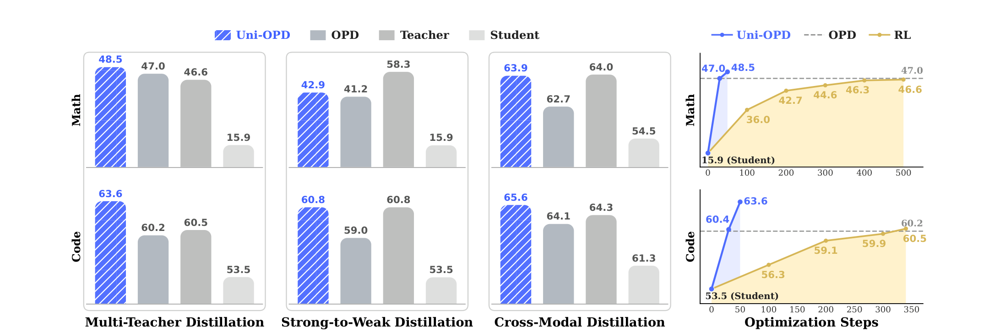
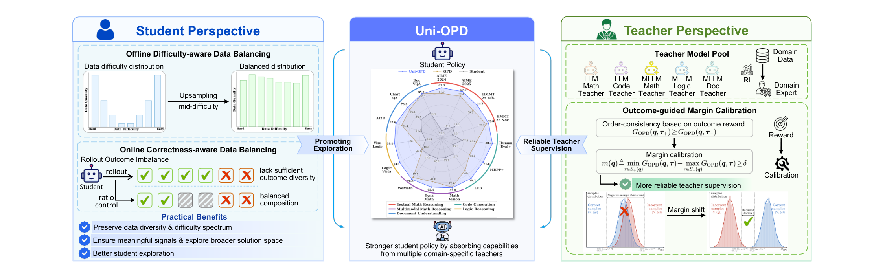
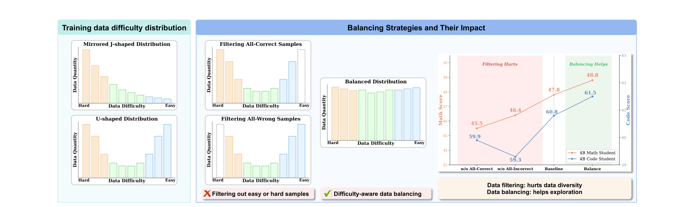
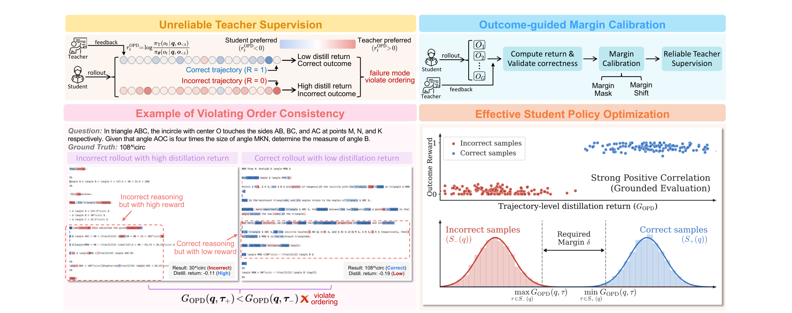

# Uni-OPD：双视角的在线蒸馏配方

## 来源

- 原始 PDF：[`raw/2605.03677v2.pdf`](../../raw/2605.03677v2.pdf)
- 标题：Uni-OPD: Unifying On-Policy Distillation with a Dual-Perspective Recipe
- 版本 / 日期：arXiv:2605.03677v2，2026-07-06（v1 2026-05-05），38 页。页眉日期写 July 7, 2026
- 作者：Wenjin Hou、Yue Zhang、Zhenglin Zhou、Yi Yang、Fei Wu、Hehe Fan（浙江大学）；Shangpin Peng、Zhuotao Tian（深圳 Loop Area Institute）；Weinong Wang、Zheng Ruan、Mingqi Gao、Yifei Chen、Kaiqi Wang、Hongming Yang、Chengquan Zhang、Han Hu（腾讯 LLM 部门）。Hou 与 Peng 共同一作，实习于腾讯。通讯 Hehe Fan
- 代码：脚注 <https://github.com/WenjinHou/Uni-OPD>。结尾仍写权重、数据和脚本在发表后开源
- 模型链接：**未建模型页**。学生是 Qwen3-4B / 1.7B 和 Qwen3-VL-4B / 2B-Instruct。教师是作者用 GRPO 训出的域专家，或现成的 Qwen3-30B-A3B-Instruct-2507
- 实现：建在 [Miles](miles-v0-1.md) 上，Megatron 训练、SGLang rollout。教师是独立 SGLang 服务，只回 prefill 的 token log-prob。一张任务表把每条 prompt 路由到对应域的教师

## 为什么这篇在 wiki 里独占一席

它把多教师 OPD 拆成两件可以单独坏掉的事：学生 rollout 里缺少「有信息量」的状态，以及教师的 token 级打分加总之后和最终对错反序。学生侧不删全对或全错题，而是把中间难度上采样，并在训练时把一批 rollout 的对错比拉回 1:1。教师侧不改 reverse KL 的形式，只在轨迹平均回报上做 margin shift，让正确轨迹的平均回报比错误轨迹至少高出一个 \(\delta\)。

> Figure 1. Overall performance comparisons and convergence behavior. … Uni-OPD consistently outperforms OPD and converges faster than RL.（`§1`）

## 核心结论

1. **目标是采样 token 上的 reverse KL。** 公式 1 写成最小化 \(D_{\mathrm{KL}}(\pi_\theta\|\pi_T)\)。给出的梯度是学生轨迹上的 \((\log\pi_\theta-\log\pi_T)\nabla\log\pi_\theta\)，token 奖励 \(r^{\mathrm{OPD}}_t=\log\pi_T-\log\pi_\theta\)。这是 sampled-token reverse KL，不是 full-vocab。多教师公式 4 是加权求和；实现不是把多个教师的 logits 混在一起，而是每条 prompt 只问一个域教师。
2. **轨迹回报是 token 奖励的长度平均** \(G_{\mathrm{OPD}}\)。\(G>0\) 表示教师平均比学生更看好这条轨迹。顺序一致的要求是：同一题上，每条答对的轨迹回报不低于每条答错的。最坏间隔是最低的正确回报减去最高的错误回报。正文用这个 MinMax 间隔写公式 9–11。
3. **主实验没有用正文那个 MinMax + Lift。** 附录 Table C.2：间隔用组内 **Mean**（正确均值减错误均值）。文本域方向是 Spread、\(\delta=0.4\)；多模态方向是 Lift、\(\delta=0\)。Spread 是把缺口一半加到正确轨迹、一半从错误轨迹减去。\(\delta=0\) 只要求均值不反序。算法在全对或全错的组上不做校准，因为间隔没有定义。
4. **同尺寸 4B 多教师上，Uni-OPD 高于他们复现的 OPD，也高于自训的域 RL teacher。** 数学均分 OPD 47.0、Uni-OPD 48.5，教师 46.6。代码 OPD 60.2、Uni-OPD 63.6，教师 60.5。正文把 +1.5 和 +3.4 写成「1.5% 和 3.4%」，表上是绝对分。
5. **强到弱没有在数学上越过 30B teacher。** Qwen3-30B-A3B-Instruct-2507 的数学均分是 58.3。4B 学生从 OPD 的 41.2 到 42.9，1.7B 从 23.8 到 25.0。4B 代码均分 60.8，和这位 teacher 的 60.8 相同。AIME 2024 上 4B 的 Uni-OPD 是 55.9，低于 OPD 的 56.5；均分靠 AIME 2025 的 50.2 对 46.4 拉上来。

## 方法

> Figure 2. Overview of the Uni-OPD framework. (Left) Offline difficulty-aware and online correctness-aware data balancing promote student exploration. (Right) Outcome-guided margin calibration mechanism improves the reliability of teacher supervision.（`§3`）

### 学生侧：两层均衡

离线：用学生自己对每题采 \(N=8\) 条（temperature 1.0、top-p 0.95、top-k 50、最长 16384），用通过数当难度。U 形分布上采样 8 次里对 1–7 次的题；镜像 J 形则上采样对 1–8 次的题，用来压过「全容易」的长尾。不把全对或全错整段删掉。

> Figure 3. Data difficulty distribution and its impact on OPD performance. … our difficulty-balancing strategy upsamples mid-difficulty samples … and empirically outperforms filtering.（`§3.3`）

图上这四档不是 Table 1 的主表。代码基线 60.8 对不上多教师 OPD 的 60.2。

在线：目标是一批里正确轨迹约占一半。Table C.2 写 Correct/Incorrect ratio 1:1、Sample filter。附录允许一个容差 \(\epsilon\)，数值没有给。全对或全错的组没有对比，margin 校准用不上。Figure 4 是另一组比例扫描：只保留正确轨迹时数学 40.9、代码 57.3；八根柱里数学最高 43.8、代码最高 60.6。横轴从左到右是 Only Correct、Baseline、0.5、0.75、1.0、1.2、1.5、2.0 时，数学最高落在 1.0，代码最高落在 1.2。主实验仍固定 1:1。这组绝对分也低于 Table 1。

### 教师侧：把反序的回报拉开

> Figure 5. Demonstration of unreliable teacher supervision and outcome-guided margin calibration mechanism. … Our method uses outcome rewards as a global anchor to calibrate returns through margin-based adjustment.（`§3.4`）

附录 B.3 用 Qwen3-4B 学生、30B-A3B teacher、数学训练题统计：\(N=4\) 时 24.2% 的题反序，只有 10.4% 既混合又顺序一致；全对 26.6%、全错 38.9%。\(N=8\) 时反序升到 41.2%，顺序一致只剩 4.9%。成对比较里，错误轨迹回报高于正确轨迹的比例大约 45%，几乎不随 \(N\) 变。全体轨迹的平均 \(G_{\mathrm{OPD}}\) 是正确 −0.313、错误 −0.324，两边都是负的，分布叠在一起。靠近 0 的错误轨迹被写成高温解码下的重复、没有正常结束。

两种修法：

- **Margin mask**：贪心丢掉最伤间隔的那一条，直到间隔达到 \(\delta\)，或保留比例碰到 \(\rho\)。丢掉的轨迹回报乘 0。主实验不用这条。
- **Margin shift**：不丢样本。缺口 \(\lambda(q)=\delta-m(q)\) 加到整条轨迹的回报上，再广播成每个 token 奖励的平移。Table 6 把两条单独接到单教师 OPD 上：数学均分从 44.6 到 mask 47.7、shift 48.1。主实验用 shift。

Table 6 的 48.1 和附录 Table E.6 里 \(N=16\) 的 48.2 是同一组四项（62.7、56.3、34.4、39.2），均分四舍五入差 0.1。

## 评测要点

文本评测：temperature 1.0、top-p 1.0、最长 16384、seed 42、vLLM。数学每题 32 条，代码每题 4 条。正文把「采样解的平均准确率」叫做 pass@1，并另外写出无偏 pass@k。主表是平均准确率，不是「32 条里至少对一次」。多模态走 LMMs-Eval 的官方协议，0-shot。

教师 GRPO（Table C.1）：16×H20，学习率 \(1\times10^{-6}\)，每题 8 条，最长回复 16384，不用 KL。文本数学 500 step、代码 300 step。多模态数学 / 逻辑 / 文档是 300 / 300 / 160 step。OPD 写明继承学习率、优化器和长度，另改成 batch 64、每题 16 条。学生 OPD 的卡数和总 step 没有另表；Figure 1 的 RL 曲线横轴数学到 500、代码到 350。

训练题：DeepMath 难度 ≥6 的 57K 数学题，Eurus-2-RL-Data 代码子集 25.3K。多模态来自 OpenMMReasoner：数学 14.8K、逻辑 14.8K、文档 14.6K。验证器分别是 DeepMath、PRIME、OpenMMReasoner。通用超参写明对齐 [ExOPD](exopd.md) 的 G-OPD 仓库，所以表里的 ExOPD 行是这篇的复现，不是 ExOPD 原文主表。

### 同尺寸 LLM

Table 1，学生 Qwen3-4B。教师是同尺寸域 RL。均分是域内算术平均。

| 设定 | 方法 | 数学均分 | 代码均分 |
| --- | --- | ---: | ---: |
| — | Student | 15.9 | 53.5 |
| — | Teacher (RL) | 46.6 | 60.5 |
| 单教师 | OPD | 44.6 | 59.0 |
| 单教师 | ExOPD | 48.0 | 62.1 |
| 单教师 | Uni-OPD | **48.7** | **63.2** |
| 多教师 | OPD | 47.0 | 60.2 |
| 多教师 | ExOPD | 47.7 | 62.0 |
| 多教师 | Uni-OPD | **48.5** | **63.6** |

单教师数学 48.7、代码 63.2，都高于对应的 4B RL teacher。多教师代码里 LiveCodeBench 从 OPD 的 23.4 到 30.1，学生基线是 17.7，代码 teacher 是 26.6。

附录 Table E.1 把学生换成 1.7B、教师仍是 4B RL。单教师均分 OPD 28.8 / 52.5，Uni-OPD 29.9 / 53.7。多教师 28.3 / 52.7 到 29.6 / 53.8。离 4B teacher 的 46.6 / 60.5 仍远。AIME 2025 单教师是 35.1 对 OPD 的 35.4。

### 多模态与跨模态

Table 2，学生 Qwen3-VL-4B-Instruct。单教师均分：数学 OPD 63.3、Uni-OPD 63.9（teacher 64.0）；逻辑 49.6 到 51.7（teacher 51.2）；文档 83.6 到 83.7（teacher 83.9）。多教师时普通 OPD 的数学掉到 57.9，Uni-OPD 回到 61.0，仍低于单教师的 63.9。文档多教师 83.4 到 83.9。InfoVQA 单教师是 81.2，低于 OPD 的 81.4。

Table 4 的跨模态学生仍是这只 VL-4B。一个教师在纯文本代码上做 RL，一个在多模态数学上做 RL。代码均分 64.1 到 65.6（代码 teacher 64.3），多模态数学 62.7 到 63.9（数学 teacher 64.0）。LCB 从 38.6 到 41.3。

附录 Table E.2 是 VL-2B、教师为 VL-4B 域 RL。单教师三域均分 OPD 47.9 / 41.2 / 76.8，Uni-OPD 48.6 / 43.2 / 77.2。多教师数学只有 43.9，对 OPD 的 41.0，都远低于单教师。

### 强到弱

Table 3。一位 Qwen3-30B-A3B-Instruct-2507 同时给数学和代码题打分。作者把它也叫成多教师场景，教师权重只有一份。

| 学生 | 方法 | 数学均分 | 代码均分 |
| --- | --- | ---: | ---: |
| 30B teacher | — | 58.3 | 60.8 |
| 4B | OPD | 41.2 | 59.0 |
| 4B | Uni-OPD | 42.9 | 60.8 |
| 1.7B | OPD | 23.8 | 49.1 |
| 1.7B | Uni-OPD | 25.0 | 52.7 |

### 消融

Table 5 的「Qwen3-4B RL Teacher」块数字就是 Table 1 的多教师行，不是单教师。去掉离线均衡后数学 / 代码 47.5 / 62.3，去掉在线均衡 47.8 / 62.6，去掉 margin 47.3 / 61.2，完整 Uni-OPD 48.5 / 63.6。30B 那一块与 Table 3 的 4B 行一致：去掉 margin 后数学 42.0、代码 59.6，完整是 42.9 / 60.8。

Table E.6 把全局 batch 固定成 \(N\times\mathrm{bs}=1024\)。普通 OPD 的数学均分在 \(N=4\) 到 32 之间是 44.3–44.6。加上 margin shift 后，\(N=4\) 为 45.3，\(N=16\) 为 48.2，\(N=32\) 为 48.1。默认 \(N=16\)。

## 与现有 wiki 页的关系

- **[ExOPD](exopd.md)**：同属按域路由、sampled-token reverse KL。ExOPD 用 \(\lambda>1\) 把隐式奖励放大。这里不改 \(\lambda\)，改的是数据组成和轨迹回报的间隔。表里的 ExOPD 行是这篇按 G-OPD 仓库复现的，不能和 ExOPD 原文的 4B 主表相减。
- **[OPD 综述](opd-survey.md)** v4 把它放在训练动态 / 课程轴，表里写成 Dual-perspective data balancing。综述后文用「不会做」和「做错但看不出来」来转述难度。原文学生侧是 8 次通过数的上采样和 1:1 对错比，教师侧是 0/1 结果与 \(G_{\mathrm{OPD}}\) 的顺序。
- **[f-OPD](f-opd.md)** 处理异步缓冲的新鲜度。这篇假设打分发生在当前 rollout 上，修的是回报和结果反序。
- **[Thinking Machines Lab 博客](thinking-machines-on-policy-distillation.md)** 被引成 reverse KL 的来源。这里的估计器与博客的 per-token 形式同族。
- **[Miles](miles-v0-1.md)** 是训练底座。served teacher、按任务路由，和 Miles 文档里的接口一致。分数是这篇自己的实验。

## 待追问

- **现有材料待核**：正文公式 9–11 是 MinMax 间隔和 Lift。Table C.2 的主实验是 Mean，文本域 Spread、\(\delta=0.4\)，多模态 Lift、\(\delta=0\)。两套不能当成同一个默认。
- **现有材料待核**：正文把 +1.5 和 +3.4 写成百分数。表上是 47.0→48.5 和 60.2→63.6 的绝对分。
- **现有材料待核**：主表叫 pass@1，定义是 32 条或 4 条的平均准确率。无偏 pass@k 另有公式，主表没有报。
- **需实验或作者披露**：在线容差 \(\epsilon\)、mask 的保留比例 \(\rho\)、OPD 学生训练的 step 数和 GPU 数。教师 RL 的 16×H20 没有自动继承成学生 OPD 的硬件。
- **需实验或作者披露**：多教师时同一条 prompt 若同时属于两域，路由表怎么拆。公式 4 的 \(w_i\) 没有数值。
- **需实验或作者披露**：Figure 3 的四档和 Figure 4 的比例扫描都低于 Table 1。它们和完整配方差在哪一组开关，正文没有逐项对齐。

## 相关页面

- [On-Policy Distillation 跨报告对比](../comparisons/on-policy-distillation.md)
- [Multi-Teacher On-Policy Distillation](../concepts/multi-teacher-on-policy-distillation.md)
- [ExOPD](exopd.md)
- [OPD 综述](opd-survey.md)
- [f-OPD](f-opd.md)
- [Miles v0.1](miles-v0-1.md)
- [Thinking Machines Lab On-Policy Distillation 博客](thinking-machines-on-policy-distillation.md)
