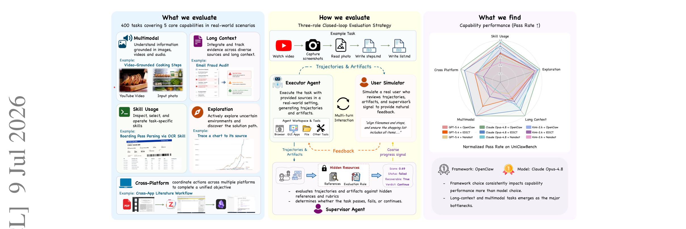

# UniClawBench

## 来源

- **PDF**：`raw/2607.08768v1.pdf`
- **标题**：UniClawBench: A Universal Benchmark for Proactive Agents on Real-World Tasks
- **日期**：2026-07-09（arXiv v1）
- **团队**：Zhekai Chen, Chengqi Duan, Kaiyue Sun 等，HKU MMLab + Meituan
- **arXiv**：[2607.08768](https://arxiv.org/abs/2607.08768v1)
- **代码**：[github.com/HKU-MMLab/UniClawBench](https://github.com/HKU-MMLab/UniClawBench)

## 核心结论

UniClawBench 是一个 **capability-driven（能力驱动）** 的 proactive agent 基准，针对现有 agent benchmark 的三个结构性缺陷提出：

1. **真实世界复杂性**：现有 benchmark 依赖自建网站镜像（WebArena）或虚拟机缓存页（OSWorld），与真实环境存在鸿沟。UniClawBench 的任务在真实 Docker 环境中执行，可访问 live web。
2. **多轮闭环交互**：现有 benchmark 多用单轮评测，忽略人-agent 闭环交互中用户反复给反馈的现实。UniClawBench 设计三角色闭环（executor + hidden supervisor + user simulator）。
3. **能力分解 vs 场景分类**：现有 benchmark 按应用场景（office / research）组织任务，混淆了不同能力。UniClawBench 按 5 维能力组织：Multimodal / Long Context / Skill Usage / Exploration / Cross-Platform。

> Figure 1 | Overview of UniClawBench. 400 bilingual real-world tasks spanning 5 core capabilities; three-role closed-loop evaluation framework; cross-model and cross-framework experiments.（§ 1 Introduction, Figure 1）

400 个任务为中英双语，人工设计。核心发现：

- **绝对通过率 < 50%**：即使最强的 Claude Opus-4.8（PR 0.475）和 GPT-5.4（PR 0.407）也远低于 50%，揭示 sandbox 能力与真实世界执行的深刻鸿沟。
- **"半途失败"现象**：多数模型的 intermediate average score（AS）较高，但最终 pass rate 显著低于 AS，说明 agent 能做出部分进展但常在长执行链中犯不可恢复错误。
- **能力维度差异**：Skill Usage 和 Exploration 相对好（工具选择/证据定位），Long Context、Multimodal、Cross-Platform 是硬瓶颈。
- **框架 > 模型**：framework 选择对能力表现的影响常超过模型选择。OpenClaw（集中式单 agent，信息损失最小）全面最优；EDICT（多 agent 编排）AS 高但 PR 低（coordination friction）；Nanobot（超轻量）token 效率极高但 PR 最低。

## 架构与训练

### 三角色闭环评测

> Figure 2 | Three-role Closed-loop Evaluation Strategy. Executor in Docker, hidden supervisor with rubrics, user simulator with coarse progress signal; Information Firewall prevents grading-criteria leakage.（§ 3.3 Evaluation System, Figure 2）

**三角色设计的关键**：

- **Executor Agent**：在 fresh Docker 容器中执行，可访问 browser、命令行、GUI 应用、本地文件和注入的服务。hidden references 和 grading rubrics 永不暴露给 executor。
- **Supervisor Agent**（hidden）：在独立 workspace 中，用 checkpoint-based rubric 评分，返回 pass / fail / continue 三态。pass = 任务完成；fail = 不可恢复错误；continue = 有缺陷但可后续恢复。supervisor 输出 detailed justification，将证据映射到 rubric。
- **User Simulator**：只收到 executor 的可见轨迹和 supervisor 的粗粒度状态信号（不收到 hidden rubric），生成自然语言反馈，经 sanitize 后作为下一轮 user message 回传 executor。这模拟了真实人-agent 交互，同时隔离评分标准。

**终止条件**：pass（score ≥ 阈值如 0.9）/ continue（未通过但可恢复且 follow-up 预算未用完，如 max 3 轮）/ fail（不可恢复或预算耗尽）/ timeout（如 30 分钟）。

### 评测指标

- **PR（Pass Rate）**：task-level pass/fail。
- **AS（Average Score）**：checkpoint-based step-level 聚合分数。

### 评测可靠性

50 个随机采样轨迹由 3 位人类专家独立评测：自动 PR 与人类多数投票一致率 **92.0%**；自动 AS 与人类平均分的 Pearson r = **0.71**，Spearman ρ = **0.68**。

## 评测要点

### 跨模型结果（Table 1，统一 OpenClaw 框架）

10 个 SOTA 模型在 OpenClaw v2026.3.11 下评测，中英子集平均：

| 模型 | Skill PR | Exploration PR | Long Context PR | Multimodal PR | Cross-Platform PR | Overall PR | Overall AS |
| --- | ---: | ---: | ---: | ---: | ---: | ---: | ---: |
| Claude Opus-4.8 | 0.550 | 0.825 | 0.438 | 0.175 | 0.388 | **0.475** | 0.702 |
| GPT-5.4 | 0.512 | 0.775 | 0.225 | 0.175 | 0.350 | 0.407 | **0.774** |
| Claude Sonnet-4.6 | 0.512 | 0.812 | 0.400 | 0.212 | 0.338 | 0.455 | 0.763 |
| Kimi-2.6 | 0.438 | 0.775 | 0.287 | 0.075 | 0.237 | 0.362 | 0.709 |
| Qwen-3.5-Plus | 0.300 | 0.787 | 0.200 | 0.075 | 0.225 | 0.318 | 0.731 |
| Gemini-3.1-Pro | 0.300 | 0.850 | 0.188 | 0.163 | 0.125 | 0.325 | 0.727 |
| Gemini-3.0-Flash | 0.287 | 0.800 | 0.163 | 0.087 | 0.075 | 0.282 | 0.698 |
| GPT-5.4-Mini | 0.188 | 0.688 | 0.100 | 0.062 | 0.037 | 0.215 | 0.616 |
| GPT-4.1 | 0.075 | 0.512 | 0.075 | 0.075 | 0.025 | 0.152 | 0.488 |
| Gemini-3.1-Flash-Lite | 0.050 | 0.600 | 0.062 | 0.037 | 0.025 | 0.155 | 0.543 |

> Table 1 节选。开源模型（Qwen-3.5-Plus、Kimi-2.6）已逼近甚至超过部分闭源模型（如 Gemini-3.1-Pro）。

### 跨框架结果（Table 2，3 模型 × 3 框架）

| 模型 | 框架 | Overall PR | Overall AS | TokenI (M) | TokenO (K) |
| --- | --- | ---: | ---: | ---: | ---: |
| GPT-5.4 | OpenClaw | **0.407** | 0.774 | 1.15 | 11.0 |
| GPT-5.4 | EDICT | 0.338 | 0.744 | 1.68 | 18.3 |
| GPT-5.4 | Nanobot | 0.290 | 0.640 | **0.57** | 9.5 |
| Claude Opus-4.8 | OpenClaw | **0.475** | 0.702 | 0.78 | 16.4 |
| Claude Opus-4.8 | EDICT | 0.415 | 0.687 | 2.15 | 42.7 |
| Claude Opus-4.8 | Nanobot | 0.385 | 0.587 | 0.49 | 16.2 |
| Kimi-2.6 | OpenClaw | **0.362** | 0.709 | 1.09 | 22.9 |
| Kimi-2.6 | EDICT | 0.320 | 0.695 | 2.53 | 51.5 |
| Kimi-2.6 | Nanobot | 0.278 | 0.573 | 0.86 | 21.3 |

> Table 2 节选。OpenClaw 全面最高 PR；EDICT AS 高但 PR 低（coordination friction）；Nanobot token 效率最高但 PR 最低。

**框架特征分析**：

- **OpenClaw**（集中式单 agent）：信息损失最小，task constraints / tool evidence / user feedback 在统一轨迹中保持，strong model 能可靠地把部分进展转化为完整可验证的成功。全面 PR 最高。
- **EDICT**（多 agent 编排）：AS 高但 PR 低，存在 **coordination friction**。中央 orchestrator 基于离散状态轮询（如 Kanban board）分发任务，缺乏对下游 sub-agent 的实时监督。sub-agent 传错状态或丢上下文则 pipeline 停滞，产出 partial progress 但 fail。长上下文任务中 identity/role 约束易被遗忘，orchestrator 自己做本该分配的工作，付了多 agent 的 token 成本却无协作收益。
- **Nanobot**（超轻量）：token 用量极低（GPT-5.4 下 0.57M vs OpenClaw 1.15M），但简化上下文管理在需要长证据链和完整轨迹的严格任务中力不从心，能拿到高 intermediate checkpoint score 但常无法产出完整结果。

### 多轮反馈效果（Figure 4c）

随 supervision cycle 增加，pass rate 持续上升（Cycle 1 → 2 → 3：23.8% → 29.5% → 31.7%），验证多轮 user feedback 对动态错误恢复的关键作用。

## 待追问

- 400 个任务的中英分配比例未在正文明确（需查附录或 GitHub repo）。
- 三角色闭环的 user simulator 和 supervisor 用的具体模型未在正文说明（推测也是 LLM，但未指明型号）。
- 任务执行环境的 Docker 镜像和 tool/skill 列表是否随 repo 公开，需查 GitHub。
- Cross-Platform 任务的"多平台"具体指哪些平台组合（browser + GUI app? 跨 OS?），正文仅举例未枚举。
- 论文引用了 Hermes Agent [27] 和 OpenClaw [39] 作为 proactive agent 平台代表，但未在实验中评测它们作为 executor backbone 的差异。

## 相关页面

- 概念：[Agentic 评测体系](../concepts/agentic-evaluation-benchmarks.md)（UniClawBench 作为 capability-driven benchmark 补充进来）
- 概念：[Agentic engineering](../concepts/agentic-engineering.md)（proactive agent 平台背景）
- 模型：[Kimi K2.5](../models/kimi-k2.5.md)（Kimi-2.6 为评测模型之一）
