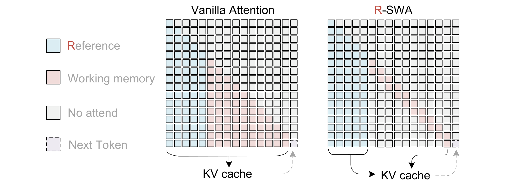
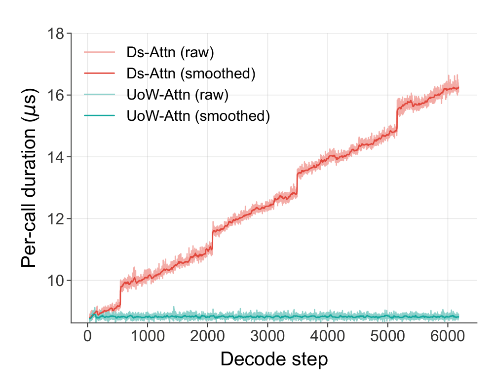

# Unlimited OCR Works

## 来源

- PDF：`raw/2606.23050v1.pdf`（14 页）
- arXiv：[2606.23050](https://arxiv.org/abs/2606.23050)
- 团队：Baidu Inc.
- 模型：[Unlimited OCR](../models/unlimited-ocr.md)
- 日期：2026-06-22

## 核心结论

Unlimited OCR 以 [DeepSeek OCR](https://arxiv.org/abs/2510.18234) 为基线，用 **Reference Sliding Window Attention (R-SWA)** 替换 decoder LLM 的全部注意力层。R-SWA 的核心设计：每个生成 token attend 所有 reference token（视觉 token + prompt，全局固定可见）+ 前 $n$ 个 output token（causal sliding window，$n$=128），使 KV cache 在整个解码过程中恒定为 $L_m + n$，不随输出长度增长。

三个主张：

1. **恒定 KV cache 实现长文档一次性转录**：结合 DeepEncoder 的 16× 视觉 token 压缩率，模型在标准 32K 上下文长度下单次前向即可转录数十页文档。
2. **OCR 精度无损甚至提升**：R-SWA 在单页 OCR 上不降反升--OmniDocBench v1.5 总分 93.23，比 DeepSeek OCR 基线高 6.22 分；v1.6 总分 93.92，达端到端 SOTA。
3. **R-SWA 是通用 parsing 注意力机制**：不只 OCR，适用于 ASR、翻译等一切 reference-based 长程依赖任务。

## 架构与训练

### 模型架构

> Figure 2: Unlimited OCR 架构。KV cache 为容量 $m+n$ 的队列，每次生成新 token 时驱逐第 $m+1$ 个 output token，计算成本和内存不随生成过程增长。（§ 3.2 Architecture）

Unlimited OCR 完整沿用 DeepSeek OCR 的架构骨架：DeepEncoder（SAM-ViT + CLIP-ViT 级联，16× token 压缩）+ 3B MoE decoder（500M 激活参数）。唯一的改动是把 decoder LLM 全部 vanilla MHA 替换为 R-SWA。

### DeepEncoder

DeepEncoder 原出 DeepSeek OCR，级联 SAM-ViT（window attention 处理原始图像 token）和 CLIP-ViT（global attention 处理压缩后 token），在 bridge 处做 16× token 压缩。1024×1024 的 PDF 图像被压缩为仅 256 个 token。保留两种分辨率模式："Base"（1024×1024，多页）和 "Gundam"（动态分辨率，单页）。DeepEncoder 在训练中冻结--它已在 DeepSeek OCR 中充分优化。

### Reference Sliding Window Attention (R-SWA)

> Figure 1: R-SWA 原理。每个生成 token attend 所有 reference token（视觉 token）+ 前 $n$ 个 output token（$n$=128）。对比标准 full attention，R-SWA 在整个解码过程中保持 KV cache 恒定；对比 vanilla SWA，它保留视觉 token 保真度（排除在状态转移之外），避免渐进模糊。（§ 1 Introduction, Figure 1 caption）

R-SWA 把注意力约束在大小 $m+n$ 的双段窗口内：

- **$m$ 段（prefix）**：视觉 token + prompt，在单次推理中固定不变，全局可见。$L_m$ 取决于文档页数/分辨率，不随解码长度变化。
- **$n$ 段（decode）**：宽度 $n$=128 的 causal sliding window，随生成滑动。

形式化：$\mathcal{N}^{(t)} = \mathcal{P} \cup \mathcal{D}_n^{(t)}$，其中 $\mathcal{P} = \{1, \ldots, L_m\}$，$\mathcal{D}_n^{(t)} = \{j \mid \max(L_m+1, L_m+t-n) \leq j \leq L_m+t-1\}$。注意力权重 $\alpha_{tj}$ 在 $\mathcal{N}^{(t)}$ 上做标准 softmax，但有效集大小恒为 $m+n$。

**KV cache 管理**：标准 MHA 的 cache $C_{\text{MHA}}(T) = L_m + T$（随 $T$ 无限增长）；R-SWA 的 cache $C_{\text{R-SWA}}(T) = L_m + \min(n, T) \leq L_m + n$（有上界）。当 $T \gg n$ 时，cache ratio $\rho(T) \approx (L_m + n) / T \to 0$。

**与 vanilla SWA 的关键区别**：vanilla SWA 对所有 token（包括视觉 token）做状态转移，会渐进模糊视觉特征；R-SWA 把视觉 token 排除在状态转移之外，保持视觉保真度。论文指出这不是线性注意力--视觉/reference token 不做 recurrent state update，否则会渐进模糊视觉特征。

### Kernel 级验证

> Figure 3: Flash Attention v3 kernel 的 per-call 延迟随解码长度变化。DeepSeek OCR 延迟线性增长且有对齐边界尖峰；Unlimited OCR 延迟恒定。（§ 3.4.3 Kernel study）

### 训练流程

从 DeepSeek OCR checkpoint 继续，4000 步，global batch 256，最大序列长度 32K，8×16 A800 GPU，AdamW + cosine annealing（初始 LR 1e-4），DeepEP expert parallelism EP=4，Megatron-LM 框架。DeepEncoder 冻结，只训 LLM。数据约 200 万 OCR 样本（单页:多页 = 9:1），多页数据由单页拼接合成（2-50 页，`<page>` 分隔），全部打包到 32K 序列长度。

## 评测要点

### OmniDocBench 主结果

OmniDocBench v1.5（对比经典端到端模型 + DeepSeek OCR 基线）：

| 模型 | 参数量 | Overall ↑ | Text Edit ↓ | Formula CDM ↑ | Table TEDS ↑ | Table TEDS-S ↑ | Read-order Edit ↓ |
| --- | --- | --- | --- | --- | --- | --- | --- |
| OCRFlux | 3B | 74.82 | 0.193 | 68.03 | 75.75 | 80.23 | 0.202 |
| GPT-4o | - | 75.02 | 0.217 | 79.70 | 67.07 | 76.09 | 0.148 |
| InternVL3 | 78B | 80.33 | 0.131 | 83.42 | 70.64 | 77.74 | 0.113 |
| olmOCR | 7B | 81.79 | 0.096 | 86.04 | 68.92 | 74.77 | 0.121 |
| MinerU2-VLM | 0.9B | 85.56 | 0.078 | 80.95 | 83.54 | 87.66 | 0.086 |
| Qwen2.5-VL | 72B | 87.02 | 0.094 | 88.27 | 82.15 | 86.22 | 0.102 |
| Gemini-2.5 Pro | - | 88.03 | 0.075 | 85.82 | 85.71 | 90.29 | 0.097 |
| dots.ocr | 3B | 88.41 | 0.048 | 83.22 | 86.78 | 90.62 | 0.053 |
| Qwen3-VL | 235B | 89.15 | 0.069 | 88.14 | 86.21 | 90.55 | 0.068 |
| DeepSeek-OCR 2 | 3B-A0.5B | 89.17 | 0.049 | 86.85 | 85.60 | 90.06 | 0.060 |
| DeepSeek-OCR（基线） | 3B-A0.5B | 87.01 | 0.073 | 83.37 | 84.97 | 88.80 | 0.086 |
| **Unlimited-OCR** | **3B-A0.5B** | **93.23** | **0.038** | **92.61** | **90.93** | **94.07** | **0.045** |
| *vs DeepSeek-OCR* | | *+6.22* | *-0.035* | *+9.24* | *+5.96* | *+5.27* | *-0.041* |

OmniDocBench v1.6（对比当前端到端 SOTA）：

| 模型 | 参数量 | Overall ↑ | Text Edit ↓ | Formula CDM ↑ | Table TEDS ↑ | Table TEDS-S ↑ | Read-order Edit ↓ |
| --- | --- | --- | --- | --- | --- | --- | --- |
| HunyuanOCR | 1B | 89.95 | 0.088 | 87.68 | 91.01 | 92.23 | 0.171 |
| DeepSeek-OCR 2 | 3B-A0.5B | 90.25 | 0.050 | 91.84 | 83.89 | 87.75 | 0.144 |
| dots.ocr | 3B | 90.77 | 0.048 | 89.95 | 87.18 | 90.58 | 0.138 |
| FireRed-OCR | 2B | 93.26 | 0.037 | 95.44 | 88.04 | 91.06 | 0.131 |
| Logics-Parsing-v2 | 4B | 93.33 | 0.041 | 95.65 | 88.42 | 91.98 | 0.137 |
| Qianfan-OCR | 4B | 93.90 | 0.040 | 95.08 | 90.53 | 93.31 | 0.13 |
| **Unlimited-OCR** | **3B-A0.5B** | **93.92** | **0.042** | **95.79** | **90.16** | **93.32** | **0.129** |

v1.6 上 Unlimited-OCR 以 3B-A0.5B 参数量达 Overall 93.92，与 4B 级 Qianfan-OCR（93.90）持平，超过 [HunyuanOCR-1.5](hunyuan-ocr-1.5.md) 的 94.74（1B 模型，v1.6 不同评测条件）需注意横向可比性。

### 长文档一次性转录

这是 Unlimited OCR 的核心新能力--此前模型只能逐页处理（for-loop + 每页重置 memory）。多页一次性 OCR 评测：

| 指标 | 2 页 | 5 页 | 10 页 | 15 页 | 20 页 | 40+ 页 |
| --- | --- | --- | --- | --- | --- | --- |
| Distinct-20 ↑ | 99.76% | 99.78% | 97.49% | 99.92% | 98.73% | 96.08% |
| Distinct-35 ↑ | 99.87% | 99.98% | 99.83% | 99.99% | 99.89% | 96.90% |
| Edit Distance ↓ | 0.0362 | 0.0452 | 0.0526 | 0.0787 | 0.0572 | 0.1069 |

20 页时 edit distance 仍低于 0.06，40+ 页低于 0.11 且 Distinct-35 保持 97%。论文指出 40+ 页的误差主要来自 DeepEncoder "Base" 模式（1024×1024）下小文字辨识困难，而非 R-SWA 在长程解析中丢失方向。

### 推理效率

TPS（tokens/s，512 并发，"Base" DeepEncoder 模式）随输出长度的变化：

| 输出长度 | 256 | 512 | 1024 | 2048 | 3072 | 4096 | 6144 |
| --- | --- | --- | --- | --- | --- | --- | --- |
| DeepSeek OCR | 7229 | 7468 | 7423 | 7167 | 6791 | 6430 | 5823 |
| Unlimited OCR | 7230 | 7715 | 7841 | 7881 | 7882 | 7905 | 7848 |

256 token 时两者持平；6144 token 时 DeepSeek OCR 降至 5823，Unlimited OCR 保持 7848，**差距达 35%**。OmniDocBench 短文档上 Unlimited OCR 5580 TPS vs DeepSeek OCR 4951 TPS（+12.7%）。

## 待追问

- R-SWA 的 $n$=128 是如何选定的？论文未给出 $n$ 的消融实验。窗口太小可能丢失跨页上下文（如表格续页），太大则削弱 cache 恒定优势。
- 论文提到未来计划建 prefill pool 让模型学习自动获取 prefill KV chunk（模拟人类翻页），但当前 32K 上下文仍是 prefill 瓶颈--页数越多 prefill 越长，"unlimited" 实际受限于 prefill 长度而非 decode。
- R-SWA 对跨页引用（如第 20 页引用第 1 页的图表编号）如何处理？128-token 窗口显然不够覆盖，除非信息通过 reference token 间接传递。论文未讨论这类远距离依赖场景。
- 子类别对比中 [HunyuanOCR-1.5](hunyuan-ocr-1.5.md) 在 v1.6 得 94.74（1B 模型），Unlimited-OCR 得 93.92（3B-A0.5B）--两者走不同技术路线（DFlash 推测解码 + Agentic Data Flow vs 恒定 KV cache attention），横向对比时需注意参数量和评测条件差异。

## 相关页面

- [Unlimited OCR](../models/unlimited-ocr.md) - 模型身份页
- [HunyuanOCR-1.5](hunyuan-ocr-1.5.md) - 同属 OCR VLM 家族，走推测解码加速而非恒定 cache 路线
- [高效长上下文注意力](../concepts/efficient-long-context-attention.md) - R-SWA 在长上下文注意力路线谱系中的定位（模式稀疏 / reference-based SWA）
