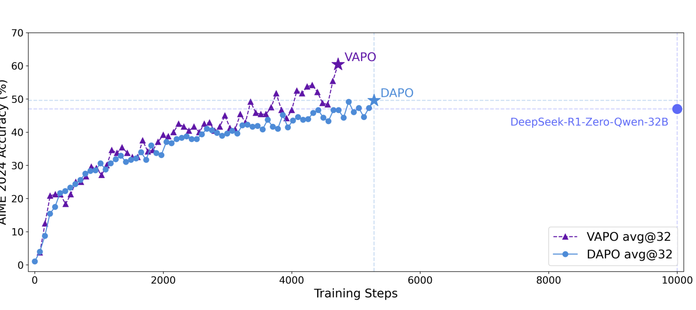
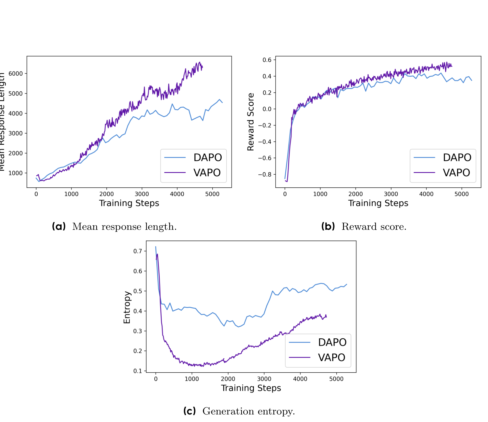

# VAPO：Efficient and Reliable Reinforcement Learning for Advanced Reasoning Tasks

## 来源

- 文件：`raw/2504.05118v3.pdf`
- 标题：VAPO: Efficient and Reliable Reinforcement Learning for Advanced Reasoning Tasks
- 团队 / 日期：ByteDance Seed；论文标注 2025-04-14；arXiv:2504.05118v3，2025-04-11
- arXiv：<https://arxiv.org/abs/2504.05118>
- 定位：这是面向 long-CoT reasoning 的 value-model-based PPO 算法论文，不发布独立模型；主要实验对象是未经过 SFT 的 Qwen2.5-32B base。
- 关系：VAPO 沿用 [VC-PPO](https://arxiv.org/abs/2503.01491) 的 Value-Pretraining / Decoupled-GAE、[DAPO](dapo.md) 的 Clip-Higher / token-level loss、自模仿学习的 positive-example NLL，以及 GRPO 式同 prompt 多次采样；论文自己的主要新增点是 Length-Adaptive GAE 与整套组合的系统消融（§1、§4、§5）。

## 核心结论

1. **VAPO 的承重墙是 critic 校准，不只是 PPO clipping 调参**：value model 先用固定 policy 采样的 Monte Carlo return 预训练；critic 更新使用 $\lambda_{critic}=1$ 的无偏 return，policy 则使用独立的 GAE 参数。去掉 Value-Pretraining 时 AIME 2024 avg@32 从 60 降到 11，去掉 Decoupled-GAE 降到 33（§4.1、Table 1）。
2. **Length-Adaptive GAE 按 response 长度调 bias–variance trade-off**：固定 $\lambda=0.95$ 时，长序列远端 reward 的系数指数衰减；VAPO 令 $\lambda_{policy}=1-1/(\alpha l)$，$\alpha=0.05$，让 GAE 系数和约为 $\alpha l$。去掉该组件从 60 降到 45，是论文中仅次于 critic 两项的消融跌幅（§3.2、§4.2、Table 1）。
3. **稀疏 verifier reward 下同时保探索与放大稀有正样本**：Clip-Higher 将 ratio 下/上界设为 $\epsilon_{low}=0.2$、$\epsilon_{high}=0.28$；positive-example LM loss 对 policy 自己采到的正确轨迹追加 NLL，权重 $\mu=0.1$；Group-Sampling 用 512 prompts × 每题 16 responses 替代 8192 prompts × 每题 1 response（§4.3、§5.1）。
4. **论文报告的主结果是单 backbone、单 benchmark 上的显著提升**：未使用 SFT 数据的 Qwen2.5-32B base 在 AIME 2024 avg@32 上，vanilla PPO 为 5、DAPO 为 50、完整 VAPO 为 60（Figure 1 标出 60.4）；VAPO 在约 5,000 gradient updates 达到峰值，论文称三次独立 run 均到 60–61 且没有 training crash（§1、§5.2）。
5. **边界不能省略**：实证集中于 AIME 2024。§5.1 虽称这些技术也适用于 code-related tasks，但没有给代码任务的表格、曲线或消融；Table 1 是逐项移除，不是完整 factorial experiment，因此不能据此断言七个组件彼此独立或各项分差可以相加。

## 架构与训练

### 三类 long-CoT value learning 难点

VAPO 把 value-model-based long-CoT RL 的失败拆成三类（§3）：

- **Value model bias**：从 reward model 初始化 critic 时，RM 只在 `<EOS>` 评分，而 value model 要为每个前缀预测未来 return，目标错位会产生初始化偏差；固定 $\lambda=0.95$ 又让终局 reward 对远端 token 近乎消失，critic 越来越依赖有偏 bootstrap。
- **序列长度异质性**：短 response 更受 variance 主导，长 response 更易积累 bootstrap bias，单一 $\lambda$ 很难同时合适。
- **稀疏 verifier reward**：long-CoT 拉长采样成本，而 binary correctness reward 只在终局出现；算法既要保留探索，又要充分利用罕见正确轨迹。

### 七项调整及来源

| 组件 | 作用层级 | 机制 | 论文中的来源 / 身份 | 去掉后的 AIME24 avg@32 |
| --- | --- | --- | --- | ---: |
| Value-Pretraining | critic 初始化 | 固定 policy 采样，Monte Carlo return 预热 value model 50 steps | VC-PPO | 11 |
| Decoupled-GAE | critic / actor target | critic 用 $\lambda=1$；actor 单独设 $\lambda_{policy}$ | VC-PPO | 33 |
| Length-Adaptive GAE | actor advantage | $\lambda_{policy}=1-1/(\alpha l)$，$\alpha=0.05$ | VAPO 主要新增 | 45 |
| Clip-Higher | PPO trust region | $\epsilon_{low}=0.2$、$\epsilon_{high}=0.28$ | DAPO | 46 |
| Token-Level Policy Gradient Loss | loss reduction | batch 内所有 response token 等权，不先按 sequence 平均 | DAPO | 53 |
| Positive Example LM Loss | 正样本利用 | 对采到的正确轨迹追加 NLL，$\mu=0.1$ | self-imitation learning | 54 |
| Group-Sampling | rollout allocation | 512 prompts × 16 responses，保持 8192 trajectories | GRPO 式 group sampling | 55 |
| 完整 VAPO | 组合 | 上述七项共同启用 | 系统组合 | **60** |

Table 1 还列出 DeepSeek-R1-Zero-Qwen-32B 为 47、DAPO 为 50、vanilla PPO 为 5。这里的“去掉后分数”是 one-at-a-time ablation；分差不能解释为可加的独立因果效应。

### 训练设置

论文 §5.1 的 actor / critic learning rate 分别为 $1\times10^{-6}$ / $2\times10^{-6}$，AdamW + warmup-constant scheduler，mini-batch 512，$\gamma=1$。评测对 AIME 2024 重复采样 32 次，`top_p=0.7`、`temperature=1.0`。所有对比实验都从 Qwen2.5-32B pre-trained model 出发，不引入 SFT 数据。

## 后训练

### Length-Adaptive GAE 的关键含义

固定 GAE 中，距终点 $k$ 步的 TD error 权重是 $\lambda^k$；论文举例 $0.95^{100}\approx0.006$。VAPO 不直接按长度线性放大 advantage，而是先要求无限几何和近似满足：

$$
\sum_{t=0}^{\infty}\lambda_{policy}^{t}\approx\frac{1}{1-\lambda_{policy}}=\alpha l,
$$

再解出 $\lambda_{policy}=1-1/(\alpha l)$。因此 response 越长，$\lambda_{policy}$ 越接近 1，终局 reward 能向更远 token 传播；较短 response 保持更强 bootstrap，以换取较低方差（§4.2）。

### Positive-example LM loss 与 group sampling

VAPO 对当前 policy 采到的正确轨迹集合 $T$ 追加 token-average NLL：

$$
L(\theta)=L_{PPO}(\theta)+\mu L_{NLL}(\theta),\qquad \mu=0.1.
$$

这不是离线 SFT：正样本来自在线 rollout，目标是让稀有正确轨迹被更强地模仿。Group-Sampling 则把固定 trajectory 预算集中到较少 prompts 的多次生成上。论文把收益归因于更丰富的同题对比信号，但没有单独分析 NLL 与 group sampling 是否因相同正样本而耦合（§4.3、§5.2）。与 [Iterative RPO](iterative-rpo.md) 的 DPO+NLL 是同一类「正样本再 SFT 一遍」补丁，VAPO 加在 PPO 上且 $\mu=0.1$，Iterative RPO 加在 DPO 上且 $\alpha=1$。

## 评测要点

> 论文 Figure 1：AIME 2024 scores of VAPO on the Qwen2.5-32B base model，与 DAPO / DeepSeek-R1-Zero-Qwen-32B 对比。（摘要页）

Figure 1 支持“在论文报告的同一设置下，VAPO 更快达到更高 AIME avg@32”，但不能单凭一张单 benchmark 曲线推出跨任务的 value-based PPO 普遍优越性。

> 论文 Figure 2：VAPO’s metric curves for response length, reward score, and generation entropy。（§5.3）

论文把更长 response、较快 reward 增长与较低后期 entropy 分别解释为 length scaling、value model 的细粒度信号与稳定性。但“更长 response 代表更强泛化”只是作者在 §5.3 的解释，论文没有提供长度控制或跨分布泛化实验；应把曲线当训练动态证据，而不是机制因果证明。

## 待追问

- $\lambda_{policy}=1-1/(\alpha l)$ 在短 response 上可能取到很小甚至负值；实现是否做了 clipping、最小长度或 padding-based $l$ 定义，论文未说明。
- Positive-example LM loss 会强化当前 policy 已经偶然找到的模式；在 verifier 有误判或答案风格单一时，是否会放大 reward hacking / mode collapse？
- VAPO 的 value model 增加了参数、显存与训练 FLOPs；论文比较 gradient update steps，没有报告端到端 wall-clock、token throughput 或总计算成本，因而“更高 sample / step efficiency”不能直接等价为更低算力成本。
- 代码任务迁移、多领域 reasoning、MoE backbone 与多轮 agent trajectory 上是否仍优于 value-model-free 方法，当前没有实证。
- Value-Pretraining / Decoupled-GAE / Length-Adaptive GAE 三项强耦合；需要 factorial ablation 才能区分各自增益和交互效应。

## 相关页面

- 对比：[LLM RL policy optimization 对比](../comparisons/llm-rl-policy-optimization.md)
- 相邻算法：[DAPO](dapo.md)、[Iterative RPO](iterative-rpo.md)（DPO 上的正样本 NLL）、[Group Sequence Policy Optimization](group-sequence-policy-optimization.md)、[Soft Adaptive Policy Optimization](soft-adaptive-policy-optimization.md)、[Agentic Reinforced Policy Optimization](agentic-reinforced-policy-optimization.md)
- 概念：[Agentic 模型的后训练](../concepts/post-training-for-agentic-models.md)
