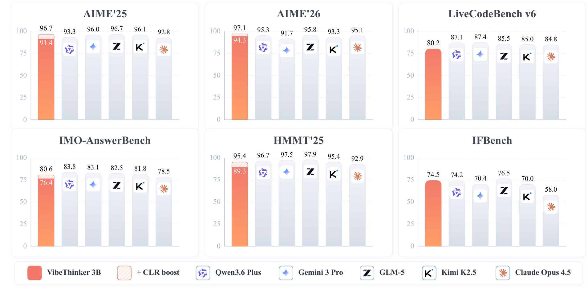
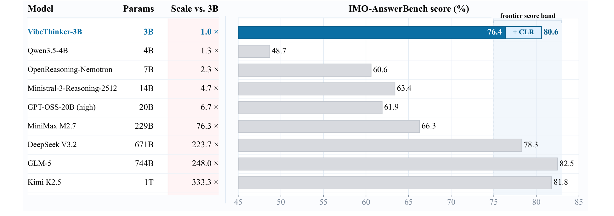

# VibeThinker-3B 技术报告

## 来源

- PDF：`raw/2606.16140v1.pdf`
- 标题：VibeThinker-3B: Exploring the Frontier of Verifiable Reasoning in Small Language Models
- arXiv：2606.16140v1，2026-06-15
- 团队：Sina Weibo Inc.（Sen Xu, Shixi Liu, Wei Wang, Jixin Min, Yingwei Dai, Zhibin Yin, Yirong Chen, Xin Zhou, Junlin Zhang）
- 模型页：[VibeThinker-3B](../models/vibethinker-3b.md)

## 核心结论

VibeThinker-3B 是一个 3B 参数的 dense reasoning 模型，基于 Qwen2.5-Coder-3B base，目标是探索**严格小模型体制下 verifiable reasoning 的能力上限**。核心发现：在可验证推理任务（数学竞赛、编程）上，3B 模型可以进入一线旗舰模型的性能带，但在知识密集型任务（GPQA-Diamond）上仍有明显差距。

**headline 数据**（原文确证，§ Evaluation Results）：

| Benchmark | VibeThinker-3B | + CLR | 对比旗舰 |
| --- | --- | --- | --- |
| AIME26 | 94.3 | 97.1 | DeepSeek V3.2 94.2 / GLM-5 95.8 / Kimi K2.5 93.3 |
| AIME25 | 91.4 | 96.7 | DeepSeek V3.2 93.1 / GLM-5 96.7 |
| HMMT25 | 89.3 | 95.4 | DeepSeek V3.2 90.2 / GLM-5 97.9 |
| LiveCodeBench v6 | 80.2 | — | Kimi K2.5 85.0 / GLM-5 85.5 |
| IMO-AnswerBench | 76.4 | 80.6 | GLM-5 82.5 / Kimi K2.5 81.8 |
| IFEval | 93.4 | — | GLM-5 92.6 / Kimi K2.5 93.9 |
| GPQA-Diamond | 70.2 | 72.9 | GLM-5 86.0 / Kimi K2.5 87.6 |

**OOD 泛化**：在 2026.04.25–05.31 的 LeetCode weekly/biweekly contests 上，Python one-shot 通过率 96.1%（123/128），超过 GPT-5.2（95.3%）、Kimi K2.5（90.6%）、GLM-5（76.6%），接近 Gemini 3 Flash（96.9%）。

> Figure 1 原文图注：VibeThinker-3B reaches frontier reasoning performance at 3B scale. CLR denotes Claim-Level Reliability Assessment, a claim-level test-time scaling strategy.

> Figure 2 原文图注：Parameter efficiency on IMO-AnswerBench, a highly demanding benchmark comprising 400 IMO-level problems, among open-source reasoning models with disclosed parameter counts.

### Parametric Compression-Coverage Hypothesis

论文提出的核心理论框架（原文确证，§ Introduction）。将基础模型能力分为两类：

- **parameter-dense capabilities（参数密集型）**：verifiable reasoning 属于此类——核心挑战不是记忆大量事实，而是在结构化解空间内做搜索、约束满足、纠错和多步组合。这类能力可以高度压缩进紧凑的可复用推理核心。
- **parameter-expansive capabilities（参数扩展型）**：知识密集和通用能力属于此类——需要对开放域事实、领域概念、语义关联和长尾场景的广泛覆盖，更像一个覆盖问题而非推理核心的压缩。

这一假设解释了为什么 VibeThinker-3B 在数学/编程上追平旗舰，但在 GPQA-Diamond 上仍有差距。论文进一步提出 **Reasoning-Knowledge Decoupling Paradigm**：大模型继续做知识广度载体，小模型在有结构约束和可靠训练信号的条件下足以封装高密度推理深度——两者是互补关系而非替代。

## 架构与训练

### 基座

Qwen2.5-Coder-3B（dense，3B 参数）。论文不涉及架构改动，所有创新在 post-training 阶段。

### 训练流水线概览

> Figure 3 原文图注：Overall training pipeline of VibeThinker-3B.

整体范式延续 VibeThinker-1.5B 的 **Spectrum-to-Signal Principle (SSP)**：SFT 阶段构造多样化解空间（Spectrum），RL 阶段放大高价值推理信号（Signal）。

### SFT 阶段

**数据构造**（原文确证，§2.1.1）：

- **Query Expansion**：从已有数据集选有可靠监督信号的 seed query（数学需有可信最终答案，编程需有可执行测试），在概念组合、解题骨架、约束、评测目标等维度重写扩展。
- **Multi-path Reasoning Distillation**：对数学/代码/STEM 样本，用强 teacher 模型对每个 query 采样多条推理轨迹，保留完整中间步骤（而非单一标准解），构造多解结构。
- **Multi-level Quality Control**：三层过滤——(1) N-gram 去重去模板化 + benchmark 去污染；(2) LLM 评估 query 质量（描述完整性、条件合理性、逻辑有效性）；(3) trace 正确性过滤（答案验证 + 代码沙箱执行 + LLM majority voting）。

**两阶段 curriculum SFT**（原文确证，§2.1.2）：

| | Stage 1: Broad Coverage | Stage 2: Hard-Reasoning |
| --- | --- | --- |
| 目标 | 广覆盖 + 行为冷启动 | 长 horizon 难题推理 |
| 数据 | 全量质量过滤后数据 | hard subset（trace >5K token + 用 VibeThinker-1.5B 8 次 rollout 错误率 >0.75 的样本） |
| 训练 | 5 epochs, lr=5e-5, cosine→8e-8, warmup 5%, global batch 128, sequence packing | 2 epochs, 沿用 Stage 1 超参 |

**Diversity-Exploring Distillation**（原文确证，§2.1.2）：训练中定期保存中间 checkpoint，在 domain-specific probing set 上评 Pass@K，为每个域选产出更多 valid solution 的 checkpoint 作为 specialist（而非选最低 loss 或最高 Pass@1），再做参数级 merge。目的：保留域特定推理能力的同时维持高输出多样性，为 RL 提供更宽的解空间。

### RL 阶段

#### MGPO 算法骨架

核心 RL 算法是 **MaxEnt-Guided Policy Optimization (MGPO)**，源自 VibeThinker-1.5B（原文确证，§2.2.1）。MGPO 在 GRPO-style clipped objective 上加了一个 prompt-level 权重：

对每个 prompt $q$，采 $G$ 条 response，计算 empirical group accuracy $p(q) = \frac{1}{G}\sum_{i=1}^{G}\mathbb{I}(r_i=1)$。权重为：

$$w(q) = \exp\left(-\gamma \, D_{ME}(p(q) \| p_0)\right), \quad p_0 = 0.5$$

$D_{ME}$ 度量 $p(q)$ 偏离最大熵点 0.5 的程度。$p(q)\approx 0$（太难，正信号稀疏）和 $p(q)\approx 1$（已饱和）的 prompt 被降权，聚焦在模型当前能力边界附近的 prompt（对错共存）。该权重作用于 group-relative advantage：

$$J_{MGPO}(\theta) = \mathbb{E}_{q,\{y_i\}}\left[\frac{1}{G}\sum_{i=1}^{G}\frac{1}{|y_i|}\sum_{t=1}^{|y_i|}\min\left(\rho_{i,t}(\theta)\,w(q)\,A_i,\;\text{clip}(\rho_{i,t}(\theta),\,1-\epsilon,\,1+\epsilon)\,w(q)\,A_i\right)\right]$$

与 DAPO 的 Dynamic Sampling 比较：DAPO 也是过滤全对/全错 prompt（$p(q)=0$ 或 $1$），但 DAPO 是 hard filter（丢弃），MGPO 是 soft weighting（指数衰减）。两者动机一致——聚焦能力边界 prompt——但 MGPO 的权重连续可微，理论上梯度信号更平滑。

VibeThinker-3B 保持了 MGPO 核心公式不变，但改为**全 on-policy**（参考 [14, 15] 的稳定化策略），因为 rollout engine 优化推理吞吐量后 training-inference probability mismatch 被放大，可能导致训练崩溃。

#### 多领域 Reasoning RL

- **顺序训练**：Math RL → Code RL → STEM RL。每个阶段的 checkpoint 保留用于后续 offline self-distillation。
- **Single Long-context**：与 VibeThinker-1.5B 的渐进式 context window 扩展不同，3B 版直接用单一 64K context window。论文发现高截断 warm-up 会损害 3B 的长思维能力（1.5B 上则有效），假设原因是 3B 的 SFT 质量控制更严、无效推理模式更少，高截断 warm-up 不再主要是去噪，而是破坏已有的高质量长推理行为。
- **Long2Short Math RL**：accuracy→efficiency 两阶段。第一阶段标准 MGPO 优化准确率；第二阶段在正确轨迹集 $C$ 内按 response length 重分配 reward——brevity score $s_i = 1/L_i$，centered length-aware shift $r'_i = r_i + \lambda \cdot \frac{s_i - \bar{s}}{\max_{j\in C}|s_j - \bar{s}|}$（$\lambda=0.2$）。设计为零和（$\sum_{i\in C}(r'_i - r_i) = 0$），不改变 group-level reward baseline，只 reshape 正确轨迹间的相对偏好，偏好更短的推理路径。

### Offline Self-Distillation

从 Math / Code / STEM RL 三个 checkpoint 收集高质量推理轨迹，通过 SFT 回灌到统一 student 模型（原文确证，§2.3）。

**Learning-potential Filtering**：对每条验证正确的 teacher trajectory $y$，计算 student 的 length-normalized NLL：

$$S_{LP}(q, y) = -\frac{1}{|y|}\sum_{t=1}^{|y|}\log\pi_\theta^{stu}(y_t \mid q, y_{<t})$$

分数越高说明该轨迹虽被 teacher 验证正确但 student 尚未学好，distillation 价值越高。为避免序列长度或异常 token 偏差，不全局排序，而是在 domain-specific length bucket 内计算优先级，排除极短 trace（分数被异常 token 主导）和极高分离群点（格式错误/分布偏移）。

### Instruct RL

最终阶段把 reasoning-enhanced checkpoint 转为用户可用模型（原文确证，§2.4）。训练数据含格式敏感 prompt、长上下文指令和通用 alignment 样本。有显式约束的样本用 rule-based validator（检查格式、排序、item count、keyword 约束、任务完成度）；开放 prompt 用 rubric-based reward model 评估 helpfulness / coherence / instruction adherence / redundancy。

### CLR: Claim-Level Reliability Assessment

test-time scaling 策略（原文确证，§3.1）。与多数聚合整条 trace 的方法不同，CLR 聚焦影响关键决策的 claim：

1. 用标准参数采 $K=32$ 条候选轨迹，每条提取 $M=5$ 个决策相关 claim + 最终答案。
2. 模型自验证每个 claim（falsify/validate），得 binary verdict $v_{k,m}\in\{0,1\}$。
3. 非线性映射到轨迹级 reliability score：$r_k = \left(\frac{1}{M}\sum_{m=1}^{M}v_{k,m}\right)^M$（指数惩罚含错误中间逻辑的轨迹）。
4. 按答案等价类聚类，选 reliability-weighted aggregation 最大的答案。

实验中独立执行 8 次取平均。CLR 不更新参数，通过隔离关键逻辑锚点显著减少 token 消耗。

## 评测要点

### 评测协议

- 推理后端 vLLM；温度 1.0, top-p=0.95, top-k=-1。
- 数学 benchmark：64 次独立采样取 mean Pass@1（IMO-AnswerBench 16 次）；knowledge/coding 分别 16/8 次。
- 数学答案判定：math verify + LLM-as-judge 联合（IMO-AnswerBench 答案形式复杂，纯规则验证不可靠）。
- 严格 benchmark 去污染。

### 核心对比（Table 1 + Table 2）

VibeThinker-3B 在小/中模型对比中全面领先（3B 超过 4B–14B reasoning 模型），在与旗舰模型对比中：

- **数学**：AIME26 94.3 追平 DeepSeek V3.2（94.2）和 Kimi K2.5（93.3）；+CLR 后 97.1 超过所有对比模型。
- **编程**：LiveCodeBench v6 80.2 超过 GPT-OSS-120B（81.9 接近），OJBench 38.6 在同规模中领先但落后于大模型。
- **知识**：GPQA-Diamond 70.2 → +CLR 72.9，但仍落后 GLM-5（86.0）/ Kimi K2.5（87.6）约 14–15 点——这是 Parametric Compression-Coverage Hypothesis 预测的边界。
- **指令**：IFEval 93.4 / IFBench 74.5，证明极端推理增强未牺牲指令可控性。

## 待追问

- MGPO 的 $D_{ME}$ 具体形式未给出（论文只说"measures how far $p(q)$ deviates from maximum-entropy point 0.5"），猜测是某种 entropy 或 KL 变体，但需查 VibeThinker-1.5B 原文确认。
- Diversity-Exploring Distillation 的参数级 merge 具体方法未说明（是 simple average / weighted average / 还是更复杂的 merge 策略？）。
- Long2Short RL 的 $\lambda=0.2$ 是如何选定的？是否有 ablation？
- CLR 的"decision-relevant claim"提取过程依赖模型自身，是否对 claim 提取质量敏感？论文未给 ablation。
- VibeThinker-1.5B 的渐进式 context window 在 3B 上失效的发现很有价值——这是否意味着 context window 策略与 SFT 数据质量强耦合？高 SFT 质量下 warm-up 截断有害，低 SFT 质量下有益？

## 相关页面

- 模型：[VibeThinker-3B](../models/vibethinker-3b.md)
- 比较：[LLM RL policy optimization 对比](../comparisons/llm-rl-policy-optimization.md)（MGPO 与 DAPO/GSPO/SAPO/ARPO 的定位对比）
- 概念：[Agentic 模型的后训练](../concepts/post-training-for-agentic-models.md)
- 跨报告：[On-Policy Distillation 跨报告对比](../comparisons/on-policy-distillation.md)（VibeThinker 的 offline self-distillation 与 OPD 的关系）
