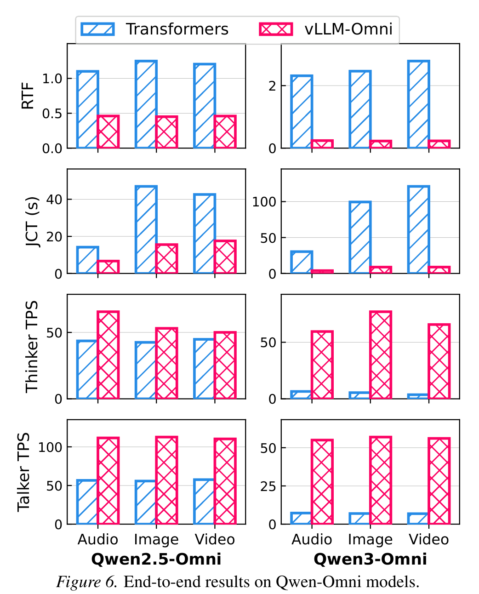
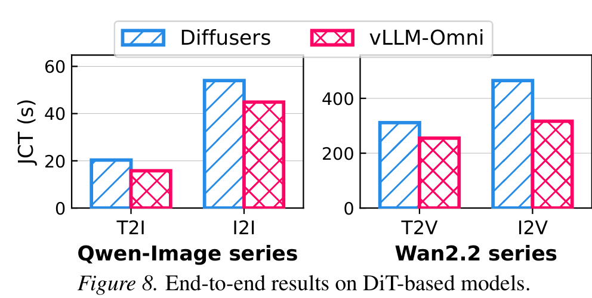

# vLLM-Omni 技术报告

## 来源

- 原始 PDF：[raw/vllm-omni-2602.02204.pdf](../../raw/vllm-omni-2602.02204.pdf)
- 标题：vLLM-Omni: Fully Disaggregated Serving for Any-to-Any Multimodal Models
- 版本/日期：arXiv:2602.02204v1，2026-02-02；论文页显示 Preprint，2026-02-03
- 团队：Huawei AI Framework and Data Technology Lab、CUHK、Institute of Software CAS、Sun Yat-sen University、Independent researcher
- 代码：<https://github.com/vllm-project/vllm-omni>
- 官方博客快照：[raw/vllm-omni-blog-2025-11-30.md](../../raw/vllm-omni-blog-2025-11-30.md)；原文：[vLLM Blog](https://vllm.ai/blog/2025-11-30-vllm-omni)
- 概念页：[Any-to-any 多模态 serving](../concepts/any-to-any-multimodal-serving.md)

## 核心结论

vLLM-Omni 是一个面向 **any-to-any 多模态模型** 的 fully disaggregated serving system。这里的 any-to-any 指模型可以同时处理 / 生成 text、image、video、audio；典型结构不再是单个 text-only AR LLM，而是 **多个 AR LLM、DiT diffusion transformer、encoder、vocoder / specialized generator** 串成流水线。

论文的关键判断是：传统 LLM serving（vLLM / SGLang）擅长单个 autoregressive text generation stage；Diffusers 等擅长 diffusion visual generation。它们都不能自然表达「Thinker→Talker→Vocoder」或「AR LLM→DiT generator」这类多阶段图。开发者只能手写跨阶段数据搬运，结果是无法用 continuous batching、chunked prefill、KV-cache 管理、execution graph compilation 等成熟 serving 优化，且资源不能按 stage 拆分。

vLLM-Omni 的回答是：把模型拆成 **stage graph**。每个节点是一个独立 stage（AR LLM / DiT / CNN / encoder），边是 transfer function；每个 stage 由独立 execution engine serve，拥有自己的 batching、scheduler、KV manager、parallelism policy 和 GPU / memory 配额。跨 stage 数据通过 unified connector 传 embeddings、hidden states、tokens、audio/image tensors。

> Figure 3（原文截图，§ 3.1 Overview）："vLLM-Omni architecture."

## 架构与执行

### Stage abstraction：把模型结构变成图

Stage abstraction 是 vLLM-Omni 的前端接口。开发者把任意多模态模型定义成 stage graph：

- **节点**：一个模型阶段，例如 AR LLM、DiT、CNN 模块，或把 multimodal encoder 合进某个 LLM stage。
- **边**：stage-transfer function，负责把上游输出转换成下游输入。
- **每个 stage 的接口**：`PreProcess Fn (Per-request)` + `Forward (Batch)`；这样 stage 内部仍能走批处理，而不是每个请求单独跑。

论文用 Qwen2.5-Omni 作例子：Thinker LLM 先生成 text / hidden states；Thinker2Talker 把 hidden states 和 multimodal embeddings 拼进 Talker 输入；Talker LLM 生成 audio codec tokens；Talker2Vocoder 再交给 DiT Vocoder 还原 waveform。Qwen3-Omni 结构类似。

> Figure 4（原文截图，§ 3.2 Stage Abstraction）："An example implementation of Qwen2.5-Omni (i.e., stage graph and workflow for the model). Qwen3-Omni is similar."

### Stage execution：每个 stage 独立 serve

Stage graph 给出结构后，后端初始化一组 execution engines，每个 engine host 一个模型组件并独立 serve。这样 Qwen3-Omni 这种三阶段 pipeline 可以按 stage 特性配置资源：Thinker 是最大 30B 模型，可给更多 accelerator memory；Talker 更小但 compute-intensive，可给更高 parallelism 或更多 accelerator。

AR stage 直接继承 vLLM engine：每个 engine 自己做 batch scheduling、KV-cache management 和 model execution。vLLM-Omni 在 model runner 中加入自定义 preprocess function，并维护 per-request intermediate data dictionary，使 Talker 这类阶段可以在每个 decoding step 组合上游 hidden states / embeddings 与当前输入。

DiT stage 则走专门的 diffusion engine。论文明确把 diffusion process 当成 stage graph 的一个节点，并把 flash attention、SAGE attention、TurboAttention、TeaCache / cache-dit、RingAttention / Ulysses 等 DiT 侧优化纳入 serving engine；因此它不是简单把 DiT 放在 vLLM 后面，而是把 non-AR generation 也纳入同一个 disaggregated serving 语义。

### Unified connector：把 KV 传输泛化成任意中间态传输

vLLM-Omni 的 unified connector 受 vLLM prefill-decode disaggregation 的 KV cache transfer 启发，但传输对象更广：embeddings、hidden states、audio / image tensors、codec tokens 等都可通过统一接口移动。

> Figure 5（原文截图，§ 3.4 Disaggregated Data Transfer）："Disaggregated data transfer with unified connector."

单机场景下，小 payload 用 inline control queues，大 payload 用 system shared memory；多机场景下用 Ray 编排，Mooncake connector 提供 TCP / RDMA transport，并用 put/get interface 交换数据、control plane 只传轻量 metadata。Table 1 显示在 Qwen2.5-Omni 上 connector overhead 相对几十秒级总推理延迟可忽略：

| Connector | Thinker2Talker latency | Talker2Vocoder latency |
| --- | ---: | ---: |
| Shared Memory | 5.49 ms | 0.53 ms |
| Mooncake | 8.28 ms | 3.34 ms |

论文还支持 **streaming stage output**：例如 Qwen-Omni 里 Vocoder 不必等 Talker 生成完整 audio token sequence，Talker 生成初始 tokens 后即可增量推给 Vocoder，从而 overlap stages、降低最终输出 TTFT，并支持流式响应。

## 评测要点

### Qwen-Omni：Qwen3-Omni JCT 最高降 91.4%

实验在 2 张 80GB accelerator 上比较 Qwen2.5-Omni / Qwen3-Omni 的 Transformers baseline 与 vLLM-Omni。baseline 使用 Transformers 默认 tensor parallel；vLLM-Omni 把 Thinker tensor-parallel 到两张卡，同时把 Talker 放 device-1、Vocoder 放 device-0。

论文给出的 headline 数字：

- Qwen2.5-Omni：RTF 降 **61.4%**，JCT 降 **61.6%**；Thinker TPS / Talker TPS 分别提升 **1.29× / 1.97×**。
- Qwen3-Omni：RTF 降 **90.7%**，JCT 降 **91.4%**；Thinker TPS / Talker TPS 分别提升 **12.97× / 7.98×**。

> Figure 6（原文截图，§ 4.2 End-to-End Performance）："End-to-end results on Qwen-Omni models."

Figure 7 的 stage time decomposition 进一步说明瓶颈：Qwen3-Omni 中 Talker stage 占主要 latency，因为它要生成的 audio tokens 比 Thinker 生成的 text tokens 多很多。论文给的 video-input 平均量级是：输入含 video tokens 约 841.6，输出 text tokens 约 150.9，输出 audio tokens 约 545.4。

### AR + DiT / audio / pure DiT 模型

vLLM-Omni 还覆盖三类非 Qwen-Omni 模型：

- **BAGEL**（AR + specialized visual generator）：1024×1024 image generation，T2I JCT 从 23.12s 降到 9.64s（2.40×），I2I 从 41.39s 降到 11.12s（3.72×）。
- **MiMo-Audio**：SeedTTS 上 RTF 从 1.39 降到 0.60；加 execution-graph compilation 后降到 0.12（11.58×）。
- **DiT-based visual generation**：Qwen-Image / Qwen-Image-Edit / Wan2.2-T2V / Wan2.2-I2V 上，相对 Diffusers 总体 1.26× speedup；论文归因于 diffusion engine 复用 vLLM 的 operator optimizations 与 flash-attention backend。

> Figure 8（原文截图，§ 4.3 Micro Experiments）："End-to-end results on DiT-based models."

## 与已有沉淀的关系

- 对 [Qwen3.5-Omni 技术报告](qwen3.5-omni.md)：Qwen3.5-Omni 页解释模型自身的 Thinker / Talker / Hybrid Attention MoE；本页解释这类 omni model 如何被拆成 Thinker / Talker / Vocoder 等 serving stages 并独立调度。
- 对 [Qwen3-VL 技术报告](qwen3-vl.md)：Qwen3-VL 是 multimodal input → text output 的 VL 模型；vLLM-Omni 关注 multimodal input + multimodal output 的 any-to-any serving，边界更宽。
- 对 [百万 token 上下文服务](../concepts/million-token-context-serving.md)：DeepSeek-V4 页关注长上下文 KV / prefix / disk cache；vLLM-Omni 把 disaggregation 从 prefill-decode KV transfer 扩展到多模态 stage 间 hidden / embedding / tensor transfer。
- 对 [多模态 Agentic 训练](../concepts/multimodal-agentic-training.md)：Kimi K2.5 页关注多模态 agent 如何训练；vLLM-Omni 是运行时基础设施：让「看、听、说、画」的多 stage 模型能高吞吐 serve。

## 待追问

- 论文评测是 offline inference / JCT / RTF 为主；在线多用户 serving 下，stage graph scheduler 的 admission control、backpressure 与 tail latency 如何表现仍需更多数据。
- Qwen3-Omni 结果很强，但 Qwen3-Omni 本身尚未在本 wiki 作为模型页沉淀；后续若收 Qwen3-Omni 原报告，应把 Figure 4 的 stage graph 与模型结构一一对齐。
- 论文把 DiT engine 纳入 stage graph，但不同 diffusion 模型的质量 / latency trade-off 是否受 engine 优化影响，当前只看 JCT，不看生成质量变化。
- Unified connector 的 Table 1 显示 overhead 小，但跨机 RDMA / Mooncake 在更大 batch、更长音视频 tensor、更多 stage 的情况下是否仍是小项，需要系统实验。

## 相关页面

- 概念：[Any-to-any 多模态 serving](../concepts/any-to-any-multimodal-serving.md)、[百万 token 上下文服务](../concepts/million-token-context-serving.md)、[多模态 Agentic 训练](../concepts/multimodal-agentic-training.md)
- 模型 / 来源：[Qwen3.5-Omni 技术报告](qwen3.5-omni.md)、[Qwen3-VL 技术报告](qwen3-vl.md)、[Qwen3.5](../models/qwen3.5.md)
- 相邻系统：[Forge Agent-Native RL](../concepts/forge-agent-native-rl.md)、[异步 Agent RL](../concepts/asynchronous-agent-rl.md)
