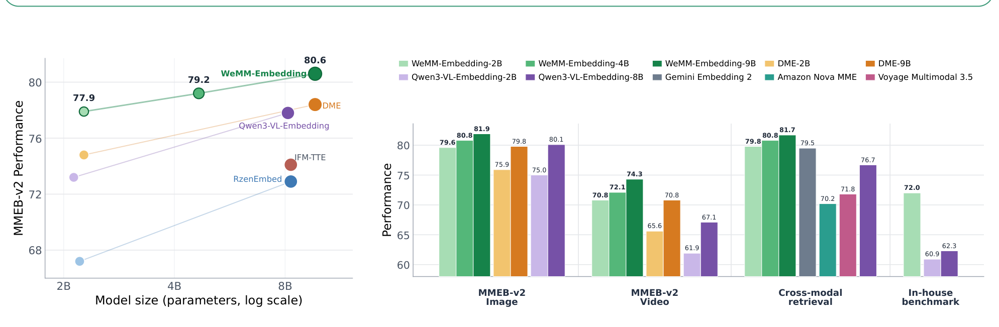
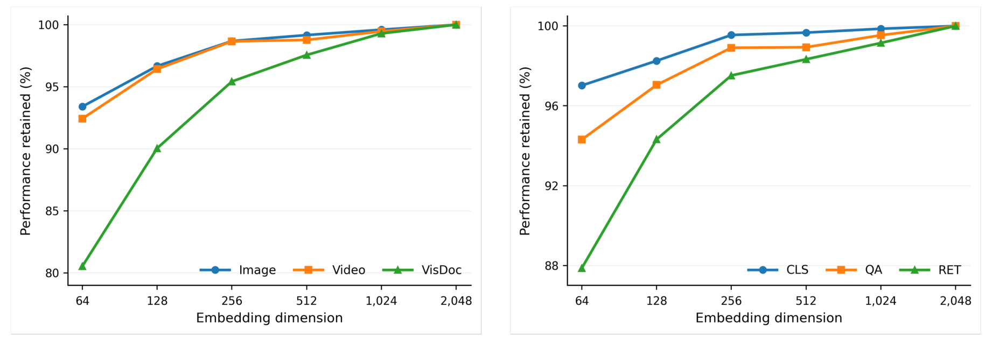

# WeMM-Embedding 技术报告

## 来源

- 文件：`raw/2608.24053v1.pdf`
- 标题：WeMM-Embedding: WeChat Multi-Modal Embedding Technical Report
- 团队 / 日期：Junjie Zhou、Ke Mei（项目负责人）、Lei Li、Tianyi Wang、Fengyun Rao（通讯）、Jing LYU；WeChat Vision, Tencent Inc.；arXiv:2608.24053v1，2026-08-25（封面日期 August 26, 2026）
- 权重 / 代码：[Hugging Face collection](https://huggingface.co/collections/tencent/wemm-embedding)、[Tencent/WeMM-Embedding](https://github.com/Tencent/WeMM-Embedding)
- 模型页：[WeMM-Embedding](../models/wemm-embedding.md)
- 定位：**通用多模态 embedding 技术报告**，发布 2B / 4B / 9B 三档权重。输入覆盖文本、图像、视频、视觉文档和任意交错组合；输出维度可经 Matryoshka 截断。**不支持音频**。基座是对应尺寸的 natively multimodal [Qwen3.5](../models/qwen3.5.md)（§3）。

## 核心结论

1. **MLLM 隐状态 + 对比学习是当前通用多模态 embedding 的主范式**。CLIP 式双塔走不通交错图文 / composed query / 视频+字幕；后续把视觉编码器当 tokenizer 仍不够通用。把 MLLM hidden state 做成 embedding、再在配对数据上继续对比训练，已成为这条线的默认做法（§1）。
2. **两阶段：几百兆异构对对齐，再在约 1/10 精炼集上做细粒度相关性和跨尺度蒸馏**。Stage 1 建覆盖；Stage 2 用 Semantic-ID 重采样、质量过滤、hard negative、reranker 排序监督和 9B teacher 蒸馏把匹配做细（§2–§3）。
3. **参数效率：2B 已超过此前领先的 8B 开源**。MMEB-v2（78 任务）上 2B 得 77.9，超过 Qwen3-VL-Embedding-8B 的 77.8 和 DME-Small-2B 的 74.8；4B 到 79.2，超过所有对照的 8B–9B；9B 到 **80.6**，作者称截至 2026-08-24 官方 leaderboard 第一，超过所有列出的开源和闭源提交（Table 1、Figure 1）。
4. **生产侧有落地，不只榜**。26 任务微信内部基准上 2B 相对 Qwen3-VL-Embedding-2B 从 60.9 提到 72.0；14 组在线 A/B 一致正向并已全量。部署面包括视频号 / 公众号 / 朋友圈推荐与搜索，以及电商（§4.3、Table 4）。
5. **256 维就保住绝大部分质量**。2B 在 MMEB-v2 上把 2048 维截到 256，图像和视频都保留 98.7%；三类任务（CLS / QA / RET）都超过 97%。视觉文档对降维更敏感（Figure 3）。

> Figure 1（原文截图，摘要旁）："Performance and efficiency overview of WeMM-Embedding. Left: MMEB-v2 overall performance across different model sizes, compared with representative baselines. Right: Aggregate performance on the MMEB-v2 image and video subsets, a 12-dataset cross-modal retrieval suite, and the 26-task in-house benchmark."

## 数据（已据原文核实）

异构任务统一成 source–target 配对（Eq. 1）

$$z_i=(I_i,q_i,c_i,N_i,y_i)$$

其中 $I_i$ 是可选任务指令，$q_i$ / $c_i$ 可为文本、图像、视频或交错组合，$N_i$ 是显式 hard negative，$y_i$ 是可选分级相关分。标准配对只用 $(q,c)$；分类等共享 target 空间会引入 false negative，用 duplicate-aware masking 排除（§2.1、§3.2）。

大规模语料来自公开数据、web 弱监督、任务向合成和内部数据，量级是 **several hundred million** 对。六大家族（Figure 2）：弱监督图/视频–文本、细粒度 caption、检索（含 composed / instruction / tool / GUI / moment / reasoning）、分类（类别名或自然语言描述作 target）、多模态 QA、以及人工离散相关档的 graded relevance。

> Figure 2（原文截图，§2 开篇）："Overview of our multimodal training data. Major data families and representative coverage across diverse task settings and content domains."

精炼集约为大规模集的 **1/10**，三步构造（§2.2）：

1. **Semantic-ID-guided resampling**。取 pair 中序列更长的一侧，用 WeMM 中间 checkpoint 编码，拟合三级 residual k-means（RQ-KMeans），得到三元组 Semantic ID；密集团子降采样、稀疏团子保留，避免高频语义被反复看到，但**不强制 Semantic ID 均匀**。灵感来自生成式检索的 Semantic ID。
2. **MLLM 质检与改写**。按任务上下文判断 pair 是否符合预定匹配关系；弱监督 alt-text 可纠事实错误，但保持原风格和详细程度。
3. **Hard negative**。文本 target 由 MLLM 生成「像但错」的候选；图像/视频 target 用中间 checkpoint 从任务候选池检索近邻；一小部分再用 reranker 打分，给更细的序关系。

## 架构与训练（已据原文核实）

三档都建在对应尺寸的 Qwen3.5 原生多模态骨干上。输入是可选指令加有序多模态段 $D=\langle I_{\mathrm{inst}},x_1,\ldots,x_m\rangle$；文本走原生 tokenizer，视觉走原生视觉管线，按原顺序拼接后再追加专用 `<embedding>` token，取其**最后一层 hidden** 做 L2 归一化作为向量（Eq. 2–5）。默认该 token 放在序列末尾，在因果 mask 下看全部前文。

同一前向可以插多个 `<embedding>`。例子：视频后接 ASR 转录时，一个 token 放在视频 token 之后、一个放在序列末尾，一次前向同时得到 video-only 和 video–text 联合表示（§3.1）。

Matryoshka：完整 hidden $h_{\mathrm{emb}}\in\mathbb{R}^D$ 取前 $d$ 维再 L2，一次前向出所有支持维度（Eq. 6）。具体 $D_{\mathrm{MRL}}$ 集合原文只写「预定义」，未列出各档数字。

### Stage 1：大规模多任务对齐

每个 batch 来自**单一数据源**（任务定义和候选空间一致），不同任务的 batch 交错。标准配对用 InfoNCE；带人工离散相关档的用 score-gap-weighted CoSENT 式排序损失。两种目标都按所有 MRL 维度分别算再加权求和（Eq. 13）。

对比损失里，正样本是配对 target，负样本是同 batch 其他 target，外加显式 hard negative。计算前做 **duplicate-aware masking**（Eq. 8）：源侧若 $s(q_i,q_j)>\tau_{\mathrm{dup}}$，则丢掉 $q_j$ 的全部候选；目标侧若 $s(c_i^+,c)>\tau_{\mathrm{dup}}$，则该候选不算负——分类这种重复 label 的任务尤其需要。温度 $\tau$ 可学习。

分级相关损失（Eq. 10–12）：pair $i,j$ 的权重是 $|y_i-y_j|$（有下限 $\epsilon$）；只对不等标签施加序约束，标签相同不排序。作者强调这是 item-to-item 检索 / 推荐里「相关有程度」而不能当普通正样本的原因。

### Stage 2：精炼微调与蒸馏

对比和分级目标保留。额外两路监督：

**Reranker 监督**（Eq. 14–15）。专用多模态 reranker 对「正样本 + mined hard negative」打分，仍用 score-gap-weighted CoSENT，但比较只发生在**同一 query 的候选之间**。经验上，对 embedding 检索出的候选再 rerank **并不在所有多模态任务上稳定变好**（作者称与 Qwen3-VL-Embedding 报告 [22] 观察类似），因此只在「确实有稳定收益」的任务上启用。被启用的任务集合未披露。

**Embedding 蒸馏**（Eq. 16–20）。更大的同族模型当 teacher，在线用当前 batch 的 source–target 相似矩阵做双向 KL：源→目标和目标→源各一份 softmax 关系分布。不需要离线标注，能覆盖异构 batch。作者写这路对 compact 变体「特别有价值」。

Stage 2 总损失：$L_{\mathrm{Stage2}}=L_{\mathrm{Task}}+\lambda_{\mathrm{Emb}}L_{\mathrm{Emb}}$。2B / 4B 的 teacher 是**冻结的 9B**。9B 没有更大 teacher，改成训多份「互补数据混合 + 训练配置」的 Stage 2 变体，再 **model merging**（引 TIES-Merging [47]）得到最终 9B。原文没有写 merge 配方、变体数量或是否就是 TIES。

## 评测要点

协议：MMEB-v2 / v3 按官方，图像/视频/音频/agent 用 Hit@1，文本和视觉文档用 NDCG@5；MMEB-v3 的 V3-All 对不支持任务记 0——当前模型音频 11 项全为 0。Leaderboard 截止 2026-08-24。Gemini Embedding 2 / Amazon Nova MME / Voyage Multimodal 3.5 的跨模态分来自 Gemini Embedding 2 报告，Qwen3-VL-Embedding 与 WeMM 由作者自己在公开集上复测（§4.1–§4.2）。

### MMEB-v2（Table 1，78 任务）

| 模型 | Size | AVG | Image | Video | VisDoc |
| --- | ---: | ---: | ---: | ---: | ---: |
| Qwen3-VL-Embedding | 2B | 73.2 | 75.0 | 61.9 | 79.2 |
| DME-Small† | 2B | 74.8 | 75.9 | 65.6 | 79.9 |
| **WeMM-Embedding** | **2B** | **77.9** | **79.6** | **70.8** | **80.7** |
| **WeMM-Embedding** | **4B** | **79.2** | **80.8** | **72.1** | **82.0** |
| Qwen3-VL-Embedding | 8B | 77.8 | 80.1 | 67.1 | 82.4 |
| DME-Medium† | 9B | 78.4 | 79.8 | 70.8 | 82.0 |
| **WeMM-Embedding** | **9B** | **80.6** | **81.9** | **74.3** | **83.3** |
| Seed-1.6-Embedding⋆ | – | 76.9 | 78.0 | 67.7 | 82.2 |
| QQMM-embed-v4† | – | 78.3 | 82.0 | 67.4 | 80.9 |
| Octen-VL-Large⋆ | – | 80.1 | 81.9 | 76.0 | 80.5 |
| DME-Large† | – | 80.2 | 81.1 | 74.4 | 83.4 |

† 闭源 leaderboard 提交，无公开权重或推理端点。⋆ 参数量未披露的商业模型。2B 相对 Qwen3-VL-Embedding-2B / DME-Small 分别 +4.7 / +3.1；并略超 Qwen3-VL-Embedding-8B。视频分项里 2B 的 CLS 84.9、QA 71.7、V-Ret 63.4、M-Ret 58.4；9B 的 moment retrieval 仅 58.5，几乎不随尺寸涨。

### MMEB-v3（Table 2，190 任务）

新增 53 文本（推理检索 / instruction following / 长上下文 / 多条件 / 通用）、47 agent（tool / GUI / memory）、11 音频、以及 MCMR。WeMM-2B 的 V3-All 56.0 已超过所有对照；4B / 9B 到 58.2 / 59.5。文本 45.3 / 47.9 / 48.8，agent 45.1 / 49.0 / 51.0。音频全 0。MCMR 上 2B 42.5 略高于 4B 的 41.9，9B 到 49.3。

### 跨模态检索 12 套（Table 3）

AVG：WeMM 2B / 4B / 9B = 79.8 / 80.8 / 81.7，对照 Qwen3-VL-Embedding-8B 76.7、Gemini Embedding 2 79.5、Amazon Nova MME 70.2、Voyage Multimodal 3.5 71.8。视频检索（VATEX / MSR-VTT / YouCook2 均值）是拉开差距的主因：2B 已 70.4，Gemini Embedding 2 为 63.1。文档检索 ViDoRe V2 上 2B 的 61.4 低于 Gemini 的 64.9，9B 才到 66.3。

### 内部 26 任务与在线（Table 4、§4.3）

| 模型 | Size | AVG | Classification | Search | Cross-DM | Article Rel. | Video Rel. |
| --- | ---: | ---: | ---: | ---: | ---: | ---: | ---: |
| Qwen3-VL-Embedding | 2B | 60.9 | 60.1 | 51.9 | 55.5 | 75.5 | 64.9 |
| WeMM-Embedding | 2B | 72.0 | 72.6 | 65.5 | 73.7 | 86.4 | 68.8 |

五类全胜，总 +11.1。推荐链路用法：候选召回、排序特征、用户序列、跨域内容理解；从向量再导出 Semantic ID 作索引和序列的离散特征。14 组 A/B 正向后全量，作者称对长尾和新内容有可见收益。搜索覆盖视频号、公众号、朋友圈，单模态和跨模态都用。**未给 A/B 的指标名、幅度或置信区间**。

### 消融

Stage-1 小规模 2B（Table 5；此表 AVG 71.9，与 Table 6 的 Stage-1 checkpoint 75.7 不是同一实验尺度）：

| 配置 | AVG | Image | Video | VisDoc |
| --- | ---: | ---: | ---: | ---: |
| Full | 71.9 | 76.1 | 59.1 | 75.3 |
| w/o task-specific instructions | 71.1 | 75.7 | 58.2 | 73.8 |
| w/o task-consistent batching | 68.5 | 71.5 | 56.3 | 73.1 |
| w/o duplicate-aware masking | 71.4 | 75.3 | 58.6 | 75.1 |

最大项是 **task-consistent batching（−3.4）**：混采 batch 会毁掉「同任务、同候选空间」的 in-batch negative。指令主要伤 VisDoc（−1.5）。masking −0.5。

Stage-2 2B 累积（Table 6）：

| 累积配置 | AVG | Image | Video | VisDoc |
| --- | --- | ---: | ---: | ---: |
| Stage-1 checkpoint | 75.7 | 77.7 | 67.5 | 78.9 |
| + curated data | 76.6 | 78.9 | 69.2 | 78.5 |
| + reranker supervision | 76.7 | 78.8 | 69.4 | 79.1 |
| + embedding-teacher distillation | 77.6 | 79.4 | 70.0 | 80.4 |
| + expanded visual input budget（final） | 77.9 | 79.6 | 70.8 | 80.7 |

精炼数据 +0.9；reranker 几乎只抬 VisDoc（78.5→79.1），总分只 +0.1，和「只在少数任务上稳定」的正文一致；蒸馏 +0.9 且三域都动；提高分辨率和视频帧密度再 +0.3，视频受益最大。四项合计 +2.2。

> Figure 3（原文截图，§4.4.1）："MRL analysis of WeMM-Embedding-2B on MMEB-v2. Left: Performance retained on the image, video, and visual-document subsets across embedding dimensions. Right: Performance retained for classification (CLS), question answering (QA), and retrieval (RET), each averaged over the corresponding image and video tasks."

## 待追问

- **基座 checkpoint 细节**：原文只写「corresponding natively multimodal Qwen3.5 backbones」，未写 Instruct / Base / thinking、是否冻视觉编码器、是否改 GDN:full-attention 混合比。
- **训练配方空白**：optimizer、学习率、步数、硬件、global batch、$\tau$、$\tau_{\mathrm{dup}}$、$\alpha_d$、$\lambda_{\mathrm{Emb}}$、各档 $D_{\mathrm{MRL}}$、Stage 2 视觉分辨率和帧采样数均未给。
- **数据不可复现**：几百兆对的来源配比、内部数据占比、Semantic-ID 码本大小、reranker 启用任务列表都没有。
- **9B merge**：引了 TIES-Merging，但没写变体数、互补混合是什么、merge 算法超参；无法判断 80.6 有多少来自 merge 而不是容量。
- **榜与生产口径**：MMEB-v2「官方第一」是 2026-08-24 快照；内部 26 任务和 14 组 A/B 无分项定义、无误差条，无法对外复现。
- **音频缺口**：同组 WAVE（ICLR 2026，部分作者重叠）做了 audio-visual embedding，WeMM 明确不支持音频、V3 音频记 0。结论里写未来做 omni-modal，但本报告没有衔接 WAVE 的机制说明。这是作者名单与引用上的推断，不是原文陈述。
- **moment retrieval 几乎不随尺寸涨**（2B 58.4 / 4B 58.6 / 9B 58.5）：是数据不够、目标不匹配，还是 Qwen3.5 时间建模上限，原文未分析。

## 相关页面

- 模型：[WeMM-Embedding](../models/wemm-embedding.md)
- 基座：[Qwen3.5](../models/qwen3.5.md)
- 同基座采用：[InternVLA-A1.5](../models/internvla-a1.5.md)（Qwen3.5 2B 做 VLA backbone，任务不是 embedding）
