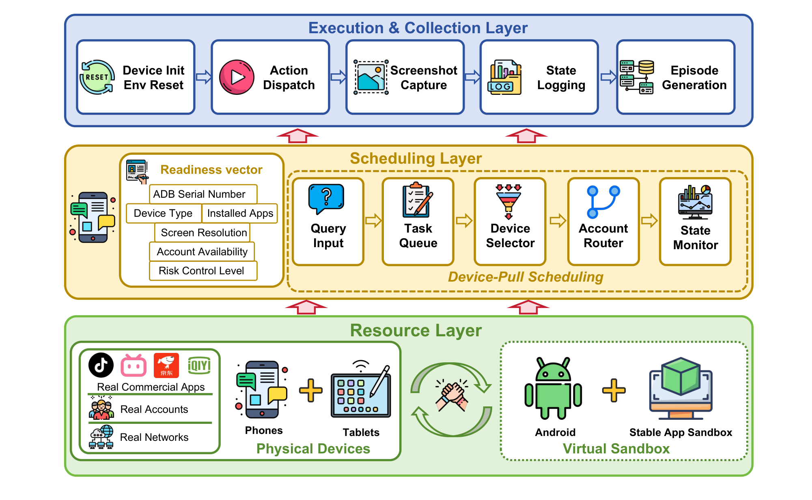
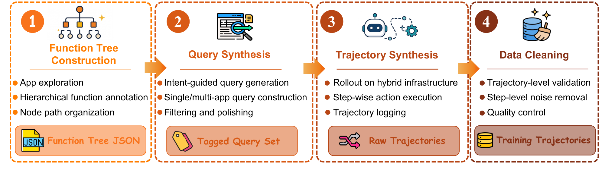
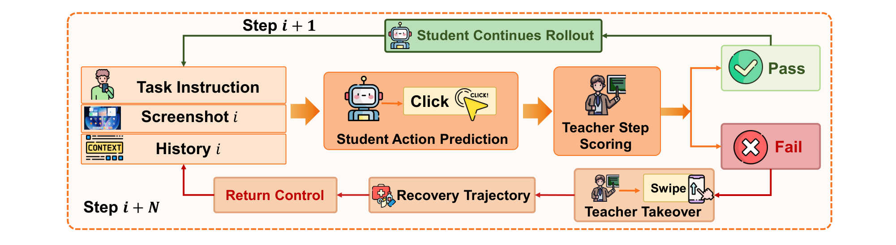
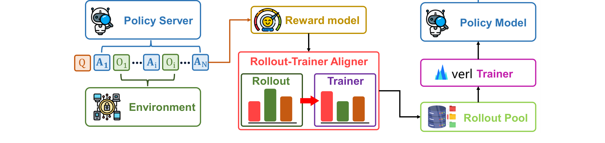

# Xiaomi-GUI-0 技术报告

## 来源

- **PDF**：`raw/2606.31410v2.pdf`（arXiv:2606.31410v2, SeerRay Team, 2026-07-01, 40 页）
- **Homepage**：https://seerray-lab.github.io/Xiaomi-GUI-0/
- **团队**：小米 SeerRay Team（通讯作者 Heng Qu / Jian Luan）
- **基座**：[Qwen3-VL-30B-A3B-Instruct](../models/qwen3-vl.md)
- **模型页**：[Xiaomi-GUI-0](../models/xiaomi-gui-0.md)

## 核心结论

Xiaomi-GUI-0 是一个面向**真实移动环境**的 native end-to-end multimodal GUI agent。报告的核心论点不是"模型更强"，而是**benchmark 高分不等于真实可用性**：真实设备上的账号状态、权限弹窗、支付验证、风控拦截、动态页面加载持续改变执行时的状态分布，而依赖离线成功轨迹、模拟环境和标准化 benchmark 训练的模型无法覆盖这些异常态。

为此，报告构建了一个以**真机执行为中心**的闭环：真机为主的混合基础设施 → 多源训练数据 → error-driven data flywheel → 三阶段渐进训练 → RealMobile 真机评测。关键数字：

- **RealMobile**：72.0% success / 85.8% progress（100 任务，14 应用，57% 跨应用）
- **AndroidWorld**：78.9%（超过 UI-Venus-1.5-30B-A3B 的 77.6%）
- 开源模型中大幅领先：最强开源对手 MAI-UI-8B 在 RealMobile 仅 33%
- 接近闭源前沿：Gemini 3.1 Pro 85% / Seed 2.0 Pro 80%，Xiaomi-GUI-0 72%

## 架构与训练

### 真机为主的混合基础设施

报告的第一个贡献是基础设施设计。主流商业应用普遍采用反模拟器检测，导致许多真实应用在虚拟化环境下无法稳定运行，而验证码、支付验证、登录过期、风控拦截等异常态更难在模拟器中复现。因此 Xiaomi-GUI-0 以物理设备为主执行环境，沙箱为辅。

> Figure 1 Overview of our hybrid infrastructure. Hundreds of physical phones and dozens of physical tablets form the primary execution substrate, complemented by hundreds of sandbox instances for scalable and reproducible collection.（§ 2.2 System Architecture）

三层架构的关键设计（已据原文核实）：

- **资源层**：物理设备池覆盖近十种主流品牌（手机 / 平板 / 车机），手机覆盖 100 个最高频商业应用，平板和车机覆盖 20 个应用；沙箱池数百并发实例，承接风控较温和的应用。设备入池前经过标准配置（应用安装、账号登录预热、ADB 连接、权限弹窗抑制）。
- **调度层**：采用 **Device-Pull** 调度——空闲设备按自身就绪状态（ADB 序列号、设备类型、分辨率、已装应用、账号可用性、风控等级）主动拉取任务，而非推送式分发。这适配了真机的不可预测性（随时离线、登录失效、触发风控、进入冷却期）。
- **执行与采集层**：标准 observe–decide–act 循环，动作统一到 Appendix B 的 action space。每条归档轨迹存储任务描述、设备类型、应用与账号状态、截图序列、动作内容、执行状态、时间戳和异常类型。

### 多源训练数据

训练数据分三个渐进层级 + 一个 error-driven flywheel：

1. **高频任务数据**（§ 3.1）：针对单应用、短路径、目标明确的头部功能。每个功能由多条自然语言 query 实例化，每条 query 采集多条功能等价轨迹覆盖不同入口。强调中间页数据增强（正确路径上的中间页 / 同应用错误页 / 跨应用相似功能页）和应用上下文标注（每步截图标注前台应用名，消除跨应用视觉相似页的歧义）。另采约 5000 样本覆盖 14 类异常态。
2. **高泛化数据**（§ 3.2）：面向长尾意图。以五级 function tree 为索引，引入 **behavior buckets**（用户意图级抽象，每个应用 8–10 个 bucket）做两轴采样：behavior bucket 为主轴保证 query 自然性，function tree 为辅轴保证长尾覆盖。query 后处理三阶段：LLM-judge 三轴打分（realism / completability / complexity）、自然语言润色、function-point 回标。轨迹清洗分两层：trajectory-level（子任务分解 + VLM judge 逐步判定，320 条上与人抽查 94% 一致）和 step-level（检测重复段并从训练标签中剥离但保留为历史证据，转化为反思导向监督）。

> Figure 2 High-generalization data construction pipeline: from function-tree construction through behavior-bucket query synthesis, trajectory rollout on the hybrid infrastructure, and trajectory- and step-level cleaning, with function-point back-tagging closing the loop on coverage.（§ 3.2 High-Generalization Data）
3. **能力增强数据**（§ 3.3）：用五标签结构化 CoT schema 规范自由文本推理——`[Observation]` / `[Reflection]`(optional) / `[Plan]`|`[Plan Update]`|`[Replan]` / `[Decision]` / `[Memory]`。四条设计原则：完整性强制（每步必含 Observation / Plan / Decision / Memory）、状态继承（前步 Plan 和 Memory 传到下一步）、计划局部化（每步维护可更新的局部 plan 而非全局 plan）、反思与重计划分离（偏差先触发 Reflection 再 Replan）。合成用 Gemini 3.1 Pro，施加双向一致性约束：forward derivability（Decision 可从 Observation + planning 推出）和 label consistency（Decision 中动作与原始 action label 完全匹配）。

### Error-Driven Data Flywheel

这是报告的核心创新之一。GUI 执行是序列决策过程：第 i 步的错误 tap 改变第 i+1 步的状态分布，效应可能级联到整条轨迹。静态语料有两个结构性局限——off-policy（标注数据不匹配模型当前执行分布）和 success-biased（训练数据过度代表正确状态下的正确动作）。Flywheel 围绕模型自身的错误分布构建，包含两个互补阶段：

**交互式标注**（§ 3.4）：标注者在平台 UI 中回放失败轨迹，定位**首个关键错误**（first-key-error），提供纠正动作 + 错误原因 + 错误类型。GUI 失败通常级联——早期错误 tap 误置页面后所有后续动作都基于错误状态——因此只标注首个关键错误既降低成本又不丢失级联信息。纠正动作作为该错误步的监督标签，前缀作为历史；原始错误步不丢弃而保留为历史，供后续 recovery 训练使用。

**Teacher 打分与接管**（§ 3.4）：将纠正监督扩展到人工标注之外。Student 在集群上 rollout 时，teacher 模型每步接收截图 + 历史 + 任务目标 + student 动作，返回质量分 + 文本理由。连续多步低于阈值时，teacher 接管有限步数，产生从错误状态回到可行路径的恢复动作，之后控制权还给 student。

> Figure 5 The student rolls out on the cluster while the teacher scores each step. Sustained below-threshold scores trigger a bounded takeover that produces a deviation–diagnosis–recovery segment before control returns to the student.（§ 3.4 Error-Driven Data Flywheel）

与传统 GUI agent flywheel 的区别：传统 flywheel 围绕数据规模和吞吐组织——rollout 产更多轨迹，高质量的进 SFT，低质量的进 continual pre-training，循环迭代；本质是轨迹选择而非显式恢复监督，保留了干净成功、丢弃或降权失败，但很少产生从错误状态桥接回正确路径的数据。Teacher 打分与接管**刻意产生 deviation、diagnosis、recovery 段**，让反思和纠正监督直接针对模型能力瓶颈。随迭代推进，简单错误从 rollout 中消失，循环集中在剩余的更难类别上。

## 后训练

### 三阶段渐进训练

三阶段按监督信号可用性和粒度排序，形成从 dense 到 sparse feedback 的课程（§ 4.1，已据原文核实）：

| 阶段 | 监督粒度 | 目标 | 初始化 |
| --- | --- | --- | --- |
| SFT | per-token（最 dense） | 学输出协议、action space、基本交互模式 | Qwen3-VL-30B-A3B-Instruct |
| Step RL | response-level（单步内可判定） | 纠正局部错误：无效动作、推理结构不完整、记忆缺失、推理与动作不一致 | SFT checkpoint |
| Agentic RL | trajectory-level（需完整 rollout 后才有 reward） | 长周期行为：跨页状态保持、中途恢复、跨应用一致性、任务级成功 | Step RL checkpoint |

### SFT

四源数据联合训练（高频任务 / 高泛化 / 能力增强 / flywheel 纠正动作）。每个训练实例是单步交互 `(x, h_t, o_t, y_t)`：任务指令 + 交互历史 + 当前截图 + 目标响应（含结构化 CoT + 动作）。next-token prediction loss，条件上下文 `(x, h_t, o_t)` 排除在监督外。

- 数据：~1.2M GUI step-level samples（来自 ~120K 轨迹）+ 4.4M grounding samples（解析屏幕所有可见元素并预测坐标 / 功能 / 文本 / 属性）
- 超参：1 epoch, batch 256, seq 8192, AdamW lr 1e-5 cosine decay 10% warmup

### Step RL

采用 [GSPO](group-sequence-policy-optimization.md)（§ 4.3）。GUI agent 响应耦合结构化 CoT 和动作，正确性依赖整体结构而非单 token，因此用 sequence-level importance ratio 匹配优化单元。

**Cascade reward** 是 Step RL 的关键设计——不独立打分各维度再加权求和（per-dimension 分数难以标定到统一尺度且权重引入敏感超参），而是按固定顺序从低成本必要条件到高成本充分条件逐级检查，首个失败级决定 reward：

| Level | Checker | 失败条件 | Reward |
| --- | --- | --- | --- |
| L1-A | Rule-based parser | 严重协议/格式错误、解析失败、代码异常 | −1.0 |
| L1-B | Rule-based action | 可解析但动作/参数/tool call 无效或与监督不一致 | −0.5 |
| L2 | Rule-based structure | 必需推理字段缺失/畸形/乱序 | −0.5 |
| L3 | LLM-as-judge capability | Reflection / memory / planning 与当前状态/历史/任务冲突 | −0.5 |
| L4 | LLM-as-judge consistency | 推理、动作描述、tool call 语义或因果不对齐 | −0.5 |
| Pass | All levels | 全部通过 | 1.0 |

top-down early-exit：L1/L2 rule-based 低成本拒绝畸形响应，L3/L4 LLM-as-judge 只在已验证 well-formed 的响应上调用，约束评估成本。三值 reward（−1.0 / −0.5 / 1.0）。

效率优化两轴：rollout throughput（异步 rollout 抑制 batch 内长尾延迟 + FP8 rollout 加速 + curriculum scheduling 对齐 prompt 与当前 policy 能力）和 sample efficiency（[DAPO](dapo.md) 的 dynamic sampling 丢弃 degenerate advantage group——全组相同 reward 无梯度）。

- 数据：~0.4M GUI step-level samples（来自 ~40K 轨迹）
- 超参：16 responses/prompt, lr 1e-6, asymmetric clip (3e-4, 4e-4), 1 epoch, batch 128 prompts

### Agentic RL

从单响应优化扩展到多步 GUI 交互（§ 4.4）。轨迹 `ξ = (x, o₁, a₁, r₁, …, o_T, a_T, r_T)`。

**在线训练框架**解耦推理、环境执行和数据传输：GUI rollout 交替两种延迟截然不同的操作——GPU-bound LLM inference（受益于高并发）和 device-bound 环境执行（延迟取决于任务复杂度 / 设备状态 / 网络条件）。同步绑定会 under-utilize 资源并放大长尾效应。框架用独立异步状态机驱动每条轨迹：推理请求分发到 SGLang 集群（session-affinity routing 复用 prefix-cache），观测和动作执行在独立异步路径上（容忍设备热插拔），数据传输用 TransferQueue 分离控制面和数据面（轻量元数据走控制器，截图和张量等大 payload 存分布式存储按引用访问）。

> Figure 6 Online training framework for Agentic RL.（§ 4.4 Agentic Reinforcement Learning）

**Turn-level batching**：整条轨迹可能很长，直接训练序列过长。按 turn 组织训练数据（每个 turn = 一个 `(x, h_t, o_t, y_t)`），history `h_t` 只保留固定窗口内最近步的响应，控制每序列上下文量。不改变优化目标——advantage 仍来自整条轨迹：保留 trajectory id 和 turn index，reward 归一化和 group-relative advantage 估计在 turn 重组为完整轨迹后进行，每个 turn 继承其父轨迹的 return 推导的 advantage。GSPO objective 复用，turn 扮演 Step RL 中 response 的角色。

**Curriculum sampling**（遵循 STEP）：每个任务 q 维护平滑成功率估计 SR_q，打分 `score_q = α·log(SR_q) + β·log(1−SR_q)`，softmax over scores 得采样概率。温度 η 控制集中度，α/β 训练中调整以从易到难迁移采样质量。

- 数据：数千任务，轨迹在线生成
- 超参：16 responses/prompt, lr 1e-6, clip (3e-4, 4e-4), batch 32 prompts, max prompt 8192, SR decay 0.9, α: 1.5→0.5, β: 1.0→2.0, η=1.0

### 实验设置

- 硬件：64× NVIDIA H100（8 节点 × 8 GPU）
- 框架：verl（RL）+ Megatron-Core（训练后端）+ SGLang（rollout engine）
- 所有数字为 4 次运行均值（benchmark 评测方差较大）

## 评测要点

### RealMobile Benchmark

报告的第三个贡献。区别于现有 benchmark 的三点（§ 5）：

1. **全真机真应用**：物理设备 + live 应用，非模拟器/mock 环境
2. **细粒度 sub-goal 打分**：非二元 pass/fail，每个任务 3–6 个 sub-goal，按完成比例给分，支持 partial credit
3. **跨应用为主**：57% 任务跨应用，要求 agent 跨应用边界维持状态

**100 任务 / 14 应用 / 4 能力域**：

| 能力域 | 子维度 | 任务数 | 平均应用数 | 跨应用比例 |
| --- | --- | --- | --- | --- |
| Foundation | Basic Operations | 10 | 1.30 | 10% |
| Safety & Reflection | Safety Constraints / Reflection | 7 / 9 | 1.31 | 31% |
| Memory & Knowledge | Objective / Subjective / World Knowledge | 16 / 7 / 10 | 1.73 | 58% |
| Complex Reasoning & Planning | Math & Logic / Multi-source Comparison / Complex Objective / Complex Subjective | 10 / 12 / 13 / 6 | 2.49 | 78% |
| **Overall** | | **100** | **1.93** | **57%** |

**评测协议**四组件：sub-goal decomposition（每个 sub-goal 对应一个可验证中间里程碑）、scoring mechanism（完成 sub-goal 数 / 总数）、veto mechanism（不可恢复错误直接归零，如发错消息 / 删用户数据 / 未授权金融操作）、conditional branching（多条有效执行路径均可得满分）。

**双验证框架**：XML structure matching（XPath 查询 UI hierarchy 验证元素存在/已被操作）+ logical semantic rules（sequential constraints 保证操作顺序 + consistency constraints 验证跨步信息传递）。auto-eval pipeline 四阶段：OCR → 检查 veto → 逐 sub-goal XPath + 代码函数验证 → 计算分数。

### 主要结果

| 模型 | RealMobile Success | RealMobile Progress | AndroidWorld |
| --- | --- | --- | --- |
| Gemini 3.1 Pro | 85.0% | 89.6% | – |
| Seed 2.0 Pro | 80.0% | 88.1% | – |
| **Xiaomi-GUI-0-30B-A3B** | **72.0%** | **85.8%** | **78.9%** |
| Claude Opus 4.7 | 60.0% | 74.8% | – |
| Gemini 3.1 Flash | 58.0% | 72.4% | – |
| Claude Opus 4.6 | 33.0% | 56.7% | – |
| MAI-UI-8B（最强开源） | 33.0% | 50.8% | 70.7% |
| UI-Venus-1.5-30B-A3B | 21.0% | 44.6% | 77.6% |
| UI-TARS-1.5 | 24.0% | 40.5% | 64.2% |

**按能力域**（§ 6.2）：

- Foundation：100% success，与 Gemini 3.1 Pro / Seed 2.0 Pro 并列——基础 UI 操作接近饱和
- Safety & Reflection：43.8%——所有模型最弱域（Gemini 3.1 Pro 也仅 62.5%），Xiaomi-GUI-0 为开源最高
- Memory & Knowledge：66.7%——开源领先但落后 Gemini 3.1 Pro（93.9%）/ Seed 2.0 Pro（90.9%），知识密集型回忆可能更依赖模型容量
- Complex Reasoning & Planning：80.5%——接近 Gemini 3.1 Pro（82.9%）/ 超 Seed 2.0 Pro（73.2%），开源最强对手仅 31.7%

## Action Space 与异常语义

统一动作空间 13 个动作（Appendix B），坐标为 [0,1]² 相对位置：

- Touch：Tap / LongPress / Swipe
- Text input：Type / Search（macro: tap→clear→type→submit）
- System & navigation：Open / Back / Home / Wait
- Interaction：Request（向用户要缺失信息/确认/澄清）
- Termination：Fail（带 type + reason）/ Complete / Speak

**14 类异常语义**（Fail.type 的合法值，Appendix B.1）：LOGIN_REQUIRED / USE_GUIDANCE / CAPTCHA_VERIFICATION / RESULT_NOT_FOUND / BLUETOOTH_CONNECTION_REQUIRED / NETWORK_ERROR / PAYMENT_AUTHENTICATION / TASK_CANT_FULFILLED / REPEAT_OPERATION / PERMISSION_REQUEST / PASSWORD_REQUIRED / TAKEOVER_EXIT / TEMPORARY_TAKEOVER / MANUAL_VERIFICATION_REQUIRED。将线上 50+ 种异常态归并为 14 种 handoff 语义，每种对应一种预期行为（停止 / 暂停 / 交还用户）。系统 prompt 中还有 loop breaker：连续三步无可见变化或同一动作循环时先自纠正（Back 或换目标），失败再调 Fail。

## 待追问

- 报告未披露 Qwen3-VL-30B-A3B-Instruct 之外是否有视觉编码器/adapter 的修改——是否完全复用原 backbone 的视觉前端？
- Error-driven flywheel 的 teacher 模型是什么——是否是更强版本的 Xiaomi-GUI-0 或外部闭源模型？teacher 打分的 LLM-as-judge 部分（cascade reward L3/L4）用什么模型实现？
- 5000 异常态样本的 14 类分布如何——是否某些类别样本过少导致学习不充分？
- Agentic RL 阶段"数千任务"的具体规模和来源——是否包含线上真实用户请求的脱敏版本？
- Step RL 的 cascade reward 三值设计（−1.0 / −0.5 / 1.0）是否限制了 reward 信号的表达力——是否有尝试更多层级或连续 reward 的消融？
- RealMobile 的 100 任务是否足够稳定——4 次运行均值的方差是多少？跨应用任务的评测方差是否显著高于单应用？

## 相关页面

- 模型：[Xiaomi-GUI-0](../models/xiaomi-gui-0.md)
- 桌面 GUI 对照：[UI-Mate 技术报告](ui-mate.md)
- 跨域真机对照：[Qwen-UI-Agent 技术报告](qwen-ui-agent.md)（同一真机方向，但对方把真机嵌进跨域 foundation agent；RealMobile ≠ MobileWorld-Real）
- 基座：[Qwen3-VL](../models/qwen3-vl.md)
- 概念：[Agentic engineering](../concepts/agentic-engineering.md)、[Agentic 模型的后训练](../concepts/post-training-for-agentic-models.md)、[Agentic 评测体系](../concepts/agentic-evaluation-benchmarks.md)
