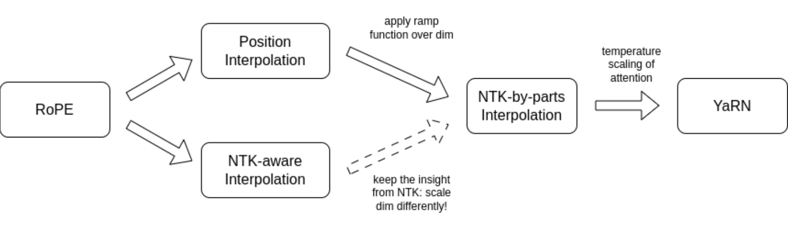
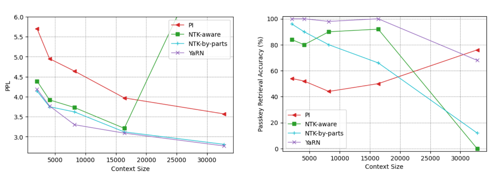
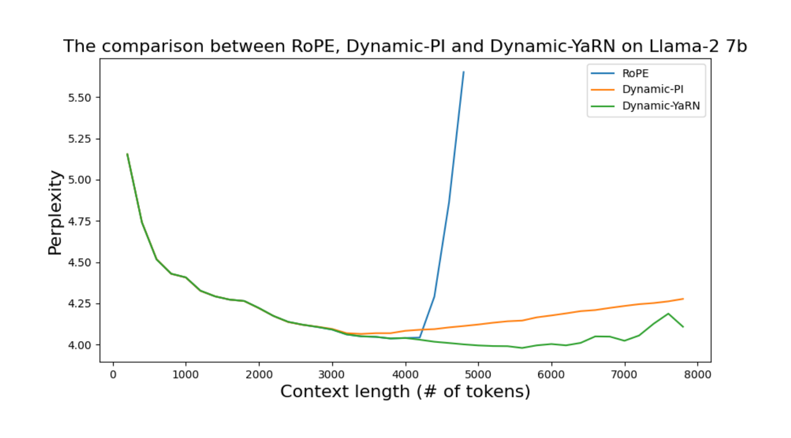

# YaRN：RoPE 上下文窗扩展

## 来源

- 文件：`raw/2309.00071v3.pdf`
- 标题：YaRN: Efficient Context Window Extension of Large Language Models
- 团队 / 日期：Bowen Peng、Jeffrey Quesnelle（Nous Research），Honglu Fan（EleutherAI / University of Geneva），Enrico Shippole；通讯 `{bloc,emozilla}@nousresearch.com`；arXiv:2309.00071v3，2026-02-06（v1 2023-09）
- 代码：[jquesnelle/yarn](https://github.com/jquesnelle/yarn)
- 定位：**方法论文，非模型报告**。不发布新基座；在 LLaMA / Llama 2 上改 RoPE 频率计算并少量微调。机制归属 [零样本 RoPE 上下文扩展](../concepts/zero-shot-rope-context-extension.md)。原文主结果是微调；无微调路径是 Dynamic-YaRN，不是后来生产里常用的固定 `factor` 推理补丁。

## 核心结论

1. **YaRN = NTK-by-parts + attention temperature**（Definition 2，§3.3）。前者按 RoPE 维的波长切分插值压力；后者在 softmax 前把 logits 除以温度 $t$，用来压扩展后变大的注意力熵。二者都改嵌入表，不改 attention 内核，与 Flash Attention 2 直接兼容，训练 / 推理零额外开销（RoPE 表预先生成并复用）。
2. **微调很便宜，而且能 train short, test long**。相对先前 PI 类方法，作者报 **10× 更少 token、2.5× 更少 step**；微调数据不足原预训练的 $\sim 0.1\%$（§1）。Llama 2 7B/13B 用 $s=16$ 在 64K PG19 上训 400 step，再从该 checkpoint 用同一 64K 数据续 200 step 到 $s=32$，Proof-pile 滑动窗 ppl 能外推到 128K（Table 1：7B 2.37、13B 2.24）。
3. **无微调路径是 Dynamic Scaling，不是固定 $s$**。每个 forward 取 $s=\max(1,l'/L)$，与 YaRN 合称 Dynamic-YaRN，作者称可 **超过 2× 上下文、无需微调**（§1、§3.4）。未微调的 Llama 2 上，Dynamic-YaRN 比 Dynamic-PI 更能拦住预训练窗外的 ppl 爆炸（Figure 8、Appendix B.7）。
4. **短窗能力掉得少**。Hugging Face Open LLM 四项上，Llama 2 7B/13B 的 YaRN $s=16$/$s=32$ 相对原版只有小幅波动；$s=16\to s=32$ 再平均掉 0.49%（Table 3、§4.4）。

> Figure 1（原文截图，§1）："An outline of the relationship between different interpolation methods."

## 机制（已据原文核实）

统一写法（§2.1 Eq. 7）：改 RoPE 就是选位置映射 $g(m)$ 和频率映射 $h(\theta)$，使 $f'_W(x_m,m,\theta)=f_W(x_m,g(m),h(\theta))$。扩展倍数 $s=L'/L$（§2.2）。第 $d$ 维波长 $\lambda_d=2\pi/\theta_d$，即该维转满 $2\pi$ 所需的 token 数（Eq. 8）。

### 前作：PI 与 NTK-aware

**Position Interpolation**（Chen et al. 2023）把所有维同等拉伸。附录 A.1 的公式是 $g(m)=m\,L/L'=m/s$，把位置索引压回预训练窗。§2.3 Eq. 9 写成 $g(m)=s\cdot m$，与 §2.2 的 $s=L'/L>1$ 不一致；插值语义以附录为准。均等拉伸会抹掉高频分量，微调后大约 $s=8$ 就开始坏（§3.1）。

**NTK-aware**（bloc97, 2023a）不改 $g(m)=m$，只换 RoPE base：$b'=b\cdot s^{|D|/(|D|-2)}$，让最低频按线性插值那么缩放、最高频保持不变（Definition 3、Appendix A.2）。Code Llama 把 base 调到 1M，作者称 RoPE "adjusted base frequency"（ABF）；YaRN 原文把它**明确归进 NTK-aware，而不是 YaRN**（§3.1 脚注）。Qwen-7B 用过 Dynamic NTK（§1）。NTK-aware 的问题：最优 base 要靠扫；$s$ 不能当真实扩展倍数读，因为部分维被外推到越界值，微调往往不如 PI（Appendix A.2）。

### 频率切分：NTK-by-parts（Definition 1，§3.2）

作者把 RoPE 维分成两类。波长 $\lambda>L$ 的维在预训练里转不满一圈，相对第一个 token 的距离是独特的，**绝对位置信息还在**；短波长维则主要编码**近邻相对顺序**。因此：

- $\lambda\ll L$（高频、相对距离）：**不插值**；
- $\lambda\ge L$（低频、绝对位置）：**只插值、不外推**；
- 中间维两边各沾一点。

用圈数比 $r(d)=L/\lambda_d$ 和两个阈值 $\alpha,\beta$ 定义 ramp $\gamma(r)$：$\gamma=0$ 当 $r<\alpha$，$\gamma=1$ 当 $r>\beta$，中间线性过渡（Eq. 10–11）。Llama 系实验值 **$\alpha=1$、$\beta=32$**（§3.2）。NTK-by-parts 取 $g(m)=m$，

$$
h(\theta_d)=\bigl(1-\gamma(r(d))\bigr)\frac{\theta_d}{s}+\gamma(r(d))\,\theta_d.
$$

$\gamma=0$ 时该维按 $s$ 做 PI 式插值；$\gamma=1$ 时频率原样保留。这是 YaRN 频率半边的一手定义，也是后来 HuggingFace `rope_type=yarn` 按维插值的来源。

### Attention temperature（§3.3、Appendix A.3）

扩展上下文后，作者观察到 softmax 前加温度 $t$ 对 perplexity 的影响**几乎不随样本、不随 token 位置变**（Appendix A.3，Figure 4–6）。注意力改为

$$
\mathrm{softmax}\Bigl(\frac{q_m^\top k_n}{t\sqrt{|D|}}\Bigr).
$$

实现上不必改 attention 代码：把复数 RoPE 嵌入乘 $\sqrt{1/t}$，等价于同时缩放 $q$ 和 $k$。表预先算好，训练和推理都零开销。LLaMA 7B/13B/33B/65B 无微调拟合得到

$$
\sqrt{1/t}=0.1\ln(s)+1,
$$

同一套 $t$ 也大致适用于 Llama 2 7B/13B/70B（Eq. 15）。$s=8$ 时 $\sqrt{1/t}\approx 1.208$（Eq. 23）。这是 YaRN 打「key 变多之后 softmax 摊平」的显式旋钮，与频率切分正交。

**YaRN** = 上述温度 + NTK-by-parts（Definition 2）。

### Dynamic Scaling（§3.4）

凡是带固定 $s$ 的方法（PI / NTK-aware / NTK-by-parts / YaRN）都有两种用法：整段推理锁死 $s=L'/L$；或每个 forward 取 $s=\max(1,l'/L)$。后者叫 Dynamic Scaling。锁死 $s$ 会在短于 $L$ 时打折、超过 $L'$ 时突然崩；动态 $s$ 可以在越过训练窗后平滑退化。与 NTK-aware 合称 Dynamic NTK，与 YaRN 合称 Dynamic-YaRN。

若 RoPE 表被 cache：Dynamic Scaling 下 $s$ 一变，**每个 token 的旋转都变**。正确实现是 cache **施加 RoPE 之前**的 KV（§3.4）。这与 [Jet-Long](jet-long.md) 的 cache 不变量相反：那边存的是基座位置上的已旋转 KV，靠可加性做 correction rotation。

## 训练

Llama 2 7B/13B 扩到 128K：只改 §3.3 的频率计算，$s=16$ 或 $s=32$。学习率 $2\times 10^{-5}$、无 weight decay、线性 warmup 20 step、AdamW $\beta=(0.9,0.95)$。$s=16$：PG19 切成 64K 段（BOS/EOS 包边），全局 batch 64，400 step。$s=32$：从 $s=16$ checkpoint 再 200 step，训练数据仍是 64K，不是 128K（§4.1）。消融用更老的 LLaMA 7B（预训练窗 2K）扩到 32K，同样 400 step。Figure 2 上 YaRN 的训练 loss 低于 PI / NTK-aware / NTK-by-parts。

## 评测要点

Table 1（Proof-pile 十条 ≥128K 文档，滑动窗 $S=256$；$s=16$ 在 128K 上 ppl $>10^1$，续训到 $s=32$ 后落到 2.37 / 2.24）：

| 模型 | $s$ | 步数 | 8K | 16K | 32K | 64K | 128K |
| --- | --- | --- | --- | --- | --- | --- | --- |
| Llama 2 7B | $4\text{K}\times 16$ | 400 | 3.51 | 2.99 | 2.65 | 2.42 | $>10^1$ |
| Llama 2 7B | $4\text{K}\times 32$ | 400+200 | 3.56 | 3.04 | 2.70 | 2.45 | **2.37** |
| Llama 2 13B | $4\text{K}\times 16$ | 400 | 3.25 | 2.79 | 2.50 | 2.29 | $>10^1$ |
| Llama 2 13B | $4\text{K}\times 32$ | 400+200 | 3.29 | 2.83 | 2.53 | 2.31 | **2.24** |

> Figure 3（原文截图，§4.2–4.3）："Sliding window perplexity (S = 256) of ten 128k Proof-pile documents and passkey retrieval accuracy at different prompt lengths for finetuned LLaMA 7B models fine-tuned to 32k context for 400 steps using different interpolation techniques. YaRN outperforms other interpolation methods given the same training budget."

无微调消融（Table 5）里，固定 $s$ 的 YaRN 在 $2\text{K}\times 16$ 上 32K ppl 为 3.45，PI / NTK-aware / NTK-by-parts 都爆；改成 Dynamic 后 YaRN 在 2K–32K 全程可算（4.05 / 3.67 / 3.65 / 3.33 / 3.45）。这是「Dynamic-YaRN 才是原文零样本路径」的表证。

Llama 2 128K 模型的 passkey：7B / 13B 的 $s=32$ 在测到的窗内平均准确率 99.4%（Table 9）。作者提醒：ppl 最低点不等于有效上下文——Code Llama 13B 在 100K 以上 ppl 上涨，128K 仍能取回 passkey（Appendix B.5）。

短窗 Open LLM（Table 3，Llama 2 基线 → YaRN $s=16$ → $s=32$）：7B 的 ARC-c 53.1 / 52.3 / 52.1，MMLU 43.8 / 42.5 / 41.7；13B 的 MMLU 55.8 / 52.8 / 51.9。作者把剩余落差部分归因于 PG19 与原预训练分布不同。

算力对照（Table 4，A100-hour）：LLaMA 7B YaRN 到 32K 要 128；Llama 2 7B 到 64K 要 256，再到 128K 再加 128。Chen et al. PI 到 16K 要 640；Xiong et al. 的 NTK-aware 长上下文训练报 64000。摘要里的 10× token / 2.5× step 主要对 PI 那条基线。

> Figure 8（原文截图，Appendix B.7）："The comparison between RoPE, Dynamic-PI and Dynamic-YaRN using Llama 2 on a long GovReport sample. This model has not been finetuned for long context."

## 证据边界与阅读提示

- ReRoPE、LM-Infinite 因改 attention、当时不兼容 FA2，没进对照（§2.3）。

## 待追问

- **需补外部来源**：$\alpha=1$、$\beta=32$ 和 $\sqrt{1/t}=0.1\ln(s)+1$ 是在 LLaMA / Llama 2 上拟合的。 [Qwen3](qwen3.md) 训练期 ABF（base $10^4\to 10^6$）再推理期 YaRN factor=4，报告没写 $\alpha/\beta/t$，也没写固定 $s$ 还是 Dynamic Scaling。HuggingFace `rope_type=yarn` 是否逐条实现 Definition 2，本页未核源码。
- **需实验或作者披露**：原文主结果是微调；生产（[Qwen3](qwen3.md) 32K→128K 是 YaRN + [Dual Chunk Attention](dual-chunk-attention.md) 再 4×、[Qwen3-Next](qwen3-next-blog.md) 256K→1M、[Laguna](laguna-m1-xs2.md) 只在 GA 层加 YaRN）把 YaRN 当推理或中段训练旋钮。三种用法（微调 / Dynamic 零样本 / 固定 factor 推理）没有同模型对照。DCA 改的是注意力位置索引，与本页的频率切分正交。
- **需实验或作者披露**：没有 256K / 1M 数字。Qwen3-Next 的 1M YaRN 远超本页 128K 证据。
- **需补外部来源**：Dynamic Scaling 要求 cache 施加 RoPE 之前的 KV；vLLM / SGLang 等生产栈实际 cache 的是哪一层，本页未核。

## 相关页面

- 概念：[零样本 RoPE 上下文扩展](../concepts/zero-shot-rope-context-extension.md)、[高效长上下文注意力](../concepts/efficient-long-context-attention.md)
- 同协议替代：[Jet-Long](jet-long.md)（HF `rope_type=yarn` factor=4 当作基线；动态分组 vs 频率插值）
- 正交的位置重映射：[Dual Chunk Attention](dual-chunk-attention.md)（Intra / Inter / Successive；Qwen3 与 YaRN 叠用）
- 生产中的 YaRN / ABF / NoPE：[Qwen3 技术报告](qwen3.md)、[Qwen3-Next 官方博客](qwen3-next-blog.md)、[Laguna M.1/XS.2 技术报告](laguna-m1-xs2.md)、[Kimi Linear 技术报告](kimi-linear.md)、[Kimi K3 技术报告](kimi-k3.md)
