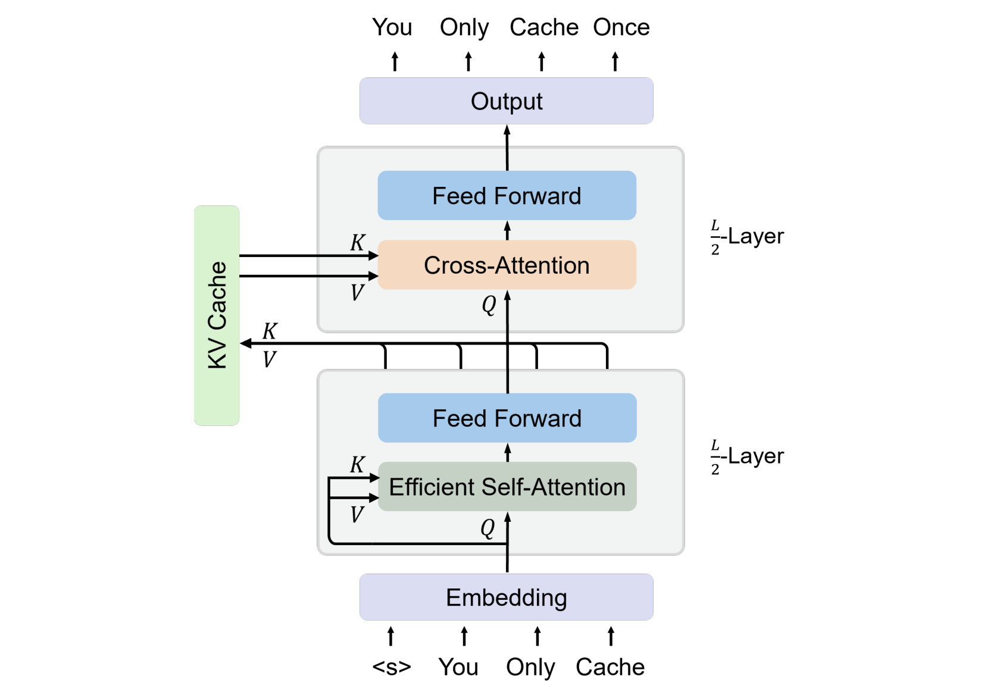
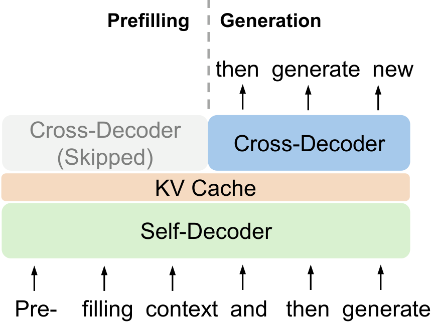
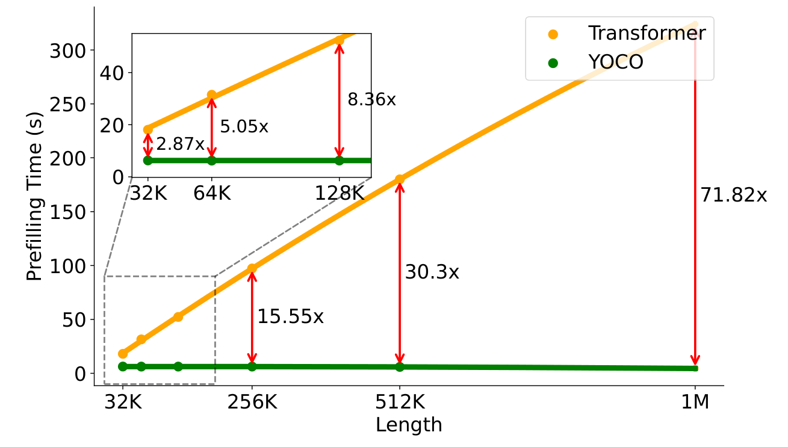

# YOCO：You Only Cache Once

## 来源

- 原始 PDF：[2405.05254v2.pdf](../../raw/2405.05254v2.pdf)，20 页；本页使用 arXiv v2（2024-05-09），不是后续会议版 PDF。
- 标题：You Only Cache Once: Decoder-Decoder Architectures for Language Models。
- 作者：Yutao Sun、Li Dong（共同一作），Yi Zhu、Shaohan Huang、Wenhui Wang、Shuming Ma、Quanlu Zhang、Jianyong Wang、Furu Wei；Microsoft Research / Tsinghua University。
- 版本入口：[arXiv](https://arxiv.org/abs/2405.05254v2)。会议归属由 [NeurIPS 2024 论文页](https://papers.nips.cc/paper_files/paper/2024/hash/0df38cd13520747e1e64e5b123a78ef8-Abstract-Conference.html) 外部佐证。
- 官方代码：[microsoft/unilm/YOCO](https://github.com/microsoft/unilm/tree/master/YOCO)。模型页：[YOCO-3B / YOCO-3B-1M](../models/yoco.md)。

## 核心结论

原文确证（§2、Table 1/2、Figure 2/3）：YOCO 把模型分成前半 self-decoder 和后半 cross-decoder。前半用固定大小状态的高效注意力生成上下文化表示，在中间投影出一份全局 K/V；后半各层保留自己的 Q 和 FFN，通过 causal cross-attention 反复读这份 K/V。两个部分都遵守因果约束，整体仍做自回归语言建模。

“Only Cache Once”指**全局 KV 只保存一份**，不是全模型只有一个状态，也不是 KV 大小与序列长度无关。前半的 gated retention 状态或 SWA cache 随层数增长但不随序列长度增长；全局 KV 仍随长度线性增长（p.2 脚注 2、§2.3）。

最值得保留的是生成依赖结构：后半网络无需为每个历史 token 重建本层 K/V，因此在只需生成后续文本时，历史 prompt 的后半前向可以跳过。这个优化在 YOCO 中不改变数学输出；[DeepSeek-V4.1 CED](deepseek-v41-flash.md) §2.2 明确受它启发，但加入逐层局部 SWA 后需要额外重放。

## 架构与训练

### 同一份全局 KV，不同层的 Q

> Figure 2，PDF p.3，原图注节译：self-decoder 生成全局 KV，cross-decoder 用 cross-attention 复用；两部分都使用 causal masking，整体表现为自回归 decoder-only Transformer。

原文确证（§2.1–2.2，Eq.1–3）：令 $M=X^{L/2}$ 为前半输出，则

$$
\hat K=\operatorname{LN}(M)W_K,\qquad
\hat V=\operatorname{LN}(M)W_V,\qquad
Q^l=\operatorname{LN}(X^l)W_Q^l.
$$

所有 cross-decoder 层共享 $\hat K,\hat V$，但 $Q^l$ 来自各层当前表示，attention 输出和 FFN 也逐层更新。共享的不是 attention 权重或层输出；K 和 V 是两次不同投影，不应与 V4 的 Shared-KV（K=V）混淆。cross-attention 兼容 GQA，继续降低每份缓存的 head 数。

**本页综合**：它改变“谁生成历史记忆”，并保留“深层如何反复查询记忆”的自由度。省去的是逐层历史 K/V 的重复生成与保存，不是整个后半网络的表达深度。

### 为什么能精确跳过 prompt 的后半计算

> Figure 3，PDF p.4，原图注节译：prefill 并行编码输入，生成阶段逐 token 解码；计算依赖允许 prefill 提前退出而不改变最终输出。

原文确证（§2.3、Figure 3）：cross-decoder 历史位置的输出不会再变成后续位置所需的 K/V；未来所读的全局 KV 已在 self-decoder 末端产生。因此不必为建立缓存而计算所有历史位置的后半层。

由 Eq.2–3 可推得的边界：为了得到第一个生成 token 的 logits，最后一个 prompt 位置仍须经过 cross-decoder；之后的新 token 也运行两半。需要给所有 prompt 位置算 loss 或 log-prob 的训练/打分任务不能直接省略这些输出。这里的 early exit 是依赖关系允许的精确优化，不是按置信度提前停止推理。

| 对象 | 普通 Transformer | YOCO | 口径 |
| --- | --- | --- | --- |
| 全局 KV | 每层保存历史 K/V | 后半各层共用一份 | 缓存沿层维去重，仍随 token 数增长 |
| 总缓存复杂度 | $O(LND)$ | 原表写 $O((N+L)D)$ | Table 1 把固定窗口/固定状态维度作为常数；§2.3 更明确写缓存条目 $O(N+CL)$ |
| prefill 注意力复杂度 | $O(LN^2D)$ | $O(LND)$ | Table 2；依赖固定窗口或 chunkwise retention，并跳过大部分 cross-decoder；不是训练复杂度声明 |
| 单 token decode | 每层访问历史 | cross-decoder 仍读全局历史 | 不等于整模型常数时间解码 |

### Self-decoder 的两种实现

原文确证（§3）：默认使用 **gated retention（gRet）**，也测试 SWA。gRet 用输入相关、head-wise 的衰减门扩展 retention，递归形式为

$$
S_n=\gamma_n S_{n-1}+K_n^\top V_n,\qquad O_n=Q_nS_n.
$$

每个 head 保存矩阵状态；状态大小不随 token 数增长，但并非没有缓存。parallel、recurrent、chunkwise recurrent 三种表示数学等价，训练/prefill 可在 chunk 内并行，生成可逐 token 更新；§4.4 的推理实现使用 chunk size 256。SWA 版本保留固定窗口内的 K/V，scaling 实验窗口为 1,024（§4.2）。

该递归式是衰减后的加性写入，没有 delta-rule 的预测误差校正项；不能因存在 gate 就把 gRet 当作 Gated DeltaNet。YOCO 的百万上下文信息通路也不只靠这个固定矩阵，后半仍能直接读取完整全局 KV。

Appendix A / Figure 11 进一步利用共享结构做 chunk parallelism：self-decoder 在相邻设备间传递递归状态或窗口信息；cross-decoder 的全局 KV 只需一次 all-gather，而非每层重复通信。论文没有给出这一通信优化的单独端到端消融。

### 训练配置与长窗扩展

原文确证（§4.1、Appendix C/E）：YOCO-3B 有 26 层、hidden 3072、FFN 8192、24 query heads / 8 KV heads、head dim 128；非 embedding 参数为 2.83B。使用 `tiktoken-cl100k_base`，词表 100,288，RMSNorm + SwiGLU + AdamW。4K 训练窗口、4M tokens/batch，实际训练 1.6T tokens；5T 是学习率计划，不是已完成训练量。

| 长窗阶段 | 训练 tokens | 学习率 | RoPE θ |
| --- | --- | --- | --- |
| 65,536 | 6B | 8e-5 | 640K |
| 262,144 | 4B | 4e-5 | 5M |
| 1,048,576 | 1.5B | 2e-5 | 80M |

Table 7 的三个阶段合计追加 11.5B tokens（本页求和）。按文档长度上采样，作者明确不使用 long-instruction tuning 数据，因此“1M”来自继续训练，不是仅修改推理参数的零样本扩窗。

## 后训练

这篇报告主要覆盖自回归预训练、模型规模实验与长上下文继续训练，没有提供 SFT→RL/OPD 的 agent 后训练流水线，也没有工具使用或多模态实测。§5 的多模态 self-decoder、缓存压缩、单索引检索以及 YOCO + BitNet + Groq 都是展望，不能当成该模型已经实现的功能。

## 评测要点

### 短任务与模型规模

原文确证（Table 3）：八项零样本任务平均值，作者报告口径，未独立复现。

| 模型 | 训练量/阶段 | 八项均分 |
| --- | --- | --- |
| OpenLLaMA-3B-v2 | 1T | 0.619 |
| StableLM-base-alpha-3B-v2 | 1T | 0.612 |
| YOCO-3B | 1T | 0.634 |
| YOCO-3B | 1.6T | 0.636 |
| YOCO-3B-1M | 长窗扩展后 | 0.645 |

不同预训练模型的数据和参数量不完全一致，这张表支持竞争力，不隔离架构因果效应。更可控的是 §4.2 / Figure 4：160M–13B、相同数据与设置、每个模型 10B tokens，比较 Transformer、YOCO-SWA、YOCO-gRet 的 validation loss；作者报 gRet 最好，SWA 与 Transformer 接近。这不等于 13B 模型已完成万亿 token 训练。

### 1M 单针不等于 1M 多针

原文确证（§4.3、Figure 5、Table 4）：1M 单针任务为 city–magic-number 检索，每个深度和长度跑 10 次取均值，接近满分。多针比较统一在 **128K** 做：

| 模型 | 1 针 | 2 针 | 4 针 | 8 针 |
| --- | --- | --- | --- | --- |
| LWM-1M-text 7B | 1.00 | 0.90 | 0.76 | 0.62 |
| MiniCPM-128K 2.4B | 1.00 | 1.00 | 0.54 | 0.56 |
| ChatGLM3-128K 6B | 0.94 | 0.72 | 0.52 | 0.44 |
| YOCO-3B-1M | 0.98 | 0.98 | 0.84 | 0.56 |

YOCO 在 4 针占优，8 针低于 LWM、与 MiniCPM 相同，不能写成全面领先。Figure 6 的书籍/仓库代码 cumulative NLL 随上下文降低，是利用长程信息的另一个信号；Appendix G 的 160M / 16K ZeroSCROLLS 实验评的是答案 perplexity，不是百万长度的任务成功率。

### 推理收益与计量边界

> Figure 9，PDF p.11，原图注节译：比较生成首个 token 前的输入编码时间；Transformer 随长度二次增长，YOCO 线性增长，即使 32K 也有 2.87× 加速。

原文确证（§4.4、Figure 7–10）：默认采用 §4.1 的 3B 配置，H100-80GB，Transformer 基线带 GQA、Flash-Decoding 和 kernel fusion；序列最后 1,024 tokens 作为生成部分，其余作为输入。

- **总推理显存**：1M 下 YOCO 为 12.4GB，Transformer 约为其 9.38 倍；包含权重、KV 和其他激活，不能与 V4.1 的“全局 KV 890 bytes/token”直接比较。
- **Prefill**：512K 约 180 秒降到不足 6 秒；1M 加速 71.82×。不能把这个倍数写成 token-by-token decode 加速。
- **端到端吞吐**：512K 时 4.5→43.1 token/s，9.56×；论文明确计入 prefill 与生成，并将可用 batch 增大列为收益来源，不是固定 batch 的纯 decode kernel 对照。
- **大模型缓存会计**：65B 的约 80× 指 Figure 8 的 KV 存储对比，不是 65B 已训练模型的能力或总显存实测结论。

## 与 DeepSeek-V4.1 CED 的关系

直接继承关系由 [V4.1 原文](../../raw/DeepSeek_V41_Tech_Report.pdf) §2.2 明确确认：CED 受 YoCo（Sun et al., 2024）启发。以下是本页对两篇一手材料的对照综合（YOCO §2–3；V4.1 §2.2–2.3、§3.2.2）：

| 问题 | YOCO | V4.1 CED + CSA2 |
| --- | --- | --- |
| 前半网络 | gRet 或 SWA，常数状态 | SWA + CSA2，自身有压缩全局 KV |
| 后半全局 KV 来源 | self-decoder 末端投影一份 K/V | encoder 末端投影，由 decoder Full 建立，Reindex/Reuse 共享 |
| 后半怎样读历史 | 每层自己的 Q，dense causal cross-attention | 每层自己的 Q，top-512 稀疏选择，允许重新索引 |
| 后半局部状态 | 不另建逐层 SWA KV | 保留本层 SWA KV，增加局部计算深度 |
| Prefill 提前退出 | 不改变数学输出 | 末尾 128-token decoder replay 近似补齐 SWA，非完整前向等价 |

**本页综合**：YOCO 贡献“把全局记忆的生成与深层读取拆开”的结构；V4.1 选择更丰富的前半全局记忆和后半局部状态，再用稀疏共享、量化与重放控制新增成本。不同模型规模、硬件和基线的提速倍数不能据此串乘。

## 待追问

- 全局 KV 只在中间生成，会怎样限制高层上下文化或多跳信息整合？当前 3B/短预算 scaling 不能隔离所有能力边界。
- 1M 的多针组合、长文推理与多轮 agent 表现如何？128K 多针已随针数增加退化。
- 前后各半是否最优，更多 KV 生成层与共享层之间的容量—效率曲线是什么？V4.1 的多组缓存提供另一种选择，但没有跨论文公平消融。
- gRet 的矩阵状态和 SWA 的窗口状态在短输入、大 head dimension 下占多少？“once”的长序列近似何时失效？
- 实际服务中的 KV 精度、batch、并行度与 prefix 命中率改变后，还能保留多少端到端收益？本报告不提供现代 agent 工作负载的完整成本对照。
- v2 引言 p.2 将 early exit 写成进入 self-decoder 之前，与 §2.3 和 Figure 3 不符；本页采用后两处一致的“跳过 cross-decoder”。复杂 chunkwise 公式不作为直接实现规范，复现需对照递归形式及官方代码。

## 后续：YOIO

同团队后续把「只缓存一次」扩成「只索引一次」：[YOIO / CLSA](yoio.md) 在 4B SWA-YOCO 上用单次 token-level top-k 服务全部 cross-decoder，用来补 decode；self-decoder 从本报告的 gated retention 换成了窗口 512 的 SWA，不能当成 3B 检查点的继续训练。

## 相关页面

- [YOCO 模型](../models/yoco.md)、[YOCO-CLSA 4B](../models/yoco-clsa.md)、[YOIO](yoio.md)、[DeepSeek-V4.1-Flash 技术报告](deepseek-v41-flash.md)。
- [高效长上下文注意力](../concepts/efficient-long-context-attention.md)、[百万 token 上下文服务](../concepts/million-token-context-serving.md)、[跨层索引复用](../concepts/cross-layer-index-reuse.md)。
