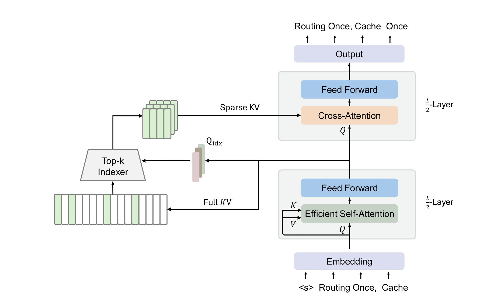
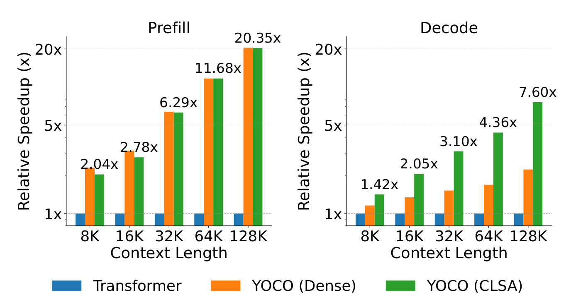
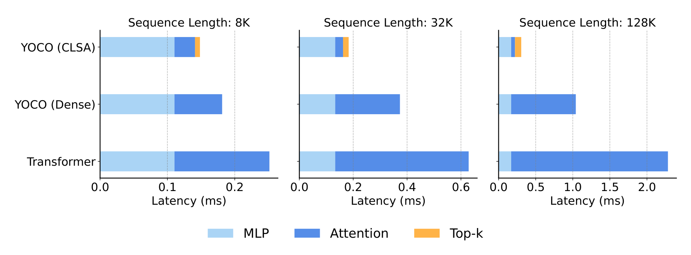
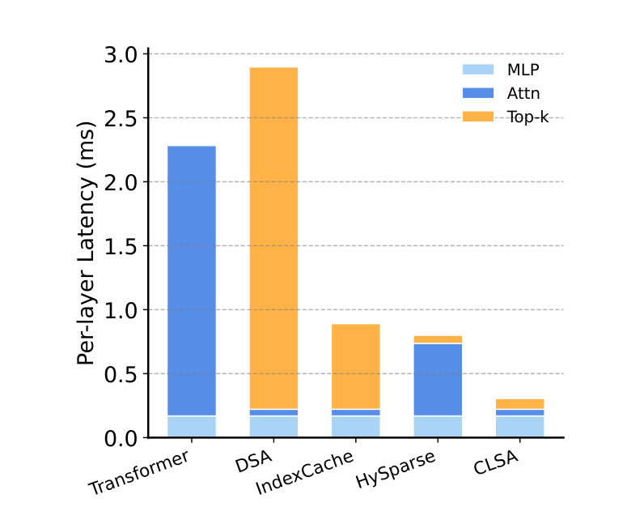

# YOIO：You Only Index Once

## 来源

- 原始 PDF：[2606.06467v1.pdf](../../raw/2606.06467v1.pdf)，15 页。
- 标题：You Only Index Once: Cross-Layer Sparse Attention with Shared Routing。
- 版本/日期：arXiv:2606.06467v1，2026-06-04。入口：[arXiv](https://arxiv.org/abs/2606.06467)。
- 作者：Yutao Sun、Yanqi Zhang、Li Dong（共同一作），Jianyong Wang、Furu Wei；Microsoft Research / Tsinghua University。与 [YOCO](yoco.md) 同团队。
- 方法名是 **CLSA**（cross-layer sparse attention）；标题里的 You Only Index Once 是对 YOCO「只缓存一次」的延伸。模型页：[YOCO-CLSA 4B](../models/yoco-clsa.md)。

## 核心结论

原文确证（§1–2、Table 1、Figure 1）：CLSA 建在 [YOCO](yoco.md) 这类 KV-sharing 的 decoder-decoder 上。self-decoder 仍只生成一份全局 KV；在这份共享隐状态上再加一个单头 indexer，对每个 query 做一次 token-level top-k，**16 层 cross-decoder 共用这个 index**。各层保留自己的 Q 和 FFN，只对选中位置做 cross-attention。

「Only Index Once」指 **routing 只算一次**，不是 KV 不再随长度增长，也不是 self-decoder 没有窗口缓存。全局 KV 仍是 $O(N)$；self-decoder 仍有逐层 SWA cache。

相对 [IndexCache](indexcache.md) 的差别不是「谁先做跨层复用」——YOIO 引用了 IndexCache / HySparse——而是复用对象不同。IndexCache 在**逐层 KV** 的 DSA 上让 1/4 层当 oracle；CLSA 把 routing 绑到**已经共享的那一份记忆**上，因此 indexer 在结构上只有一个。

作者把三条推理瓶颈拆开写（§2.3）：prefill 与 KV 存储继承 YOCO；decode 靠共享 top-k 把 token-sparse 的路由开销摊销掉。128K、B200、vLLM 上相对同配置 Transformer：decode 7.6×，端到端吞吐 17.1×（Table 11–12）。质量实验停在 32K；128K 只有延迟，没有 RULER / 长文 loss。

## 架构与训练

### 共享记忆上的一次路由

> Figure 1，PDF p.2，原图注节译：self-decoder 只计算一次共享 KV；query-aware indexer 同时生成 routing 的 Q/K，并为每个 query 产生 token-level top-k；该稀疏 index 也只产生一次，供后续 cross-decoder 复用。

原文确证（§2.1，Eq.1–4）：令 $H$ 为写入记忆的共享隐状态，$K,V$ 为对应 KV，$Q^{(l)}$ 为第 $l$ 层 query。稠密 YOCO 做 $O^{(l)}=\operatorname{Attn}(Q^{(l)},K,V)$。CLSA 在 $H$ 上加单头索引分支

$$
Q_{\mathrm{idx}}=HW^{Q}_{\mathrm{idx}},\qquad
K_{\mathrm{idx}}=HW^{K}_{\mathrm{idx}},\qquad
I=Q_{\mathrm{idx}}K_{\mathrm{idx}}^{\top},\qquad
S_{t}=\operatorname{TopK}(I_{t},k),
$$

然后每层只看被选位置：

$$
O^{(l)}_{t}=\operatorname{Attn}(Q^{(l)}_{t},K_{S_{t}},V_{S_{t}}).
$$

$Q_{\mathrm{idx}},K_{\mathrm{idx}}$ 都来自同一份 $H$，主注意力的 $Q^{(l)}$ 仍逐层不同。实验里 $k=2048$。索引分支只有一个 head，与主 GQA（20 query / 4 KV）分开。

self-decoder 保持 YOCO 的高效注意力，本报告实现为 **SWA，窗口 512**，不是 YOCO-3B 默认的 gated retention。全局 cross-attention 用 RNoPE：SWA 路径 RoPE base $10^{4}$，全局路径 NoPE。Indexer 公式未写 RoPE；全局路径既已 NoPE，不能把 indexer 写成带旋转位置。

### 多层蒸馏：一份 index 要服务整栈

共享 index 必须同时对多层有用，而不是拟合某一层。原文确证（§2.2，Eq.5–8）：先把稠密 cross-attention 在所有 decoder 层、所有 head 上平均成共识目标

$$
\bar A=\frac{1}{LH}\sum_{l=1}^{L}\sum_{h=1}^{H}\operatorname{softmax}\bigl(Q^{(l,h)}K^{(h)\top}\bigr),
$$

再用

$$
\mathcal L_{\mathrm{KD}}=\frac{1}{n}\sum_{t=1}^{n}\mathrm{KL}\bigl(\operatorname{sg}[\bar A_{t}]\;\|\;\operatorname{softmax}(I_{t})\bigr)
$$

训练 indexer。这与 [IndexCache](indexcache.md) 的多层 KL（对 F 层及其后 $m$ 个 S 层取平均，梯度上等价于对质心做单 KL）是同一类目标，但 CLSA 的 teacher 是**整栈+全头**的一份 $\bar A$，因为结构上只有一个 indexer。

两阶段 sparse adaptation：

1. **Indexer warmup**：冻 backbone，只优化 $\mathcal L_{\mathrm{KD}}$。
2. **Joint sparse adaptation**：$\mathcal L_{\mathrm{LM}}+\lambda\mathcal L_{\mathrm{KD}}$，$\lambda=0.1$。

不是 from-scratch native sparse，起点是稠密 YOCO。

### 复杂度：YOCO 管存储，CLSA 管 decode 路由

原文确证（Table 1）。$N,L,D$ 为长度、层数、隐维；$W_1$ 为 SWA 窗口，$W_2$ 为选中 token 数，$\eta$ 为 indexer 的 per-query 路由成本，$\gamma$ 为 hybrid 中全局层比例。

| 模型 | KV cache | Prefill | Decode |
| --- | --- | --- | --- |
| Transformer | $O(LND)$ | $O(LN^{2}D)$ | $O(LND)$ |
| Hybrid TRM | $O(L(\gamma N+(1-\gamma)W_1)D)$ | $O(L(\gamma N^{2}+(1-\gamma)W_1 N)D)$ | $O(L(\gamma N+(1-\gamma)W_1)D)$ |
| YOCO (Dense) | $O((N+W_1 L)D)$ | $O(\frac{L}{2}W_1 ND)$ | $O(\frac{L}{2}(N+W_1)D)$ |
| DSA | $O(LND)$ | $O(LW_2 ND+\eta LN^{2})$ | $O(LW_2 D+\eta LN)$ |
| YOCO (CLSA) | $O((N+W_1 L)D)$ | $O(\frac{L}{2}W_1 ND)$ | $O(\frac{L}{2}(W_1+W_2)D+\eta N)$ |

CLSA 的 prefill 列与稠密 YOCO 相同：prompt 的 cross-decoder 仍可按 YOCO 依赖跳过，indexer 只需从 $H$ 写出 $K_{\mathrm{idx}}$。Decode 的 indexer 项是 $\eta N$ 而不是 DSA 的 $\eta LN$。KV 仍随 $N$ 线性增长，没有变成常数缓存。

作者的对比判断（§2.3）：只做动态稀疏仍要存逐层 KV，decode 还可能被 $\eta LN$ 吃掉；hybrid 的收益被 $\gamma$ 卡住。CLSA 把 KV 共享和 index 共享绑在一起。

### 4B 训练配置

原文确证（§3.1、Appendix B/C，Table 5–8）：三模型同宽同深，4B 量级 dense。

| 项目 | 取值 |
| --- | --- |
| Hidden / FFN | 2560 / 7680 |
| 层数 | 32；YOCO 变体 16 self-decoder + 16 cross-decoder |
| Heads | 20 query / 4 KV，head dim 128，GQA |
| QK Norm | Transformer 与 YOCO self-decoder 开启 |
| 位置 | Transformer：RoPE base $5\times 10^{5}$；YOCO：RNoPE |
| CLSA $k$ | 2048 |
| Batch | 8M tokens/step，Adam $\beta=(0.9,0.95)$，$\varepsilon=10^{-8}$，weight decay 0.1 |

| 阶段 | 序列 | 步数 | 峰值 LR | 本页折合 tokens |
| --- | --- | --- | --- | --- |
| Dense 1 | 8K | 125,000（warmup 2,000） | $3\times 10^{-4}$ | 1.0T |
| Dense 2 | 32K | 10,000 | 固定 $3\times 10^{-5}$ | 80B |
| Sparse 1 | 32K | 2,500（warmup 500） | 恒定 $3\times 10^{-4}$ | 20B |
| Sparse 2 | 32K | 2,500 | 固定 $3\times 10^{-5}$ | 20B |

tokens 列为步数 × 8M 的本页求和，原文未另写总 token 数。Sparse 1 的 min LR 等于峰值（Table 5），与「只训 indexer」的恒定学习率一致。词表与精确非 embedding 参数未给。

## 后训练

本报告覆盖稠密预训练与 sparse adaptation，没有 SFT / RL / OPD，也没有工具使用或多模态。§4 把 NSA、MoBA、IndexCache、HySparse、Kimi Linear、Qwen3 等列为相关工作，不是本模型的后训练结果。

## 评测要点

### 短任务：总体接近稠密，不是全面超过

原文确证（Table 2），作者报告口径，4B，未独立复现。

| 模型 | ARC-C | BBH | GSM8K | HellaSwag | HumanEval | MMLU | DROP | WinoGrande |
| --- | --- | --- | --- | --- | --- | --- | --- | --- |
| Transformer | 0.453 | 0.420 | 0.434 | 0.667 | 0.384 | 0.527 | 0.366 | 0.638 |
| YOCO (Dense) | 0.461 | 0.411 | 0.430 | 0.676 | 0.396 | 0.519 | 0.387 | 0.630 |
| YOCO (CLSA) | 0.465 | 0.418 | 0.470 | 0.674 | 0.396 | 0.513 | 0.391 | 0.616 |

CLSA 在 ARC-C、GSM8K、DROP 最高，HumanEval 追平稠密 YOCO；WinoGrande 相对 Transformer 掉 0.022。不能写成全面领先。作者把部分增益也归因于 hybrid / 多套位置编码，没有隔离「只换稀疏」的因果。

Appendix Figure 7：稠密阶段 HumanEval / DROP / HellaSwag 上 YOCO 与 Transformer 全程接近，用来说明 sparse 适配的起点不是弱 backbone。

### 长上下文：32K 质量，不是 128K 质量

原文确证（Table 3、Figure 2）。RULER 只评 16K 与 32K。

| Ctx | 模型 | S1 | S2 | S3 | MK1 | MK2 | MK3 | MQ | MV | QH | QS | CWE | FWE | Avg |
| --- | --- | --- | --- | --- | --- | --- | --- | --- | --- | --- | --- | --- | --- | --- |
| 16K | Transformer | 100.0 | 99.8 | 98.4 | 88.2 | 71.4 | 14.4 | 85.7 | 85.6 | 28.8 | 33.2 | 15.6 | 52.1 | 64.4 |
| 16K | YOCO (Dense) | 100.0 | 99.8 | 96.4 | 69.4 | 91.6 | 61.2 | 45.8 | 49.3 | 30.8 | 31.4 | 9.4 | 67.0 | 62.7 |
| 16K | YOCO (CLSA) | 100.0 | 100.0 | 98.4 | 70.4 | 92.4 | 58.4 | 53.0 | 47.2 | 31.2 | 32.7 | 9.8 | 61.6 | 62.9 |
| 32K | Transformer | 100.0 | 98.8 | 83.4 | 57.0 | 38.8 | 0.8 | 45.6 | 42.6 | 21.2 | 20.2 | 1.8 | 43.8 | 46.2 |
| 32K | YOCO (Dense) | 100.0 | 90.2 | 74.8 | 53.2 | 84.0 | 43.6 | 27.0 | 29.0 | 30.6 | 30.6 | 4.6 | 60.3 | 52.3 |
| 32K | YOCO (CLSA) | 100.0 | 93.6 | 83.2 | 58.4 | 88.8 | 38.0 | 31.6 | 29.8 | 29.2 | 29.2 | 5.1 | 50.2 | 53.1 |

16K 均分 Transformer 最高。32K CLSA 均分最高，作者归因于 MK1/MK2 等多针；MQ/MV 仍低于 Transformer。单针接近满分不能外推到多针。Books / ArXiv / StarCoder 的 8K–32K 验证 loss 上 CLSA 与稠密 YOCO 几乎重合（Figure 2），这是「近无损语言建模」的证据，不是 128K 任务分数。

### 选多少 token：覆盖率 ≠ 语言建模质量

原文确证（Table 4）：$k=2048$ 在 32K 上约 1:16。StarCoder / Books / ArXiv 的 dense attention 覆盖率分别为 84.12% / 76.29% / 80.67%；相对稠密 CE 差为 $-0.0004$ / $+0.0054$ / $+0.0026$。作者的论点是：不必追回 100% attention mass 也能保持 CE；block-sparse 的块归纳偏置和 token 语义不对齐，所以他们坚持 token-level，再用跨层共享摊销路由。这是机制解释，不是 block-sparse 全谱系的公平消融。

### 推理：prefill 几乎是 YOCO，decode 才是 CLSA

原文确证（§3.4、Figure 3–6、Appendix D/E，Table 9–12）。实现并入 vLLM，NVIDIA B200。相对倍数以同配置 Transformer 为 1。

> Figure 3，PDF p.7，原图注节译：相对 Transformer 的 prefill / decode 吞吐；YOCO 主要加速 prefill，CLSA 提供最大 decode 增益，且随上下文增大。

绝对吞吐（tokens/s，Table 10–12）：

| 长度 | Prefill TRM / Dense / CLSA | Decode TRM / Dense / CLSA | 端到端 TRM / Dense / CLSA |
| --- | --- | --- | --- |
| 8K | 4722 / 10884 / 9623 | 4763 / 5517 / 6742 | 2990 / 4312 / 4920 |
| 32K | 2889 / 18450 / 18163 | 1762 / 2677 / 5461 | 570 / 1833 / 2805 |
| 128K | 1019 / 20865 / 20742 | 431 / 961 / 3277 | 62.5 / 599 / 1068 |

128K：CLSA decode $3276.80/431.16\approx 7.60\times$，端到端 $1068.06/62.53\approx 17.1\times$。Prefill 约 20× 来自 YOCO 避免二次全局注意力；短上下文上 CLSA prefill 甚至略慢于稠密 YOCO（8K：9623 vs 10884）。不要把 7.6× 写成 prefill 加速，也不要把 20× prefill 算成 CLSA 的稀疏贡献。

> Figure 6，PDF p.8，原图注节译：YOCO (Dense) 的注意力是 16 层 SWA 与 16 层稠密 cross-attn 的平均；CLSA 同理平均 SWA 与稀疏层。top-k 只算一次，图中数值除以 32 以便与 Transformer 对齐。

> Figure 5，PDF p.7，原图注节译：与 DSA、IndexCache、HySparse 及稠密基线的 per-layer 延迟对照；CLSA 通过跨 cross-decoder 摊销路由得到最低延迟。

这张图是**同一 4B 栈、同一 128K 设定**上的延迟对照：Table 9 里 Transformer 每层合计 2.28 ms，与图中 Transformer 柱一致。IndexCache 被实现为「每四层复用一次路由」（对应 1/4 retention 的均匀假设），不是清华+Z.ai 原文在 30B / GLM-5 上的贪心 pattern 或质量数字。不能写成「CLSA 在 GLM-5 上快于 IndexCache」。

Table 9 的 CLSA top-k 是把一次性路由除以 **32 层** 后的摊销值（128K 为 0.08 ms/层）；结构上共享发生在 16 个 cross-decoder 上。未摊销的 128K top-k 在 Figure 4 中可与 dense attention 同量级，这是「不摊销则 token-sparse 没有 wall-clock 优势」的证据。

## 与 YOCO、IndexCache、CSA2 的关系

本页综合（YOIO §2–4；[YOCO](yoco.md) §2；[IndexCache](indexcache.md)；[V4.1](deepseek-v41-flash.md) §2.2）：

| 问题 | YOCO | IndexCache | V4.1 CSA2 | YOIO / CLSA |
| --- | --- | --- | --- | --- |
| 记忆 | 一份全局 KV | 逐层 DSA KV | encoder 多份压缩全局 KV，decoder 共享一份 | 一份全局 KV（继承 YOCO） |
| 路由 | 无 top-k，稠密 cross-attn | 1/4 层算 indexer，其余复用 | Full / Reindex / Reuse 多层模式 | **结构上只有一个 indexer** |
| 后半局部状态 | 无逐层 SWA | 各层主注意力仍在 | 每层自己的 SWA KV | self-decoder 有 SWA；cross-decoder 无另建历史 SWA |
| Prefill 提前退出 | 精确，不改输出 | 不适用（不是 decoder-decoder） | 末尾 128-token 近似 replay | 继承 YOCO 的精确跳过 |
| 直接实验栈 | 3B gRet | 30B / GLM-5 DSA | 生产 552B | 4B SWA YOCO |

**本页综合**：YOCO 贡献「记忆只生成一次」；IndexCache 贡献「在逐层稀疏栈上复用 indexer」；CLSA 贡献「记忆已经共享时，路由应绑在记忆上」。V4.1 的 Reuse 更接近 IndexCache 的分层模式，而不是 CLSA 这种单 indexer。不同模型规模和硬件上的倍数不能串乘。

## 证据边界与阅读提示

- Figure 5 的 DSA / IndexCache / HySparse 是 4B 延迟对照，不是原论文的质量或端到端 serving 对照。

## 待追问

- **需补外部来源**：$d_{\mathrm{idx}}$、indexer 是否因果 mask、是否有独立位置编码，原文未写。
- **需实验或作者披露**：$k=2048$ 在 128K 是 1:64；更长上下文要不要提高 $k$，没有曲线。
- **需实验或作者披露**：128K 只有 vLLM 延迟，没有 RULER / 多针 / 长推理质量。
- **需实验或作者披露**：self-decoder 从 YOCO-3B 的 gRet 换成 SWA，CLSA 增益有多少来自这个替换，没有消融。
- **需实验或作者披露**：没有 RL：top-k 非确定性在 agentic 训练里是否会像 DSA 那样爆，未知。
- **需补外部来源**：权重与 vLLM 补丁除 `https://aka.ms/GeneralAI` 外没有可核的公开路径。

## 相关页面

- 模型：[YOCO-CLSA 4B](../models/yoco-clsa.md)、[YOCO-3B](../models/yoco.md)
- 前作与近亲：[YOCO](yoco.md)、[IndexCache](indexcache.md)、[DeepSeek-V4.1-Flash](deepseek-v41-flash.md)
- 概念：[跨层索引复用](../concepts/cross-layer-index-reuse.md)、[高效长上下文注意力](../concepts/efficient-long-context-attention.md)、[DeepSeek Sparse Attention](../concepts/deepseek-sparse-attention.md)、[百万 token 上下文服务](../concepts/million-token-context-serving.md)
- 比较：[稀疏注意力机制对比](../comparisons/sparse-attention-mechanisms.md)
